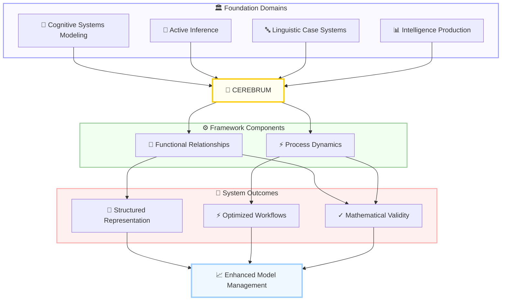

# Figure 1: Foundation Domains of CEREBRUM

```mermaid
flowchart TB    
    subgraph Foundations["🏛️ Foundation Domains"]
        direction TB
        CSM["🧠 Cognitive Systems Modeling"]
        AI["🔄 Active Inference"]
        LCS["🔤 Linguistic Case Systems"]
        IP["📊 Intelligence Production"]
    end
    
    CORE["🧩 CEREBRUM"]
    
    subgraph Components["⚙️ Framework Components"]
        direction TB
        FUNC["🔗 Functional Relationships"]
        PROC["⚡ Process Dynamics"]
    end
    
    subgraph Outcomes["🎯 System Outcomes"]
        direction TB
        REPR["📐 Structured Representation"]
        OPT["⚡ Optimized Workflows"]
        VALID["✓ Mathematical Validity"]
    end
    
    OUTPUT["📈 Enhanced Model Management"]
    
    CSM --> CORE
    AI --> CORE
    LCS --> CORE
    IP --> CORE
    
    CORE --> FUNC
    CORE --> PROC
    
    FUNC --> REPR
    PROC --> OPT
    FUNC --> VALID
    PROC --> VALID
    
    REPR --> OUTPUT
    OPT --> OUTPUT
    VALID --> OUTPUT
    
    %% Simple styling
    classDef foundation fill:#f9f9ff,stroke:#9999ff,stroke-width:2px
    classDef core fill:#fffef0,stroke:#ffcc00,stroke-width:3px
    classDef component fill:#f0fff0,stroke:#99cc99,stroke-width:2px
    classDef outcome fill:#fff0f0,stroke:#ffaaaa,stroke-width:2px
    classDef output fill:#f0f8ff,stroke:#99ccff,stroke-width:3px
    
    class Foundations foundation
    class CORE core
    class Components component
    class Outcomes outcome
    class OUTPUT output
```