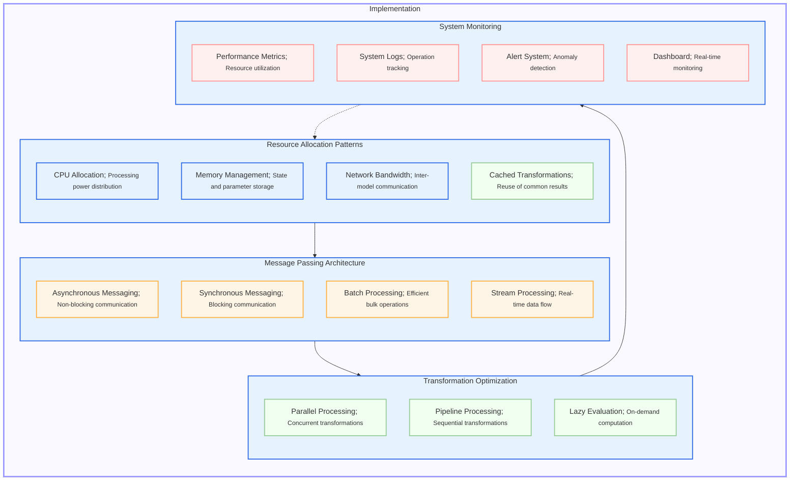

# Figure 10: Computational Implementation of Model Relationships

```mermaid
flowchart TD
    subgraph Implementation["Implementation"]
        direction TB
        
        subgraph ResourceAllocation["Resource Allocation Patterns"]
            direction TB
            CPU["CPU Allocation; <small>Processing power distribution</small>"]
            MEM["Memory Management; <small>State and parameter storage</small>"]
            NET["Network Bandwidth; <small>Inter-model communication</small>"]
            CACHE["Cache Optimization; <small>Frequent access patterns</small>"]
        end
        
        subgraph MessagePassing["Message Passing Architecture"]
            direction TB
            ASYNC["Asynchronous Messaging; <small>Non-blocking communication</small>"]
            SYNC["Synchronous Messaging; <small>Blocking communication</small>"]
            BATCH["Batch Processing; <small>Efficient bulk operations</small>"]
            STREAM["Stream Processing; <small>Real-time data flow</small>"]
        end
        
        subgraph Transformation["Transformation Optimization"]
            direction TB
            PARALLEL["Parallel Processing; <small>Concurrent transformations</small>"]
            PIPELINE["Pipeline Processing; <small>Sequential transformations</small>"]
            CACHE["Cached Transformations; <small>Reuse of common results</small>"]
            LAZY["Lazy Evaluation; <small>On-demand computation</small>"]
        end
        
        subgraph Monitoring["System Monitoring"]
            direction TB
            METRICS["Performance Metrics; <small>Resource utilization</small>"]
            LOGS["System Logs; <small>Operation tracking</small>"]
            ALERTS["Alert System; <small>Anomaly detection</small>"]
            DASH["Dashboard; <small>Real-time monitoring</small>"]
        end
    end
    
    %% Connect components
    ResourceAllocation --> MessagePassing
    MessagePassing --> Transformation
    Transformation --> Monitoring
    Monitoring -.-> ResourceAllocation
    
    %% Styling
    classDef resource fill:#E6F3FF,stroke:#326CE5,stroke-width:2px
    classDef message fill:#FFF5E6,stroke:#FFB347,stroke-width:2px
    classDef transform fill:#F0FFF0,stroke:#99cc99,stroke-width:2px
    classDef monitor fill:#FFF0F0,stroke:#ff9999,stroke-width:2px
    classDef framework fill:#f9f9ff,stroke:#9999ff,stroke-width:3px
    
    class CPU,MEM,NET,CACHE resource
    class ASYNC,SYNC,BATCH,STREAM message
    class PARALLEL,PIPELINE,CACHE,LAZY transform
    class METRICS,LOGS,ALERTS,DASH monitor
    class Implementation framework
    class ResourceAllocation,MessagePassing,Transformation,Monitoring resource
```

