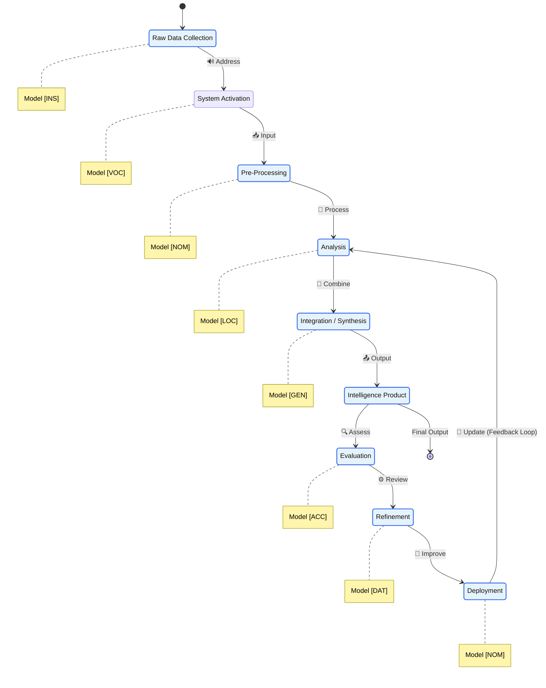

# Figure 11: Implementation in Intelligence Production - State Diagram

```mermaid
stateDiagram-v2
    direction TB

    [*] --> RawData
    RawData: Raw Data Collection
    note right of RawData: Model [INS]

    RawData --> Activation: 🔊 Address
    Activation: System Activation
    note right of Activation: Model [VOC]

    Activation --> PreProcessing: 📥 Input
    PreProcessing: Pre-Processing
    note right of PreProcessing: Model [NOM]

    PreProcessing --> Analysis: 🧮 Process
    Analysis: Analysis
    note right of Analysis: Model [LOC]

    Analysis --> Integration: 🔄 Combine
    Integration: Integration / Synthesis
    note right of Integration: Model [GEN]

    Integration --> Product: 📤 Output
    Product: Intelligence Product

    Product --> Evaluation: 🔍 Assess
    Evaluation: Evaluation
    note right of Evaluation: Model [ACC]

    Evaluation --> Refinement: ⚙️ Review
    Refinement: Refinement
    note right of Refinement: Model [DAT]

    Refinement --> Deployment: 🚀 Improve
    Deployment: Deployment
    note right of Deployment: Model [NOM]

    Deployment --> Analysis: 🔄 Update (Feedback Loop)

    Product --> [*]: Final Output

    %% Styling
    classDef stateStyle fill:#E6F3FF,stroke:#326CE5,stroke-width:2px
    classDef noteStyle fill:#FFF0F0,stroke:#ff9999,stroke-width:1px

    class RawData,PreProcessing,Analysis,Integration,Product,Evaluation,Refinement,Deployment stateStyle
```

