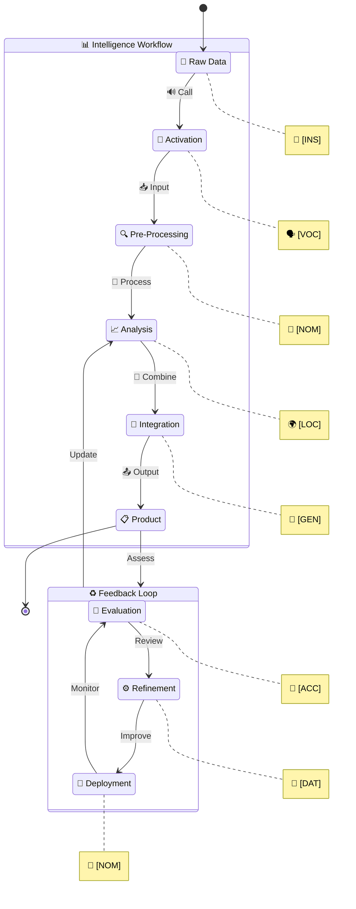

# Figure 12: Intelligence Workflow

```mermaid
stateDiagram-v2
    %% Intelligence production state diagram
    
    [*] --> RawData
    
    RawData --> Activation: 🔊 Call
    Activation --> PreProcessing: 📥 Input
    PreProcessing --> Analysis: 🧮 Process
    Analysis --> Integration: 🔄 Combine
    Integration --> Product: 📤 Output
    Product --> [*]
    
    state "📊 Intelligence Workflow" as IW {
        direction TB
        
        RawData: 📁 Raw Data
        note right of RawData: 🔧 [INS]
        
        Activation: 📢 Activation
        note right of Activation: 🗣️ [VOC]
        
        PreProcessing: 🔍 Pre-Processing
        note right of PreProcessing: 👑 [NOM]
        
        Analysis: 📈 Analysis
        note right of Analysis: 🌍 [LOC]
        
        Integration: 🧩 Integration
        note right of Integration: 💫 [GEN]
        
        Product: 📋 Product
    }
    
    state "♻️ Feedback Loop" as FB {
        direction TB
        Evaluation: 🔬 Evaluation
        note right of Evaluation: 🎯 [ACC]
        
        Refinement: ⚙️ Refinement
        note right of Refinement: 📩 [DAT]
        
        Deployment: 🚀 Deployment
        note right of Deployment: 👑 [NOM]
        
        Evaluation --> Refinement: Review
        Refinement --> Deployment: Improve
        Deployment --> Evaluation: Monitor
    }
    
    Product --> FB: Assess
    FB --> Analysis: Update
    
    %% Styling with colors applied through the diagram syntax itself
```

