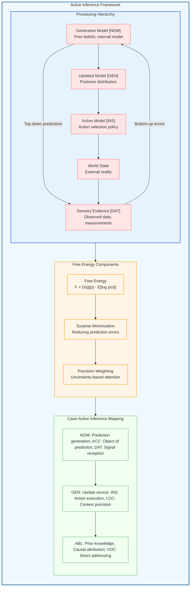

# Figure 13: Active Inference Integration Framework

```mermaid
flowchart TD
    subgraph AIFRAMEWORK["Active Inference Framework"]
        direction TB
        
        subgraph ProcessingLayers["Processing Hierarchy"]
            direction TB
            GM["Generative Model [NOM]<br>Prior beliefs; internal model"]
            SE["Sensory Evidence [DAT]<br>Observed data; measurements"]
            UM["Updated Model [GEN]<br>Posterior distribution"]
            AM["Active Model [INS]<br>Action selection policy"]
            W["World State<br>External reality"]
            
            GM -->|"Top-down predictions"| SE
            SE -->|"Bottom-up errors"| GM
            GM --> UM
            UM --> AM
            AM --> W
            W --> SE
        end
        
        subgraph FreeEnergy["Free Energy Components"]
            direction TB
            FE["Free Energy<br>F = D(q||p) - E[log p(o)]"]
            SURPRISE["Surprise Minimization<br>Reducing prediction errors"]
            PRECISION["Precision Weighting<br>Uncertainty-based attention"]
            
            FE --> SURPRISE --> PRECISION
        end
        
        subgraph CaseMapping["Case-Active Inference Mapping"]
            direction TB
            MAP1["NOM: Prediction generation; ACC: Object of prediction; DAT: Signal reception"]
            MAP2["GEN: Update source; INS: Action execution; LOC: Context precision"]
            MAP3["ABL: Prior knowledge; Causal attribution; VOC: Direct addressing"]
            
            MAP1 --> MAP2 --> MAP3
        end
        
        ProcessingLayers --> FreeEnergy --> CaseMapping
    end
    
    %% Styling
    classDef framework fill:#f0f8ff,stroke:#4682b4,stroke-width:3px
    classDef process fill:#e6f3ff,stroke:#326ce5,stroke-width:2px
    classDef energy fill:#fff5e6,stroke:#ffb347,stroke-width:2px
    classDef mapping fill:#f0fff0,stroke:#99cc99,stroke-width:2px
    classDef state fill:#ffe6e6,stroke:#ff9999,stroke-width:2px
    classDef flow fill:none,stroke:#666,stroke-width:1px
    
    class AIFRAMEWORK framework
    class ProcessingLayers process
    class FreeEnergy energy
    class CaseMapping mapping
    class GM,SE,UM,AM,W state
    class FE,SURPRISE,PRECISION energy
    class MAP1,MAP2,MAP3 mapping
```

