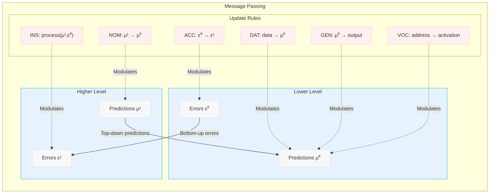

# Figure 14: Case-Specific Message Passing in Active Inference

```mermaid
flowchart TB
    %% Active inference message passing under different case declensions
    
    subgraph HierarchicalProcessing["Message Passing"]
        direction TB
        
        subgraph Level1["Higher Level"]
            L1_Pred["Predictions μ¹"]
            L1_Error["Errors ε¹"]
        end
        
        subgraph Level0["Lower Level"]
            L0_Pred["Predictions μ⁰"]
            L0_Error["Errors ε⁰"]
        end
        
        subgraph CaseRules["Update Rules"]
            NOMRule["NOM: μ¹ → μ⁰"]
            ACCRule["ACC: ε⁰ → ε¹"]
            DATRule["DAT: data → μ⁰"]
            GENRule["GEN: μ⁰ → output"]
            INSRule["INS: process(μ¹,ε⁰)"]
            VOCRule["VOC: address → activation"]
        end
    end
    
    %% Message passing connections
    L1_Pred -->|"Top-down predictions"| L0_Pred
    L0_Error -->|"Bottom-up errors"| L1_Error
    
    %% Case modulation connections
    NOMRule -.->|"Modulates"| L1_Pred
    ACCRule -.->|"Modulates"| L0_Error
    DATRule -.->|"Modulates"| L0_Pred
    GENRule -.->|"Modulates"| L0_Pred
    INSRule -.->|"Modulates"| L1_Error
    VOCRule -.->|"Modulates"| L0_Pred
    
    classDef level fill:#E6F3FF,stroke:#87CEFA,stroke-width:2px
    classDef node fill:#F8F8F8,stroke:#DDDDDD,stroke-width:1px
    classDef rule fill:#FFF0F0,stroke:#FFCCCC,stroke-width:1px
    
    class Level0,Level1 level
    class L0_Pred,L0_Error,L1_Pred,L1_Error node
    class NOMRule,ACCRule,DATRule,GENRule,INSRule,VOCRule rule
```

