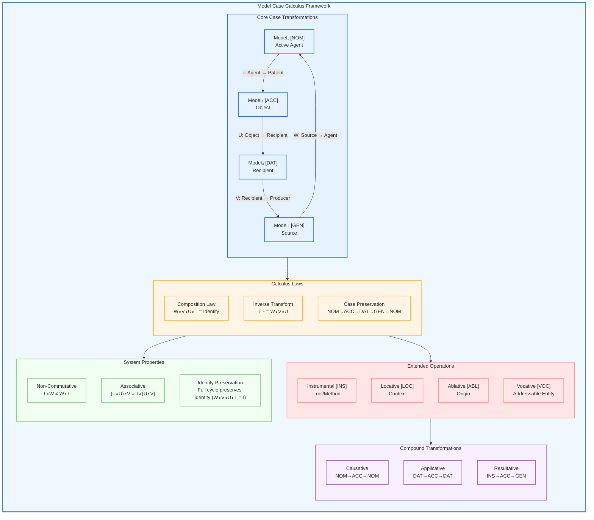

# Figure 15: Model Case Calculus Framework

```mermaid
flowchart TD
    subgraph CaseCalculus["Model Case Calculus Framework"]
        direction TB
        
        subgraph CoreTransforms["Core Case Transformations"]
            direction TB
            M1["Model₁ [NOM]<br>Active Agent"]
            M2["Model₂ [ACC]<br>Object"]
            M3["Model₃ [DAT]<br>Recipient"]
            M4["Model₄ [GEN]<br>Source"]
            
            M1 -->|"T: Agent → Patient"| M2
            M2 -->|"U: Object → Recipient"| M3
            M3 -->|"V: Recipient → Producer"| M4
            M4 -->|"W: Source → Agent"| M1
        end
        
        subgraph Laws["Calculus Laws"]
            direction TB
            L1["Composition Law<br>W∘V∘U∘T = Identity"]
            L2["Inverse Transform<br>T⁻¹ = W∘V∘U"]
            L3["Case Preservation<br>NOM→ACC→DAT→GEN→NOM"]
        end
        
        subgraph Properties["System Properties"]
            direction TB
            P1["Non-Commutative<br>T∘W ≠ W∘T"]
            P2["Associative<br>(T∘U)∘V = T∘(U∘V)"]
            P3["Identity Preservation<br>Full cycle preserves identity (W∘V∘U∘T = I)"]
        end
        
        subgraph ExtendedCases["Extended Operations"]
            direction TB
            E1["Instrumental [INS]<br>Tool/Method"]
            E2["Locative [LOC]<br>Context"]
            E3["Ablative [ABL]<br>Origin"]
            E4["Vocative [VOC]<br>Addressable Entity"]
        end
        
        subgraph CompoundTransforms["Compound Transformations"]
            direction TB
            C1["Causative<br>NOM→ACC→NOM"]
            C2["Applicative<br>DAT→ACC→DAT"]
            C3["Resultative<br>INS→ACC→GEN"]
        end
    end
    
    CoreTransforms --> Laws --> Properties
    Laws --> ExtendedCases --> CompoundTransforms
    
    %% Styling
    classDef framework fill:#f0f8ff,stroke:#4682b4,stroke-width:3px
    classDef core fill:#e6f3ff,stroke:#326ce5,stroke-width:2px
    classDef laws fill:#fff5e6,stroke:#ffb347,stroke-width:2px
    classDef props fill:#f0fff0,stroke:#99cc99,stroke-width:2px
    classDef extended fill:#ffe6e6,stroke:#ff9999,stroke-width:2px
    classDef compound fill:#f9f0ff,stroke:#9966cc,stroke-width:2px
    
    class CaseCalculus framework
    class CoreTransforms,M1,M2,M3,M4 core
    class Laws,L1,L2,L3 laws
    class Properties,P1,P2,P3 props
    class ExtendedCases,E1,E2,E3,E4 extended
    class CompoundTransforms,C1,C2,C3 compound
``` 