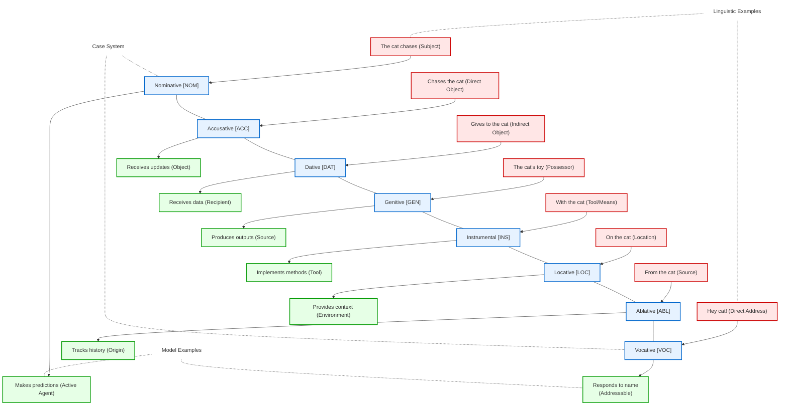

# Figure 2: Case Relationships - Model and Linguistic Parallels

```mermaid
graph TB
    %% Linguistic Examples on top
    LNOM["The cat chases (Subject)"]
    LACC["Chases the cat (Direct Object)"]
    LDAT["Gives to the cat (Indirect Object)"]
    LGEN["The cat's toy (Possessor)"]
    LINS["With the cat (Tool/Means)"]
    LLOC["On the cat (Location)"]
    LABL["From the cat (Source)"]
    LVOC["Hey cat! (Direct Address)"]
    
    %% Cases in center
    NOM["Nominative [NOM]"]
    ACC["Accusative [ACC]"]
    DAT["Dative [DAT]"]
    GEN["Genitive [GEN]"]
    INS["Instrumental [INS]"]
    LOC["Locative [LOC]"]
    ABL["Ablative [ABL]"]
    VOC["Vocative [VOC]"]
    
    %% Model Examples on bottom
    MNOM["Makes predictions (Active Agent)"]
    MACC["Receives updates (Object)"]
    MDAT["Receives data (Recipient)"]
    MGEN["Produces outputs (Source)"]
    MINS["Implements methods (Tool)"]
    MLOC["Provides context (Environment)"]
    MABL["Tracks history (Origin)"]
    MVOC["Responds to name<br>(Addressable)"]
    
    %% Connect examples to their respective cases in vertical stacks
    LNOM --> NOM --> MNOM
    LACC --> ACC --> MACC
    LDAT --> DAT --> MDAT
    LGEN --> GEN --> MGEN
    LINS --> INS --> MINS
    LLOC --> LOC --> MLOC
    LABL --> ABL --> MABL
    LVOC --> VOC --> MVOC
    
    %% Create the horizontal connection only between cases
    NOM --- ACC --- DAT --- GEN --- INS --- LOC --- ABL --- VOC
    
    %% Subgraph labels
    Lang["Linguistic Examples"]
    CS["Case System"]
    Mod["Model Examples"]
    
    %% Position the labels (invisible connections to group them)
    Lang -.- LNOM
    Lang -.- LVOC
    CS -.- NOM
    CS -.- VOC
    Mod -.- MNOM
    Mod -.- MVOC
    
    %% Styling with distinct colors
    classDef case fill:#e6f2ff,stroke:#0066cc,stroke-width:2px
    classDef lang fill:#ffe6e6,stroke:#cc0000,stroke-width:2px
    classDef model fill:#e6ffe6,stroke:#009900,stroke-width:2px
    classDef label fill:none,stroke:none
    
    class NOM,ACC,DAT,GEN,INS,LOC,ABL,VOC case
    class LNOM,LACC,LDAT,LGEN,LINS,LLOC,LABL,LVOC lang
    class MNOM,MACC,MDAT,MGEN,MINS,MLOC,MABL,MVOC model
    class Lang,CS,Mod label
```
