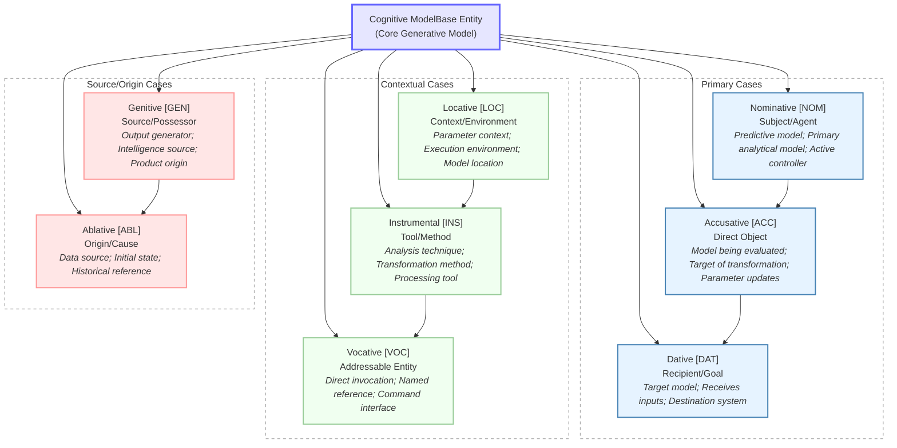

# Figure 3: Cognitive Model Case Framework

```mermaid
graph TD
    %% Core Model
    Core["Cognitive ModelBase Entity<br>(Core Generative Model)"]
    
    %% Primary Cases (Top)
    NOM["Nominative [NOM]<br>Subject/Agent<br><i>Predictive model; Primary analytical model; Active controller</i>"]
    ACC["Accusative [ACC]<br>Direct Object<br><i>Model being evaluated; Target of transformation; Parameter updates</i>"]
    DAT["Dative [DAT]<br>Recipient/Goal<br><i>Target model; Receives inputs; Destination system</i>"]
    
    %% Contextual Cases (Left)
    LOC["Locative [LOC]<br>Context/Environment<br><i>Parameter context; Execution environment; Model location</i>"]
    INS["Instrumental [INS]<br>Tool/Method<br><i>Analysis technique; Transformation method; Processing tool</i>"]
    VOC["Vocative [VOC]<br>Addressable Entity<br><i>Direct invocation; Named reference; Command interface</i>"]
    
    %% Source Cases (Right)
    GEN["Genitive [GEN]<br>Source/Possessor<br><i>Output generator; Intelligence source; Product origin</i>"]
    ABL["Ablative [ABL]<br>Origin/Cause<br><i>Data source; Initial state; Historical reference</i>"]
    
    %% Connections with descriptions
    Core --> NOM
    Core --> ACC
    Core --> DAT
    Core --> LOC
    Core --> INS
    Core --> VOC
    Core --> GEN
    Core --> ABL
    
    %% Layout hints
    NOM --> ACC
    ACC --> DAT
    LOC --> INS
    INS --> VOC
    GEN --> ABL
    
    %% Styling
    classDef core fill:#e6e6ff,stroke:#6666ff,stroke-width:3px
    classDef primary fill:#e6f3ff,stroke:#4682b4,stroke-width:2px
    classDef contextual fill:#f0fff0,stroke:#99cc99,stroke-width:2px
    classDef source fill:#ffe6e6,stroke:#ff9999,stroke-width:2px
    
    class Core core
    class NOM,ACC,DAT primary
    class LOC,INS,VOC contextual
    class GEN,ABL source
    
    %% Subgraph styling
    subgraph Primary["Primary Cases"]
        NOM
        ACC
        DAT
    end
    
    subgraph Contextual["Contextual Cases"]
        LOC
        INS
        VOC
    end
    
    subgraph Source["Source/Origin Cases"]
        GEN
        ABL
    end
    
    classDef group fill:none,stroke:#999,stroke-dasharray: 5 5
    class Primary,Contextual,Source group
```