# Figure 4: Generative Model Integration in Intelligence Case Management

```mermaid
graph TB
    %% Core Generative Model
    Core["🧠 Generative Model Core Intelligence Case Manager<br><i>Predictive Processing; Case Transformations; Resource Allocation</i>"]

    %% Intelligence Production Components
    subgraph Production["Intelligence Production"]
        direction LR
        Collection["📥 Data Collection<br><i>[DAT] Input Processing<br>[LOC] Context Mapping</i>"]
        Analysis["🔍 Analysis<br><i>[NOM] Active Inference<br>[INS] Method Application</i>"]
        Synthesis["📊 Synthesis<br><i>[ACC] Model Updates<br>[GEN] Product Generation</i>"]
        Dissemination["📤 Dissemination<br><i>[GEN] Report Creation<br>[ABL] Source Attribution<br>[VOC] Direct Interface</i>"]
    end

    %% Case Management Functions
    subgraph Management["Case Management Functions"]
        direction LR
        Tracking["📋 Case Tracking<br><i>Status Monitoring; Progress Updates</i>"]
        Workflow["⚡ Workflow Control<br><i>Process Orchestration; Resource Management</i>"]
        Quality["✓ Quality Assurance<br><i>Validation Checks; Error Minimization</i>"]
    end

    %% Connections
    Core --> Collection
    Core --> Analysis
    Core --> Synthesis
    Core --> Dissemination
    
    Core --> Tracking
    Core --> Workflow
    Core --> Quality

    Collection --> Analysis
    Analysis --> Synthesis
    Synthesis --> Dissemination

    %% Styling
    classDef core fill:#e6e6ff,stroke:#6666ff,stroke-width:3px
    classDef production fill:#f0f8ff,stroke:#4682b4,stroke-width:2px
    classDef management fill:#fff0f0,stroke:#ff9999,stroke-width:2px
    classDef group fill:none,stroke:#999,stroke-dasharray: 5 5

    class Core core
    class Collection,Analysis,Synthesis,Dissemination production
    class Tracking,Workflow,Quality management
    class Production,Management group
```

Figure 4. Generative Model Integration in Intelligence Case Management. The diagram illustrates how CEREBRUM's generative model core orchestrates intelligence production and case management through case-specific transformations. The intelligence production cycle (top) shows how different cases support specific production stages, while case management functions (bottom) ensure operational effectiveness. Case assignments enable dynamic role transitions as intelligence products move through the workflow.
