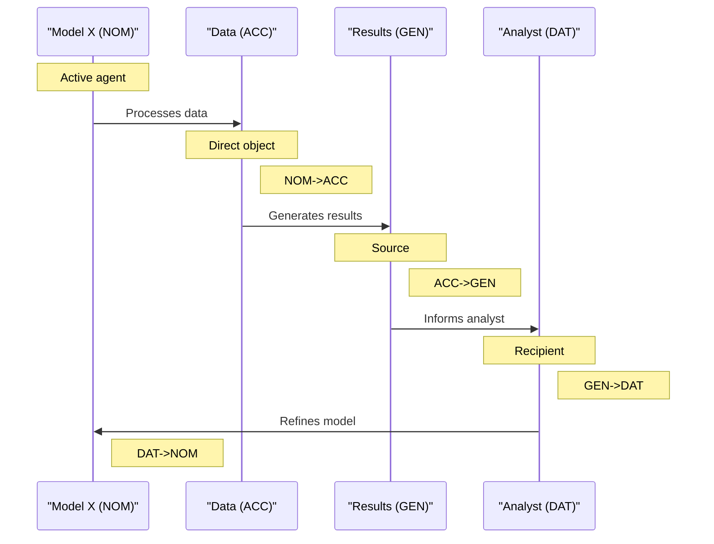

# Figure 5: Model Workflows as Case Transformations - Sequence Diagram 1

```mermaid
sequenceDiagram
    participant Model as "Model X (NOM)"
    participant Data as "Data (ACC)"
    participant Results as "Results (GEN)"
    participant Analyst as "Analyst (DAT)"
    
    Note over Model: Active agent
    Model->>Data: Processes data
    Note over Data: Direct object
    Note right of Data: NOM->ACC
    Data->>Results: Generates results
    Note over Results: Source
    Note right of Results: ACC->GEN
    Results->>Analyst: Informs analyst
    Note over Analyst: Recipient
    Note right of Analyst: GEN->DAT
    Analyst->>Model: Refines model
    Note right of Model: DAT->NOM
```