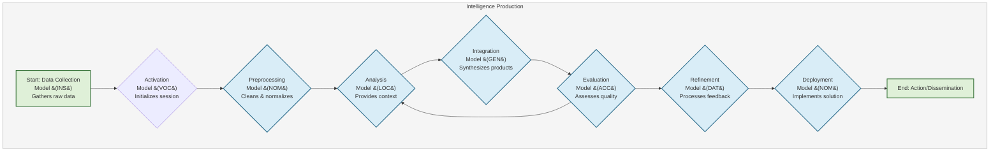

# Figure 6: Intelligence Production Workflow with Case-Bearing Models

```mermaid
flowchart LR
    subgraph IntelligenceCycle ["Intelligence Production"]
        direction LR
        A[Start: Data Collection<br>Model &#40;INS&#41;<br>Gathers raw data] --> A2{Activation<br>Model &#40;VOC&#41;<br>Initializes session};
        A2 --> B{Preprocessing<br>Model &#40;NOM&#41;<br>Cleans & normalizes};
        B --> C{Analysis<br>Model &#40;LOC&#41;<br>Provides context};
        C --> D{Integration<br>Model &#40;GEN&#41;<br>Synthesizes products};
        D --> E{Evaluation<br>Model &#40;ACC&#41;<br>Assesses quality};
        E --> F{Refinement<br>Model &#40;DAT&#41;<br>Processes feedback};
        F --> G{Deployment<br>Model &#40;NOM&#41;<br>Implements solution};
        G --> H[End: Action/Dissemination];
        
        %% Feedback loop
        E --> C;
    end

    %% Styling
    classDef startend fill:#dff0d8,stroke:#3c763d,stroke-width:2px
    classDef process fill:#d9edf7,stroke:#31708f,stroke-width:2px
    classDef decision fill:#fcf8e3,stroke:#8a6d3b,stroke-width:2px
    classDef cycle fill:#f5f5f5,stroke:#ccc,stroke-width:2px

    class A,H startend
    class B,C,D,E,F,G process
    class IntelligenceCycle cycle
```