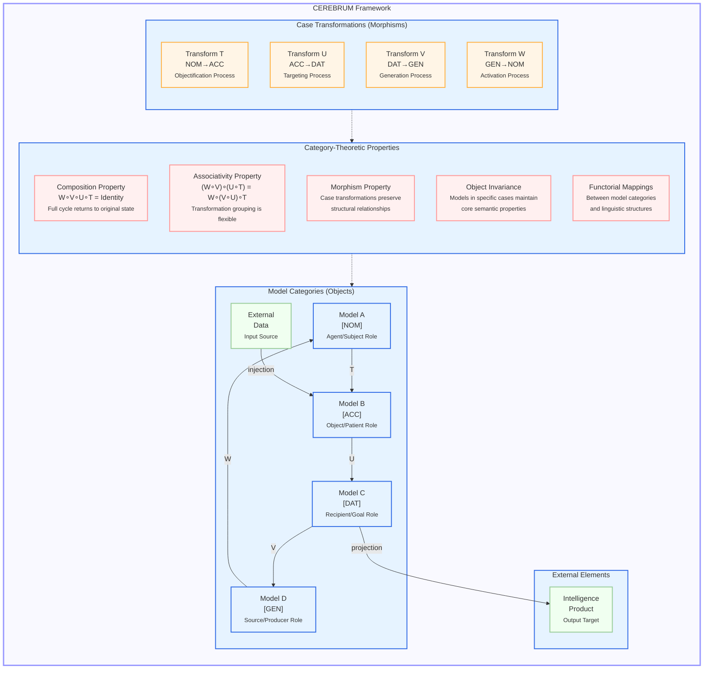

# Figure 7: CEREBRUM Category Theory Framework

```mermaid
flowchart TD
    subgraph CategoryTheory["CEREBRUM Framework"]
        direction TB
        
        subgraph ModelCases["Model Categories (Objects)"]
            direction TB
            A["Model A<br>[NOM]<br><small>Agent/Subject Role</small>"]
            B["Model B<br>[ACC]<br><small>Object/Patient Role</small>"]
            C["Model C<br>[DAT]<br><small>Recipient/Goal Role</small>"]
            D["Model D<br>[GEN]<br><small>Source/Producer Role</small>"]
            E["Model E<br>[VOC]<br><small>Addressable Entity Role</small>"]
        end
        
        subgraph Morphisms["Case Transformations (Morphisms)"]
            direction TB
            T["Transform T<br>NOM→ACC<br><small>Objectification Process</small>"]
            U["Transform U<br>ACC→DAT<br><small>Targeting Process</small>"]
            V["Transform V<br>DAT→GEN<br><small>Generation Process</small>"]
            W["Transform W<br>GEN→NOM<br><small>Activation Process</small>"]
        end
        
        subgraph External["External Elements"]
            direction TB
            E["External<br>Data<br><small>Input Source</small>"]
            F["Intelligence<br>Product<br><small>Output Target</small>"]
        end
        
        subgraph Properties["Category-Theoretic Properties"]
            direction TB
            COMP["Composition Property<br>W∘V∘U∘T = Identity<br><small>Full cycle returns to original state</small>"]
            ASSOC["Associativity Property<br>(W∘V)∘(U∘T) = W∘(V∘U)∘T<br><small>Transformation grouping is flexible</small>"]
            MORPH["Morphism Property<br><small>Case transformations preserve<br>structural relationships</small>"]
            OBJ["Object Invariance<br><small>Models in specific cases maintain<br>core semantic properties</small>"]
            FUNCTORS["Functorial Mappings<br><small>Between model categories<br>and linguistic structures</small>"]
        end
    end
    
    A --> |"T"| B
    B --> |"U"| C
    C --> |"V"| D
    D --> |"W"| A
    
    E --> |"injection"| B
    C --> |"projection"| F
    
    Properties -.-> ModelCases
    Morphisms -.-> Properties

    %% Styling
    classDef modelCase fill:#E6F3FF,stroke:#326CE5,stroke-width:2px
    classDef morphism fill:#FFF5E6,stroke:#FFB347,stroke-width:2px
    classDef external fill:#F0FFF0,stroke:#99cc99,stroke-width:2px
    classDef property fill:#FFF0F0,stroke:#ff9999,stroke-width:2px
    classDef framework fill:#f9f9ff,stroke:#9999ff,stroke-width:3px
    
    class A,B,C,D,E modelCase
    class T,U,V,W morphism
    class E,F external
    class COMP,ASSOC,MORPH,OBJ,FUNCTORS property
    class CategoryTheory framework
    class ModelCases,Morphisms,External,Properties modelCase
```

