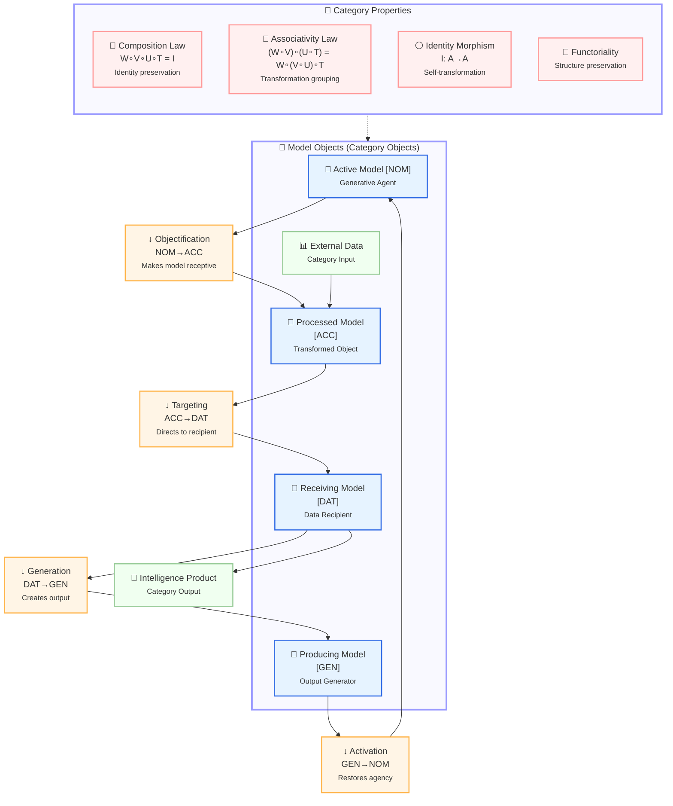

# Figure 8: Category Theory Framework

```mermaid
flowchart TB
    %% Category theory diagram
    
    subgraph Objects["🔵 Model Objects (Category Objects)"]
        direction TB
        A["👑 Active Model [NOM]
<small>Generative Agent</small>"]
        B["🎯 Processed Model
[ACC]
<small>Transformed Object</small>"]
        C["📩 Receiving Model
[DAT]
<small>Data Recipient</small>"]
        D["💫 Producing Model
[GEN]
<small>Output Generator</small>"]
        E["📢 Addressable Model
[VOC]
<small>Named Interface</small>"]
    end
    
    %% Define transforms as nodes for clarity
    T["↓ Objectification
NOM→ACC
<small>Makes model receptive</small>"]
    U["↓ Targeting
ACC→DAT
<small>Directs to recipient</small>"]
    V["↓ Generation
DAT→GEN
<small>Creates output</small>"]
    W["↓ Activation
GEN→NOM
<small>Restores agency</small>"]
    
    %% External elements
    E["📊 External Data
<small>Category Input</small>"]
    F["📘 Intelligence Product
<small>Category Output</small>"]
    
    subgraph Props["📐 Category Properties"]
        direction TB
        COMP["🔄 Composition Law
W∘V∘U∘T = I
<small>Identity preservation</small>"]
        ASSOC["🔀 Associativity Law
(W∘V)∘(U∘T) = W∘(V∘U)∘T
<small>Transformation grouping</small>"]
        IDENTITY["⚪ Identity Morphism
I: A→A
<small>Self-transformation</small>"]
        FUNCTOR["🔗 Functoriality
<small>Structure preservation</small>"]
    end
    
    %% Connect the model objects through transforms
    A --> T
    T --> B
    B --> U
    U --> C
    C --> V
    V --> D
    D --> W
    W --> A
    
    %% Connect external elements
    E --> B
    C --> F
    
    %% Add property connections
    Props -.-> Objects
    
    %% Styling
    classDef object fill:#E6F3FF,stroke:#326CE5,stroke-width:2px
    classDef transform fill:#FFF5E6,stroke:#FFB347,stroke-width:2px
    classDef external fill:#F0FFF0,stroke:#99cc99,stroke-width:2px
    classDef property fill:#FFF0F0,stroke:#ff9999,stroke-width:2px
    classDef category fill:#f9f9ff,stroke:#9999ff,stroke-width:3px
    
    class A,B,C,D,E object
    class T,U,V,W transform
    class E,F external
    class COMP,ASSOC,IDENTITY,FUNCTOR property
    class Objects,Props category
```

