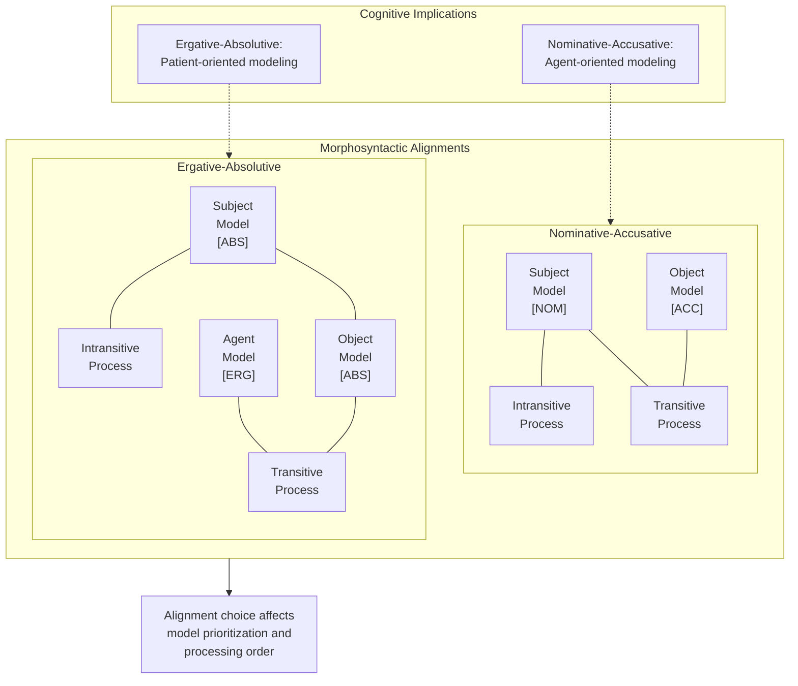

# Figure 9: Morphosyntactic Alignments in Model Relationships

```mermaid
flowchart TD
    subgraph MorphosyntacticAlignments["Morphosyntactic Alignments"]
        direction TB
        subgraph NominativeAccusative["Nominative-Accusative"]
            direction TB
            NA_S["Subject<br>Model<br>[NOM]"]
            NA_VI["Intransitive<br>Process"]
            NA_VT["Transitive<br>Process"]
            NA_O["Object<br>Model<br>[ACC]"]
            NA_S --- NA_VI
            NA_S --- NA_VT
            NA_O --- NA_VT
        end
        subgraph ErgativeAbsolutive["Ergative-Absolutive"]
            direction TB
            EA_S["Subject<br>Model<br>[ABS]"]
            EA_VI["Intransitive<br>Process"]
            EA_A["Agent<br>Model<br>[ERG]"]
            EA_VT["Transitive<br>Process"]
            EA_O["Object<br>Model<br>[ABS]"]
            EA_S --- EA_VI
            EA_A --- EA_VT
            EA_O --- EA_VT
            EA_S --- EA_O
        end
    end
    subgraph CognitiveImplications["Cognitive Implications"]
        direction TB
        NAM["Nominative-Accusative:<br>Agent-oriented modeling"]
        EAM["Ergative-Absolutive:<br>Patient-oriented modeling"]
    end
    NAM -.-> NominativeAccusative
    EAM -.-> ErgativeAbsolutive

	ALIGN["Alignment choice affects<br>model prioritization and<br>processing order"]

    MorphosyntacticAlignments --> ALIGN
```

