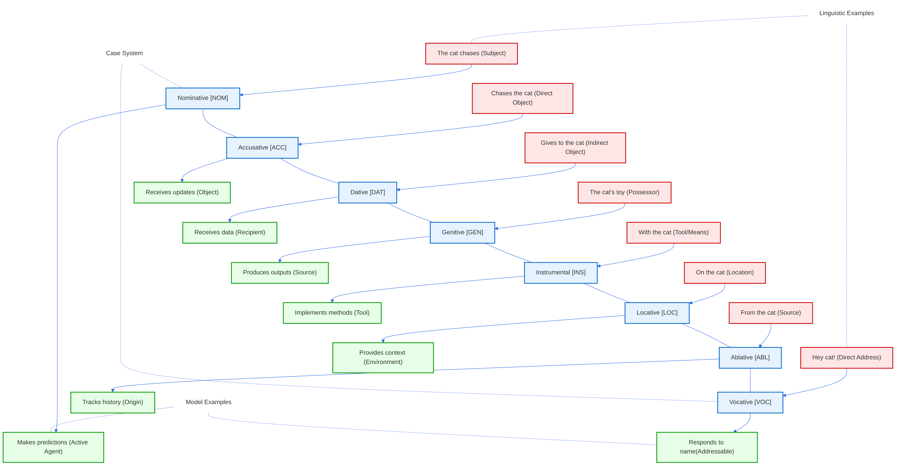
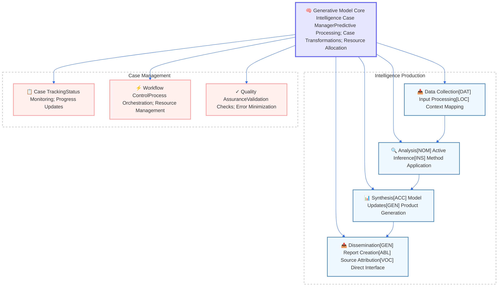
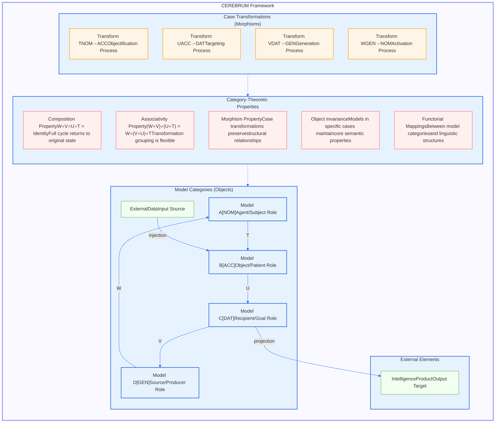
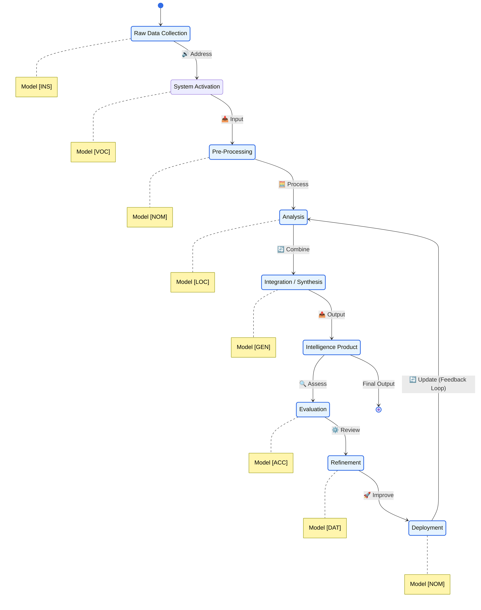
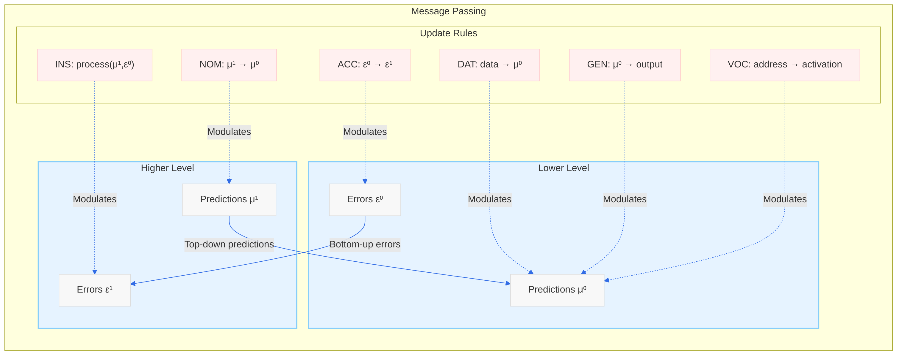

# Figures

This supplement contains all figures referenced in the main text, presented one per page for detailed viewing.

## Figure 1: Figure 1](figures/Figure_1

](figures/Figure_3.png)

igures/Figure_2.p

](figures/Figure_6.png)

 typical transformation cycle, and Figur](figures/Figure_5](figures/Figure_5.png)](figures/Figure

](figures/Figure

](figures/Figure_

](fig

](figures/Figure_15.png)

les](figures/Figure_14.png)](figures/Figure_14.png)

ures/Figure_13.png)

tions of these workflows](figures/Figure_12.png)](figures/Figure_12.png)

s](figures/Figure_11.png)](figures/Figure_11.png)

10.png)

_9.png)

ure_8.png)](figures/Figure_8.png)

onstrates the category-theoretic formalization of case relationships and transformations between cognitive models.](figures/Figure_7.png)](figures/Figure_7.png)

_5.png)

](figures/Figure_4.png)

ng)](figures/Figure_2.png)

](figures/Figure_1.png)

\pagebreak

## Figure 2: illustrates this linguistic parallel

\pagebreak

## Figure 3: Figure 3](figures/Figure_3

\pagebreak

## Figure 4: illustrates how this core framework integrates with intelligence case management

\pagebreak

## Figure 5: provides a sequence diagram of a typical transformation cycle, and Figur](figures/Figure_5

\pagebreak

## Figure 6: s](figures/Figure_6

\pagebreak

## Figure 7: CEREBRUM Category Theory Framework. Demonstrates the category-theoretic formalization of case relationships and transformations between cognitive models.

\pagebreak

## Figure 8: Figure 8](figures/Figure_8

\pagebreak

## Figure 9: Figure 9](figures/Figure_9

\pagebreak

## Figure 10: demonstrates the practical imple](figures/Figure_10

\pagebreak

## Figure 11: and Figure 12 provide alternative state-based visualizations of these workflows

\pagebreak

## Figure 12: provide alternative state-based visualizations of these workflows

\pagebreak

## Figure 13: Figure 13](figures/Figure_13

\pagebreak

## Figure 14: details the associated message passing rules

\pagebreak

## Figure 15: Figure 15](figures/Figure_15

\pagebreak

