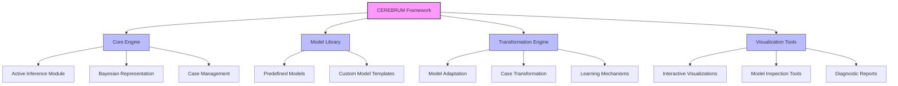
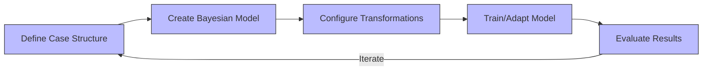
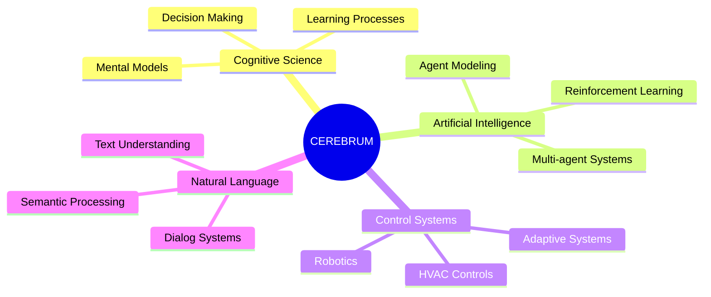
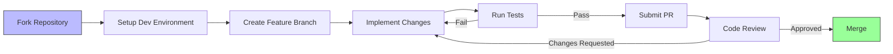

# CEREBRUM 
[](https://doi.org/10.5281/zenodo.15170908)

CEREBRUM: Case-Enabled Reasoning Engine with Bayesian Representations for Unified Modeling

## Repository
**GitHub Repository:** [https://github.com/ActiveInferenceInstitute/CEREBRUM](https://github.com/ActiveInferenceInstitute/CEREBRUM)

[](https://doi.org/10.5281/zenodo.15171283)

## Publication Information
- **Author:** Daniel Ari Friedman
- **Version:** 1.0
- **Date:** April 7, 2025
- **DOI:** [10.5281/zenodo.15170908](https://doi.org/10.5281/zenodo.15170908)
- **Zenodo Record:** [https://zenodo.org/records/15216751](https://zenodo.org/records/15216751)
- **Institution:** Active Inference Institute

## Overview
CEREBRUM is a unified modeling framework that integrates case-based reasoning with Bayesian representations. It provides a comprehensive suite of tools for developing, testing, and deploying cognitive models that combine the strengths of case-based reasoning with probabilistic inference.

Key features include:
- Integration of symbolic case structures with Bayesian probabilistic representations
- Flexible transformation engine for model adaptation and learning
- Multiple language implementations with consistent APIs
- Visualization tools for model inspection and analysis
- Extensive example library demonstrating applications across domains

## Project Architecture



## Repository Structure
The CEREBRUM repository is organized into the following structure:

| Directory/File | Description |
|----------------|-------------|
| `/src` | Source code for the CEREBRUM framework |
| `/src/core` | Core engine components including active inference module, neural networks, and model base classes |
| `/src/models` | Implementation of various model types and case definitions |
| `/src/utils` | Utility functions and helper classes |
| `/src/visualization` | Visualization tools and components |
| `/src/transformations` | Model transformation and adaptation algorithms |
| `/src/cases` | Case definition and management functionalities |
| `/src/examples` | Example implementations and demonstrations |
| `/docs` | Documentation including specifications, guides, and discussions |
| `/docs/examples` | Detailed documentation for example models |
| `/docs/languages` | Language-specific implementation guidelines |
| `/paper` | Academic paper source files and generation tools |
| `/paper/components` | Paper section components and figures |
| `/paper/output` | Generated paper outputs in various formats |
| `/tools` | Development and maintenance tools |
| `/output` | Default location for generated outputs and results |

## Implementation Workflow



## Getting Started

CEREBRUM can be used in multiple ways depending on your needs:

1. **Explore existing models**: Check out the `/src/examples` directory
2. **Create your own models**: Follow the guides in `/docs/getting_started.md`
3. **Extend the framework**: See `/docs/contributing_technical.md` for development setup

### Installation

```bash
# Clone the repository
git clone https://github.com/ActiveInferenceInstitute/CEREBRUM.git
cd CEREBRUM

# Install dependencies
pip install -r requirements.txt

# For development
pip install -r requirements_dev.txt
```

## PDF Documentation
The full documentation for CEREBRUM is available as a PDF file in the `paper/output/` directory, which is generated from the Markdown source files.

### Requirements for PDF Generation
To regenerate the PDF documentation, you need:
- Python 3
- Node.js with Mermaid CLI (`@mermaid-js/mermaid-cli` package)
- Pandoc
- XeLaTeX (for PDF generation)

### Generating the PDF
To regenerate the PDF documentation, run:

```bash
python3 paper/assemble_paper.py
```

This script will:
1. Render all Mermaid diagrams from `paper/components/figures/` to PNG images
2. Assemble all markdown components in the correct order
3. Generate an HTML version of the paper
4. Create the final PDF file at `paper/output/assembled_paper.pdf`

For more detailed information about the paper building process, please see `paper/README.md`.

## Use Cases

CEREBRUM has been applied to a variety of domains:



## Citation
If you use CEREBRUM in your research, please cite:
```bibtex
@misc{friedman2025cerebrum,
  author = {Friedman, Daniel Ari},
  title = {CEREBRUM: Case-Enabled Reasoning Engine with Bayesian Representations for Unified Modeling},
  year = {2025},
  month = {April},
  version = {1.0},
  doi = {10.5281/zenodo.15170908},
  publisher = {Active Inference Institute},
  url = {https://github.com/ActiveInferenceInstitute/CEREBRUM}
}
```

## License
CC BY-NC-ND 4.0

## Acknowledgements
This work builds upon the efforts and insights of many participants within the Active Inference Institute. Special thanks are extended to Dave Douglass for his contributions related to computational linguistics, archiving, Active Inference principles, upper ontologies, and translations, which have significantly informed aspects of this project.

## Contributing
We welcome contributions from researchers, developers, and enthusiasts across multiple domains:

### Ways to Contribute
- **🔬 Research**: Theoretical development, empirical testing, literature reviews
- **💻 Technical**: Core development, language implementations, integrations, testing
- **📚 Documentation**: Educational content, API docs, use cases, tutorials
- **🧩 Examples**: Model examples, domain applications, interactive demonstrations
- **🌍 Community**: Organizing events, content creation, mentoring, user support

### Contribution Scale
From micro-contributions (1-3 hours) to large projects (40+ hours), we value contributions of all sizes.

### Development Process



For detailed contribution guidelines, process information, and more specific ideas, please see our [CONTRIBUTING.md](CONTRIBUTING.md) document. 