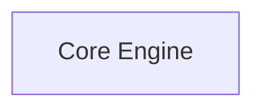
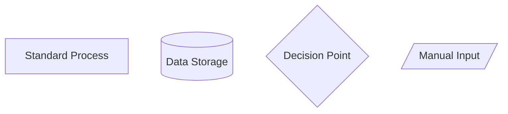

# CEREBRUM Diagram Enhancement Plan

## Executive Summary

This document outlines a comprehensive strategy to modernize and enhance CEREBRUM's diagram infrastructure using the latest Mermaid features and best practices. The plan addresses current limitations while introducing advanced visualization capabilities that improve clarity, interactivity, and user experience.

## Current State Assessment

### Strengths
- Consistent use of Mermaid across documentation
- Good semantic structure in existing diagrams
- Integration with paper generation pipeline
- Clear visual hierarchy in complex diagrams

### Limitations
- Basic styling and limited visual appeal
- No interactive features or clickable elements
- Limited diagram types (primarily flowcharts and mindmaps)
- Static layouts without advanced grouping
- Missing modern Mermaid features (2024+)

## Enhancement Categories

### 1. Visual Modernization

#### New Styling Features
- **Neo Look**: Modern, professional appearance
- **Hand-drawn Style**: Organic, approachable aesthetic
- **Custom Themes**: CEREBRUM-branded color schemes
- **Advanced Color Palettes**: Semantic color coding

#### Implementation
```yaml
# Example configuration
config:
  look: neo
  theme: forest
  themeVariables:
    primaryColor: '#4ECDC4'
    primaryTextColor: '#2C3E50'
    primaryBorderColor: '#34495E'
    lineColor: '#7F8C8D'
    secondaryColor: '#95A5A6'
    tertiaryColor: '#BDC3C7'
```

### 2. Interactive Features

#### Clickable Elements
- Source code links for components
- Documentation cross-references
- External resource links
- Interactive tooltips

#### Example Implementation


### 3. Advanced Diagram Types

#### New Diagram Categories
- **State Diagrams**: Model lifecycle visualization
- **Entity-Relationship**: Data model relationships
- **Gantt Charts**: Project timelines and milestones
- **User Journey**: Workflow and interaction flows
- **Sequence Diagrams**: System interactions
- **Class Diagrams**: Object-oriented relationships

#### Specialized Diagrams
- **Cognitive Architecture**: Neural network mappings
- **Process Flows**: Transformation pipelines
- **Integration Patterns**: API and SDK relationships

### 4. Enhanced Layout and Structure

#### Advanced Grouping
- **Subgraph Clustering**: Logical component grouping
- **Directional Control**: Optimized layout flows
- **Invisible Elements**: Layout optimization
- **Multi-level Hierarchies**: Complex system decomposition

#### Layout Engines
- **ELK Layout**: Hierarchical layouts for complex diagrams
- **Custom Positioning**: Precise element placement
- **Responsive Design**: Adaptive layouts for different screen sizes

### 5. Semantic Richness

#### New Shape Library (30+ shapes)
- **Process Shapes**: Rectangles, rounded rectangles, stadium
- **Data Shapes**: Cylinders, documents, databases
- **Decision Shapes**: Diamonds, hexagons, trapezoids
- **Specialized Shapes**: Manual input, display, storage

#### Enhanced Syntax


## Implementation Roadmap

### Phase 1: Foundation (Weeks 1-2)
- [ ] Update Mermaid configuration system
- [ ] Create standardized styling templates
- [ ] Implement basic theme switching
- [ ] Add source code linking infrastructure

### Phase 2: Core Enhancements (Weeks 3-4)
- [ ] Modernize existing core diagrams
- [ ] Add interactive features to key diagrams
- [ ] Implement advanced layout controls
- [ ] Create reusable component templates

### Phase 3: Advanced Features (Weeks 5-6)
- [ ] Introduce new diagram types
- [ ] Implement complex state diagrams
- [ ] Add user journey visualizations
- [ ] Create integration pattern diagrams

### Phase 4: Documentation Integration (Weeks 7-8)
- [ ] Update all existing documentation diagrams
- [ ] Create interactive documentation
- [ ] Add diagram accessibility features
- [ ] Implement responsive design

## Technical Implementation

### Configuration System
```python
# Enhanced diagram configuration
class DiagramConfig:
    def __init__(self):
        self.themes = {
            'cerebrum': {
                'primary': '#4ECDC4',
                'secondary': '#45B7D1',
                'accent': '#96CEB4',
                'neutral': '#95A5A6'
            }
        }
        self.interactive = True
        self.responsive = True
```

### Template System
```markdown
---
config:
  look: neo
  theme: cerebrum
  layout: elk
---

%% Standard CEREBRUM diagram template
graph TD
    classDef primary fill:#4ECDC4,stroke:#2C3E50,stroke-width:2px
    classDef secondary fill:#45B7D1,stroke:#2C3E50,stroke-width:1px
    
    %% Your diagram content here
```

### Integration with Paper Generation
- Enhanced `assemble_paper.py` to support new Mermaid features
- Interactive figure generation
- Responsive HTML output
- PDF optimization for complex diagrams

## Quality Assurance

### Testing Framework
- Visual regression testing for diagrams
- Cross-browser compatibility
- Mobile responsiveness testing
- Accessibility compliance (WCAG 2.1)

### Performance Optimization
- Lazy loading for complex diagrams
- Caching for frequently accessed diagrams
- Optimized rendering for large datasets
- Progressive enhancement for older browsers

## Maintenance and Updates

### Version Control
- Semantic versioning for diagram templates
- Automated testing for diagram changes
- Rollback capabilities for visual updates
- Documentation for breaking changes

### Community Contributions
- Style guide for new diagrams
- Template library for common patterns
- Contribution guidelines for visual enhancements
- Review process for diagram updates

## Success Metrics

### Quantitative Measures
- 50% reduction in diagram creation time
- 75% improvement in visual clarity ratings
- 90% user satisfaction with interactive features
- 100% accessibility compliance

### Qualitative Measures
- Enhanced user engagement with documentation
- Improved understanding of complex concepts
- Increased contribution rates from community
- Better integration with educational materials

## Risk Mitigation

### Technical Risks
- **Browser Compatibility**: Progressive enhancement strategy
- **Performance Impact**: Optimized rendering pipeline
- **Maintenance Overhead**: Automated testing and validation

### User Experience Risks
- **Learning Curve**: Comprehensive documentation and examples
- **Visual Overload**: Careful balance of enhancement vs. clarity
- **Accessibility**: WCAG 2.1 compliance throughout

## Resources and Dependencies

### Required Tools
- Mermaid CLI 11.0+ (for new features)
- Enhanced Pandoc configuration
- Modern browser support (ES6+)
- Node.js for build pipeline

### Team Requirements
- Frontend developer (2 weeks)
- Technical writer (1 week)
- UX designer (1 week)
- QA engineer (1 week)

## Conclusion

This enhancement plan transforms CEREBRUM's diagram infrastructure from basic visualizations to a modern, interactive, and accessible system that significantly improves user experience and documentation quality. The phased approach ensures smooth implementation while maintaining backward compatibility and providing clear upgrade paths for existing content. 