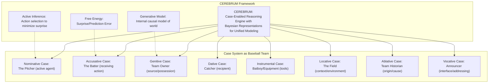
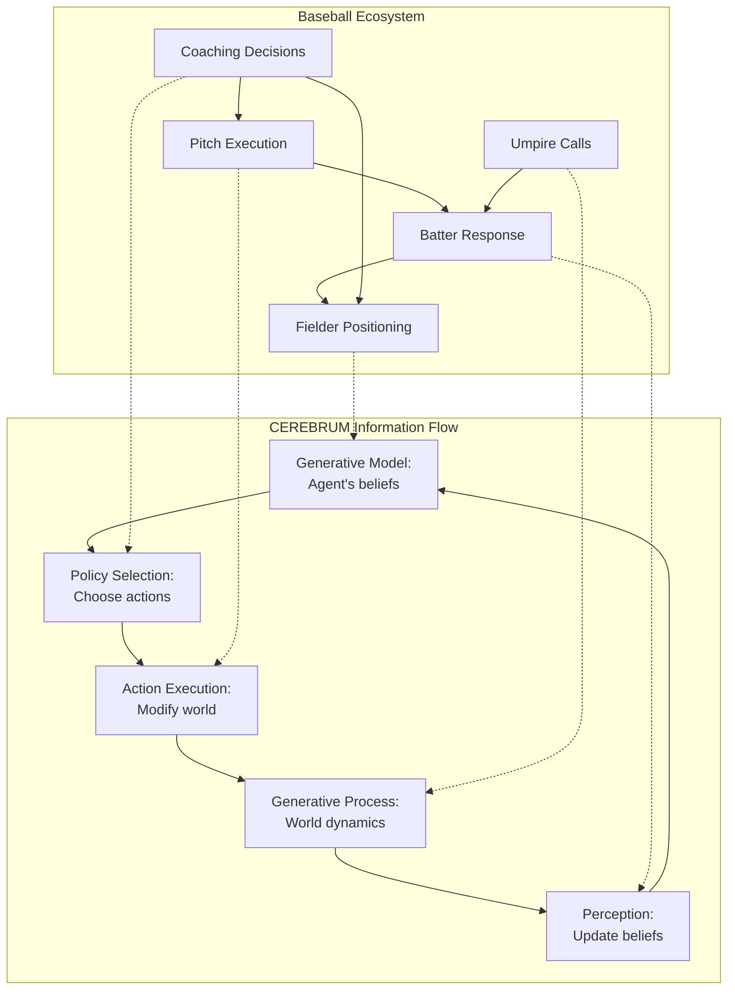
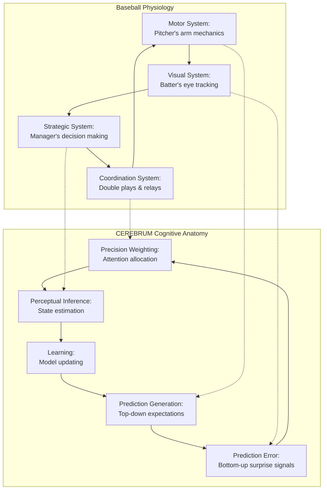
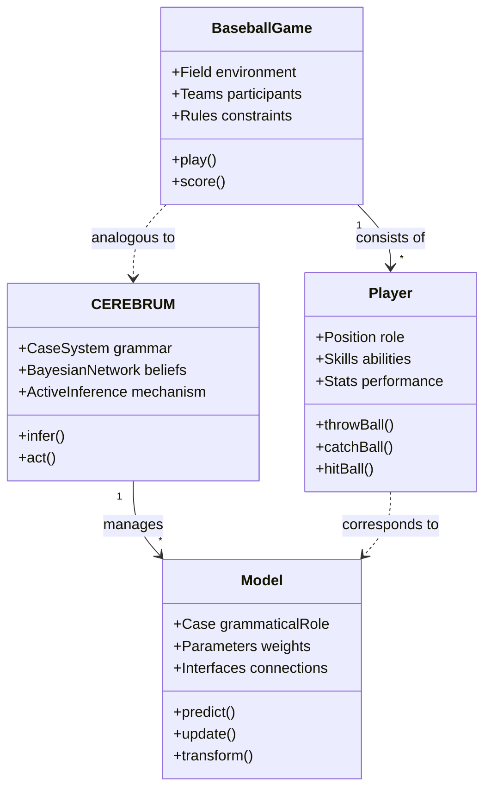
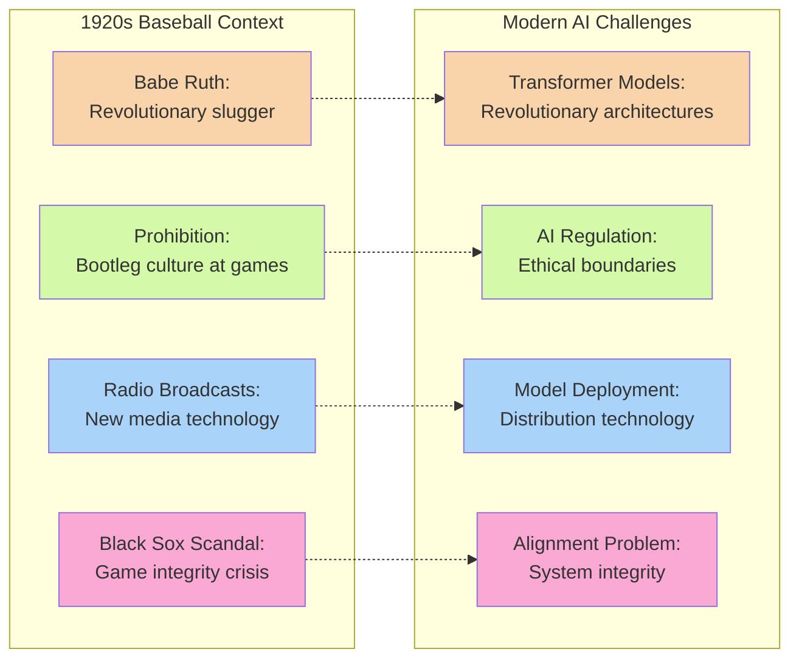

# Who's on First? AI Edition: CEREBRUM, Active Inference, and the LLM Speakeasy

**Characters:**

*   **Abbott:** An increasingly flustered AI theorist, trying to explain the finer points of computational neuroscience and predictive processing frameworks.
*   **Costello:** A bewildered everyman, stuck in a Vaudeville loop mixed with 1920s sensibilities and an encyclopedic knowledge of baseball trivia that he constantly misapplies.

**Setting:** Outside a bustling AI conference, reminiscent of a noisy street corner near Ebbets Field or perhaps a dimly lit speakeasy entrance on the Lower East Side. Gramophones can be heard playing "Ain't We Got Fun" in the distance.

**(SCENE START)**

**Abbott:** Costello, my dear fellow, you look like you've seen a ghost! Or perhaps just one too many talks on recursive self-improvement and transformer attention mechanisms. It's not all Greek lambda calculus, you know. We're making strides beyond just that ubiquitous LLM everyone's buzzing about—like Ruth pointing to the center field bleachers before knocking it out of the park!

**Costello:** The LLM? Yeah, the Big Linguini Machine! Writes my thank-you notes like nobody's business. Slicker than a greased piglet at the county fair. Makes Honus Wagner's shortstop plays look like amateur hour. Is that the whole shebang, the bee's knees, the cat's pajamas?

**Abbott:** Heavens no! That's just the appetizer, the peanuts before the ballgame! For the main course, for building agents that truly *think*, plan, adapt – like how Ty Cobb could predict a curveball even before the pitcher's windup – we're using sophisticated frameworks with hierarchical Bayesian inference. Take CEREBRUM, for instance. It often works hand-in-glove with principles like Active Inference and Variational Free Energy minimization.

**Costello:** Who-brum? Sounds like a brand of aspirin. My head *is* spinning worse than when I took my dame to see the Charleston competition at the Coconut Grove.

**Abbott:** No, no! **CEREBRUM**. Capital C-E-R-E-B-R-U-M. It's the **Case-Enabled Reasoning Engine with Bayesian Representations for Unified Modeling**. Quite the mouthful, I admit, but it's the engine under the hood! The Babe Ruth of cognitive architectures, if you will.

**Costello:** A case-enabled engine? Like in my new Ford Model T? Does it come in different cases? Like a suitcase for travel or a briefcase for carrying my baseball cards? And who's patient? Is the engine sick? Coughing like a Model T on bad hooch? And **Bayesian Representations**? Is that the name of the mechanic? Representing the Bayes family dealership? Are they related to the Bayses who own that diner on 42nd where Shoeless Joe Jackson once ate a ham sandwich?

**Abbott:** *Massaging temples* Costello, try to follow. CEREBRUM isn't a *who*, it's a *what*! It's the **framework**, the architecture, the conceptual scaffold! Like Fenway Park's Green Monster—it structures the play! And "Case-Enabled" refers to **Linguistic Case Systems** from computational linguistics and cognitive grammar. Think morphology, like nouns changing form depending on their grammatical role. The models *take* different cases to fulfill different computational roles in a distributed inference system.

**Costello:** So the models get put in different cases? Like suspects down at the precinct? What case are they on? Who's the lead detective? Is it that flatfoot McGillicuddy who caught Three-Finger Brown gambling at the Polo Grounds?

**Abbott:** Not detective cases! **Grammatical cases**! Like **Nominative**! From Latin grammar and highly structured languages. These are formal role descriptors from morphosyntax and computational semantics!

**Costello:** Nominative? Who's he nominating? For President? Is he running against Coolidge? Or maybe against Walter Johnson for best fastball in the league? Johnson's got that train-whistle pitch, you know—leaves smoke on the plate faster than a bootlegger running from the feds!

**Abbott:** The *model* is in the Nominative case! It means the model is the active agent, the subject, the one *doing* the predicting, generating things, exerting influence within our computational graph! Like the pitcher on the mound—the prime mover, the initiator of action sequences with causal power! In the Bayesian network, it's the node that propagates belief updates downstream!

**Costello:** Okay, so Nominative is the pitcher. Got it. Like Walter Johnson with his blazing fastball or maybe Carl Mays with that submarine delivery that beaned Ray Chapman in '20—only death from a pitched ball in the majors, you know. What else ya got in this computational ballpark of yours?

**Abbott:** Well, there's the **Accusative** case, a fundamental grammatical role in semantic networks and predicate calculus.

**Costello:** Accusative? Who's he accusing? Is Nominative throwing spitballs? Scuffing the ball? Adding shine like Eddie Cicotte? Call the umpire! Get Bill Klem out here—the "Old Arbitrator" ain't never missed a call, so they say!

**Abbott:** Nobody is accusing anybody! In the Accusative case, the model is the *object*! It's being acted upon, receiving updates, being transformed through backpropagation or variational inference. Like the batter getting a pitch—the recipient of action! Or maybe a model getting refined by stochastic gradient descent optimization procedures. It's the target of the computational operation, the node receiving the message passing!

**Costello:** So, Nominative throws the ball, Accusative gets the ball thrown *at* him. Okay... What's on second base? Is it Eddie Collins with his hit-and-run strategy? Or maybe Rogers Hornsby batting .400?

**Abbott:** We're not talking about baseball bases, Costello! We're talking about model roles in cognitive architectures and semantic frames! There's also the **Genitive** case, critical for establishing ownership relations in knowledge graphs!

**Costello:** Genitive? Is that the pitcher's sister? Jenny Tive? Nice girl? Does she know Nuxhall's daughter? How's her curveball? Is she one of those bloomer girls who plays exhibition games?

**Abbott:** *Deep breath* Genitive means the model is the source, the possessor! Like the origin of outputs, the generator of reports—they call it "**Generative AI**" sometimes, drawing from the same etymological root. Think of it as where the intelligence product *comes from*, its provenance in the computational provenance graph. In information theory terms, it's the entropy source!

**Costello:** So… Jenny Tive owns the ballpark where Nominative is pitching to Accusative? Like how Colonel Ruppert owns the Yankees? Or maybe like Landis running the whole league with an iron fist since that Black Sox business? Speaking of which, did Shoeless Joe really throw those games? Hit .375 in the Series!

**Abbott:** Let's move on. **Dative** case! An essential concept in argument structure and thematic relations within computational linguistics!

**Costello:** Dative? Is he going on a date with Genitive? Should I tell Nominative? Does this break the player's code? Going out with the owner's sister could get you traded to the Phillies faster than you can say Jack Robinson!

**Abbott:** Dative means the model is the recipient! It receives data flows, information, utility functions. It's configured specifically for input reception and processing, like a catcher's mitt receiving the ball. In neural network terms, it's analogous to an input layer specialized for certain data modalities. It has high receptive field sensitivity!

**Costello:** Okay, Dative catches the ball, like Gabby Hartnett or Mickey Cochrane behind the plate. Nominative (pitcher), Accusative (batter), Genitive (owner), Dative (catcher). Who's on first? Is it Lou Gehrig with his reliability? Or maybe George Sisler with that picture-perfect swing?

**Abbott:** *Ignoring the question* Then there's **Instrumental**! A critical case relationship in both linguistics and computational action modeling!

**Costello:** Instrumental? Like the band playing between innings? Paul Whiteman's orchestra? The Jazz Age is swingin'! Fletcher Henderson at the Cotton Club! Is he related to Joe McCarthy's coaching strategy for the Cubs?

**Abbott:** The model *as* the instrument! The tool! The means by which an analysis is performed through algorithmic operations and transformations. Like using a specific Transformer architecture or attention mechanism, that algorithm *is* the Instrumental model for that task. In CEREBRUM terms, it's a computational service provider with well-defined interfaces and contracts!

**Costello:** So Instrumental is the batboy, bringing the tools. Okay. Like Eddie Bennett who worked for the Yankees—was the good luck charm for Ruth and Gehrig! What about the field? Is it like Sportsman's Park with that short right field or the Polo Grounds with those cavernous power alleys?

**Abbott:** You mean the **Locative** case? A spatial-semantic relationship marker that designates contextual embeddings!

**Costello:** Locative? Yeah, where's the game located? Yankee Stadium? Or maybe Cleveland's League Park where Tris Speaker patrols center field so shallow he could touch second base? Is this one of those new radio broadcasts where Graham McNamee describes the action?

**Abbott:** Locative means the model *is* the context! The environment! The situational parameters in the state space. It sets the scene, the constraints, the boundary conditions of the inference problem. It's *where* the action happens, computationally speaking. In active inference terms, it defines the Markov blanket that separates internal and external states!

**Costello:** Locative is the field. Makes sense. Like how Ruth hits better in the Polo Grounds with that short porch in right field, but Speaker prefers the wide-open spaces at Griffith Stadium. Any others? This team is getting crowded worse than the Yankee dugout after they signed all those sluggers!

**Abbott:** There's **Ablative**, a critical concept for source attribution and causal history modeling!

**Costello:** Ablative? Sounds like a laxative sold at the pharmacy next to the ballpark. Is the hot dogs vendor nearby? Those things'll tie your intestines in knots worse than a Carl Hubbell screwball!

**Abbott:** Ablative signifies origin or cause! Where something comes *from*, historically. The causal precursor, the ancestral node in a Bayesian network! Like tracing insights back to their source model through attribution chains. It's critical for explainable AI and algorithmic accountability!

**Costello:** So Ablative is like the team historian, telling us where Nominative came from. Like how Babe Ruth started as a pitcher with the Red Sox before becoming the Sultan of Swat for the Bombers! Or how Casey Stengel was a mediocre outfielder before becoming a managerial genius!

**Abbott:** ...And finally, **Vocative**, an essential interface paradigm in human-computer interaction!

**Costello:** Vocative? Like a vocalist? Is someone gonna sing the anthem? Maybe Al Jolson? Is Jack Dempsey in the crowd today? He always brings out the high society swells!

**Abbott:** Vocative means the model is being addressed directly! Called out! Like saying "Hey, Model X!" It's the interface, the API endpoint, the name you call to wake it up or get its attention. Think of it like hailing a taxi or using a command line prompt! It's the entry point for interaction initiation protocols!

**Costello:** Okay, Vocative is the announcer calling the plays! Like Thomas or McNamee on the wireless! Nominative (pitcher), Accusative (batter), Genitive (owner), Dative (catcher), Instrumental (batboy), Locative (field), Ablative (historian), Vocative (announcer). THAT'S THE WHOLE TEAM! SO WHO'S ON FIRST?! Is it Sisler? Gehrig? Judge? Kelly? Chase? Who?!

**Abbott:** It's not a team, Costello! It's **Declension**! The *same* model can *be* in *different* cases depending on the computational context and task requirements! It undergoes **Morphological Transformation**! It changes its shape, its interfaces, its **Precision Weighting** through parametric adjustments and architectural reconfiguration!

**Costello:** Morphological transformation? Like a caterpillar becoming a butterfly? The model changes costumes? Like how Ruth changed from pitcher to slugger? And Precision Weighting? Is that the umpire checking the scales? Making sure Nominative isn't throwing a heavy ball? Is it Bill Klem with his famous "I call 'em as I see 'em" attitude? Or maybe Cy Rigler with that exaggerated strike call?

**Abbott:** Precision relates to uncertainty quantification in Bayesian inference! How much weight, how much computational resource, you give to different parts—parameters, predictions, inputs—depending on the case and uncertainty estimates! Like in **Active Inference**, the whole goal is to minimize **Free Energy**—surprise! Mathematically, it's the negative log evidence lower bound on model evidence! You act and perceive to keep things predictable based on your **Generative Model** through Bayesian belief updating and policy selection!

**Costello:** Free energy? Like getting free electricity from Tesla's wireless tower? Or maybe some bootleg hooch from that speakeasy down the block run by Owney Madden? Who's surprised? The batter when Nominative throws a curveball like Dazzy Vance? And Generative Model? Is that the fancy new car model Genitive is driving? A Pierce-Arrow with those sleek lines or maybe a Duesenberg straight-eight with custom coachwork?

**Abbott:** The Generative Model is the agent's *internal model* of how its sensations are caused through hierarchical latent variable structures! Its prediction machine operating across multiple levels of abstraction! CEREBRUM helps structure these models and their relationships using things like **Category Theory** and **Fibrations** over computational base spaces!

**Costello:** Category Theory? Like sorting the mail? Or different weight classes in boxing? Heavyweight Jack Dempsey versus lightweight Benny Leonard? Or maybe it's about categorizing pitches—fastball, curveball, spitball (when the ump ain't looking), and that new slider Carl Mays is working on?

**Abbott:** It's mathematics! Advanced abstract algebra! It formalizes relationships as **morphisms** between objects—in this case, models in different case states with commutative transformation rules! Like **functors** mapping between categories and **natural transformations** between functors! It helps ensure consistency and compositional reasoning, especially when dealing with complex **Intelligence Production** workflows or different **Morphosyntactic Alignments** in distributed multi-agent systems!

**Costello:** Morpho-whatsit Alignment? Like getting the Model T's wheels aligned at the garage on 42nd? Does Bayesian Representations do that? Is he related to that mechanic O'Malley who fixed Hornsby's flivver before the World Series?

**Abbott:** Morphosyntactic Alignment! Like Nominative-Accusative systems versus Ergative-Absolutive patterns in cross-linguistic typology! It's about how grammatical roles are grouped and mapped—how subjects and objects relate across transitive and intransitive constructions! CEREBRUM lets you model these different interaction patterns in your **Model Ecosystem** through declarative constraint specifications! It affects how models pass messages and update their posterior belief distributions. It's how you build **Knowledge Graphs** with real semantic relationships and proper scope resolution, leading to **Emergent Behaviors** through compositional dynamics and non-linear interactions!

**Costello:** Emergent Behaviors? Like the crowd doing the wave? Or arguing with the umpire after Babe Ruth gets tossed for arguing balls and strikes? Or maybe how Frankie Frisch covers second base differently depending on who's pitching? So... CEREBRUM is the rulebook written by Commissioner Landis, Category Theory is the math professor calculating batting averages and slugging percentages, Active Inference is the team's strategy to not be surprised by a hidden ball trick, Free Energy is the illegal booze under the bleachers that the cops pretend not to see, the Cases are the players—Nominative, Accusative, Genitive, Dative, Instrumental, Locative, Ablative, Vocative—who change roles (Declension!), Precision Weighting is the umpire checking legal pitches, the Generative Model is John McGraw's playbook full of strategies, and Morpho-thingy Alignment is how the teams line up for the national anthem...

**Abbott:** (*A glimmer of hope*) Yes! Essentially! You've separated the concepts and identified their functional analogs! That's a valid conceptual mapping using domain-appropriate metaphors!

**Costello:** Okay! I think I finally got it! It all makes sense now, like why Ty Cobb spikes the shortstop on a close play!

**Abbott:** (*Relieved*) Wonderful! So, any questions about the architectural principles or implementation details?

**Costello:** Just one... WHO'S ON FIRST?! Is it Sisler? Chase? Gehrig? Judge? WHO?!

**Abbott:** (*Throws hands up, utterly defeated*) I DON'T KNOW!

**Costello:** THIRD BASE! See? I told ya knew the lineup! Tinker to Evers to Chance, easiest double play in the book! Now, about that Big Linguini Machine writing my letters... can CEREBRUM help it understand baseball statistics? I've got this idea for something called "on-base percentage" that factors in walks—might catch on someday!

**(SCENE END)**

## Mermaid Diagrams: Baseball and CEREBRUM Conceptual Mappings

