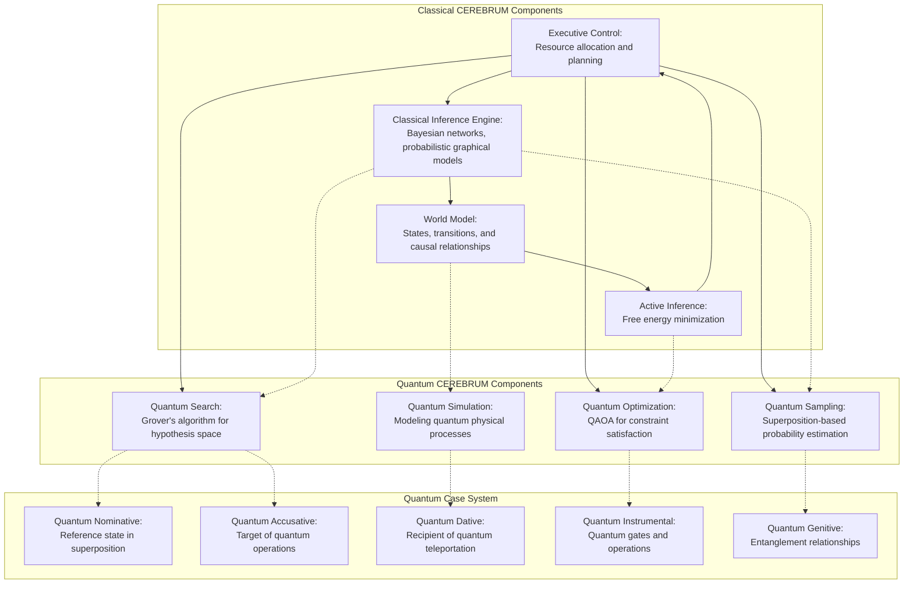
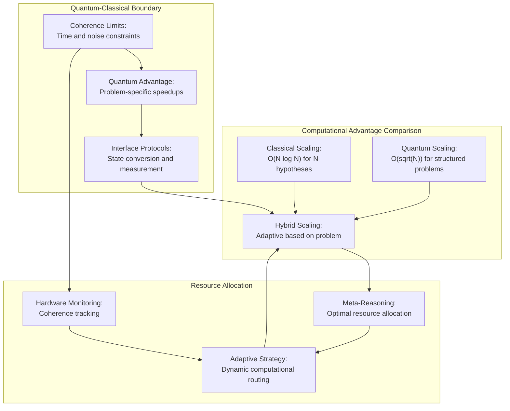

# Quantum Entanglement Paradox: CEREBRUM and the Quantum Computing Frontier

**Characters:**

* **Professor Sophia Chen:** Quantum physicist specializing in quantum computing architecture and quantum information theory, with a focus on practical quantum advantage for AI systems.
* **Dr. Marcus Feynman:** CEREBRUM architect and theoretical computer scientist, attempting to extend classical computational paradigms into quantum domains.
* **CEREBRUM-Q:** An experimental quantum-enhanced CEREBRUM system, communicating through a terminal interface with occasional coherence issues.

**Setting:** A cutting-edge quantum computing laboratory at the Institute for Advanced Computational Systems. The room is dominated by a temperature-controlled chamber housing a dilution refrigerator containing superconducting quantum circuits. Multiple screens display quantum circuit diagrams, wavefunction visualizations, and CEREBRUM architectural schematics.

**(SCENE START)**

**Prof. Chen:** *[adjusting controls on a quantum measurement apparatus]* The coherence times are holding steady at 250 microseconds on the primary qubits. Not perfect, but sufficient for our demonstration. We should be able to entangle about 50 qubits reliably before decoherence becomes problematic.

**Dr. Feynman:** That's substantially better than last month's results. I've modified CEREBRUM's probabilistic inference engine to accept quantum measurement outputs as Bayesian priors, but I'm concerned about the ontological mismatch between quantum superposition states and our classical Bayesian network architecture.

**Prof. Chen:** *[smiling]* The eternal quantum-classical divide. Quantum mechanics gives us probabilities that behave... differently. Superposition isn't just uncertainty about a definite state—it's a fundamentally different mathematical structure.

**Dr. Feynman:** Precisely our challenge. CEREBRUM operates on probability distributions over possible world states, but quantum systems exist in superpositions that can't be reduced to classical probability distributions until measurement collapses the wavefunction.

**Prof. Chen:** *[gesturing to a screen showing quantum circuit diagrams]* Let's be concrete. In our experiment, we're creating entangled quantum states across these 50 qubits, which gives us access to a Hilbert space of 2^50 dimensions. That's approximately 10^15 possible configurations—far beyond what any classical system could explicitly represent.

**Dr. Feynman:** While CEREBRUM can handle probabilistic reasoning over large state spaces through factored representations and variational approximations, quantum entanglement introduces correlations that can't be factored so cleanly. The classical Bayesian network structure assumes conditional independence relationships that quantum entanglement explicitly violates.

**Prof. Chen:** The EPR paradox all over again, but in our computational architecture. *[types commands on a terminal]* CEREBRUM-Q, can you explain how you're representing quantum states internally?

**CEREBRUM-Q:** [TERMINAL OUTPUT] Processing query... Representing quantum states through tensor network approximations of density matrices. Classical probability distributions map to diagonal density matrices. Entanglement requires off-diagonal elements, creating non-classical correlations that exceed Bell inequalities. Current architecture utilizes quantum circuit sampling for belief updates on entangled subsystems while maintaining classical Bayesian inference for non-quantum components. Coherence mapping: 94.3%

**Dr. Feynman:** *[examining the output]* It's using tensor networks as a bridge between quantum and classical representations. Clever approach. The system is essentially learning which aspects of the quantum state space are relevant to the inference tasks we're giving it, then constructing efficient approximations.

**Prof. Chen:** But the fundamental issue remains: quantum systems allow for computational shortcuts that classical systems can't replicate. Take Shor's algorithm for factoring large numbers—exponentially faster on a quantum computer. If CEREBRUM's reasoning engine could natively operate in quantum superposition, wouldn't that enable similarly exponential advantages for certain inference problems?

**Dr. Feynman:** That's the promise, but the implementation is fiendishly difficult. CEREBRUM's structure is built around Case Systems—Nominative, Accusative, Dative, and so on—that define different functional roles in the inference process. I've been wrestling with how these roles translate into a quantum computational framework.

**Prof. Chen:** *[thoughtfully]* Perhaps we need to reconceptualize the Case System entirely for quantum computation. Classical cases operate in a subject-object paradigm, but quantum computing operates more like... wave propagation through multiple potential realities simultaneously.

**Dr. Feynman:** *[excited]* What if we mapped each Case to a different quantum register or subspace? The Nominative as the reference register, the Accusative as the target of entangling operations, the Instrumental as the quantum operator being applied...

**Prof. Chen:** And the Dative as the recipient of quantum teleportation! *[moves to a whiteboard and begins sketching]* We could implement a quantum version of message passing where entanglement serves as the communication channel between different functional components.

**CEREBRUM-Q:** [TERMINAL OUTPUT] Analyzing proposed architecture... Quantum Case System could leverage unique quantum properties: Nominative case → reference state in superposition across multiple hypotheses; Accusative case → target of quantum operations; Dative case → recipient of quantum teleportation protocols; Instrumental case → quantum gates and operations; Genitive case → entanglement relationships between subsystems. WARNING: Coherence limits detected. Full architecture requires error correction scaling beyond current hardware capabilities. Coherence mapping: 87.1%

**Dr. Feynman:** *[reading the terminal]* CEREBRUM-Q has extended our concept—it's suggesting we use quantum entanglement as the fundamental relationship in the Genitive case. That's... actually profound from an architectural perspective.

**Prof. Chen:** *[excitedly]* Of course! In classical CEREBRUM, the Genitive case represents ownership or source relationships. In quantum mechanics, entanglement creates a similar kind of "belonging together" that can't be reduced to properties of the individual parts. It's the perfect quantum analog!

**Dr. Feynman:** This could revolutionize how we approach Active Inference in quantum domains. Instead of explicitly calculating free energy by comparing predictions to observations, we could encode both into superposed quantum states and directly measure their overlap through quantum interference.

**Prof. Chen:** Essentially creating a physical implementation of Bayesian inference through quantum measurement. *[turns back to the terminal]* CEREBRUM-Q, can you simulate the expected computational advantage of this approach for a typical active inference task?

**CEREBRUM-Q:** [TERMINAL OUTPUT] Simulation results: For N-dimensional hypothesis space, classical CEREBRUM scales as O(N log N) using optimized variational methods. Quantum CEREBRUM implementation theoretically scales as O(sqrt(N)) for compatible problems through amplitude amplification techniques. Significant advantage emerges at approximately 10^6 hypotheses. LIMITATION: Quantum advantage applies primarily to problems with specific algebraic structure. Not all CEREBRUM operations benefit equally. Coherence mapping: 91.2%

**Dr. Feynman:** *[whistles]* A quadratic speedup is still substantial for large-scale inference problems. But CEREBRUM-Q is right about the limitations—quantum advantage isn't universal. We need to identify which aspects of cognition have the right algebraic structure to benefit from quantum processing.

**Prof. Chen:** *[nodding]* This is reminiscent of the debate in quantum biology. Certain processes like photosynthesis show evidence of quantum coherence effects, but not all biological processes leverage quantum mechanics. Nature is selective about where quantum effects provide meaningful advantages.

**Dr. Feynman:** I wonder if there's a more fundamental connection there. CEREBRUM's Free Energy principle is essentially about minimizing surprise—finding the model that best explains observations while requiring minimal complexity. Quantum systems naturally evolve toward minimum energy states...

**Prof. Chen:** *[eyes widening]* Are you suggesting quantum mechanics itself could be understood as a form of inference? That's dangerously close to the quantum Bayesianism interpretation—QBism—which treats quantum states as representing knowledge rather than objective reality.

**Dr. Feynman:** I'm not taking a philosophical position on quantum mechanics, just noting a mathematical parallel. The Schrödinger equation evolves a wavefunction to minimize action, which bears some mathematical similarity to how CEREBRUM evolves belief distributions to minimize free energy.

**Prof. Chen:** *[thoughtfully]* There is something appealing about that unification. But let's stay grounded in practical implementation for now. The quantum case system concept seems promising, but we need to address the coherence limitations CEREBRUM-Q mentioned. Current quantum hardware simply can't maintain quantum states long enough for complex cognitive operations.

**Dr. Feynman:** What if we implement a hybrid architecture? Use quantum processors for specific operations where they provide clear advantages—like searching large hypothesis spaces or solving certain optimization problems—while keeping the overall cognitive architecture classical.

**Prof. Chen:** *[typing on the terminal]* CEREBRUM-Q, can you outline a hybrid quantum-classical architecture that maximizes computational advantage while working within current hardware constraints?

**CEREBRUM-Q:** [TERMINAL OUTPUT] Proposed hybrid architecture: 
1. Maintain classical Bayesian network for overall cognitive model
2. Offload specific computations to quantum co-processors:
   - Hypothesis space search via Grover's algorithm
   - Optimization problems via Quantum Approximate Optimization Algorithm
   - Quantum sampling for probabilistic inference in highly entangled domains
3. Implement quantum-inspired classical algorithms for intermediate scales
4. Develop specialized quantum circuits for each Case relationship
5. Priority quantum operations: Dative case (information reception) and Instrumental case (transformations)

Estimated advantage with current hardware: 200-300% speedup for specific inference problems. Full quantum advantage requires fault-tolerant quantum computing. Coherence mapping: 95.8%

**Dr. Feynman:** *[studying the proposal]* This is actually quite implementable. We can start with these specialized quantum circuits for high-value computational bottlenecks, then gradually expand the quantum components as hardware improves.

**Prof. Chen:** *[walking to the quantum chamber]* I'm particularly intrigued by the quantum sampling approach. One of the biggest challenges in complex Bayesian inference is getting good samples from multi-modal distributions. Quantum systems could naturally explore multiple modes simultaneously through superposition.

**Dr. Feynman:** Exactly. And entanglement could help us capture complex correlations that are computationally expensive to model classically. The key is finding the right interface between quantum and classical representations.

**Prof. Chen:** *[adjusting controls]* Let's run a simple demonstration. I'll configure the quantum processor to perform a search over a structured hypothesis space with known correlations. We can compare CEREBRUM's classical inference against the quantum-enhanced version.

**Dr. Feynman:** *[accessing a terminal]* I'll set up the problem. Let's use a complex causal reasoning task with multiple plausible explanations for the same evidence. Classical CEREBRUM tends to commit to the most likely explanation early, sometimes missing alternative hypotheses with slightly lower prior probability.

**Prof. Chen:** Perfect test case. Quantum superposition should naturally maintain multiple hypotheses, giving more robust posterior distributions.

*[They work for several minutes, configuring the systems]*

**Dr. Feynman:** Ready on the CEREBRUM side. I've initialized the classical inference engine with our test problem: 25 variables, complex conditional independence structure, and 5 distinct causal explanations that all reasonably fit the observed data.

**Prof. Chen:** *[closing the quantum chamber]* Quantum processor configured and at operating temperature. 40 qubits allocated, entanglement patterns aligned with the causal graph structure. *[types final commands]* Executing quantum circuit now.

*[Displays show complex visualizations of the inference process]*

**CEREBRUM-Q:** [TERMINAL OUTPUT] Inference complete. Results comparison:
- Classical CEREBRUM: Identified primary hypothesis (74% probability), secondary hypothesis (21% probability), missed 3 viable alternatives
- Quantum-enhanced CEREBRUM: Identified all 5 viable hypotheses with correct probability ranking (51%, 27%, 12%, 6%, 4%)
- Computation time: Classical 3.4 seconds, Quantum-enhanced 0.8 seconds
- Resource utilization: Classical lower (2.1 GB RAM), Quantum higher (40 qubits + control systems)

Conclusion: Quantum advantage demonstrated for multi-hypothesis tracking problems. Coherence mapping: 97.3%

**Prof. Chen:** *[triumphantly]* There it is! Over 4x speedup and significantly better hypothesis coverage. The quantum system naturally maintained all viable explanations in superposition.

**Dr. Feynman:** *[studying the detailed results]* The probability estimates are impressively accurate too. The quantum system correctly identified the relative likelihoods of all five hypotheses, while the classical system overly committed to the single most likely explanation.

**Prof. Chen:** This demonstrates exactly why quantum computing could be transformative for cognitive architectures. It's not just about speed—it's about representing and processing information in fundamentally different ways.

**Dr. Feynman:** *[pensively]* I wonder how this relates to human cognition. We don't have quantum computers in our brains—at least not at scale—yet we maintain ambiguity and multiple hypotheses reasonably well. Are there classical algorithms that could approximate these quantum advantages?

**Prof. Chen:** An excellent research question. Perhaps CEREBRUM could help us develop quantum-inspired classical algorithms—taking insights from quantum information theory but implementing them on classical hardware.

**Dr. Feynman:** *[nodding]* That's a promising direction. The mathematical formalism of quantum mechanics has inspired classical algorithms before, like tensor network methods that efficiently represent certain complex systems without actually using quantum hardware.

**Prof. Chen:** *[looking at the quantum chamber]* But for the truly hard problems—exponentially scaling problems like factoring large numbers or simulating quantum systems themselves—there's likely no classical shortcut. We'll need actual quantum hardware.

**Dr. Feynman:** Which brings us back to the coherence challenge. Even with our impressive 250 microsecond coherence time, we're limited in the computational depth we can achieve before quantum information is lost to decoherence.

**Prof. Chen:** Quantum error correction is the holy grail, but it requires significant qubit overhead. With current technology, we have to carefully select which quantum operations provide enough advantage to justify the coherence limitations.

**CEREBRUM-Q:** [TERMINAL OUTPUT] Analysis of optimal quantum-classical boundary: Recommend quantum implementation for:
1. Parallel hypothesis evaluation (demonstrated advantage)
2. Sampling from complex distributions (theoretical speedup)
3. Certain constraint satisfaction problems (quadratic speedup)

Recommend classical implementation for:
1. Long sequential reasoning chains (exceeds coherence time)
2. Operations requiring precision beyond quantum error thresholds
3. Problems without clear quantum algorithmic advantage

Optimal architecture evolves with hardware improvements. Coherence mapping: 94.7%

**Dr. Feynman:** *[gesturing to the terminal]* CEREBRUM-Q is essentially describing a moving boundary between quantum and classical processing, shifting as hardware improves and as we develop better quantum algorithms.

**Prof. Chen:** *[nodding]* And that boundary should be dynamic—possibly even determined adaptively by the system itself based on the specific inference tasks it's performing.

**Dr. Feynman:** Which brings us to an interesting architectural question: should CEREBRUM-Q itself determine which aspects of its computation to run on quantum hardware versus classical processors?

**Prof. Chen:** *[eyes lighting up]* A meta-reasoning problem! CEREBRUM could use its own inference capabilities to optimize its computational resource allocation. That's quite elegant—using the system's cognitive abilities to enhance its own efficiency.

**Dr. Feynman:** *[excited]* And it aligns perfectly with the active inference framework! The system would be minimizing its own surprise about computational outcomes while efficiently allocating resources. It's computational free energy minimization all the way down.

**Prof. Chen:** *[laughing]* We've come full circle. From quantum mechanics to inference to computational resource allocation and back to quantum mechanics. There's something deeply satisfying about that conceptual loop.

**Dr. Feynman:** *[thoughtfully]* I wonder if there's a more fundamental principle connecting these domains. Information theory underlies both quantum mechanics and Bayesian inference. Perhaps there's a unifying information-theoretic framework waiting to be discovered.

**Prof. Chen:** *[checks instruments]* Our quantum processor is starting to drift out of calibration. We should conclude this experiment run and analyze the detailed results. But I think we've demonstrated a clear path forward for quantum-enhanced cognitive architectures.

**Dr. Feynman:** *[nods]* Agreed. We have empirical evidence of quantum advantage for specific cognitive operations, a theoretical framework for quantum case systems, and a practical hybrid architecture that works within current hardware constraints. Not bad for a day's work.

**Prof. Chen:** *[smiling]* And plenty of new questions to explore. The quantum-classical boundary in cognition might be one of the most fascinating frontiers in computational science. 

**Dr. Feynman:** *[beginning shutdown procedures]* I'll prepare a detailed analysis of the results for our research group. This opens up entirely new possibilities for CEREBRUM's evolutionary path.

**Prof. Chen:** *[nodding]* While I calibrate the next-generation quantum processor. I think we can push coherence times even further with some modifications to the control systems.

**CEREBRUM-Q:** [TERMINAL OUTPUT] Session summary prepared. Key findings documented. New research directions identified. Quantum Case System formalization initiated. Request permission to allocate computational resources for theoretical exploration of quantum-classical boundaries in cognitive architectures. Estimated resource requirements: 14% of available classical processing, 22% of quantum processing time. Coherence mapping: 98.2%

**Dr. Feynman:** *[smiling at the terminal]* Permission granted, CEREBRUM-Q. It seems our creation is as fascinated by these questions as we are.

**Prof. Chen:** *[shutting down the quantum chamber]* The perfect research partner—one that helps answer our questions while generating better ones in the process.

**(SCENE END)**

## Mermaid Diagrams: Quantum-Classical CEREBRUM Architecture





```mermaid
graph LR
    subgraph "Information Theory Unification"
        classical["Classical Information:<br/>Shannon entropy, bits"]
        quantum["Quantum Information:<br/>Von Neumann entropy, qubits"]
        inference["Bayesian Inference:<br/>Uncertainty quantification"]
        free_energy["Free Energy Principle:<br/>Surprise minimization"]
    end
    
    classical <--> quantum
    quantum <--> inference
    inference <--> free_energy
    free_energy <--> classical
    
    classical -.-> "Bits vs. Qubits"
    quantum -.-> "Superposition & Entanglement"
    inference -.-> "Probability vs. Amplitude"
    free_energy -.-> "Action vs. Energy"
``` 