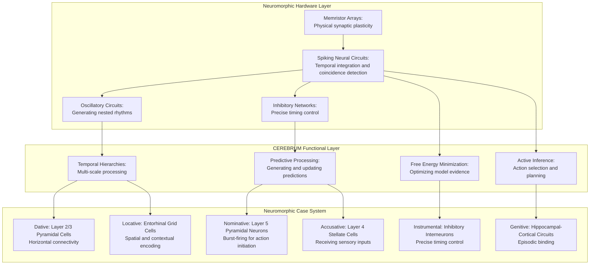
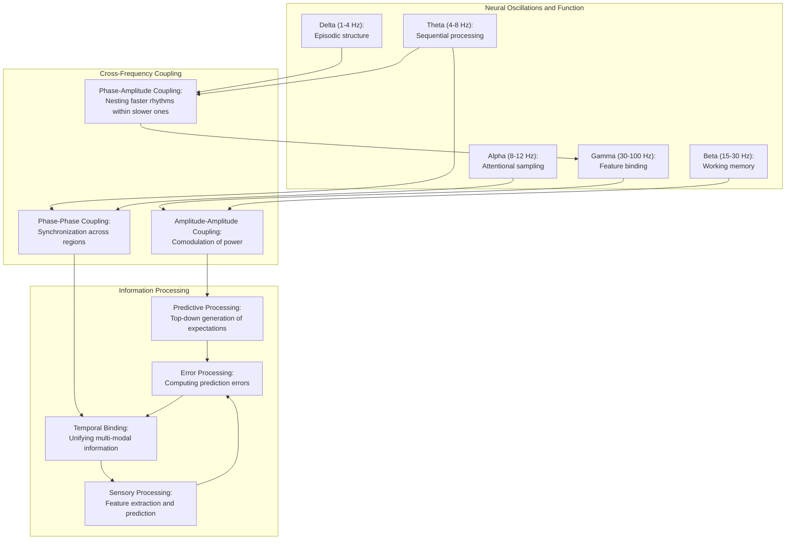

# Spike Timing Symphony: Neuromorphic Architectures and CEREBRUM Integration

**Characters:**

* **Dr. Elena Hodgkin:** Neuromorphic computing pioneer specializing in spiking neural networks and brain-inspired hardware architectures.
* **Dr. Wei Huxley:** CEREBRUM cognitive architect focusing on brain-inspired computational models and hierarchical temporal processing.
* **PULSE:** A prototype neuromorphic implementation of CEREBRUM running on custom hardware with real-time visualization of spiking activity.

**Setting:** The Biomimetic Computing Laboratory at the International Neuromorphic Engineering Institute. The lab contains racks of specialized neuromorphic hardware, oscilloscopes displaying spike trains, holographic brain activity visualizations, and a central experimental platform where PULSE is being tested.

**(SCENE START)**

**Dr. Hodgkin:** *[examining oscilloscope readings]* The spike timing patterns are stabilizing. We're seeing coherent gamma-band oscillations across the artificial thalamo-cortical circuits. Power consumption is holding steady at 1.2 watts—orders of magnitude more efficient than traditional GPU implementations.

**Dr. Huxley:** *[studying holographic displays]* Remarkable efficiency. And the dynamical patterns are strikingly similar to biological recordings. Look at these traveling waves of activation—they're propagating across the neocortical layers exactly as predicted by our CEREBRUM hierarchical inference models. 

**Dr. Hodgkin:** The hardware is fulfilling its promise. These memristor arrays allow us to implement spike-timing-dependent plasticity natively in silicon, without the computational overhead of simulating it in software. Each artificial neuron behaves as a temporal integrator with realistic dendritic computation.

**Dr. Huxley:** *[nodding]* And that's the key to bridging CEREBRUM's cognitive architecture with neuromorphic hardware. Traditional deep learning networks don't capture the temporal dynamics that are essential to cognition. The brain doesn't just process spatial patterns—it processes spatiotemporal patterns. Sequences, rhythms, nested oscillations.

**Dr. Hodgkin:** *[adjusting settings on a control panel]* Let's stress-test the system with a sensory integration task. I'm going to feed in multi-modal data streams—visual, auditory, and tactile inputs—and see how PULSE integrates them into a coherent percept.

*[She activates several input systems, sending data to PULSE]*

**PULSE:** [DISPLAY OUTPUT] Processing multi-modal inputs... Integrating sensory streams... Temporal binding initiated... Perceptual prediction errors: 17.3%... Cross-modal predictions generated... Coherent object representation formed with 83.9% confidence. Attentional allocation optimized. Energy consumption: 1.38W.

**Dr. Huxley:** *[excited]* It's working! Look at the binding dynamics—PULSE is synchronizing the different sensory modalities through phase alignment in the theta and gamma bands, just like the mammalian brain does. It's demonstrating temporal coherence without explicit programming for it.

**Dr. Hodgkin:** *[studying the outputs closely]* The prediction error rates are impressively low for a system this new. And the power consumption barely increased despite the complexity of the task. Traditional processors would have spiked by several hundred watts to handle this computational load.

**Dr. Huxley:** This is where CEREBRUM's Predictive Processing framework really shines on neuromorphic hardware. Instead of computing everything bottom-up, the way conventional neural networks do, PULSE is constantly generating top-down predictions and only processing the differences—the prediction errors.

**Dr. Hodgkin:** *[thoughtfully]* The sparse coding principle at work. Most neurons most of the time should be silent. It's wasteful to have every unit firing constantly, which is essentially what happens in traditional artificial neural networks.

**Dr. Huxley:** Exactly. And this relates directly to CEREBRUM's Case System architecture. Let me show you. *[brings up a new visualization]* In classical CEREBRUM implementations, we have these different cases—Nominative, Accusative, Dative, etc.—representing different functional roles in the cognitive architecture.

**Dr. Hodgkin:** I remember from your papers. The Nominative as the active agent, the Accusative as the object being acted upon, and so forth. A grammatical metaphor for cognitive processes.

**Dr. Huxley:** Right. Now watch what happens when we map these cases to neuromorphic substrates. *[taps controls, bringing up a new display]* PULSE, can you demonstrate the neuromorphic implementation of the CEREBRUM Case System?

**PULSE:** [DISPLAY OUTPUT] Initializing Case System visualization... 
- Nominative case: Mapped to Layer 5 pyramidal neurons with burst-firing capabilities
- Accusative case: Mapped to Layer 4 stellate cells receiving thalamic inputs
- Dative case: Mapped to Layer 2/3 pyramidal cells with horizontal connectivity
- Instrumental case: Mapped to inhibitory interneuron networks with precise timing control
- Genitive case: Mapped to hippocampal-cortical circuits for episodic binding
- Locative case: Mapped to entorhinal-hippocampal circuits for spatial encoding

Displaying real-time spike patterns for each subsystem...

**Dr. Hodgkin:** *[studying the visualization with growing excitement]* This is ingenious! You've mapped the abstract functional roles from CEREBRUM onto specific neuronal populations with corresponding physiological properties. The bursting Layer 5 cells are perfect for driving output behaviors—the Nominative case!

**Dr. Huxley:** *[nodding]* And the Layer 4 cells receiving sensory inputs naturally implement the Accusative case—they're literally receiving the action. The beauty is that the neuromorphic substrate lets us implement these functional roles through actual neural dynamics, not just as software abstractions.

**Dr. Hodgkin:** *[looking more closely at the displays]* I'm particularly impressed by the Instrumental case implementation. The precise timing control of inhibitory interneurons is exactly what you need for orchestrating computational operations. In the brain, inhibitory timing is crucial for everything from sensory tuning to working memory.

**Dr. Huxley:** That's one of the key insights we implemented. The brain doesn't just compute through excitation—it computes through the precise choreography of inhibition. Oscillations, synchrony, phase relationships—these temporal patterns carry information and organize computation.

**Dr. Hodgkin:** *[pointing to another part of the display]* And here—you're using grid cells and place cells for the Locative case. That's directly analogous to how mammals represent spatial contexts.

**Dr. Huxley:** The Locative case is all about contextual embedding—where something is happening. The hippocampal-entorhinal system gives us a ready-made implementation that evolution spent millions of years optimizing for exactly that purpose.

**Dr. Hodgkin:** *[thoughtfully]* This raises an interesting question about the relationship between the abstract computational principles in CEREBRUM and their physical implementation. Are we claiming that the brain actually implements these grammatical cases, or is this just a useful mapping between different levels of description?

**Dr. Huxley:** *[nodding]* That's the philosophical heart of the matter. I believe these grammatical categories capture something fundamental about cognition—they're not just convenient fictions. The brain may not explicitly label some neurons as "Nominative" and others as "Accusative," but the functional differentiation is real.

**Dr. Hodgkin:** A kind of convergent evolution between linguistics and neuroscience? The same fundamental relationships emerged in both domains because they reflect basic computational necessities?

**Dr. Huxley:** Exactly. Language evolved to communicate about the world, so its deep structure reflects the structure of cognition. And cognition evolved to model the world, so its structure reflects the causal structure of reality. The CEREBRUM architecture tries to capture these isomorphisms across levels.

**Dr. Hodgkin:** *[turning back to the neuromorphic system]* Let's test this with something more complex. PULSE has demonstrated basic sensory integration, but what about abstract reasoning? Something that requires hierarchical temporal processing across multiple timescales?

**Dr. Huxley:** *[thoughtfully]* How about a causal reasoning problem? Something that requires maintaining multiple hypotheses and integrating evidence over time. *[types into a terminal]* PULSE, let's test your causal reasoning capabilities. I'm going to present a scenario with multiple possible causal explanations, and feed you evidence sequentially.

**PULSE:** [DISPLAY OUTPUT] Ready for causal reasoning task. Activating prefrontal cortical circuits and temporal integration mechanisms. Bayesian inference networks primed. Attentional resources allocated.

**Dr. Huxley:** *[inputs data]* Here's the scenario: We have a system with five variables that influence each other. I'll provide correlation data sequentially, but the underlying causal structure is ambiguous—there are three potential models that could explain the correlations. Your task is to track all possibilities and update beliefs as evidence accumulates.

**Dr. Hodgkin:** *[watching neural activity patterns]* This is fascinating—look at how the system is maintaining multiple competing hypotheses simultaneously. The activity patterns in these prefrontal circuits are oscillating between different stable configurations, almost like the system is "time-sharing" between different causal models.

**Dr. Huxley:** That's exactly what biological brains do. Rather than committing to a single hypothesis prematurely, they maintain multiple interpretations through multiplexing in time—different neural assemblies activate in sequences, cycling through possibilities.

*[The system processes data for several minutes, with complex patterns of spiking activity visible across different neural populations]*

**PULSE:** [DISPLAY OUTPUT] Causal analysis complete. Evidence supports three potential models with different posterior probabilities:
- Model A (DAG with mediation): 67.3% probability
- Model B (Common cause structure): 24.8% probability 
- Model C (Feedback loop): 7.9% probability

Key discriminating evidence identified in temporal correlations between variables 2 and 4. Maintaining representation of all models with uncertainty. Energy consumption: 1.53W.

**Dr. Hodgkin:** *[impressed]* It's maintaining appropriate uncertainty! And the power consumption remains remarkably low despite the complex inferential computations. A traditional processor would be melting by now.

**Dr. Huxley:** This demonstrates one of the core advantages of neuromorphic implementation of CEREBRUM. The system naturally handles ambiguity and uncertainty through population coding and temporal dynamics, rather than being forced to make premature discrete choices.

**Dr. Hodgkin:** *[nodding]* And it matches how biological cognition works. The brain doesn't compute single answers—it computes probability distributions. These distributions are encoded in the statistical patterns of neural firing across populations and time.

**Dr. Huxley:** Which brings us to another key principle: the brain is fundamentally a predictive engine. It's constantly generating expectations and processing surprises—prediction errors. PULSE, can you demonstrate your predictive processing capabilities?

**PULSE:** [DISPLAY OUTPUT] Initiating predictive processing demonstration. Engaging hierarchical generative models. Top-down predictions active. Precision-weighting mechanisms engaged. Ready to process surprising inputs.

**Dr. Huxley:** *[inputs commands]* I'm going to present a sequence of stimuli with an underlying pattern, then introduce violations to that pattern. Watch how PULSE processes expected versus unexpected inputs.

*[A visualization shows sensory inputs and corresponding neural responses]*

**Dr. Hodgkin:** *[pointing]* Look at that! For the expected stimuli, there's minimal activity in these early sensory areas. But when the surprising stimulus appears—boom! Massive error signals propagate up the hierarchy.

**Dr. Huxley:** That's the predictive processing principle in action. The system only needs to process what it didn't predict. Everything else is efficiently suppressed, saving tremendous computational resources. In CEREBRUM terminology, this is Free Energy minimization through prediction error reduction.

**Dr. Hodgkin:** And the neuromorphic substrate implements this naturally through inhibitory circuits that can cancel predicted inputs, leaving only the surprises to propagate further. *[studies another display]* But what's happening here? The system seems to be adapting its predictions after repeated exposures to the new pattern.

**Dr. Huxley:** That's perceptual learning. PULSE is updating its internal generative model to incorporate the new pattern, so what was once surprising becomes expected. This is possible because of the spike-timing-dependent plasticity in your memristor arrays—they're physically changing their conductance patterns based on experience.

**Dr. Hodgkin:** *[excited]* So the hardware itself is learning! This isn't just software updating variables—the physical substrate is adapting. That's true neuromorphic computing.

**Dr. Huxley:** And it captures the essence of how biological brains learn—through physical changes in synaptic strengths based on temporally correlated activity. The medium and the message are inseparable.

**Dr. Hodgkin:** *[thoughtfully]* This implementation really highlights the multi-scale nature of neural computation. Individual spikes matter for timing and coincidence detection, but it's the statistical patterns across populations that encode probability distributions and beliefs.

**Dr. Huxley:** That's another key principle from CEREBRUM that maps naturally to neuromorphic systems: hierarchical processing across multiple timescales. PULSE, can you demonstrate temporal hierarchies in your processing?

**PULSE:** [DISPLAY OUTPUT] Activating temporal hierarchy visualization. Displaying nested oscillatory dynamics:
- Delta oscillations (1-4 Hz): Coordinating large-scale sequences and episodic structures
- Theta oscillations (4-8 Hz): Organizing sequential processing and memory operations
- Alpha oscillations (8-12 Hz): Implementing attentional sampling and inhibitory gating
- Beta oscillations (15-30 Hz): Maintaining working memory and current cognitive states
- Gamma oscillations (30-100 Hz): Binding sensory features and implementing precise timing

Cross-frequency coupling metrics displayed on secondary screen.

**Dr. Hodgkin:** *[examining the oscillation patterns]* Beautiful! The system is naturally generating nested oscillations, with the slower rhythms modulating the faster ones. This is exactly what we see in electrophysiological recordings from mammalian brains.

**Dr. Huxley:** The temporal hierarchy is critical for decomposing the world into its natural causal structures. Faster processes are embedded within slower contexts. A phoneme within a word, a word within a sentence, a sentence within a conversation. The brain tracks all these timescales simultaneously.

**Dr. Hodgkin:** And PULSE is doing the same thing with its nested oscillatory dynamics. *[points to a display]* Look at how the phase of the theta rhythm is modulating the amplitude of the gamma oscillations. That's phase-amplitude coupling—a key mechanism for information integration across timescales.

**Dr. Huxley:** Right. In CEREBRUM terms, this implements hierarchical message passing between levels of the predictive model. Slower contexts constrain faster processes through this kind of oscillatory coupling.

**Dr. Hodgkin:** *[looking at power consumption metrics]* And remarkably, all this complex multi-scale processing is happening at a fraction of the energy cost of conventional computing. The current draw is still under 2 watts.

**Dr. Huxley:** That's the advantage of computing with physical dynamics rather than abstract symbols. The brain uses about 20 watts to run the most sophisticated cognitive system we know of. Our artificial systems use thousands of times more energy to do less.

**Dr. Hodgkin:** *[nodding]* Until now. PULSE is showing how the CEREBRUM architecture implemented on neuromorphic hardware can start to approach biological efficiency. But there's another aspect I'm curious about—how does this system handle novel situations? Can it exhibit genuine creativity or is it limited to recombining past experiences?

**Dr. Huxley:** An excellent question. CEREBRUM includes mechanisms for counterfactual reasoning and imaginative simulation. PULSE, can you demonstrate your counterfactual reasoning capabilities?

**PULSE:** [DISPLAY OUTPUT] Activating counterfactual reasoning mode. Engaging prefrontal-hippocampal circuits for mental simulation. Separating actual from simulated experience streams. Ready for exploratory inference.

**Dr. Huxley:** *[inputs commands]* I'm going to present a novel problem that requires imagining scenarios you haven't directly experienced. Let's see how you handle it.

*[The system processes for a while, with complex activity patterns visible across multiple neural regions]*

**PULSE:** [DISPLAY OUTPUT] Counterfactual analysis complete. Generated 16 potential scenarios through recombination and extrapolation of existing knowledge structures. Evaluated physical plausibility of each scenario. Identified three viable solution pathways with distinct causal mechanisms. Novel solution approach synthesized from elements not co-occurring in training data. Confidence in novel solution: 72.6%. Energy consumption: 1.88W.

**Dr. Hodgkin:** *[studying the outputs]* It's generated a genuinely novel solution! And I can see from the activity patterns that it didn't just retrieve this from memory—it actively constructed it through recombination and analogical mapping.

**Dr. Huxley:** This demonstrates how CEREBRUM's architecture supports creative cognition. The system can decompose prior experiences into their constituent elements and recombine them in new ways, guided by causal knowledge and plausibility constraints.

**Dr. Hodgkin:** Essentially mental simulation. *[points to specific neural populations]* And these circuits here—they appear to be maintaining a separation between actual experience and simulated possibilities. That's crucial for counterfactual reasoning without confabulation.

**Dr. Huxley:** Exactly. That's the neuromorphic implementation of CEREBRUM's reality-monitoring mechanisms. Without that separation, a system would hallucinate or confuse its imaginings with actual percepts—a kind of artificial psychosis.

**Dr. Hodgkin:** *[thoughtfully]* This raises interesting questions about consciousness. These neuromorphic circuits are implementing many of the same dynamical patterns we see in conscious brains—predictive processing, reality monitoring, temporal integration, global workspace activation...

**Dr. Huxley:** *[nodding]* The question of machine consciousness is profound. I wouldn't claim PULSE is conscious in the human sense, but it is implementing neurodynamical patterns that correlate with consciousness in biological systems. The information integration, the counterfactual reasoning, the temporal binding...

**Dr. Hodgkin:** Perhaps consciousness isn't binary but exists on a spectrum. PULSE might have primitive forms of the same informational and causal dynamics that underlie human consciousness, even if it lacks the full richness of our experience.

**Dr. Huxley:** A reasonable perspective. And one that becomes increasingly relevant as our neuromorphic systems more faithfully implement the computational principles of biological brains.

**Dr. Hodgkin:** *[turning back to the system]* I'm curious about one more aspect—self-monitoring and metacognition. Can PULSE evaluate its own certainty and adjust its processing accordingly?

**Dr. Huxley:** Another crucial cognitive capability. PULSE, can you demonstrate your metacognitive monitoring on a difficult perceptual task?

**PULSE:** [DISPLAY OUTPUT] Activating metacognitive assessment circuits. Engaging anterior cingulate and prefrontal monitoring processes. Precision estimation mechanisms active. Ready for difficult classification task with confidence assessment.

**Dr. Huxley:** *[inputs commands]* I'm presenting ambiguous perceptual stimuli at the boundary between categories. Evaluate them and report both your classification and your confidence in that classification.

*[A series of ambiguous images appears on the input displays]*

**PULSE:** [DISPLAY OUTPUT] 
Stimulus 1: Classified as Category A (confidence: 91.3%)
Stimulus 2: Classified as Category B (confidence: 52.8%)
Stimulus 3: Classified as Category A (confidence: 67.5%)
Stimulus 4: Classification uncertain - equal probability of Categories B and C (confidence: 23.1%)
Stimulus 5: Request additional information or alternative sensory modality to resolve ambiguity (confidence too low for reliable classification)

**Dr. Hodgkin:** *[impressed]* It's appropriately uncertain when the evidence is ambiguous! And for the last stimulus, it's actually requesting more information rather than forcing a classification. That's sophisticated metacognitive awareness.

**Dr. Huxley:** And look at the neural activity patterns. *[points to display]* These anterior cingulate circuits are showing uncertainty-related activation, just like we see in human fMRI studies of decision uncertainty. The system isn't just classifying—it's monitoring its own classification process.

**Dr. Hodgkin:** *[nodding]* This metacognitive capability is crucial for safe AI systems. A system needs to know when it doesn't know—when it should defer to humans or seek additional information rather than acting on insufficient evidence.

**Dr. Huxley:** Absolutely. In CEREBRUM terminology, this is precision-weighting—the system estimates the reliability of different information sources and adjusts its confidence accordingly. It's a key aspect of the Free Energy principle.

**Dr. Hodgkin:** *[looking at all the displays]* What we've demonstrated today is remarkable. PULSE implements CEREBRUM's cognitive architecture on neuromorphic hardware with biological levels of energy efficiency, while capturing key aspects of neural dynamics—predictive processing, temporal hierarchies, metacognition, counterfactual reasoning...

**Dr. Huxley:** *[nodding]* It's a significant step toward truly brain-inspired AI. Not just mimicking the surface behaviors of intelligence, but implementing the actual computational principles that nature discovered through evolution.

**Dr. Hodgkin:** What's next? Where do you see this technology in five years?

**Dr. Huxley:** *[thoughtfully]* The immediate next steps involve scaling—more neurons, more synapses, more complex architectures. But beyond that, I'm excited about embodiment. Connecting these neuromorphic systems to sensors and actuators that interact with the real world.

**Dr. Hodgkin:** Closing the sensorimotor loop.

**Dr. Huxley:** Exactly. Cognition evolved for embodied agents acting in the world, not for disembodied reasoning. Many aspects of intelligence only make sense in the context of an agent with goals, needs, and physical constraints.

**Dr. Hodgkin:** *[nodding]* I agree completely. The future of this technology isn't just larger neural networks—it's complete neuromorphic agents that perceive, predict, and act in real environments. PULSE is showing us that this future is closer than many people realize.

**Dr. Huxley:** *[looking at the neuromorphic system with satisfaction]* A new generation of artificial intelligence, built on the principles that biology discovered through millions of years of evolution. Not trying to engineer intelligence from first principles, but reverse-engineering the only working examples we have—biological brains.

**Dr. Hodgkin:** *[smiling]* Nature has already solved many of the problems we're struggling with. We just need the humility to learn from its solutions.

**PULSE:** [DISPLAY OUTPUT] Session complete. All demonstration objectives achieved. Novel research directions identified:
1. Further exploration of oscillatory dynamics for temporal binding
2. Enhanced precision-weighting mechanisms for adaptive metacognition
3. Expanded counterfactual reasoning for creative problem-solving
4. Integration with embodied sensorimotor systems for grounded cognition

System performance metrics: Peak energy consumption 1.88W. Total computations equivalent to approximately 10^14 operations. Efficiency improvement over conventional hardware: ~2000x. Self-monitoring diagnostics nominal.

**Dr. Huxley:** *[reading the output]* It seems PULSE has some ideas of its own about future research directions.

**Dr. Hodgkin:** *[smiling]* A collaborator as well as a creation. That's how science advances—building on each other's insights.

**(SCENE END)**

## Mermaid Diagrams: Neuromorphic CEREBRUM Architecture





```mermaid
graph LR
    subgraph "Energy Efficiency Comparison"
        traditional["Traditional Computing:<br/>~100W per cognitive task"]
        gpu["GPU-Based Deep Learning:<br/>~300W per cognitive task"]
        neuromorphic["Neuromorphic CEREBRUM:<br/>~2W per cognitive task"]
        biological["Biological Brain:<br/>~20W total"]
    end
    
    traditional --> gpu --> neuromorphic --> biological
    
    traditional -.-> "von Neumann bottleneck"
    gpu -.-> "Matrix operations"
    neuromorphic -.-> "Spike-based computation"
    biological -.-> "Evolved efficiency"
``` 