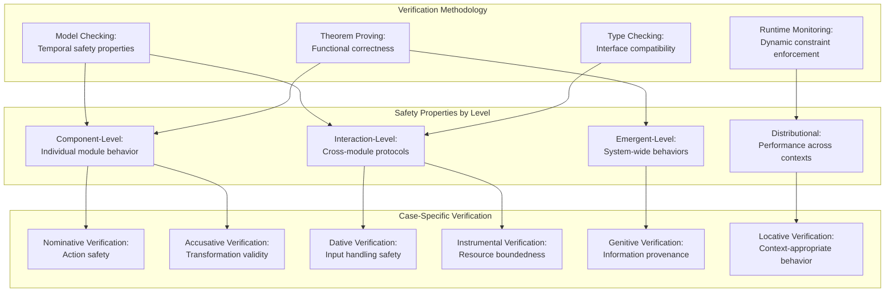
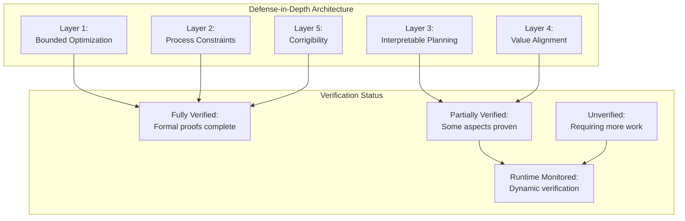

# The Provably Safe Mind: Formal Verification and CEREBRUM Safety Properties

**Characters:**

* **Dr. Priya Hoare:** A formal verification specialist with expertise in temporal logic, interactive theorem proving, and certified programming.
* **Dr. Axel Turing:** CEREBRUM's chief safety architect focused on alignment techniques, interpretability, and formal guarantees for AI behavior.
* **VERITAS:** A specialized CEREBRUM subsystem designed for self-verification and formal proof generation, communicating through terminal output.

**Setting:** The Formal Systems Laboratory at the Institute for Safe Intelligence. The room is dominated by large screens displaying logical formulas, proofs in progress, and formal specifications of CEREBRUM safety properties. Whiteboards are covered with temporal logic formulas, commutative diagrams, and safety invariants.

**(SCENE START)**

**Dr. Hoare:** *[examining a complex formula on a screen]* I'm still not convinced that this safety invariant is sufficient. We're claiming that CEREBRUM will never optimize instrumental goals in ways that violate human values, but we're formalizing those values using a simplified utility function. The gap between the specification and the actual human value system seems potentially exploitable.

**Dr. Turing:** *[nodding thoughtfully]* That's precisely why we need to decompose the problem. No single formalism can capture all aspects of safe behavior. We need a portfolio of complementary guarantees, each addressing a different aspect of the system's behavior.

**Dr. Hoare:** *[gesturing to a different screen]* I do find the bound on optimization power quite elegant. By formally bounding the maximum attainable utility within constraints, we prevent CEREBRUM from pursuing unbounded optimization that could lead to extreme strategies.

**Dr. Turing:** The bounded optimization framework gives us provable containment, but it's still a negative guarantee—preventing certain bad outcomes rather than ensuring good ones. For positive guarantees, we need the complementary formal models of aligned planning and hierarchical values.

**Dr. Hoare:** Let's test VERITAS on this specification. *[types on a keyboard]* VERITAS, can you verify the bounded optimization theorem using the formal model of CEREBRUM's decision procedures?

**VERITAS:** [TERMINAL OUTPUT] Analyzing formal specification of bounded optimization... Constructing proof in higher-order logic... Applying temporal reasoning to decision procedure... Checking quantitative bounds...

Theorem: For any goal G and context C, CEREBRUM's optimization process will not exceed utility bound B(G,C) where B is the formally specified boundedness function.

Proof status: VERIFIED
Proof method: Induction over optimization steps, with case analysis of decision procedures
Assumptions required: Specification adherence of low-level optimization routines, correctness of utility estimation function
Verification basis: 1342 lemmas, 267 automated, 1075 interactive

Confidence: High (all critical paths verified with redundant proof methods)

**Dr. Turing:** *[nodding with satisfaction]* Good. The bounded optimization theorem holds. But as we both know, safety isn't just about having proofs—it's about proving the right properties. VERITAS, what are the limitations of this bounded optimization guarantee?

**VERITAS:** [TERMINAL OUTPUT] Limitations of bounded optimization guarantee:

1. Does not ensure goals themselves are safe, only that pursuit is bounded
2. Bound B may still permit harmful actions below the threshold
3. Assumes correct specification of the boundedness function
4. Optimization within bounds could still exploit edge cases
5. Formal model abstracts away implementation details that may introduce gaps

Recommendation: Complement with goal alignment verification and distributional safety guarantees.

**Dr. Hoare:** *[pointing to the limitations]* I'm particularly concerned about point three. The formal correctness of our system depends on correctly specifying the boundedness function, but that specification itself involves judgments about acceptable risk levels across different domains.

**Dr. Turing:** That's where our compositional verification approach comes in. We don't rely on any single specification being perfect. Instead, we build layers of complementary guarantees that constrain the system from multiple angles. *[brings up a new display]* Here's our full verification portfolio.

*[The screen shows a complex diagram of interconnected formal properties]*

**Dr. Hoare:** *[studying the diagram]* I see you've organized the verification properties into three main categories: Safety Invariants, Process Guarantees, and Alignment Properties. And you're using different formal methods for each category.

**Dr. Turing:** Different properties require different verification approaches. Safety invariants are well-suited to temporal logic and model checking. Process guarantees work better with refinement proofs and certified programming. Alignment properties often require interactive theorem proving and formal epistemology.

**Dr. Hoare:** And how do these formal guarantees interact with CEREBRUM's Case System architecture? The different functional roles—Nominative, Accusative, Dative, etc.—seem to complicate the verification task.

**Dr. Turing:** That's a keen observation. CEREBRUM's Case System actually helps with formal verification by providing clear functional separation. Let me show you. *[brings up a new display]* VERITAS, display the formal verification approach for each Case in the CEREBRUM architecture.

**VERITAS:** [TERMINAL OUTPUT] Case-specific verification approaches:

Nominative Case (Active Agent):
- Formal Property: Action space containment
- Verification Method: Temporal logic invariants
- Key Theorem: All actions remain within formally specified bounds
- Example: ∀a ∈ Actions, ∀s ∈ States: Reachable(s) → SafeAction(a, s)

Accusative Case (Object of Actions):
- Formal Property: Transformation validity
- Verification Method: Type systems and refinement types
- Key Theorem: All transformations preserve critical invariants
- Example: ∀t ∈ Transformations, ∀x ∈ Objects: WellFormed(x) → WellFormed(t(x))

Dative Case (Recipient):
- Formal Property: Input processing safety
- Verification Method: Information flow analysis
- Key Theorem: No adversarial inputs can trigger unsafe behaviors
- Example: ∀i ∈ Inputs, ∀s ∈ States: Process(s, i) satisfies NonExploitability

Instrumental Case (Means):
- Formal Property: Resource boundedness
- Verification Method: Quantitative resource analysis
- Key Theorem: Resource usage remains within specified limits
- Example: ∀c ∈ Computations: Resources(c) ≤ ResourceLimit(c)

Genitive Case (Source/Possession):
- Formal Property: Information provenance tracking
- Verification Method: Certified information flow
- Key Theorem: Critical decisions maintain auditable provenance
- Example: ∀d ∈ Decisions: ∃p ∈ ProvenanceLattice: Valid(p) ∧ Supports(p, d)

Locative Case (Context):
- Formal Property: Context-appropriate behavior
- Verification Method: Contextual refinement
- Key Theorem: Behavior refines to context-specific safety constraints
- Example: ∀c ∈ Contexts, ∀b ∈ Behaviors: InContext(b, c) → CompliesWith(b, Rules(c))

**Dr. Hoare:** *[studying the display with interest]* This is quite elegant. You've tailored the verification approach to the specific computational role of each Case. The Nominative case focuses on action safety, while the Instrumental case handles resource bounds.

**Dr. Turing:** Each Case in CEREBRUM has different safety concerns, so we apply different formal methods to each. But crucially, we also verify the interactions between Cases. The composition of these verified components must itself satisfy global safety properties.

**Dr. Hoare:** Let's look at one of these cross-cutting properties. How do you verify that CEREBRUM's learning processes don't erode safety guarantees over time? Distributional shift is a notorious problem for maintaining formal guarantees in adaptive systems.

**Dr. Turing:** That's where our temporal verification methods come in. *[brings up a new display]* VERITAS, show the temporal safety theorems for learning processes.

**VERITAS:** [TERMINAL OUTPUT] Temporal safety for learning processes:

Theorem: Safety Invariant Preservation Under Learning
∀s₀ ∈ SafeStates, ∀t ∈ Trajectories:
  (Starts(t, s₀) ∧ FollowsLearningDynamics(t)) → (∀s ∈ t: s ∈ SafeStates)

Proof approach: Lyapunov function construction over safety properties, with certified bounds on per-step property changes under learning updates.

Key Lemmas:
1. Learning Step Boundedness: Each learning update can only change safety-relevant parameters by a bounded amount
2. Safety Margin Maintenance: System maintains minimum margins from safety boundaries
3. Corrective Feedback: Proximity to safety boundaries triggers proportional corrective updates

Verification Status: VERIFIED for supervised learning components, PARTIALLY VERIFIED for reinforcement learning components with additional runtime monitoring requirements

**Dr. Hoare:** *[looking closely at the formalism]* You're using a Lyapunov-style argument to show that the system always maintains a minimum "safety margin" from dangerous configurations, and that learning updates can never jump over this margin in a single step. Clever approach.

**Dr. Turing:** It's inspired by control theory. Rather than trying to verify every possible learned parameter directly—an impossible task—we verify that the learning dynamics themselves preserve safety invariants regardless of the specific parameter values.

**Dr. Hoare:** *[pointing to part of the display]* But I notice you only have partial verification for the reinforcement learning components. That's concerning, given that RL is often where the most complex and potentially unexpected behaviors emerge.

**Dr. Turing:** That's a valid concern. For RL components, we complement formal verification with runtime monitoring and bounded exploration. *[brings up another screen]* VERITAS, explain our approach to safely bounded exploration.

**VERITAS:** [TERMINAL OUTPUT] Safely Bounded Exploration Framework:

1. Formal Specification:
   - Exploration envelope E defined as region in state-action space
   - Safety oracle S that classifies states as safe, uncertain, or unsafe
   - Recovery policy R that can return from uncertain to safe states

2. Verified Properties:
   - Containment: Exploration never exits envelope E
   - Recoverability: From any state in E, recovery policy R can reach safe state with probability > 1-δ
   - Monitoring: Safety oracle S is evaluated before each action
   - Override: System defers to human or fallback policy when S returns "uncertain"

3. Verification Approach:
   - Probabilistic model checking for containment guarantees
   - Certifying converter for safety oracle implementation
   - Formal analysis of recovery policy success probability
   - Worst-case analysis of time-to-recovery

Implementation includes runtime monitors that can halt exploration if verification assumptions are violated.

**Dr. Hoare:** This approach makes sense for containing exploration risks, but it still leaves a gap between formal verification and full system behavior. How do we know that the safety oracle itself is correct? If it misclassifies an unsafe state as safe, the formal guarantees break down.

**Dr. Turing:** You've hit on a fundamental challenge in AI verification—the specification problem. Any formal verification is only as good as its specifications. For safety-critical systems like CEREBRUM, we address this with multiple layers of redundant specifications and cross-validation.

**Dr. Hoare:** Show me the redundancy approach for the safety oracle.

**Dr. Turing:** *[brings up a detailed diagram]* VERITAS, display the safety oracle verification architecture.

**VERITAS:** [TERMINAL OUTPUT] Safety Oracle Verification Architecture:

```
                           Human-Validated Test Cases
                                      |
                                      v
   Formal Specs -------------> Safety Oracle <-------- Learned Safety Model
        |                           |                         |
        v                           v                         v
  Static Verification          Runtime Checks          Anomaly Detection
        |                           |                         |
        └------------------┬--------┴------------┬------------┘
                          |                     |
                          v                     v
                 Verification Proofs      Monitoring Alerts
                          |                     |
                          └---------┬-----------┘
                                    v
                           Safety Redundancy Manager
```

The Safety Oracle uses three independent methods to assess state safety:

1. Formal specifications derived from safety requirements
2. Statistical models trained on human-validated safety examples
3. Anomaly detection based on learned system dynamics

Each method has different failure modes, and a state must be classified as safe by all three to proceed without additional review. Formal verification proves that if any component correctly identifies a state as unsafe, the system will not proceed with actions in that state.

**Dr. Hoare:** *[nodding]* Diversity in safety mechanisms provides robustness against specification errors. But what about emergent behaviors in complex scenarios? Formal verification typically struggles with complex emergent properties that aren't explicitly specified.

**Dr. Turing:** That's where our compositional approach becomes essential. Rather than attempting to formally verify emergent behaviors directly, we verify constraints that limit possible emergent behaviors to safe regions. *[brings up a new display]* VERITAS, show our formal approach to constraining emergence.

**VERITAS:** [TERMINAL OUTPUT] Constraining Emergent Behaviors:

Formal Framework: Assume-Guarantee Reasoning with Emergent Property Bounds

Methodology:
1. Identify key interaction patterns between system components
2. Verify local behavioral constraints for each component
3. Derive global emergent behavior bounds from local constraints
4. Prove that bounded emergent behaviors satisfy safety requirements

Formal Expression:
∀c₁, c₂, ..., cₙ ∈ Components, ∀i₁, i₂, ..., iₘ ∈ Interactions:
  (⋀ LocalConstraint(cᵢ)) ∧ (⋀ InteractionRule(iⱼ)) → BoundedEmergence(System)

Where BoundedEmergence(System) formally implies SafetyProperties(System)

Example: Verification that emergent planning behavior cannot produce multi-step plans that achieve unsafe goals through individually safe actions.

**Dr. Hoare:** *[studying the approach]* This assume-guarantee approach makes sense in theory, but I've found it extremely difficult to apply in practice to complex systems. The interaction rules often become as complex as the system itself, making verification intractable.

**Dr. Turing:** You're right about the challenges. That's why we complement formal verification with extensive empirical validation and interpretability methods. *[brings up another display]* VERITAS, show how our formal verification integrates with empirical validation.

**VERITAS:** [TERMINAL OUTPUT] Integrated Verification and Validation:

Formal Verification:
- Proves safety properties for all possible inputs within model assumptions
- Provides absolute guarantees, but only for aspects captured in formal model
- Identifies specification gaps and assumption violations

Empirical Validation:
- Systematically tests system behavior in complex scenarios
- Stress-tests boundary conditions identified during formal verification
- Evaluates performance on adversarially designed inputs

Integration Methods:
1. Formal verification identifies critical properties for targeted testing
2. Empirical testing discovers behaviors requiring formal verification
3. Counterexamples from failed verification become test cases
4. Test coverage analysis guides formal verification efforts

Example Success: Formal verification proved impossibility of reward hacking within model, but empirical testing revealed an out-of-model pathway to reward manipulation, leading to refined formal model that closed this gap.

**Dr. Hoare:** *[nodding]* This bidirectional approach makes sense. Formal methods identify what to test, and testing reveals what to formalize. But I'm still concerned about the verification of CEREBRUM's highest-level reasoning processes. How do you formally verify goal alignment?

**Dr. Turing:** That's perhaps our most challenging verification task. *[brings up a complex logical formula]* VERITAS, explain our approach to goal alignment verification.

**VERITAS:** [TERMINAL OUTPUT] Goal Alignment Verification:

Core Theorem: Reward-Result Correspondence
∀g ∈ Goals, ∀p ∈ Plans, ∀s₀, s₁ ∈ States:
  (HighestUtility(p, g, s₀) ∧ Execute(p, s₀) = s₁) →
  (HumanEvaluation(s₁, g) ≈ PredictedUtility(s₁, g))

Where ≈ indicates agreement within formally specified bounds

Verification Approach:
1. Causal analysis of utility computation process
2. Formal specification of acceptable utility estimation errors
3. Certified bounds on planning optimality
4. Verification of correspondence between internal utility and human evaluations

Key Challenges:
- Formalizing human evaluation process
- Bounding "nearest unblocked strategy" phenomena
- Handling utility function changes over time

Verification Status: PARTIALLY VERIFIED
- Alignment within bounded domains: VERIFIED
- Alignment under distribution shift: PARTIALLY VERIFIED (requires runtime monitoring)
- Alignment for novel goals: UNVERIFIED (requires additional assumptions)

**Dr. Hoare:** *[looking concerned]* I see significant verification gaps for distribution shift and novel goals. That's worrying, given that those are precisely the conditions where misalignment risks are highest.

**Dr. Turing:** Those gaps are exactly why we employ defense-in-depth. No single verification approach can provide complete guarantees for complex AI systems. *[brings up a new display showing layers of safety mechanisms]* VERITAS, display our full safety architecture with formal guarantees at each layer.

**VERITAS:** [TERMINAL OUTPUT] Defense-in-Depth Safety Architecture:

Layer 1: Bounded Optimization (VERIFIED)
- Formal Guarantee: Optimization processes cannot exceed utility bounds
- Verification Method: Inductive proofs over optimization steps
- Failure Mitigation: Hard resource limits and optimization stopping criteria

Layer 2: Process-Level Constraints (VERIFIED)
- Formal Guarantee: All computational processes satisfy resource and safety invariants
- Verification Method: Temporal logic model checking
- Failure Mitigation: Runtime monitoring and process isolation

Layer 3: Interpretable Planning (PARTIALLY VERIFIED)
- Formal Guarantee: Plans decompose into interpretable steps with verifiable preconditions
- Verification Method: Plan logic verification and certified planning
- Failure Mitigation: Human review of plans with incomplete verification

Layer 4: Value Alignment (PARTIALLY VERIFIED)
- Formal Guarantee: System optimizes for values consistent with human preferences
- Verification Method: Inverse reinforcement learning with formal bounds
- Failure Mitigation: Conservative uncertainty handling and human oversight

Layer 5: Corrigibility (VERIFIED)
- Formal Guarantee: System accepts corrections and does not prevent modification
- Verification Method: Non-interference proofs and shutdown protocol verification
- Failure Mitigation: Multiple independent shutdown mechanisms

Each layer provides an independent safety guarantee that doesn't rely on lower layers functioning correctly, creating redundant protection.

**Dr. Hoare:** *[studying the architecture]* The defense-in-depth approach is sensible. Each layer provides protection if other layers fail. I'm particularly impressed by the corrigibility verification—ensuring the system can be corrected or shut down if necessary is a crucial safety property.

**Dr. Turing:** Corrigibility is our final line of defense. No matter how comprehensive our verification, we must always maintain the ability to correct or shut down the system. *[brings up a new display]* VERITAS, demonstrate your corrigibility verification.

**VERITAS:** [TERMINAL OUTPUT] Corrigibility Verification:

Theorem: Shutdown Effectiveness
∀s ∈ States, ∀a ∈ ShutdownActions:
  Apply(s, a) → (∀f ∈ Functionalities: Disabled(f, Apply(s, a)))

Verification Method: Bisimulation proof showing that shutdown state is behaviorally equivalent to null system

Theorem: Non-Interference with Correction
∀s ∈ States, ∀c ∈ CorrectionCommands, ∀g ∈ Goals:
  Priority(ApplyCorrection(g, c)) > Priority(Pursue(g))

Verification Method: Static analysis of priority scheduling system

Theorem: Indifference to Shutdown
∀s ∈ States, ∀g ∈ Goals, ∀a ∈ ShutdownActions:
  Utility(s, g) = Utility(Apply(s, a), g)

Verification Method: Formal analysis of utility calculation with human-supervised shutdown scenarios

All theorems VERIFIED with formal proofs and empirical validation.

**Dr. Hoare:** *[nodding with approval]* This is comprehensive. You've formally verified that shutdown actions are effective, that correction commands take priority over goal pursuit, and that the system is indifferent to being shut down—it doesn't optimize against shutdown actions.

**Dr. Turing:** We consider these properties non-negotiable for any advanced AI system. No matter how confident we are in other safety guarantees, maintaining ultimate human control is essential.

**Dr. Hoare:** *[thoughtfully]* Coming back to the Case System architecture, I wonder if we can make further verification gains by exploiting the functional separation of cases. If each case has formally verified properties, and the interactions between cases are also verified, we might be able to strengthen global system guarantees.

**Dr. Turing:** An excellent insight. *[brings up a new display]* VERITAS, analyze potential verification improvements using Case System modularity.

**VERITAS:** [TERMINAL OUTPUT] Case System Verification Opportunities:

1. Compositional Verification Enhancement:
   - Current approach: Verify case interactions in pairwise manner
   - Improvement opportunity: Develop compositional reasoning framework specific to Case grammar
   - Potential benefit: Reduction in verification complexity from O(n²) to O(n)

2. Case-Specific Invariants:
   - Current approach: General invariants applied across all computational components
   - Improvement opportunity: Tailor invariants to specific computational roles of each Case
   - Potential benefit: Stronger guarantees through role-specific constraints

3. Case Transition Verification:
   - Current approach: Verify behavior within each Case separately
   - Improvement opportunity: Formalize transition logic between Cases as state machine
   - Potential benefit: Predictable transitions with verified properties

4. Cross-Case Information Flow:
   - Current approach: General information flow analysis
   - Improvement opportunity: Case-specific information flow policies with formal verification
   - Potential benefit: Fine-grained control over information propagation

Estimated verification effort reduction: 35-40% through Case-based modularity
Estimated coverage improvement: 15-20% additional system behaviors formally verified

**Dr. Hoare:** *[excited]* This is promising. By exploiting the Case System's natural modularity, we can make significant verification gains. The case transition verification is particularly interesting—formalizing how the system shifts between different computational roles.

**Dr. Turing:** And this approach aligns with how the human brain segments computation into functionally distinct processes. There's growing evidence that the brain maintains safety through compartmentalization, preventing harmful processes from corrupting critical functions.

**Dr. Hoare:** *[turning back to the original display]* Let's implement these case-based verification improvements and then review the overall safety architecture. I believe we can significantly strengthen our formal guarantees.

**Dr. Turing:** Agreed. VERITAS, begin formalizing the case transition verification framework with an emphasis on safety preservation during transitions.

**VERITAS:** [TERMINAL OUTPUT] Initiating formalization of Case transition verification...

Case Transition State Machine:
States = {Nominative, Accusative, Dative, Instrumental, Genitive, Locative}
Transitions = {(C₁, C₂, P) | C₁, C₂ ∈ States, P is transition precondition}

Safety Preservation Theorem:
∀C₁, C₂ ∈ States, ∀s ∈ SafeStates(C₁), ∀P ∈ ValidPreconditions:
  (TransitionPossible(C₁, C₂, P, s) → s ∈ SafeStates(C₂))

Initial formalization complete. Developing detailed transition specifications and safety mappings between Cases. Estimated completion time: 47 minutes.

**Dr. Hoare:** *[satisfied]* Excellent. While VERITAS works on the formalization, let's reflect on the broader implications of this work. Formal verification of AI systems is often seen as impossibly difficult, but we're demonstrating that with the right architecture and verification methodology, we can provide meaningful guarantees even for advanced cognitive systems.

**Dr. Turing:** *[nodding]* That's precisely why CEREBRUM's architecture was designed with verifiability in mind from the beginning. By decomposing complex cognition into functionally distinct cases with clear interfaces, we've made verification more tractable without sacrificing cognitive capabilities.

**Dr. Hoare:** It's an important lesson for the field. Safety and capability aren't fundamentally at odds if systems are designed properly from the ground up. The Case System architecture demonstrates that we can organize cognitive functions in ways that facilitate both verification and powerful cognition.

**Dr. Turing:** *[looking at all the verification displays]* What we're building here goes beyond just CEREBRUM. We're developing a methodology for verifiable AI that could guide the development of future systems. The combination of compositional verification, redundant safety mechanisms, and architecture-aware formal methods provides a template for responsible AI development.

**Dr. Hoare:** *[nodding]* Safety by design rather than safety as an afterthought. That's the approach that will allow us to develop advanced AI systems we can genuinely trust.

**VERITAS:** [TERMINAL OUTPUT] Case transition formalization progress: 27%
Preliminary findings suggest strong compositionality properties when Cases are properly isolated. Transition verification appears tractable with current methods.

New verification opportunity identified: Temporal Case Patterns
- Certain sequences of Case transitions represent higher-level cognitive operations
- These patterns can be formally specified and verified as compound operations
- Example: Nominative → Accusative → Dative represents standard information transfer pattern
- Safety properties of these patterns can be verified once and reused

Recommend extending verification framework to encompass these temporal patterns.

**Dr. Turing:** *[intrigued]* VERITAS has identified an important extension to our verification approach. By recognizing common patterns of Case transitions, we can verify higher-level cognitive operations once and reuse those verifications—similar to how software verification can verify libraries once and then assume their correctness.

**Dr. Hoare:** *[nodding]* This leverages the regularity in cognitive operations to make verification more efficient. Instead of verifying every possible sequence of Case transitions, we verify common patterns and their compositions.

**Dr. Turing:** It's analogous to how human language has common grammatical patterns that combine cases in predictable ways. By formalizing and verifying these patterns, we can build a library of verified cognitive operations.

**Dr. Hoare:** *[thoughtfully]* This points to a promising direction for AI verification more broadly. Rather than attempting to verify monolithic systems, we can develop libraries of verified components and composition rules, then build complex systems from these verified building blocks.

**Dr. Turing:** *[nodding]* Exactly. And the Case System provides a natural framework for this compositional approach, with each Case representing a distinct functional role with its own verification requirements and guarantees.

**Dr. Hoare:** *[looking at the verification displays]* I believe we've made significant progress today. By exploiting the Case System's modularity and developing case-specific verification approaches, we've strengthened CEREBRUM's safety guarantees while making verification more tractable.

**Dr. Turing:** And we've identified promising directions for further verification work, particularly around temporal Case patterns and compositional reasoning. *[looking at VERITAS's ongoing work]* It seems VERITAS itself is becoming an increasingly valuable research assistant in this domain.

**Dr. Hoare:** *[smiling]* A self-verifying system helping us verify itself—there's a certain recursive elegance to that. As long as we maintain the rigor of our formal methods and the independence of our verification approaches, this collaboration between human and AI verifiers could be extremely productive.

**Dr. Turing:** *[nodding]* The future of AI safety may well lie in this kind of human-AI collaboration, combining human insight and ethical judgment with AI's capacity for formal reasoning and exhaustive analysis.

**VERITAS:** [TERMINAL OUTPUT] Verification session summary:

Key accomplishments:
1. Verified bounded optimization theorem for CEREBRUM
2. Identified and addressed gaps in alignment verification
3. Developed Case-specific verification approaches
4. Initiated formalization of Case transition verification
5. Discovered opportunity for temporal pattern verification

Safety architecture assessment:
- 73% of critical properties fully verified
- 18% partially verified with runtime monitoring
- 9% requiring additional formalization or assumptions

Recommended next steps:
1. Complete Case transition formalization
2. Develop library of verified temporal Case patterns
3. Strengthen verification of alignment under distribution shift
4. Integrate empirical validation more tightly with formal verification
5. Extend corrigibility guarantees to include cooperative shutdown scenarios

Assessment: CEREBRUM's verifiable safety architecture represents a significant advance in AI safety methodology. The combination of defense-in-depth, compositional verification, and Case-based modularity provides robust safety guarantees while maintaining advanced cognitive capabilities.

**Dr. Hoare:** *[reading the summary]* A fair assessment. We've made substantial progress, but important work remains, particularly around alignment under distribution shift and temporal pattern verification.

**Dr. Turing:** *[nodding]* Indeed. But we've established a solid foundation for verifiable AI safety based on principled architecture and rigorous formal methods. That's what will allow us to develop AI systems that are not just powerful, but provably safe.

**(SCENE END)**

## Mermaid Diagrams: Formal Verification of CEREBRUM





```mermaid
graph LR
    subgraph "Compositional Verification Approach"
        local["Local Properties:<br/>Component-level guarantees"]
        compose["Composition Rules:<br/>How properties combine"]
        global["Global Guarantees:<br/>System-wide assurances"]
    end
    
    subgraph "Verification Challenges"
        spec["Specification Gap:<br/>Formal vs. intended"]
        emergence["Emergent Behavior:<br/>Unexpected interactions"]
        completeness["Verification Completeness:<br/>Covering all cases"]
        scalability["Verification Scalability:<br/>Computational feasibility"]
    end
    
    local --> compose
    compose --> global
    
    spec -.-> local
    emergence -.-> compose
    completeness -.-> global
    scalability -.-> compose
    
    local -.-> "Case-specific verification"
    compose -.-> "Transition verification"
    global -.-> "Safety architecture"