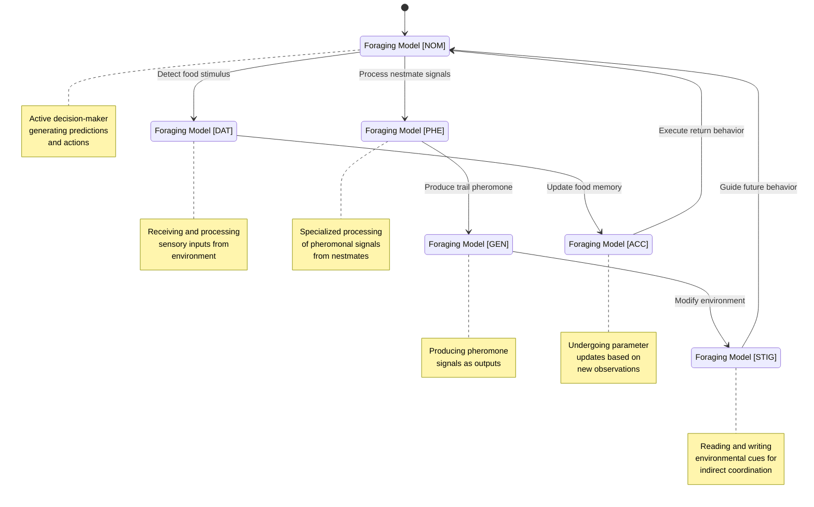
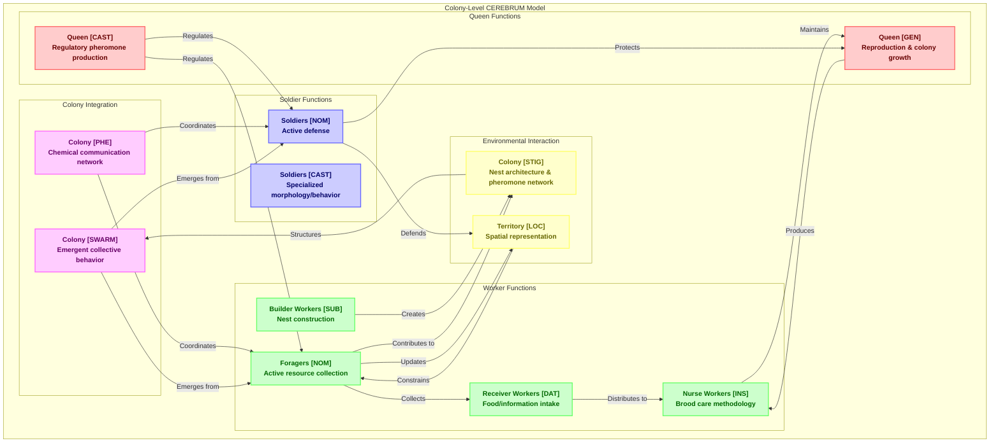
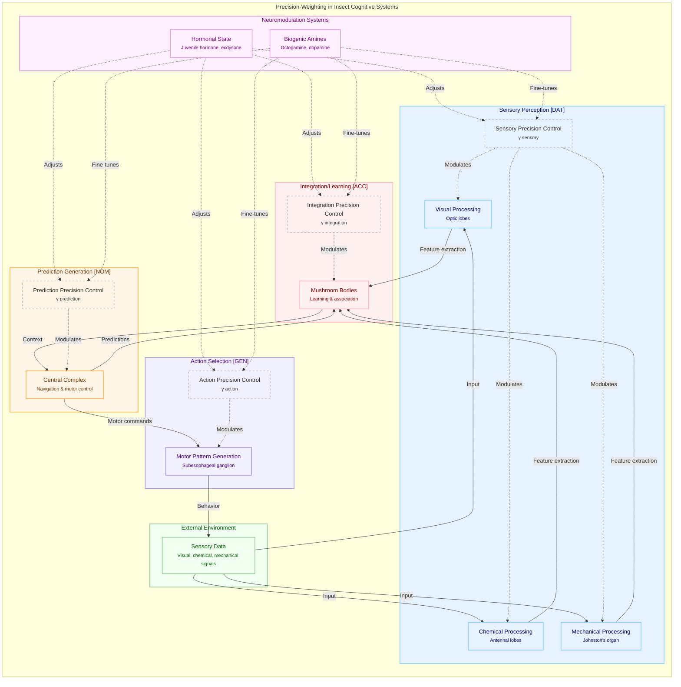

# CEREBRUM Entomological Integration Framework

## Introduction: Bridging Insect Cognition and CEREBRUM

The CEREBRUM framework (Case-Enabled Reasoning Engine with Bayesian Representations for Unified Modeling) provides a powerful paradigm for understanding cognitive systems through the lens of linguistic case grammar. This document explores the application of CEREBRUM to entomological systems, examining how insect cognition, behavior, and social structures can be formalized within this case-based framework. By mapping the functional roles defined by CEREBRUM's standard case system onto insect cognitive processes, we aim to develop a comprehensive integration that enhances both fields.

## 1. Entomological Brain Structures and CEREBRUM Case Assignments

Insect nervous systems possess specialized structures that serve distinct cognitive functions. The following table maps these structures to appropriate CEREBRUM case assignments:

**Table 1: Neural Structures and CEREBRUM Case Mappings**

| Neural Structure | Primary Function | CEREBRUM Case | Case Function in Entomological Context | Precision Weighting Pattern |
|------------------|------------------|---------------|----------------------------------------|------------------------------|
| Mushroom Bodies | Learning, memory, sensory integration | [NOM]/[ACC] | Active learning agent / Object of update | High precision on sensory associations and memory formation |
| Central Complex | Navigation, spatial orientation, motor control | [NOM]/[LOC] | Active navigator / Spatial context provider | High precision on spatial representations and motor commands |
| Antennal Lobes | Olfactory processing, pheromone detection | [DAT]/[PHE] | Chemical signal recipient / Pheromone processor | High precision on chemical detection channels |
| Optic Lobes | Visual processing, motion detection | [DAT] | Visual signal recipient | High precision on visual flow detection |
| Subesophageal Ganglion | Feeding behavior control, motor patterns | [INS]/[GEN] | Behavioral method implementation / Output generator | High precision on motor pattern execution |
| Ventral Nerve Cord | Signal transmission pathway | [INS] | Communication method between brain and body | High precision on signal transmission fidelity |
| Johnston's Organ | Mechanoreception, vibration sensing | [DAT] | Mechanical signal recipient | High precision on specific frequency bands |

## 2. Insect-Specific CEREBRUM Cases

Beyond the standard CEREBRUM cases, insect cognition suggests several specialized cases unique to arthropod intelligence:

```mermaid
graph TB
    subgraph StandardCases["Standard CEREBRUM Cases"]
        NOM["Nominative [NOM]<br>Subject/Agent<br><small>Active decision maker</small>"]
        ACC["Accusative [ACC]<br>Direct Object<br><small>Target of learning</small>"]
        DAT["Dative [DAT]<br>Recipient<br><small>Sensory input processor</small>"]
        GEN["Genitive [GEN]<br>Producer<br><small>Signal/pheromone generator</small>"]
        INS["Instrumental [INS]<br>Tool/Method<br><small>Behavioral algorithm</small>"]
        LOC["Locative [LOC]<br>Context<br><small>Environmental representation</small>"]
        ABL["Ablative [ABL]<br>Origin<br><small>Historical cause/memory</small>"]
        VOC["Vocative [VOC]<br>Addressable<br><small>Directly activated function</small>"]
    end
    
    subgraph InsectSpecificCases["Insect-Specific CEREBRUM Cases"]
        PHE["Pheromonal [PHE]<br><small>Chemical communication specialist</small>"]
        SWARM["Swarm [SWARM]<br><small>Collective behavior participant</small>"]
        MET["Metamorphic [MET]<br><small>Life-stage transition manager</small>"]
        CAST["Caste [CAST]<br><small>Social role specialist</small>"]
        SUB["Substrate [SUB]<br><small>Environmental material manipulator</small>"]
        STIG["Stigmergic [STIG]<br><small>Indirect communication coordinator</small>"]
    end
    
    NOM --> PHE
    DAT --> PHE
    GEN --> PHE
    
    NOM --> SWARM
    INS --> SWARM
    
    ACC --> MET
    
    NOM --> CAST
    INS --> CAST
    
    NOM --> SUB
    INS --> SUB
    
    GEN --> STIG
    DAT --> STIG
    LOC --> STIG
    
    classDef standard fill:#e6f3ff,stroke:#4682b4,stroke-width:2px,color:#00008B
    classDef insect fill:#ffe6e6,stroke:#ff9999,stroke-width:2px,color:#8B0000
    
    class NOM,ACC,DAT,GEN,INS,LOC,ABL,VOC standard
    class PHE,SWARM,MET,CAST,SUB,STIG insect
```



**Table 2: Insect-Specific CEREBRUM Cases**

| Case Abbr | Case Name | Core Function | Active Inference Signature | Example Implementation |
|-----------|-----------|--------------|----------------------------|------------------------|
| [PHE] | Pheromonal | Chemical communication specialist | High precision on specific chemosensory channels & signal dynamics | Ant trail-following model; Queen-worker communication |
| [SWARM] | Swarm | Collective behavior participant | High precision on neighbor states; low on individual goals | Locust migration model; Honeybee swarm decision-making |
| [MET] | Metamorphic | Life-stage transition manager | Dynamic precision reweighting across entire architecture | Caterpillar-to-butterfly cognitive transformation |
| [CAST] | Caste | Social role specialist | Specialized priors and action policies based on colony role | Ant worker/soldier/queen behavioral differentiation |
| [SUB] | Substrate | Environmental material manipulator | High precision on material properties and manipulation | Wasp nest construction; Termite mound building |
| [STIG] | Stigmergic | Indirect communication coordinator | Balanced precision between environment reading/writing | Ant pheromone trail system; Termite construction coordination |

## 3. Model Instantiations in Entomological Systems

The following diagram illustrates how a generative model within an insect cognitive system might transform between different cases depending on its current functional role:



**Table 3: Example CEREBRUM Case Transitions in Insect Cognitive Models**

| Initial Case | Target Case | Transition Description | Ecological Context | Active Inference Implementation |
|--------------|-------------|------------------------|--------------------|---------------------------------|
| [NOM] → [DAT] | Foraging ant shifts from active search to food detection | Ant encounters food source | Precision shift from motor action to chemosensory input |
| [DAT] → [ACC] | Learning from detected stimulus | Associating odor with food reward | Parameter updates in mushroom body circuits |
| [ACC] → [GEN] | Applying learned association to signal production | Successful forager communicates findings | Generative model output directed to pheromone glands |
| [GEN] → [STIG] | Transitioning from signal production to environmental modification | Depositing pheromone trail on return journey | Precision balancing between trail deposition and path following |
| [STIG] → [NOM] | Returning to active navigation based on stigmergic cues | Following existing pheromone trails | Reactivating motor control based on environmental signals |
| [NOM] → [SWARM] | Joining collective movement | Locust entering gregarious phase | Shift from individual to collective behavior patterns |
| [DAT] → [MET] | Receiving developmental signals triggering metamorphosis | Caterpillar initiating pupation | Massive reorganization of neural architecture triggered by hormonal cascade |

## 4. Eusocial Colony-Level CEREBRUM Integration

Eusocial insect colonies represent a higher-order cognitive entity that can be analyzed within the CEREBRUM framework. The following diagram models a colony's distributed cognition:



**Table 4: Colony-Level CEREBRUM Case Assignments**

| Colony Component | Primary CEREBRUM Case | Secondary Case | Function Description | Free Energy Minimization Role |
|------------------|----------------------|----------------|---------------------|-------------------------------|
| Queen | [GEN], [CAST] | [VOC] | Reproduction and regulatory signal production | Controls colony-level priors through pheromones |
| Foragers | [NOM], [DAT] | [STIG] | Active resource collection and environmental sensing | Samples environment to reduce uncertainty |
| Nurse Workers | [INS], [DAT] | [CAST] | Brood care and food distribution | Optimizes internal colony resource allocation |
| Builder Workers | [SUB], [NOM] | [STIG] | Nest construction and maintenance | Creates optimized physical embodiment of colony model |
| Soldiers | [NOM], [CAST] | [DAT] | Colony defense and territorial maintenance | Maintains boundaries against external threats |
| Pheromone Network | [PHE], [STIG] | [DAT]/[GEN] | Chemical communication infrastructure | Distributes information with minimal complexity cost |
| Nest Architecture | [STIG], [LOC] | [SUB] | Physical coordination structure | Embodies colony's generative model of optimal living conditions |
| Colony Collective | [SWARM] | [MET] | Emergent distributed intelligence | Aggregate free energy minimization across all individuals |

## 5. Active Inference and Precision in Insect Cognition

Active inference provides a computational framework for understanding how insects sample and model their environment. The following diagram illustrates the precision-weighting mechanisms in insect cognitive systems:



**Table 5: Active Inference Parameters in Insect Cognitive Systems**

| Component | Active Inference Parameter | Neural/Physiological Implementation | Ecological Function | Case Modulation |
|-----------|----------------------------|-------------------------------------|---------------------|----------------|
| Sensory Precision (γ sensory) | Precision of sensory inputs | Gain control in sensory pathways; neuromodulation by octopamine | Determines importance of new sensory data vs. prior expectations | Highest in [DAT] and [PHE] cases |
| Integration Precision (γ integration) | Precision of prediction errors | Plasticity in mushroom body synapses; dopaminergic modulation | Controls learning rate and adaptation to new information | Highest in [ACC] case |
| Prediction Precision (γ prediction) | Precision of prior beliefs | Central complex activity patterns; state-dependent modulation | Determines confidence in internal models and predictions | Highest in [NOM] and [LOC] cases |
| Action Precision (γ action) | Precision of action selection | Motor pattern generator thresholds; corollary discharge | Controls action selection certainty and exploration-exploitation balance | Highest in [GEN] and [INS] cases |
| Hormonal Modulation | Global precision scaling | Juvenile hormone, ecdysone, and other hormones | Manages developmental transitions and behavioral state switches | Critical for [MET] and [CAST] cases |
| Social Modulation | Collective precision alignment | Pheromonal synchronization, trophallaxis | Coordinates colony-level behavior and distributed cognition | Essential for [SWARM] and [STIG] cases |

## 6. Morphosyntactic Alignment in Insect Colony Grammar

The grammatical structure of interactions within insect colonies can be analyzed through morphosyntactic alignment patterns:

```mermaid
graph TD
    subgraph Alignments["Morphosyntactic Alignments in Insect Colony Grammar"]
        subgraph NomAcc["Nominative-Accusative Alignment"]
            NomAcc_Agent["Agent [NOM]<br><small>Initiates action</small>"]
            NomAcc_Patient["Patient [ACC]<br><small>Receives action</small>"]
            
            NomAcc_Agent -->|"Acts on"| NomAcc_Patient
        end
        
        subgraph ErgAbs["Ergative-Absolutive Alignment"]
            ErgAbs_Agent["Agent [ERG]<br><small>Initiates transitive action</small>"]
            ErgAbs_Subject["Subject [ABS]<br><small>Intransitive actor</small>"]
            ErgAbs_Patient["Patient [ABS]<br><small>Receives action</small>"]
            
            ErgAbs_Agent -->|"Acts on"| ErgAbs_Patient
            ErgAbs_Subject -->|"Performs action"| 
        end
        
        subgraph StigActAlign["Stigmergic-Agentive Alignment"]
            Stig_Modifier["Environmental Modifier [STIG/GEN]<br><small>Changes environment</small>"]
            Stig_Environment["Environment [LOC]<br><small>Stores information</small>"]
            Stig_Responder["Environmental Responder [DAT/NOM]<br><small>Reacts to environment</small>"]
            
            Stig_Modifier -->|"Modifies"| Stig_Environment -->|"Influences"| Stig_Responder
            Stig_Responder -->|"May become"| Stig_Modifier
        end
        
        subgraph CasteAlign["Caste-Based Alignment"]
            Caste_Queen["Queen [CAST/GEN]<br><small>Source of regulation</small>"]
            Caste_Worker["Worker [CAST/NOM]<br><small>Task specialist</small>"]
            Caste_Soldier["Soldier [CAST/INS]<br><small>Defense specialist</small>"]
            
            Caste_Queen -->|"Regulates"| Caste_Worker
            Caste_Queen -->|"Regulates"| Caste_Soldier
            Caste_Worker -->|"Supports"| Caste_Queen
            Caste_Soldier -->|"Protects"| Caste_Queen
            Caste_Soldier -->|"Protects"| Caste_Worker
        end
    end
    
    classDef nomAcc fill:#e6f3ff,stroke:#4682b4,stroke-width:2px,color:#00008B
    classDef ergAbs fill:#ffe6e6,stroke:#ff9999,stroke-width:2px,color:#8B0000
    classDef stigAct fill:#e6ffe6,stroke:#99cc99,stroke-width:2px,color:#006600
    classDef casteAlign fill:#fff5e6,stroke:#ffb347,stroke-width:2px,color:#663300
    
    class NomAcc_Agent,NomAcc_Patient nomAcc
    class ErgAbs_Agent,ErgAbs_Subject,ErgAbs_Patient ergAbs
    class Stig_Modifier,Stig_Environment,Stig_Responder stigAct
    class Caste_Queen,Caste_Worker,Caste_Soldier casteAlign
```

**Table 6: Morphosyntactic Alignments in Insect Colony Communication**

| Alignment Pattern | Key Relationship | Insect Example | CEREBRUM Implementation | Cognitive Signature |
|-------------------|------------------|----------------|-------------------------|---------------------|
| Nominative-Accusative | Distinguishes initiators from recipients | Dominant ant forcing submission from subordinate | [NOM] actor → [ACC] recipient | Clear agent/patient distinction with different precision patterns |
| Ergative-Absolutive | Groups intransitive subjects with objects | Ant forager (intransitive movement) and food item (receiving transport) | [ABS] shared pattern for self-movers and moved objects | Focus on state change rather than agency |
| Stigmergic-Agentive | Focuses on environment as communication medium | Termite construction system | [STIG/GEN] → [LOC] → [DAT/NOM] | Environment stores information between agents |
| Caste-Based | Organizes by specialized social roles | Honeybee division of labor | [CAST] as primary role marker with secondary functional cases | Strong role-based priors govern interactions |
| Pheromonal-Sequential | Chains chemical signals in temporal sequence | Ant alarm-recruitment-attack sequence | [PHE] → [SWARM] → [NOM] chain | Chemical signals trigger state transitions |

## 7. Applications and Future Directions

The integration of CEREBRUM with entomological systems offers numerous applications and research directions:

**Table 7: Applications of CEREBRUM-Entomology Integration**

| Application Domain | Description | Implementation Approach | Potential Impact |
|-------------------|-------------|-------------------------|------------------|
| Swarm Robotics | Designing distributed robotic systems using insect-inspired CEREBRUM cases | Implement [SWARM] and [STIG] cases for collective behavior | More robust, adaptive robot swarms with emergent intelligence |
| Computational Neuroscience | Formal models of insect neural circuits using precision-modulated case frameworks | Map neural activity to case-specific message passing patterns | Better understanding of how simple neural systems implement complex behaviors |
| Agricultural Pest Management | Predicting and managing insect behavior using case-based models | Apply [PHE] and [SWARM] models to anticipate pest outbreaks | More targeted, effective pest control with reduced chemical use |
| Artificial Intelligence | Novel architectures inspired by insect-specific CEREBRUM cases | Implement metamorphic learning systems using [MET] principles | Systems that can radically reorganize their cognitive architecture for new tasks |
| Distributed Computing | Colony-inspired algorithms for network management | Apply eusocial case grammar to distributed computing tasks | More efficient and resilient distributed systems |
| Biomimetic Materials | Understanding how insects manipulate materials through [SUB] case modeling | Model substrate-specific behaviors for material science applications | New approaches to adaptive, responsive materials |

## Conclusion

The CEREBRUM Entomological Integration Framework establishes a formal bridge between insect cognition and computational modeling through the innovative application of case grammar. By expanding the CEREBRUM framework to incorporate insect-specific cases like [PHE], [SWARM], [MET], [CAST], [SUB], and [STIG], we enable more nuanced modeling of arthropod intelligence. This integration not only enhances our understanding of insect cognition but also provides powerful new paradigms for artificial intelligence, distributed systems, and biomimetic engineering.

The framework's application of active inference principles to insect cognitive systems offers a mathematically rigorous approach to modeling the precision-weighted message passing that underlies insect behavior and social organization. Through the lens of morphosyntactic alignment patterns, we can analyze the "grammar" of insect colony communication and coordination, revealing deeper principles of distributed cognition.

Future research will focus on computational implementation, empirical validation, and expansion of the framework to additional arthropod taxa, ultimately yielding new insights at the intersection of entomology, computational neuroscience, and artificial intelligence. 