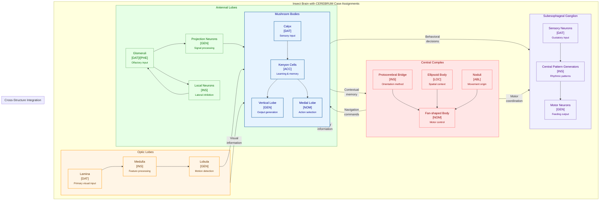
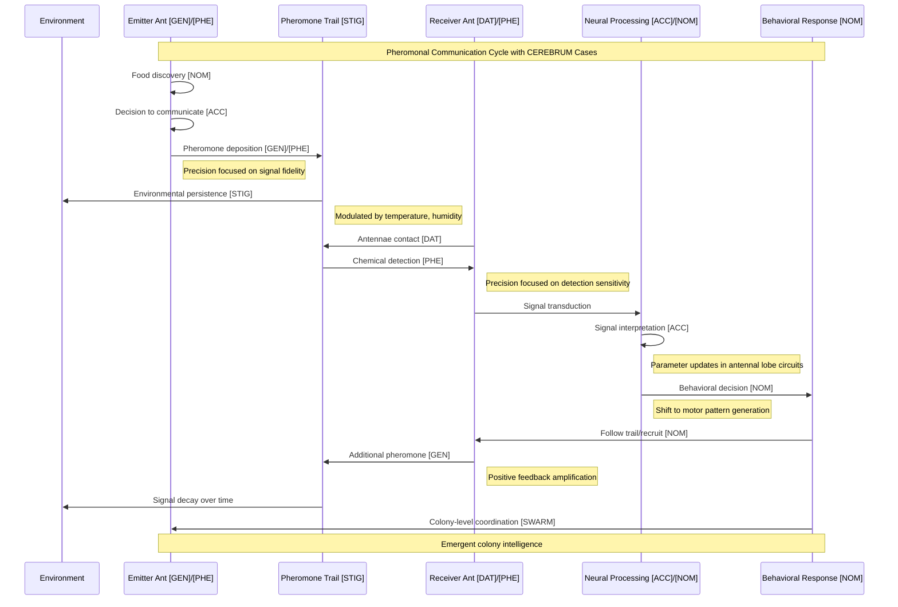
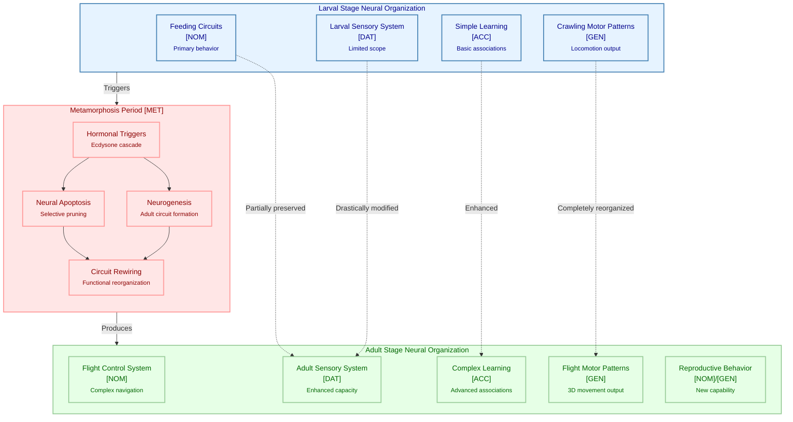
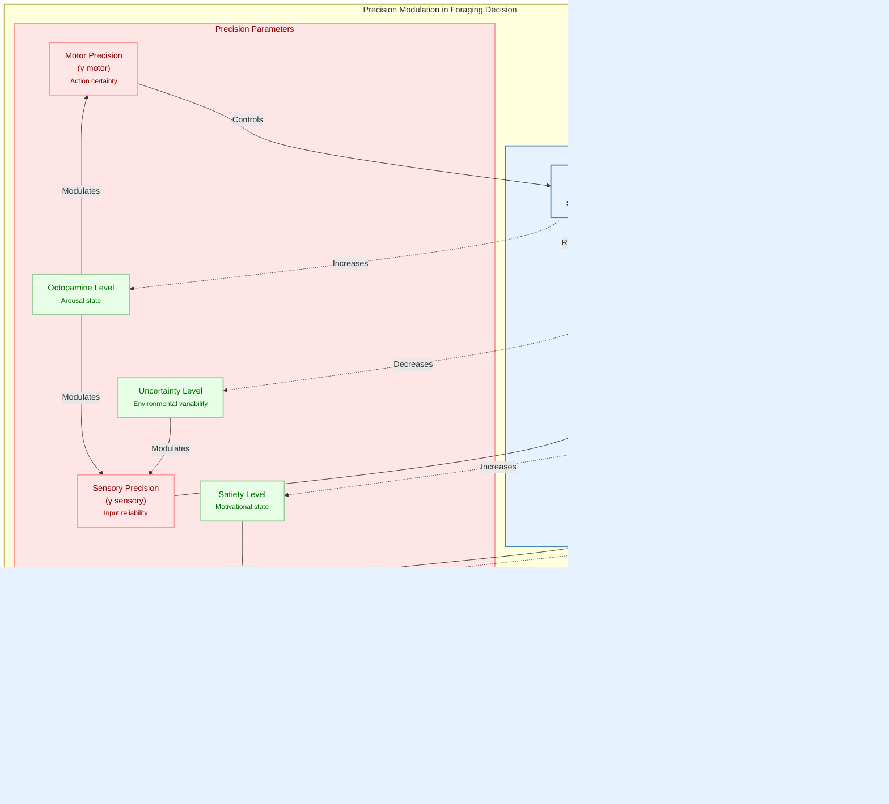
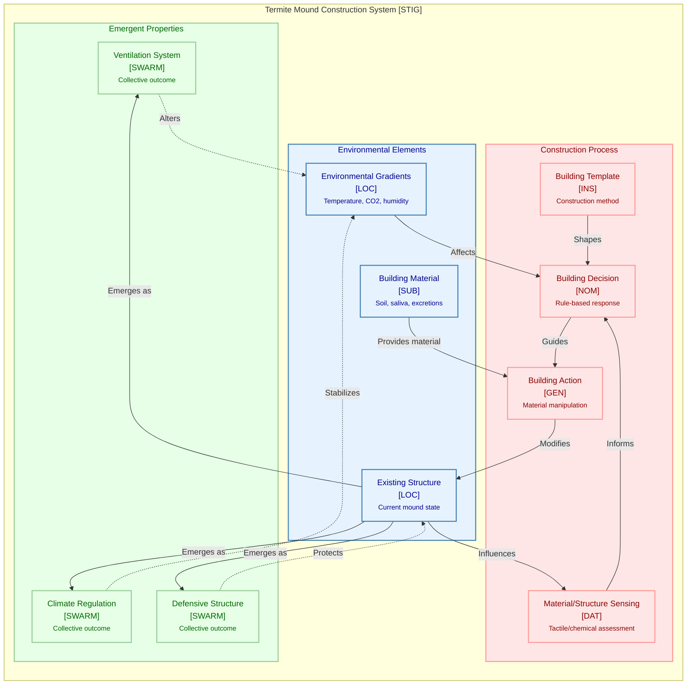
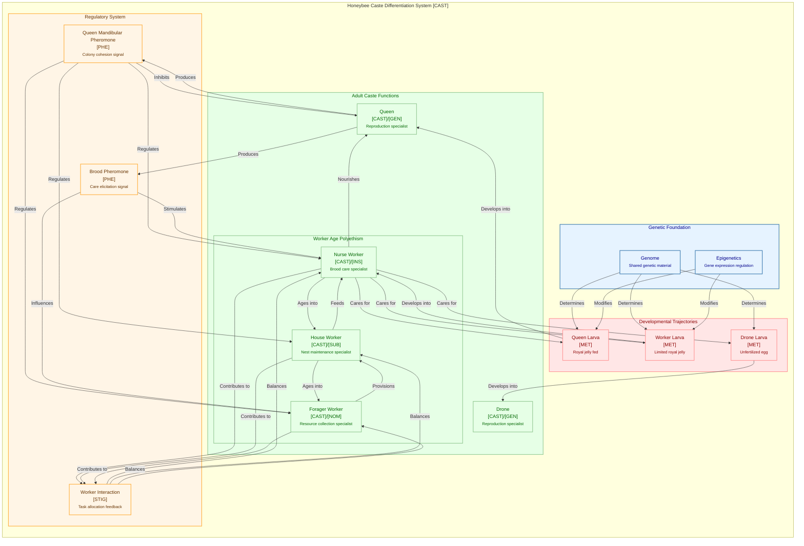
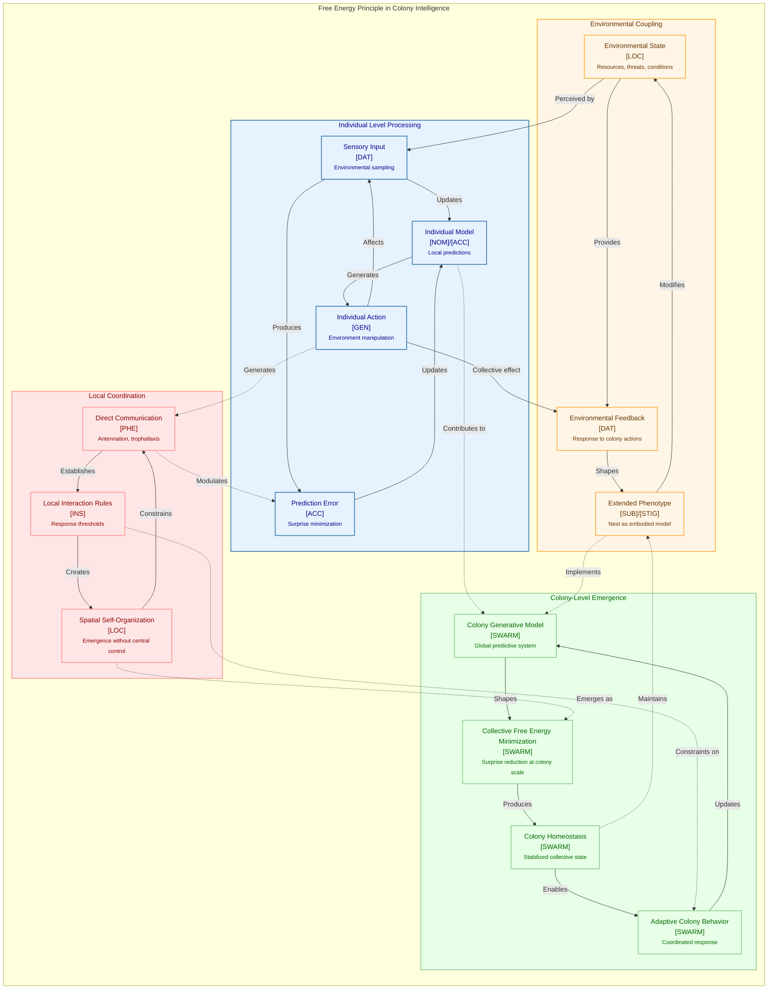

# CEREBRUM Insect Cognitive Diagrams

This document contains technical diagrams illustrating the integration of insect cognitive systems with the CEREBRUM framework.

## 1. Insect Neural Architecture with CEREBRUM Case Mapping

## 2. Pheromonal Communication System with CEREBRUM Cases

## 3. Metamorphic Neural Reorganization with CEREBRUM [MET] Case

## 4. Precision Dynamics in Foraging Decision-Making

## 5. Stigmergic Construction System

## 6. Caste Differentiation System

## 7. Swarm Decision-Making Process

```mermaid
stateDiagram-v2
    [*] --> QuiescentState
    
    state "Quiescent Colony [LOC]" as QuiescentState
    state "Queen Assessment [NOM]/[CAST]" as QueenAssessment
    state "Scout Activation [VOC]/[NOM]" as ScoutActivation
    
    state ScoutForaging {
        [*] --> IndividualSearch
        IndividualSearch: Scout bees [NOM]
        IndividualSearch --> SiteAssessment
        SiteAssessment: Quality evaluation [DAT]/[ACC]
        SiteAssessment --> DanceRecruitment
        DanceRecruitment: Dance communication [GEN]/[PHE]
        DanceRecruitment --> [*]
    }
    
    state ConsensusBuilding {
        [*] --> MultipleOptions
        MultipleOptions: Competing sites [SWARM]
        MultipleOptions --> StrengthAssessment
        StrengthAssessment: Dance vigor comparison [DAT]
        StrengthAssessment --> CrossInhibition
        CrossInhibition: Stop signal production [GEN]/[PHE]
        CrossInhibition --> Convergence
        Convergence: Majority formation [SWARM]
        Convergence --> [*]
    }
    
    state SwarmPreparation {
        [*] --> FoodCollection
        FoodCollection: Resource gathering [NOM]
        FoodCollection --> ClusterFormation
        ClusterFormation: Physical aggregation [SWARM]
        ClusterFormation --> ThermalRegulation
        ThermalRegulation: Temperature control [SWARM]
        ThermalRegulation --> [*]
    }
    
    state SwarmMovement {
        [*] --> LiftOff
        LiftOff: Coordinated departure [SWARM]
        LiftOff --> DirectionalGuidance
        DirectionalGuidance: Streaker bee guidance [INS]/[LOC]
        DirectionalGuidance --> ClusterTravelFormation
        ClusterTravelFormation: Travel formation [SWARM]
        ClusterTravelFormation --> [*]
    }
    
    state NewNestEstablishment {
        [*] --> ArrivalAssessment
        ArrivalAssessment: Final site verification [DAT]/[ACC]
        ArrivalAssessment --> EntranceClearing
        EntranceClearing: Site preparation [SUB]
        EntranceClearing --> CombConstruction
        CombConstruction: Wax production [SUB]/[STIG]
        CombConstruction --> QueenEggLaying
        QueenEggLaying: Colony reproduction [GEN]/[CAST]
        QueenEggLaying --> [*]
    }
    
    QuiescentState --> QueenAssessment: Overcrowding trigger
    QueenAssessment --> ScoutActivation: Queen preparation
    ScoutActivation --> ScoutForaging: Initiate search
    ScoutForaging --> ConsensusBuilding: Multiple sites found
    ConsensusBuilding --> SwarmPreparation: Decision made
    SwarmPreparation --> SwarmMovement: Preparation complete
    SwarmMovement --> NewNestEstablishment: Arrival at chosen site
    NewNestEstablishment --> QuiescentState: Colony established
    
    note right of QueenAssessment
        Queen reduces egg-laying
        and loses weight for flight
    end note
    
    note right of ConsensusBuilding
        Democratic decision process
        with cross-inhibition and
        quorum sensing
    end note
    
    note right of SwarmMovement
        Collective navigation with
        distributed intelligence
    end note
```

## 8. Free Energy Principle in Insect Collective Intelligence

