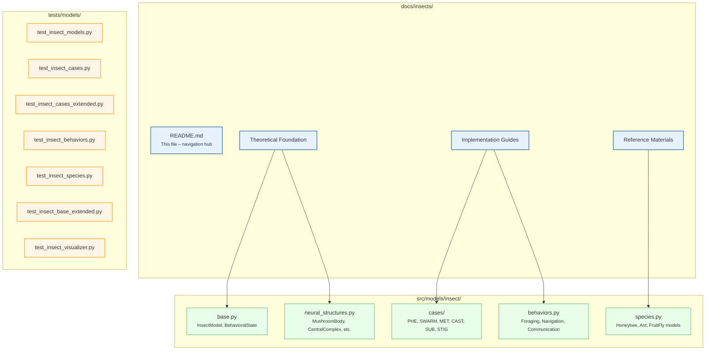

# Insect Cognition Documentation

> **CEREBRUM Entomological Integration Suite** — Modeling arthropod intelligence through case grammar and active inference

This directory contains the comprehensive documentation for CEREBRUM's insect cognition modeling capabilities, bridging computational neuroscience, entomology, and the Free Energy Principle into a unified case-based framework.

## Quick Start

```python
from src.models.insect.base import InsectModel, BehavioralState, SensoryInput
from src.models.insect.neural_structures import MushroomBody, CentralComplex
from src.models.insect.cases.pheromonal import PheromonalCase
from src.models.insect.cases.swarm import SwarmCase

# Create an insect model
model = InsectModel(species="Apis mellifera", initial_case=Case.NOMINATIVE)
model.transform_case(Case.DATIVE)  # Switch to sensory recipient mode
```

## Architecture Overview



## Document Map

### Theoretical Foundation

| Document | Description | Key Content |
|----------|-------------|-------------|
| [entomological-integration.md](entomological-integration.md) | **Primary integration document** — maps insect neural structures to CEREBRUM cases with precision dynamics | 7 tables, 4 mermaid diagrams, morphosyntactic alignments |
| [insect-instantiations.md](insect-instantiations.md) | **Case declension theory** — formal treatment of standard + insect-specific cases as functional roles | Tables 1–2, prose analysis of each case, Umwelt theory |
| [insect-cognitive-architectures.md](insect-cognitive-architectures.md) | **Comprehensive architecture reference** — 10 tables covering orders, structures, learning, communication, behavior, evolution, applications | 237 lines, 26 insect orders/species |
| [insect-brain-structures.md](insect-brain-structures.md) | **Neuroanatomical mapping** — detailed brain structure → CEREBRUM case assignments with species examples | 4 tables, 1 mermaid overview diagram |

### Neural Circuit Documentation

| Document | Description | Key Content |
|----------|-------------|-------------|
| [insect-brain-mapping.md](insect-brain-mapping.md) | **Technical circuit analysis** — neuronal circuit implementations, pathways, neurochemical modulation | 6 tables covering circuits, pathways, modulators, evolution |
| [insect-brain-diagrams.md](insect-brain-diagrams.md) | **Anatomical circuit diagrams** — detailed mermaid flowcharts of mushroom body, central complex, antennal lobe, optic lobe, and brain-wide integration | 5 detailed mermaid diagrams |
| [insect-diagrams.md](insect-diagrams.md) | **System-level diagrams** — cognitive architecture, pheromonal communication, metamorphosis, foraging precision, stigmergy, caste differentiation, swarm decision, free energy | 8 mermaid diagrams |

### Behavioral Analysis

| Document | Description | Key Content |
|----------|-------------|-------------|
| [insect-case-studies.md](insect-case-studies.md) | **Behavioral case studies** — detailed neural implementation analysis of complex behaviors | 8 case studies: honeybee foraging, Drosophila courtship, desert ant navigation, bumblebee social learning, predator avoidance, termite construction, locust phase change, firefly synchronization |

### Reference Materials

| Document | Description | Key Content |
|----------|-------------|-------------|
| [insect-cognitive-terms.md](insect-cognitive-terms.md) | **Glossary and nomenclature** — A–Z project name acronyms, neural/cognitive components, behavioral patterns, learning terms | 212+ definitions across 4 categories |

### Implementation Status

| Document | Description |
|----------|-------------|
| [assessment-summary.md](assessment-summary.md) | Current state analysis with strengths, gaps, and recommendations |
| [implementation-completion-summary.md](implementation-completion-summary.md) | Overview of completed implementation with code cross-references |
| [implementation-roadmap.md](implementation-roadmap.md) | Development timeline with milestones and success criteria |
| [insect-improvement-plan.md](insect-improvement-plan.md) | Phased improvement plan from foundation to interactive features |

## Source Code Cross-Reference

| Source File | CEREBRUM Cases | Key Classes | Documentation |
|-------------|----------------|-------------|---------------|
| `src/models/insect/base.py` | All standard cases | `InsectModel`, `InsectActiveInferenceModel`, `BehavioralState`, `SensoryInput`, `Action` | [insect-instantiations.md](insect-instantiations.md) |
| `src/models/insect/neural_structures.py` | [ACC], [NOM], [LOC], [DAT], [GEN], [INS] | `MushroomBody`, `CentralComplex`, `AntennalLobe`, `OpticLobe`, `SubesophagealGanglion`, `VentralNerveCord` | [insect-brain-structures.md](insect-brain-structures.md) |
| `src/models/insect/behaviors.py` | [NOM], [DAT], [GEN] | Foraging, Navigation, Communication modules | [insect-case-studies.md](insect-case-studies.md) |
| `src/models/insect/species.py` | Species-specific | Honeybee, Ant, FruitFly specializations | [insect-cognitive-architectures.md](insect-cognitive-architectures.md) |
| `src/models/insect/cases/pheromonal.py` | [PHE] | `PheromonalCase`, `PheromoneType`, `ChemicalSignal` | [entomological-integration.md](entomological-integration.md) |
| `src/models/insect/cases/swarm.py` | [SWARM] | `SwarmCase`, `SwarmBehavior`, `SwarmMember` | [entomological-integration.md](entomological-integration.md) |
| `src/models/insect/cases/metamorphic.py` | [MET] | `MetamorphicCase`, `DevelopmentalStage` | [entomological-integration.md](entomological-integration.md) |
| `src/models/insect/cases/caste.py` | [CAST] | `CasteCase`, `CasteType`, `CasteProfile` | [entomological-integration.md](entomological-integration.md) |
| `src/models/insect/cases/substrate.py` | [SUB] | `SubstrateCase`, `SubstrateType` | [entomological-integration.md](entomological-integration.md) |
| `src/models/insect/cases/stigmergic.py` | [STIG] | `StigmergicCase`, `StigmergicSignal` | [entomological-integration.md](entomological-integration.md) |

## CEREBRUM Case System

### Standard Cases (8)

| Case | Abbreviation | Insect Function |
|------|-------------|-----------------|
| Nominative | [NOM] | Active agent executing behavior (central complex → motor output) |
| Accusative | [ACC] | Target of learning/update (mushroom body associative circuits) |
| Genitive | [GEN] | Output producer (pheromone glands, motor pattern generators) |
| Dative | [DAT] | Sensory recipient (antennal lobes, optic lobes, mechanoreceptors) |
| Instrumental | [INS] | Method/algorithm (path integration, optic flow computation) |
| Locative | [LOC] | Spatial/environmental context (ellipsoid body, cognitive maps) |
| Ablative | [ABL] | Historical origin/memory (long-term memory traces, developmental history) |
| Vocative | [VOC] | Directly addressable entity (alarm receptor, caste-specific activation) |

### Insect-Specific Cases (6)

| Case | Abbreviation | Core Function | Implementation |
|------|-------------|---------------|----------------|
| Pheromonal | [PHE] | Chemical communication specialist | `cases/pheromonal.py` |
| Swarm | [SWARM] | Collective behavior participant | `cases/swarm.py` |
| Metamorphic | [MET] | Life-stage transition manager | `cases/metamorphic.py` |
| Caste | [CAST] | Social role specialist | `cases/caste.py` |
| Substrate | [SUB] | Environmental material manipulator | `cases/substrate.py` |
| Stigmergic | [STIG] | Indirect communication coordinator | `cases/stigmergic.py` |

## Recent Research Integration

Key findings integrated into this documentation:

- **2023**: First complete *Drosophila melanogaster* larval brain connectome — 3,016 neurons, 548,000 synaptic connections (Winding, Pedigo et al., *Science*)
- **2025**: Executive functions framework for insect cognition — mapping inhibition, shifting, and working memory to mushroom bodies and central complex (Baran, Obidziński, Hohol, *Frontiers in Behavioral Neuroscience*)
- **2024–2026**: Advances in neuromorphic computing inspired by insect circuit motifs, including sparse coding in Kenyon cells and ring attractor dynamics in the ellipsoid body

## How to Use This Documentation

1. **New to insect-CEREBRUM integration?** Start with [insect-instantiations.md](insect-instantiations.md) for the theoretical foundation
2. **Looking for neural circuit details?** See [insect-brain-diagrams.md](insect-brain-diagrams.md) and [insect-brain-mapping.md](insect-brain-mapping.md)
3. **Want to understand specific behaviors?** Read [insect-case-studies.md](insect-case-studies.md)
4. **Need the full architecture reference?** Consult [insect-cognitive-architectures.md](insect-cognitive-architectures.md)
5. **Ready to implement?** See the source code cross-reference table above and [implementation-completion-summary.md](implementation-completion-summary.md)
6. **Looking up a term?** Check [insect-cognitive-terms.md](insect-cognitive-terms.md)

## Purpose

CEREBRUM uses insect cognition as a model domain for demonstrating case-based reasoning at scale, drawing formal parallels between insect neural structures and CEREBRUM's case transformation calculus. The insect brain — with its compact neural circuits, well-characterized connectome, rich behavioral repertoire, and collective intelligence phenomena — provides an ideal testbed for validating that the linguistic case metaphor can capture the computational logic of biological cognition. By mapping the ~100,000–1,000,000 neurons of the insect brain onto CEREBRUM's case grammar, we bridge ethology, computational neuroscience, and Active Inference into a unified formal framework.
