# CEREBRUM Insect Brain Structures

This document provides a comprehensive mapping of insect brain structures within the CEREBRUM framework, illustrating how different neuroanatomical regions correspond to functional case roles in cognitive processing.

## 1. Overview of Insect Brain Organization

```mermaid
flowchart TD
    classDef mushroom fill:#e6f3ff,stroke:#4682b4,stroke-width:2px,color:#00008B
    classDef central fill:#ffe6e6,stroke:#ff9999,stroke-width:2px,color:#8B0000
    classDef antennal fill:#e6ffe6,stroke:#99cc99,stroke-width:2px,color:#006600
    classDef optic fill:#fff5e6,stroke:#ffb347,stroke-width:2px,color:#663300
    classDef subesophageal fill:#f0f0ff,stroke:#b19cd9,stroke-width:2px,color:#4b0082
    classDef VNC fill:#fff0ff,stroke:#dda0dd,stroke-width:2px,color:#800080
    
    Brain["Insect Brain"]
    
    MB["Mushroom Bodies<br>[ACC]/[NOM]"]
    CX["Central Complex<br>[LOC]/[NOM]"]
    AL["Antennal Lobes<br>[DAT]/[PHE]"]
    OL["Optic Lobes<br>[DAT]"]
    SEG["Subesophageal Ganglion<br>[GEN]/[INS]"]
    VNC["Ventral Nerve Cord<br>[INS]"]
    
    Brain --> MB
    Brain --> CX
    Brain --> AL
    Brain --> OL
    Brain --> SEG
    Brain --> VNC
    
    MB1["Kenyon Cells<br>[ACC]"]
    MB2["Calyx<br>[DAT]"]
    MB3["Lobes<br>[NOM]/[GEN]"]
    
    MB --> MB1
    MB --> MB2
    MB --> MB3
    
    CX1["Fan-shaped Body<br>[NOM]"]
    CX2["Ellipsoid Body<br>[LOC]"]
    CX3["Protocerebral Bridge<br>[INS]"]
    CX4["Noduli<br>[ABL]"]
    
    CX --> CX1
    CX --> CX2
    CX --> CX3
    CX --> CX4
    
    AL1["Glomeruli<br>[DAT]/[PHE]"]
    AL2["Projection Neurons<br>[GEN]"]
    AL3["Local Neurons<br>[INS]"]
    
    AL --> AL1
    AL --> AL2
    AL --> AL3
    
    OL1["Lamina<br>[DAT]"]
    OL2["Medulla<br>[INS]"]
    OL3["Lobula<br>[GEN]"]
    OL4["Lobula Plate<br>[LOC]"]
    
    OL --> OL1
    OL --> OL2
    OL --> OL3
    OL --> OL4
    
    SEG1["Motor Neuromeres<br>[GEN]"]
    SEG2["Sensory Neuromeres<br>[DAT]"]
    
    SEG --> SEG1
    SEG --> SEG2
    
    class MB,MB1,MB2,MB3 mushroom
    class CX,CX1,CX2,CX3,CX4 central
    class AL,AL1,AL2,AL3 antennal
    class OL,OL1,OL2,OL3,OL4 optic
    class SEG,SEG1,SEG2 subesophageal
    class VNC VNC
```

## 2. Comprehensive Brain Structure to CEREBRUM Case Mapping

**Table 1: Primary Brain Structures and CEREBRUM Case Assignments**

| Brain Structure | Substructure | Primary CEREBRUM Case | Secondary Cases | Functional Role | Representative Species | 
|-----------------|--------------|------------------------|-----------------|-----------------|--------------------------|
| **Mushroom Bodies** | Kenyon Cells | [ACC] | [ABL] | Learning and memory | Honeybee (*Apis mellifera*) |
| | Calyx | [DAT] | [ACC] | Sensory input processing | Cockroach (*Periplaneta americana*) |
| | Vertical Lobe | [GEN] | [NOM] | Output generation | Fruit fly (*Drosophila melanogaster*) |
| | Medial Lobe | [NOM] | [INS] | Action selection | Desert ant (*Cataglyphis fortis*) |
| **Central Complex** | Fan-shaped Body | [NOM] | [LOC] | Motor coordination | Locust (*Schistocerca gregaria*) |
| | Ellipsoid Body | [LOC] | [ABL] | Spatial encoding | Dung beetle (*Scarabaeus satyrus*) |
| | Protocerebral Bridge | [INS] | [LOC] | Navigation computation | Monarch butterfly (*Danaus plexippus*) |
| | Noduli | [ABL] | [NOM] | Movement origins | Dragonfly (*Anax junius*) |
| **Antennal Lobes** | Glomeruli | [DAT]/[PHE] | [ACC] | Chemosensory input | Moth (*Bombyx mori*) |
| | Projection Neurons | [GEN] | [INS] | Signal transmission | Ant (*Camponotus floridanus*) |
| | Local Neurons | [INS] | [ACC] | Lateral inhibition | Mosquito (*Anopheles gambiae*) |
| **Optic Lobes** | Lamina | [DAT] | - | Initial visual processing | Praying mantis (*Tenodera sinensis*) |
| | Medulla | [INS] | [DAT] | Feature extraction | Bee (*Apis mellifera*) |
| | Lobula | [GEN] | [LOC] | Motion detection | Dragonfly (*Aeshna juncea*) |
| | Lobula Plate | [LOC] | [NOM] | Optic flow processing | Blowfly (*Calliphora vicina*) |
| **Subesophageal Ganglion** | Motor Neuromeres | [GEN] | [NOM] | Motor output | Grasshopper (*Schistocerca americana*) |
| | Sensory Neuromeres | [DAT] | [ACC] | Gustatory processing | Butterfly (*Pieris rapae*) |
| **Specialized Structures** | Lateral Horn | [PHE] | [NOM] | Innate olfaction | Fruit fly (*Drosophila melanogaster*) |
| | Anterior Optic Tubercle | [LOC] | [DAT] | Celestial compass | Monarch butterfly (*Danaus plexippus*) |
| | Dorsal Lobe | [INS] | [GEN] | Antennal movement | Cricket (*Gryllus bimaculatus*) |
| | Corpora Cardiaca | [MET] | [GEN] | Hormone release | Silkworm (*Bombyx mori*) |
| | Corpora Allata | [MET] | [CAST] | Juvenile hormone regulation | Termite (*Reticulitermes flavipes*) |

## 3. Information Flow through CEREBRUM Cases in Insect Brain

**Table 2: Neural Pathways and CEREBRUM Case Transitions**

| Neural Pathway | CEREBRUM Case Sequence | Information Content | Processing Function | Example Species |
|----------------|------------------------|---------------------|---------------------|-----------------|
| Olfactory Pathway | [DAT]/[PHE] → [ACC] → [NOM] | Chemical stimuli | Odor learning and response | Honeybee (*Apis mellifera*) |
| Visual Pathway | [DAT] → [INS] → [LOC] → [NOM] | Visual patterns | Pattern recognition | Paper wasp (*Polistes dominula*) |
| Mechanosensory Pathway | [DAT] → [INS] → [NOM] | Mechanical stimuli | Movement detection | Cockroach (*Periplaneta americana*) |
| Navigation Circuit | [DAT] → [LOC] → [INS] → [NOM] | Spatial cues | Path integration | Desert ant (*Cataglyphis fortis*) |
| Motor Output | [NOM] → [INS] → [GEN] | Action commands | Behavior execution | Locust (*Schistocerca gregaria*) |
| Learning Circuit | [DAT] → [ACC] → [ABL] → [NOM] | Associative signals | Memory formation | Fruit fly (*Drosophila melanogaster*) |
| Communication Circuit | [DAT] → [ACC] → [NOM] → [GEN]/[PHE] | Social signals | Information transfer | Honeybee (*Apis mellifera*) |
| Metamorphic Pathway | [MET] → all cases | Developmental signals | Neural reorganization | Butterfly (*Danaus plexippus*) |

## 4. Neurochemical Systems and CEREBRUM Case Modulation

**Table 3: Neuromodulators and Their Effects on CEREBRUM Cases**

| Neuromodulator | Primary CEREBRUM Cases Affected | Anatomical Source | Functional Effect | Example Species |
|----------------|----------------------------------|-------------------|-------------------|-----------------|
| Octopamine | [NOM], [DAT], [ACC] | Dorsal/Medial Unpaired Neurons | Arousal, motivation, learning | Honeybee (*Apis mellifera*) |
| Dopamine | [ACC], [NOM], [DAT] | PPL/PPM Clusters | Reward learning, aversion | Fruit fly (*Drosophila melanogaster*) |
| Serotonin | [DAT], [LOC], [SWARM] | CSD Neurons | Behavioral state, social behavior | Locust (*Schistocerca gregaria*) |
| GABA | [INS], inhibitory modulation | Local Interneurons | Signal refinement, contrast enhancement | Moth (*Manduca sexta*) |
| Acetylcholine | [DAT], [NOM], [GEN] | Sensory Neurons, Motor Neurons | Excitatory transmission | Cockroach (*Periplaneta americana*) |
| Glutamate | [DAT], [NOM] | Motor Neurons, Sensory Neurons | Fast excitatory transmission | Locust (*Schistocerca gregaria*) |
| Neuropeptides | [MET], [CAST], [SWARM] | Neurosecretory Cells | Developmental transitions, social regulation | Honeybee (*Apis mellifera*) |
| Juvenile Hormone | [MET], [CAST] | Corpora Allata | Developmental regulation, caste determination | Termite (*Reticulitermes flavipes*) |
| Ecdysone | [MET] | Prothoracic Gland | Metamorphosis triggering | Butterfly (*Danaus plexippus*) |

## 5. Specialized Insect Brain Adaptations

**Table 4: Specialized Neural Adaptations and CEREBRUM Implementation**

| Neural Adaptation | Primary CEREBRUM Cases | Taxonomic Distribution | Functional Specialization | Evolutionary Context |
|-------------------|------------------------|------------------------|---------------------------|----------------------|
| Enlarged Mushroom Bodies | [ACC], [NOM], [LOC] | Social Hymenoptera | Social learning, memory | Eusocial colony organization |
| Sexually Dimorphic Antennal Lobes | [DAT]/[PHE] | Moths, some beetles | Sex pheromone detection | Sexual selection, mate finding |
| Giant Fiber System | [DAT] → [NOM] → [GEN] | Cockroaches, flies | Rapid escape response | Predator avoidance |
| Time-Compensated Sun Compass | [LOC], [ABL] | Monarch butterflies, bees | Migration, homing | Long-distance navigation |
| Polarization-Sensitive Dorsal Rim | [DAT], [LOC] | Desert ants, dung beetles | Sky compass orientation | Navigation in featureless environments |
| Waggle Dance Decoder | [DAT]/[PHE] | Honey bees | Social information transfer | Foraging efficiency in social insects |
| Phase Change Circuits | [MET], [SWARM] | Locusts, some aphids | Density-dependent polymorphism | Population dynamics adaptation |
| Caste-Specific Brain Development | [MET], [CAST] | Eusocial insects | Division of labor | Specialized role optimization |
| Sound Recognition Circuits | [DAT], [VOC] | Crickets, cicadas | Species-specific song detection | Reproductive isolation |
| Face Recognition Regions | [DAT], [VOC], [CAST] | Paper wasps | Individual recognition | Social hierarchy management |

This document provides a foundation for understanding insect brain structures through the CEREBRUM case framework, highlighting the functional roles of different brain regions within this paradigm and demonstrating how neuroanatomy maps to cognitive case assignments. 