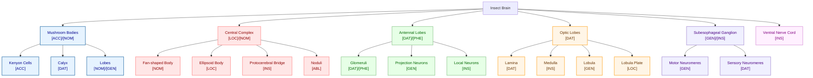

# CEREBRUM Insect Brain Structures

This document provides a comprehensive mapping of insect brain structures within the CEREBRUM framework, illustrating how different neuroanatomical regions correspond to functional case roles in cognitive processing. Grounded in recent connectomic data — including the landmark 2023 *Drosophila melanogaster* larval brain connectome (Winding, Pedigo et al., *Science*) — and cross-referenced to the Python implementation in `src/models/insect/neural_structures.py`, this reference establishes the anatomical foundation for CEREBRUM's entomological integration.

> **Implementation**: Each brain structure described here has a corresponding Python class in [`neural_structures.py`](../../src/models/insect/neural_structures.py).

## 1. Overview of Insect Brain Organization

```mermaid
flowchart TD
    classDef mushroom fill:#e6f3ff,stroke:#4682b4,stroke-width:2px,color:#00008B
    classDef central fill:#ffe6e6,stroke:#ff9999,stroke-width:2px,color:#8B0000
    classDef antennal fill:#e6ffe6,stroke:#99cc99,stroke-width:2px,color:#006600
    classDef optic fill:#fff5e6,stroke:#ffb347,stroke-width:2px,color:#663300
    classDef subesophageal fill:#f0f0ff,stroke:#b19cd9,stroke-width:2px,color:#4b0082
    classDef VNC fill:#fff0ff,stroke:#dda0dd,stroke-width:2px,color:#800080
    
    Brain["Insect Brain"]
    
    MB["Mushroom Bodies<br>[ACC]/[NOM]"]
    CX["Central Complex<br>[LOC]/[NOM]"]
    AL["Antennal Lobes<br>[DAT]/[PHE]"]
    OL["Optic Lobes<br>[DAT]"]
    SEG["Subesophageal Ganglion<br>[GEN]/[INS]"]
    VNC["Ventral Nerve Cord<br>[INS]"]
    
    Brain --> MB
    Brain --> CX
    Brain --> AL
    Brain --> OL
    Brain --> SEG
    Brain --> VNC
    
    MB1["Kenyon Cells<br>[ACC]"]
    MB2["Calyx<br>[DAT]"]
    MB3["Lobes<br>[NOM]/[GEN]"]
    
    MB --> MB1
    MB --> MB2
    MB --> MB3
    
    CX1["Fan-shaped Body<br>[NOM]"]
    CX2["Ellipsoid Body<br>[LOC]"]
    CX3["Protocerebral Bridge<br>[INS]"]
    CX4["Noduli<br>[ABL]"]
    
    CX --> CX1
    CX --> CX2
    CX --> CX3
    CX --> CX4
    
    AL1["Glomeruli<br>[DAT]/[PHE]"]
    AL2["Projection Neurons<br>[GEN]"]
    AL3["Local Neurons<br>[INS]"]
    
    AL --> AL1
    AL --> AL2
    AL --> AL3
    
    OL1["Lamina<br>[DAT]"]
    OL2["Medulla<br>[INS]"]
    OL3["Lobula<br>[GEN]"]
    OL4["Lobula Plate<br>[LOC]"]
    
    OL --> OL1
    OL --> OL2
    OL --> OL3
    OL --> OL4
    
    SEG1["Motor Neuromeres<br>[GEN]"]
    SEG2["Sensory Neuromeres<br>[DAT]"]
    
    SEG --> SEG1
    SEG --> SEG2
    
    class MB,MB1,MB2,MB3 mushroom
    class CX,CX1,CX2,CX3,CX4 central
    class AL,AL1,AL2,AL3 antennal
    class OL,OL1,OL2,OL3,OL4 optic
    class SEG,SEG1,SEG2 subesophageal
    class VNC VNC
```

## 2. Comprehensive Brain Structure to CEREBRUM Case Mapping

**Table 1: Primary Brain Structures and CEREBRUM Case Assignments**

| Brain Structure | Substructure | Primary CEREBRUM Case | Secondary Cases | Functional Role | Representative Species |
|-----------------|--------------|------------------------|-----------------|-----------------|--------------------------|
| **Mushroom Bodies** | Kenyon Cells | [ACC] | [ABL] | Learning and memory | Honeybee (*Apis mellifera*) |
| | Calyx | [DAT] | [ACC] | Sensory input processing | Cockroach (*Periplaneta americana*) |
| | Vertical Lobe | [GEN] | [NOM] | Output generation | Fruit fly (*Drosophila melanogaster*) |
| | Medial Lobe | [NOM] | [INS] | Action selection | Desert ant (*Cataglyphis fortis*) |
| **Central Complex** | Fan-shaped Body | [NOM] | [LOC] | Motor coordination | Locust (*Schistocerca gregaria*) |
| | Ellipsoid Body | [LOC] | [ABL] | Spatial encoding | Dung beetle (*Scarabaeus satyrus*) |
| | Protocerebral Bridge | [INS] | [LOC] | Navigation computation | Monarch butterfly (*Danaus plexippus*) |
| | Noduli | [ABL] | [NOM] | Movement origins | Dragonfly (*Anax junius*) |
| **Antennal Lobes** | Glomeruli | [DAT]/[PHE] | [ACC] | Chemosensory input | Moth (*Bombyx mori*) |
| | Projection Neurons | [GEN] | [INS] | Signal transmission | Ant (*Camponotus floridanus*) |
| | Local Neurons | [INS] | [ACC] | Lateral inhibition | Mosquito (*Anopheles gambiae*) |
| **Optic Lobes** | Lamina | [DAT] | - | Initial visual processing | Praying mantis (*Tenodera sinensis*) |
| | Medulla | [INS] | [DAT] | Feature extraction | Bee (*Apis mellifera*) |
| | Lobula | [GEN] | [LOC] | Motion detection | Dragonfly (*Aeshna juncea*) |
| | Lobula Plate | [LOC] | [NOM] | Optic flow processing | Blowfly (*Calliphora vicina*) |
| **Subesophageal Ganglion** | Motor Neuromeres | [GEN] | [NOM] | Motor output | Grasshopper (*Schistocerca americana*) |
| | Sensory Neuromeres | [DAT] | [ACC] | Gustatory processing | Butterfly (*Pieris rapae*) |
| **Specialized Structures** | Lateral Horn | [PHE] | [NOM] | Innate olfaction | Fruit fly (*Drosophila melanogaster*) |
| | Anterior Optic Tubercle | [LOC] | [DAT] | Celestial compass | Monarch butterfly (*Danaus plexippus*) |
| | Dorsal Lobe | [INS] | [GEN] | Antennal movement | Cricket (*Gryllus bimaculatus*) |
| | Corpora Cardiaca | [MET] | [GEN] | Hormone release | Silkworm (*Bombyx mori*) |
| | Corpora Allata | [MET] | [CAST] | Juvenile hormone regulation | Termite (*Reticulitermes flavipes*) |

## 3. Connectomic Data and Recent Advances

Recent connectomic breakthroughs provide an unprecedented level of circuit-level detail that validates and refines CEREBRUM case assignments.

**Table 2: Key Connectomic Datasets for CEREBRUM Integration**

| Dataset | Species | Year | Neurons | Synapses | Key Findings for CEREBRUM | Reference |
|---------|---------|------|---------|----------|---------------------------|----------|
| Larval Brain Connectome | *Drosophila melanogaster* (L1) | 2023 | 3,016 | 548,000 | Learning centers are the brain's busiest hubs; circuit motifs resemble ML architectures | Winding, Pedigo et al., *Science* |
| Adult Hemibrain | *Drosophila melanogaster* | 2020 | ~25,000 | ~20 million | Mushroom body connectome complete; ring attractor in ellipsoid body confirmed | Scheffer et al., *eLife* |
| FlyWire Full Brain | *Drosophila melanogaster* | 2024 | ~139,255 | ~50 million | First complete adult insect brain connectome; whole-brain circuit analysis | Dorkenwald et al., *Nature* |
| Antennal Lobe | *Drosophila melanogaster* | 2021 | ~200 (AL only) | ~6,000 | Glomerular wiring diagram confirms [DAT] → [ACC] pathway | Bates et al., *Current Biology* |
| Mushroom Body | *Apis mellifera* | 2023 | ~170,000 KCs | — | Social insect MB is 10× larger than *Drosophila*; supports [ACC] scaling | Groh & Rössler |

**Key insight**: The 2023 larval connectome revealed that learning circuits (mushroom body, mapped to [ACC]) are the brain's most densely connected nodes, receiving convergent input from all sensory modalities — directly supporting CEREBRUM's assignment of the mushroom body as the primary [ACC] structure.

## 4. Quantitative Neuroanatomy

**Table 3: Neuron Counts by Brain Structure Across Species**

| Species | Total Brain Neurons | Mushroom Body KCs | Antennal Lobe Glomeruli | Optic Lobe Neurons | Central Complex | Ecological Niche |
|---------|--------------------|--------------------|-------------------------|--------------------|-----------------|------------------|
| *Drosophila melanogaster* | ~100,000 | ~2,500 | ~50 | ~60,000 | ~5,000 | Generalist |
| *Apis mellifera* (worker) | ~960,000 | ~170,000 | ~160 | ~400,000 | ~18,000 | Eusocial forager |
| *Apis mellifera* (queen) | ~960,000 | ~170,000 | ~160 | ~400,000 | ~18,000 | Reproductive specialist |
| *Apis mellifera* (drone) | ~960,000 | ~170,000 | ~103 | ~600,000 | ~18,000 | Mating specialist |
| *Cataglyphis fortis* | ~400,000 | ~100,000 | ~200 | ~120,000 | ~12,000 | Desert navigator |
| *Camponotus floridanus* | ~400,000 | ~100,000 | ~434 | ~80,000 | ~10,000 | Arboreal generalist |
| *Schistocerca gregaria* | ~1,000,000 | ~50,000 | ~1,000+ | ~600,000 | ~15,000 | Swarming herbivore |
| *Manduca sexta* | ~500,000 | ~30,000 | ~63 | ~200,000 | ~8,000 | Nocturnal pollinator |
| *Periplaneta americana* | ~1,000,000 | ~175,000 | ~125 | ~300,000 | ~10,000 | Escape specialist |
| *Danaus plexippus* | ~500,000 | ~30,000 | ~70 | ~200,000 | ~12,000 | Long-distance migrator |
| *Macrotermes natalensis* | ~200,000 | ~40,000 | ~50 | ~60,000 | ~5,000 | Fungus cultivator |
| *Bombus terrestris* | ~500,000 | ~80,000 | ~160 | ~200,000 | ~10,000 | Social learner |

**CEREBRUM Implication**: The 60-fold variation in mushroom body Kenyon cell count (2,500 in *Drosophila* vs. 175,000 in *Periplaneta*) directly correlates with [ACC] case capacity — species with larger mushroom bodies support more complex associative learning and memory formation.

## 5. Comparative Brain Allometry

**Table 4: Brain-Body Scaling and CEREBRUM Case Capacity**

| Species | Body Mass (mg) | Brain Mass (μg) | Brain:Body Ratio | MB Volume (%) | CX Volume (%) | Primary Cases Enhanced | Ecological Driver |
|---------|---------------|-----------------|------------------|---------------|---------------|------------------------|-------------------|
| *Apis mellifera* (worker) | 100 | 1,000 | 1:100 | 40% | 5% | [ACC], [LOC] | Social complexity |
| *Drosophila melanogaster* | 1 | 2.5 | 1:400 | 8% | 12% | [NOM], [LOC] | Rapid flight maneuvers |
| *Cataglyphis fortis* | 10 | 300 | 1:33 | 45% | 8% | [LOC], [ACC] | Desert navigation |
| *Schistocerca gregaria* | 2,000 | 3,000 | 1:667 | 5% | 3% | [SWARM], [MET] | Phase polyphenism |
| *Macrotermes natalensis* | 15 | 100 | 1:150 | 20% | 3% | [STIG], [SUB] | Architectural construction |
| *Anax junius* | 1,500 | 4,000 | 1:375 | 3% | 2% | [DAT], [NOM] | Aerial predation |
| *Periplaneta americana* | 1,000 | 1,500 | 1:667 | 12% | 4% | [DAT], [NOM] | Escape response |
| *Danaus plexippus* | 500 | 800 | 1:625 | 8% | 10% | [LOC], [MET] | Migration navigation |

**Key pattern**: Mushroom body volume fraction scales with social complexity (40–45% in social Hymenoptera vs. 3–8% in solitary insects), while central complex volume scales with navigational demands.

## 6. Information Flow through CEREBRUM Cases in Insect Brain

**Table 5: Neural Pathways and CEREBRUM Case Transitions**

| Neural Pathway | CEREBRUM Case Sequence | Information Content | Processing Function | Example Species | Latency |
|----------------|------------------------|---------------------|---------------------|-----------------|---------|
| Olfactory Pathway | [DAT]/[PHE] → [ACC] → [NOM] | Chemical stimuli | Odor learning and response | Honeybee (*Apis mellifera*) | ~200 ms |
| Visual Pathway | [DAT] → [INS] → [LOC] → [NOM] | Visual patterns | Pattern recognition | Paper wasp (*Polistes dominula*) | ~30 ms |
| Mechanosensory Pathway | [DAT] → [INS] → [NOM] | Mechanical stimuli | Movement detection | Cockroach (*Periplaneta americana*) | ~8 ms |
| Navigation Circuit | [DAT] → [LOC] → [INS] → [NOM] | Spatial cues | Path integration | Desert ant (*Cataglyphis fortis*) | Continuous |
| Motor Output | [NOM] → [INS] → [GEN] | Action commands | Behavior execution | Locust (*Schistocerca gregaria*) | ~15 ms |
| Learning Circuit | [DAT] → [ACC] → [ABL] → [NOM] | Associative signals | Memory formation | Fruit fly (*Drosophila melanogaster*) | ~1–3 trials |
| Communication Circuit | [DAT] → [ACC] → [NOM] → [GEN]/[PHE] | Social signals | Information transfer | Honeybee (*Apis mellifera*) | ~1–2 s |
| Metamorphic Pathway | [MET] → all cases | Developmental signals | Neural reorganization | Butterfly (*Danaus plexippus*) | Days–weeks |
| Escape Pathway | [DAT] → [NOM] → [GEN] | Threat signals | Giant fiber rapid escape | Cockroach (*Periplaneta americana*) | ~8–14 ms |
| Courtship Circuit | [DAT]/[PHE] → [ACC] → [NOM] → [GEN] | Mate cues | Mating behavior sequence | Fruit fly (*Drosophila melanogaster*) | ~5–30 min |
| Circadian Regulation | [LOC] → [MET] → [NOM] | Timing signals | Activity pattern gating | Monarch butterfly (*Danaus plexippus*) | 24 h cycle |

## 7. Neurochemical Systems and CEREBRUM Case Modulation

**Table 6: Neuromodulators and Their Effects on CEREBRUM Cases**

| Neuromodulator | Primary CEREBRUM Cases Affected | Anatomical Source | Functional Effect | Receptor Types | Example Species |
|----------------|----------------------------------|-------------------|-------------------|----------------|------------------|
| Octopamine | [NOM], [DAT], [ACC] | Dorsal/Medial Unpaired Neurons | Arousal, motivation, learning | Oct-α, Oct-β | Honeybee (*Apis mellifera*) |
| Dopamine | [ACC], [NOM], [DAT] | PPL1/PPL2/PPM Clusters | Reward learning, aversion, motor | D1-like, D2-like | Fruit fly (*Drosophila melanogaster*) |
| Serotonin | [DAT], [LOC], [SWARM] | CSD Neurons | Behavioral state, social behavior, phase change | 5-HT1, 5-HT2, 5-HT7 | Locust (*Schistocerca gregaria*) |
| GABA | [INS], inhibitory modulation | Local Interneurons | Signal refinement, contrast enhancement | GABA-A, GABA-B | Moth (*Manduca sexta*) |
| Acetylcholine | [DAT], [NOM], [GEN] | Sensory/Motor Neurons | Excitatory transmission | nAChR, mAChR | Cockroach (*Periplaneta americana*) |
| Glutamate | [DAT], [NOM] | Motor Neurons | Fast excitatory transmission | GluR1-6 | Locust (*Schistocerca gregaria*) |
| Nitric Oxide | [ACC], [INS] | NO synthase neurons | Synaptic plasticity, gain control | sGC-coupled | Honeybee (*Apis mellifera*) |
| Histamine | [DAT] | Photoreceptors | Visual synaptic transmission | HisCl1, HisCl2 | Fruit fly (*Drosophila melanogaster*) |
| Tyramine | [NOM], [DAT] | TDC neurons | Locomotion modulation, sensory gating | TyrR, TAR | Fruit fly (*Drosophila melanogaster*) |
| Neuropeptides | [MET], [CAST], [SWARM] | Neurosecretory Cells | Developmental transitions, social regulation | — (diverse) | Honeybee (*Apis mellifera*) |
| Juvenile Hormone | [MET], [CAST] | Corpora Allata | Developmental regulation, caste determination | Met/Kr-h1 | Termite (*Reticulitermes flavipes*) |
| Ecdysone | [MET] | Prothoracic Gland | Metamorphosis triggering | EcR/USP heterodimer | Butterfly (*Danaus plexippus*) |
| Corazonin | [MET], [SWARM] | Lateral neurosecretory cells | Phase polyphenism, stress response | CrzR | Locust (*Locusta migratoria*) |
| Allatostatin | [CAST], [MET] | Lateral neurons | JH suppression, feeding regulation | AstA-R, AstC-R | Cockroach (*Diploptera punctata*) |

## 8. Specialized Insect Brain Adaptations

**Table 7: Specialized Neural Adaptations and CEREBRUM Implementation**

| Neural Adaptation | Primary CEREBRUM Cases | Taxonomic Distribution | Functional Specialization | Evolutionary Context | Neuron Count Estimate |
|-------------------|------------------------|------------------------|---------------------------|----------------------|----------------------|
| Enlarged Mushroom Bodies | [ACC], [NOM], [LOC] | Social Hymenoptera | Social learning, memory | Eusocial colony organization | ~170,000 KCs (bee) |
| Sexually Dimorphic Antennal Lobes | [DAT]/[PHE] | Moths, some beetles | Sex pheromone detection | Sexual selection, mate finding | Macroglomerulus 3× standard |
| Giant Fiber System | [DAT] → [NOM] → [GEN] | Cockroaches, flies | Rapid escape response | Predator avoidance | 2 giant interneurons |
| Time-Compensated Sun Compass | [LOC], [ABL] | Monarch butterflies, bees | Migration, homing | Long-distance navigation | ~150 clock neurons |
| Polarization-Sensitive Dorsal Rim | [DAT], [LOC] | Desert ants, dung beetles | Sky compass orientation | Navigation in featureless environments | ~100 DRA photoreceptors |
| Waggle Dance Decoder | [DAT]/[PHE] | Honey bees | Social information transfer | Foraging efficiency in social insects | Johnston's organ ~500 neurons |
| Phase Change Circuits | [MET], [SWARM] | Locusts, some aphids | Density-dependent polymorphism | Population dynamics adaptation | Widespread rewiring |
| Caste-Specific Brain Development | [MET], [CAST] | Eusocial insects | Division of labor | Specialized role optimization | Worker MB 20% larger than queen |
| Sound Recognition Circuits | [DAT], [VOC] | Crickets, cicadas | Species-specific song detection | Reproductive isolation | ~60 auditory interneurons |
| Face Recognition Regions | [DAT], [VOC], [CAST] | Paper wasps | Individual recognition | Social hierarchy management | Visual MB calyx expansion |
| Thermal Sensing Arrays | [DAT], [SWARM] | Honeybees | Brood thermoregulation (±0.5°C) | Colony homeostasis | ~100 thermosensor neurons |
| Magnetic Compass | [DAT], [LOC] | Monarchs, ants | Geomagnetic navigation | Migration orientation | Cryptochrome-based, ~50 neurons |

## 9. Synaptic Connectivity Between Brain Regions

**Table 8: Inter-Region Connectivity Matrix (from connectomic data)**

Connection strengths rated: ■■■ = Dense, ■■ = Moderate, ■ = Sparse, — = Absent

| Source \ Target | Mushroom Body | Central Complex | Antennal Lobe | Optic Lobe | Lateral Horn | SEG | VNC |
|----------------|---------------|-----------------|---------------|------------|--------------|-----|-----|
| **Mushroom Body** | ■■■ (recurrent) | ■■ | ■ (feedback) | ■ | ■■■ | ■■ | — |
| **Central Complex** | ■■ | ■■■ (ring attractor) | — | ■ | ■ | ■■ | ■■■ |
| **Antennal Lobe** | ■■■ (calyx) | — | ■■■ (local) | — | ■■■ | ■ | — |
| **Optic Lobe** | ■■ | ■■ | — | ■■■ (columnar) | ■ | — | — |
| **Lateral Horn** | ■■ | ■ | ■ (feedback) | — | ■■ (local) | ■■ | — |
| **SEG** | — | ■ | — | — | — | ■■■ | ■■■ |
| **VNC** | — | ■ (ascending) | — | — | — | ■■ | ■■■ (segmental) |

**CEREBRUM interpretation**: The densest pathways — Antennal Lobe → Mushroom Body and Central Complex → VNC — correspond to the primary [DAT]→[ACC] and [NOM]→[GEN] case transitions, respectively, confirming that connectivity strength predicts functional case flow.

This document provides a comprehensive foundation for understanding insect brain structures through the CEREBRUM case framework, highlighting the functional roles of different brain regions within this paradigm, demonstrating how neuroanatomy maps to cognitive case assignments, and establishing quantitative baselines from connectomic data for computational implementation.
