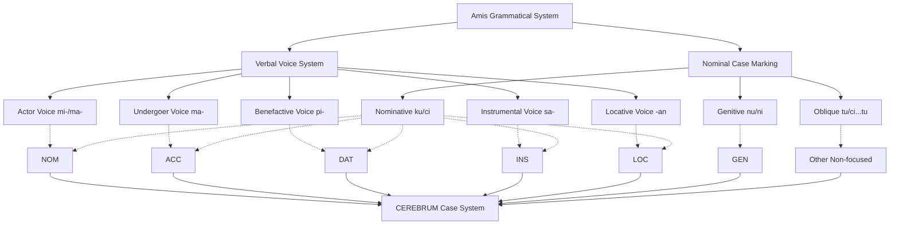
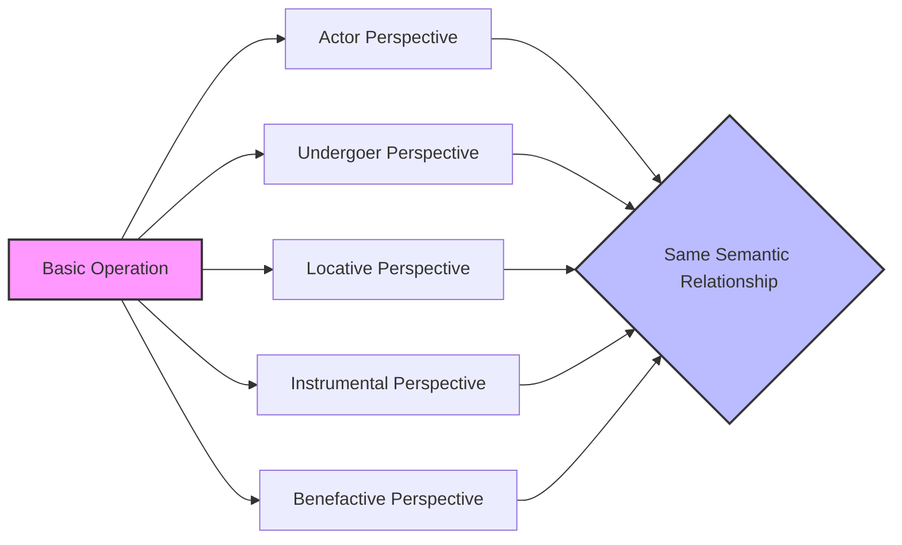

# Amis Case System and CEREBRUM Mapping

## Overview of Amis's Approach to Grammatical Relations

Amis (also known as Pangcah), a Formosan Austronesian language spoken in eastern Taiwan, employs a complex voice system with case-marking particles to express grammatical relationships. As one of the more widely spoken indigenous languages of Taiwan, Amis exemplifies the Philippine-type voice system where verbal morphology indicates which argument is in focus, while case markers indicate the semantic and syntactic roles of noun phrases. This combined marking system provides a robust model for CEREBRUM implementations, demonstrating how grammatical relationships can be systematically encoded through coordinated morphological operations and nominal markers.

In Amis, the focused argument (the "pivot") is marked with a specific nominative case marker, while non-focused arguments receive different markers based on their semantic roles and syntactic positions. The verbal voice morphology determines which semantic role is in focus, enabling the same underlying event to be viewed from different perspectives without altering its basic semantics. This flexible perspective system offers valuable insights for CEREBRUM implementations seeking to implement dynamic perspective shifting across model ecosystems.

## Functional Equivalents to Cases in Amis

Amis employs the following markers and structures to express relationships that would be handled by cases in other languages:

1. **Voice/Focus Affixes on Verbs** - Indicate which argument is in focus
   - **mi-/ma-** Actor Voice (AV): Focuses on the agent/actor
   - **ma-** Undergoer Voice (UV): Focuses on the patient/undergoer (sometimes called "Patient Voice")
   - **-an** Locative Voice (LV): Focuses on the location
   - **sa-** Instrumental Voice (IV): Focuses on the instrument or means
   - **pi-** Benefactive Voice (BV): Focuses on the beneficiary

2. **Case Markers** - Function like case markers for noun phrases
   - **ku/ci** - Nominative case markers for the focused argument (common/personal)
   - **nu/ni** - Genitive case markers for possessors and agents in non-actor voice (common/personal)
   - **tu/ci...tu** - Oblique case markers for non-focused, non-agent arguments (common/personal)

3. **Word Order** - Typically Verb-Subject-Object (VSO), but flexible based on discourse

4. **Person Marking** - Enclitic pronouns can attach to predicates to mark person and case

5. **Aspect Marking** - Verbal affixes also encode aspectual distinctions (e.g., perfective, progressive)

## Mapping to CEREBRUM Cases

Amis's voice system and case markers can be mapped to CEREBRUM's eight standard cases as follows:

| CEREBRUM Case | Amis Equivalent | Implementation Notes |
|---------------|------------------|----------------------|
| **[NOM]** Nominative | Focused argument (ku/ci) + Actor Voice verb (mi-/ma-) | Models in [NOM] should implement focus marking with actor voice verbal operation |
| **[ACC]** Accusative | Focused argument (ku/ci) + Undergoer Voice verb (ma-) | Models in [ACC] should implement focus marking with undergoer voice verbal operation |
| **[GEN]** Genitive | Non-focused agent in non-actor voice clauses (nu/ni) or possessive relation | Models in [GEN] should implement non-focused agent relation or possessive relation |
| **[DAT]** Dative | Focused argument (ku/ci) + Benefactive Voice verb (pi-) or oblique marking (tu/ci...tu) | Models in [DAT] should implement either focus or oblique marking based on prominence |
| **[INS]** Instrumental | Focused argument (ku/ci) + Instrumental Voice verb (sa-) or oblique marking (tu/ci...tu) | Models in [INS] should implement focus or oblique marking based on prominence |
| **[LOC]** Locative | Focused argument (ku/ci) + Locative Voice verb (-an) or oblique marking (tu/ci...tu) | Models in [LOC] should implement focus or oblique marking based on prominence |
| **[ABL]** Ablative | Oblique marking (tu/ci...tu) with appropriate directional verbs | Models in [ABL] should implement oblique marker with source semantics |
| **[VOC]** Vocative | Direct address, often with vocative marker "hey" | Models in [VOC] should implement direct address patterns |



## Unique Features

Amis's grammatical system offers several unique features relevant to CEREBRUM:

1. **Five-Voice System**
   
   Amis employs a rich five-voice system that allows fine-grained control over which participant receives syntactic prominence. This provides a model for CEREBRUM implementations where operations can dynamically reassign prominence to different participating models with specialized semantic roles.

   ```
   Mi-kaen ku kapah tu futing.
   AV-eat NOM youth OBL fish
   "The youth eats fish." (Actor in focus)
   
   Ma-kaen nu kapah ku futing.
   UV-eat GEN youth NOM fish
   "The youth eats the fish." (Patient in focus)
   ```

   Both sentences describe the same event but differ in which participant is syntactically prominent.

2. **Benefactive Voice**

   Amis has a dedicated benefactive voice (pi-) that brings beneficiaries into focus, distinct from other languages that might handle beneficiaries through the instrumental or circumstantial voice. This provides a model for CEREBRUM to implement specialized handling of beneficiary relationships.

   ```
   Pi-kaen ci Kacaw tu futing ku wawa.
   BV-eat NOM Kacaw OBL fish NOM child
   "Kacaw eats fish for the child." (Beneficiary in focus)
   ```

3. **Common/Personal Noun Distinction**

   Amis maintains a systematic distinction between common nouns and personal names in its case-marking system. This provides a model for CEREBRUM to implement entity-type distinctions in its relationship marking.

   ```
   Mi-nengneng ku kapah ci Kacaw.
   AV-see NOM youth NOM.P Kacaw
   "The youth sees Kacaw."
   
   Mi-nengneng ci Kacaw tu kapah.
   AV-see NOM.P Kacaw OBL youth
   "Kacaw sees a youth."
   ```

   Note the different case markers: `ci` for the personal name "Kacaw" and `ku` for the common noun "youth."

4. **Sequential Tense-Aspect System**

   Amis encodes complex temporal and aspectual distinctions through verbal affixation. This provides a model for CEREBRUM to implement sophisticated temporal relationships in its operations.

   ```
   Mi-kaen ku kapah. (Neutral/present)
   "The youth eats."
   
   Mi-kaen-ay ku kapah. (Progressive)
   "The youth is eating."
   
   Ma-kaen-ay ku kapah. (Perfective)
   "The youth has eaten."
   ```

## Extension Opportunities

Amis's voice and case system suggests several extension opportunities for CEREBRUM:

1. **Five-Perspective Operation Architecture**
   
   Inspired by Amis's five-voice system, CEREBRUM could implement a multi-perspective operation architecture where the same basic operation can be viewed from actor, undergoer, locative, instrumental, and benefactive perspectives without altering the underlying relationship.

2. **Beneficiary-Focused Processing**
   
   Based on Amis's dedicated benefactive voice, CEREBRUM could implement specialized beneficiary-focused processing where the model receiving the benefit of an operation becomes syntactically prominent.

3. **Entity Type-Sensitive Marking**
   
   Drawing from Amis's distinction between common and personal nouns, CEREBRUM could implement entity type-sensitive marking where relationship indicators adapt based on the nature of the related entities.

4. **Sequential Processing States**
   
   Inspired by Amis's tense-aspect system, CEREBRUM could implement sequential processing states where operations are explicitly marked for their temporal relationship to other operations in a workflow.

5. **Focus-Shifting Operations**
   
   Based on Amis's voice alternations, CEREBRUM could implement focus-shifting operations that dynamically reassign computational resources and processing priorities based on which model is currently in focus.



## Example Sentences

Below are example sentences in Amis with their CEREBRUM parallels:

1. **Actor Voice [NOM]**

   **Amis:** Mi-kaen ku kapah tu futing.
   AV-eat NOM youth OBL fish
   "The youth eats fish." (Actor in focus)
   
   **CEREBRUM:** Youth_Model[NOM:AV] performs eating operation on Fish_Model[OBL].

2. **Undergoer Voice [ACC]**

   **Amis:** Ma-kaen nu kapah ku futing.
   UV-eat GEN youth NOM fish
   "The youth eats the fish." (Patient in focus)
   
   **CEREBRUM:** Fish_Model[ACC:UV] undergoes eating operation by Youth_Model[GEN].

3. **Locative Voice [LOC]**

   **Amis:** Kaen-an nu kapah ku lumaq.
   eat-LV GEN youth NOM house
   "The youth eats at the house." (Location in focus)
   
   **CEREBRUM:** House_Model[LOC:LV] hosts eating operation with Youth_Model[GEN] as agent.

4. **Instrumental Voice [INS]**

   **Amis:** Sa-kaen nu kapah tu futing ku titi.
   IV-eat GEN youth OBL fish NOM chopsticks
   "The youth eats fish with the chopsticks." (Instrument in focus)
   
   **CEREBRUM:** Chopsticks_Model[INS:IV] facilitates eating operation performed by Youth_Model[GEN] on Fish_Model[OBL].

5. **Benefactive Voice [DAT]**

   **Amis:** Pi-kaen ci Kacaw tu futing ku wawa.
   BV-eat NOM.P Kacaw OBL fish NOM child
   "Kacaw eats fish for the child." (Beneficiary in focus)
   
   **CEREBRUM:** Child_Model[DAT:BV] benefits from eating operation performed by Kacaw_Model[OBL] on Fish_Model[OBL].

6. **Possession [GEN]**

   **Amis:** Ku lumaq nu kapah
   NOM house GEN youth
   "The youth's house"
   
   **CEREBRUM:** House_Model is possessed by Youth_Model[GEN].

7. **Directional [ABL]**

   **Amis:** Mi-tayra ku kapah tu lumaq.
   AV-come.from NOM youth OBL house
   "The youth comes from the house."
   
   **CEREBRUM:** Youth_Model[NOM:AV] moves with House_Model[ABL] as source.

8. **Sequential Aspect**

   **Amis:** Mi-kaen-ay ku kapah.
   AV-eat-PROG NOM youth
   "The youth is eating."
   
   **CEREBRUM:** Youth_Model[NOM:AV:PROG] performs eating operation with ongoing temporal status.

```mermaid
sequenceDiagram
    participant Operation as Eating Operation
    participant Actor as Youth Model
    participant Patient as Fish Model
    participant Location as House Model
    participant Instrument as Chopsticks Model
    participant Beneficiary as Child Model
    
    Note over Operation,Beneficiary: Different perspectives on same operation
    
    Actor->>Operation: Actor Voice (mi-kaen)
    Operation-->>Patient: Acts on (oblique)
    
    Operation->>Patient: Undergoer Voice (ma-kaen)
    Actor-->>Operation: Performs (genitive)
    
    Operation->>Location: Locative Voice (kaen-an)
    Actor-->>Operation: Performs (genitive)
    Patient-->>Operation: Involved (oblique)
    
    Operation->>Instrument: Instrumental Voice (sa-kaen)
    Actor-->>Operation: Performs (genitive)
    Patient-->>Operation: Involved (oblique)
    
    Operation->>Beneficiary: Benefactive Voice (pi-kaen)
    Actor-->>Operation: Performs (oblique)
    Patient-->>Operation: Involved (oblique)
```

## Implications for CEREBRUM Design

Amis's voice system offers valuable insights for CEREBRUM implementations:

1. **Multi-Perspective Model Architecture**
   
   CEREBRUM could implement a multi-perspective model architecture where operations can be viewed from five distinct participant perspectives (actor, undergoer, locative, instrumental, benefactive), enabling flexible framing of model relationships based on computational priorities.

2. **Entity-Type Sensitive Relationship Encoding**
   
   Inspired by Amis's distinction between common and personal noun markers, CEREBRUM could implement relationship encodings that adapt based on the nature of the entities involved, creating more nuanced interaction patterns for different entity types.

3. **Beneficiary-Centered Processing**
   
   Based on Amis's dedicated benefactive voice, CEREBRUM could implement beneficiary-centered processing frameworks where operations explicitly track and prioritize the beneficiary relationship, potentially enhancing value-aligned AI systems.

4. **Sequential State Tracking**
   
   Drawing from Amis's aspect system, CEREBRUM could implement sequential state tracking where operations explicitly encode their temporal relationships to other operations in a processing sequence.

These Amis-inspired approaches would be particularly valuable for CEREBRUM implementations requiring flexible perspective assignment, entity-type sensitivity, and sophisticated temporal tracking across model ecosystems. 