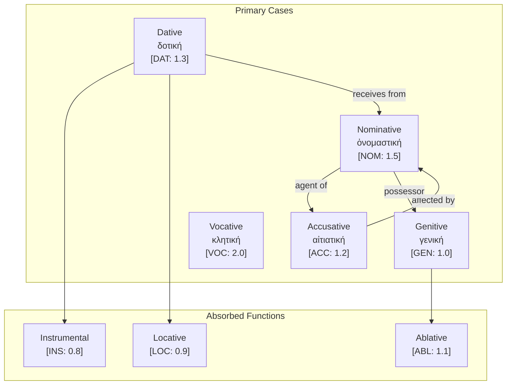

# Ancient Greek Case System and CEREBRUM Mapping

## Overview of Ancient Greek's Case System

Ancient Greek, as a classical Indo-European language, presents a case system of considerable historical and linguistic significance. With five main cases (nominative, genitive, dative, accusative, and vocative), Ancient Greek represents a balanced approach to case marking that served as a foundational model for linguistic descriptions across Western tradition. The language's systematic approach to morphological marking, alongside its rich philosophical heritage, makes it particularly relevant for CEREBRUM implementations seeking a historically grounded framework for model relationships.

Ancient Greek's case system is notable for its synthetic approach, where case markers combine with number (singular, dual, plural) and gender (masculine, feminine, neuter) in a unified inflectional system. The language employs a range of declension patterns across different noun classes, creating a morphologically rich yet structurally consistent system for expressing grammatical relationships. This historical model of linguistic organization provides valuable insights for computational implementations where systematic morphological patterns govern relationship encoding.

## Case Inventory in Ancient Greek

Ancient Greek utilizes the following case structure:

1. **Nominative Case (ὀνομαστική onomastikḗ)** - Used for subjects and predicate complements
   - Marked with various endings depending on declension class
   - Examples:
     - ἄνθρωπος (ánthrōpos) - "person" (masculine)
     - γλῶσσα (glôssa) - "tongue, language" (feminine)
     - δῶρον (dôron) - "gift" (neuter)

2. **Genitive Case (γενική genikḗ)** - Used for possession, source, and partitive relationships
   - Marked with various endings depending on declension class
   - Examples:
     - ἀνθρώπου (anthrṓpou) - "of a person"
     - γλώσσης (glṓssēs) - "of a tongue/language"
     - δώρου (dṓrou) - "of a gift"

3. **Dative Case (δοτική dotikḗ)** - Used for indirect objects, means, instrument, location, and time
   - Marked with various endings depending on declension class
   - Examples:
     - ἀνθρώπῳ (anthrṓpōi) - "to/for a person"
     - γλώσσῃ (glṓssēi) - "to/for/with a tongue/language"
     - δώρῳ (dṓrōi) - "to/for/with a gift"

4. **Accusative Case (αἰτιατική aitiatiḗ)** - Used for direct objects and extent of space or time
   - Marked with various endings depending on declension class
   - Examples:
     - ἄνθρωπον (ánthrōpon) - "person" (as object)
     - γλῶσσαν (glôssan) - "tongue/language" (as object)
     - δῶρον (dôron) - "gift" (as object)

5. **Vocative Case (κλητική klētikḗ)** - Used for direct address
   - Often similar to nominative, with some exceptions
   - Examples:
     - ἄνθρωπε (ánthrōpe) - "O person!"
     - γλῶσσα (glôssa) - "O tongue/language!" (same as nominative)
     - δῶρον (dôron) - "O gift!" (same as nominative)

Additionally, Ancient Greek preserves remnants of three other Indo-European cases:

1. **Locative Case** - Largely absorbed by the dative case, with some fossilized forms
   - Examples: οἴκοι (oíkoi) - "at home"

2. **Instrumental Case** - Absorbed by the dative case in standard Greek
   - Function preserved in dative of means/instrument

3. **Ablative Case** - Largely absorbed by the genitive case
   - Function preserved in genitive of separation/source

## Mapping to CEREBRUM Cases

Ancient Greek's case system maps to CEREBRUM's eight standard cases as follows:

| CEREBRUM Case | Ancient Greek Equivalent | Implementation Notes |
|---------------|------------------|----------------------|
| **[NOM]** Nominative | Nominative (ὀνομαστική) | Direct implementation; subject and predicate nominal function |
| **[ACC]** Accusative | Accusative (αἰτιατική) | Direct implementation; direct object and extent semantics |
| **[GEN]** Genitive | Genitive (γενική) | Models in [GEN] should implement various genitive functions including possession, source, and partitive relationships |
| **[DAT]** Dative | Dative (δοτική) | Models in [DAT] should implement multiple functions including recipient, means, and location |
| **[INS]** Instrumental | Dative of means (δοτική) | Models in [INS] should implement as specialized function of dative case |
| **[LOC]** Locative | Dative of place (δοτική) | Models in [LOC] should implement as specialized function of dative case |
| **[ABL]** Ablative | Genitive of separation (γενική) | Models in [ABL] should implement as specialized function of genitive case |
| **[VOC]** Vocative | Vocative (κλητική) | Direct implementation for address function |

## Unique Features

Ancient Greek's case system offers several unique features relevant to CEREBRUM:

1. **Multifunctional Dative Case**

   Ancient Greek's dative case serves multiple functions (recipient, instrument, location, time) that are distinguished by separate cases in some other languages. This provides a model for CEREBRUM implementations where a single case marker can have multiple interpretations based on semantic context.

   ```
   δίδωμι τῷ ἀνθρώπῳ τὸ βιβλίον. (dídōmi tôi anthrṓpōi tò biblíon)
   Give.1SG the.DAT person.DAT the.ACC book.ACC
   "I give the book to the person." (recipient)
   
   γράφω καλάμῳ. (gráphō kalámōi)
   Write.1SG reed.DAT
   "I write with a reed." (instrument)
   
   μένω Ἀθήνησι. (ménō Athḗnēsi)
   Stay.1SG Athens.DAT
   "I stay in Athens." (location)
   ```

2. **Case Syncretism Patterns**

   Ancient Greek displays systematic patterns of case syncretism where certain cases share forms in specific declension classes. This provides a model for CEREBRUM to implement economical marking systems where formal distinctions are neutralized in predictable contexts.

   ```
   In neuter nouns, nominative and accusative forms are always identical:
   δῶρον (dôron) - "gift" (both nominative and accusative)
   ```

3. **Preposition-Case Combinations**

   Ancient Greek prepositions govern specific cases, with the same preposition taking different cases to express different meanings. This provides a model for CEREBRUM to implement composite relationship markers where case functions are modified by prepositional specifiers.

   ```
   διὰ τὸν ἄνθρωπον (dià tòn ánthrōpon)
   Through the.ACC person.ACC
   "Because of the person" (accusative = cause)
   
   διὰ τοῦ ἀνθρώπου (dià toû anthrṓpou)
   Through the.GEN person.GEN
   "Through the person" (genitive = intermediate agency)
   ```

4. **Philosophical-Linguistic Legacy**

   The Ancient Greek case system, together with its philosophical terminology, established foundational concepts in Western linguistics. This historical grounding provides CEREBRUM with a connection to longstanding traditions of formal relationship categorization.

   ```
   πτῶσις ὀνομαστική (ptôsis onomastikḗ) - "naming case" → nominative
   πτῶσις γενική (ptôsis genikḗ) - "case of kind/origin" → genitive
   πτῶσις δοτική (ptôsis dotikḗ) - "giving case" → dative
   πτῶσις αἰτιατική (ptôsis aitiatiḗ) - "causing case" → accusative
   ```

## Extension Opportunities

Ancient Greek's case system suggests several extension opportunities for CEREBRUM:

1. **Semantic Microfeatures for Cases**

   Inspired by Ancient Greek's multifunctional dative, CEREBRUM could implement a system of semantic microfeatures for cases, where a single case marker can be further specified with semantic role indicators (e.g., [DAT:recipient], [DAT:instrument], [DAT:location]).

2. **Aspectual Case Functions**

   Based on Ancient Greek's use of the accusative for extent of time, CEREBRUM could implement aspectual case functions where temporal extent and boundedness are encoded through case marking (e.g., [ACC:duration], [GEN:within-time]).

3. **Preposition-Case Compounds**

   Drawing from Ancient Greek's preposition-case combinations, CEREBRUM could implement a comprehensive system of compound relationship markers where prepositions modify case meanings in systematic ways.

4. **Philosophical-Linguistic Foundations**

   Inspired by Ancient Greek's philosophical approach to linguistics, CEREBRUM could incorporate explicit ontological foundations for case relationships, connecting computational implementations to philosophical theories of relation types.

5. **Case Syncretism Management**

   Based on Ancient Greek's patterns of case syncretism, CEREBRUM could implement a formal theory of when case distinctions can be neutralized without information loss, potentially optimizing model relationship encoding.

## Example Sentences

Below are example sentences in Ancient Greek with their CEREBRUM parallels:

1. **Nominative [NOM]**

   **Ancient Greek:** ὁ ἄνθρωπος βαίνει. (ho ánthrōpos baínei)
   The.NOM person.NOM walk.3SG
   "The person walks."

   **CEREBRUM:** Person_Model[NOM] generates walking action.

2. **Accusative [ACC]**

   **Ancient Greek:** ὁρῶ τὸν ἄνθρωπον. (horô tòn ánthrōpon)
   See.1SG the.ACC person.ACC
   "I see the person."

   **CEREBRUM:** I_Model[NOM] perceives Person_Model[ACC] through visual channel.

3. **Genitive [GEN]**

   **Ancient Greek:** ὁ οἶκος τοῦ ἀνθρώπου μέγας ἐστίν. (ho oîkos toû anthrṓpou mégas estín)
   The.NOM house.NOM the.GEN person.GEN large.NOM is.3SG
   "The house of the person is large."

   **CEREBRUM:** House_Model derived from Person_Model[GEN] has large-scale property.

4. **Dative [DAT]** (Recipient function)

   **Ancient Greek:** δίδωμι τῷ ἀνθρώπῳ τὸ βιβλίον. (dídōmi tôi anthrṓpōi tò biblíon)
   Give.1SG the.DAT person.DAT the.ACC book.ACC
   "I give the book to the person."

   **CEREBRUM:** I_Model[NOM] transfers Book_Model[ACC] to Person_Model[DAT:recipient].

5. **Dative [INS]** (Instrumental function)

   **Ancient Greek:** γράφω καλάμῳ. (gráphō kalámōi)
   Write.1SG reed.DAT
   "I write with a reed."

   **CEREBRUM:** I_Model[NOM] utilizes Reed_Model[INS] to create text output.

6. **Dative [LOC]** (Locative function)

   **Ancient Greek:** ἐν τῇ ἀγορᾷ περιπατῶ. (en têi agorâi peripatô)
   In the.DAT marketplace.DAT walk-around.1SG
   "I walk around in the marketplace."

   **CEREBRUM:** I_Model[NOM] performs movement within Marketplace_Model[LOC] with containment specification.

7. **Genitive [ABL]** (Ablative function)

   **Ancient Greek:** ἀπὸ τῆς πόλεως ἔρχομαι. (apò tês póleōs érkhomai)
   From the.GEN city.GEN come.1SG
   "I come from the city."

   **CEREBRUM:** I_Model[NOM] originates from City_Model[ABL] with motion trajectory.

8. **Vocative [VOC]**

   **Ancient Greek:** ὦ ἄνθρωπε, ἄκουσον. (ô ánthrōpe, ákouson)
   O person.VOC listen.IMP.AOR
   "O person, listen."

   **CEREBRUM:** Direct invocation of Person_Model[VOC] with auditory attention request.

9. **Accusative of Extent** (Extension pattern)

   **Ancient Greek:** τρεῖς ἡμέρας μένω. (treîs hēméras ménō)
   Three.ACC days.ACC stay.1SG
   "I stay for three days."

   **CEREBRUM:** I_Model[NOM] performs dwelling operation with Duration_Model[ACC:temporal] spanning three days.

10. **Genitive of Partition** (Extension pattern)

    **Ancient Greek:** πίνω τοῦ οἴνου. (pínō toû oínou)
    Drink.1SG the.GEN wine.GEN
    "I drink (some) of the wine."

    **CEREBRUM:** I_Model[NOM] consumes partial quantity of Wine_Model[GEN:partitive].

These examples demonstrate how Ancient Greek's case system can be systematically mapped to CEREBRUM's case framework, providing historical templates for model relationships with philosophical grounding.

## Implications for CEREBRUM Design

Ancient Greek's approach to grammatical relationships offers valuable insights for CEREBRUM implementations:

1. **Systematic Multifunctionality**

   CEREBRUM could implement a systematically multifunctional case architecture inspired by Ancient Greek's dative case, where cases serve multiple related functions distinguished by semantic context rather than formal marking.

2. **Philosophically Grounded Relationship Taxonomy**

   Based on Ancient Greek's philosophical approach to linguistic categories, CEREBRUM could implement a relationship taxonomy with explicit philosophical foundations, connecting implementation details to broader theories of ontological relations.

3. **Economical Marking System**

   Inspired by Ancient Greek's patterns of case syncretism, CEREBRUM could implement an economical marking system where formal distinctions are neutralized in contexts where ambiguity can be resolved through other means.

These Ancient Greek-inspired approaches would be particularly valuable for CEREBRUM implementations seeking to ground their relationship architectures in historically significant linguistic and philosophical traditions.

## 6. Active Inference Implementation

### Case Precision and Belief States

```python
from enum import Enum
from dataclasses import dataclass, field
from typing import List, Dict, Optional, Tuple
import math

class GreekCase(Enum):
    """Ancient Greek case roles with precision modifiers for Active Inference."""
    NOM = ("Nominative", 1.5, "ὀνομαστική", "Subject/agent")
    ACC = ("Accusative", 1.2, "αἰτιατική", "Object/patient")
    DAT = ("Dative", 1.3, "δοτική", "Recipient/instrument/location")
    GEN = ("Genitive", 1.0, "γενική", "Possession/source/ablative")
    VOC = ("Vocative", 2.0, "κλητική", "Direct address")
    # Extended cases absorbed into others
    INS = ("Instrumental", 0.8, "δοτική", "Means - via dative")
    LOC = ("Locative", 0.9, "δοτική", "Location - via dative")
    ABL = ("Ablative", 1.1, "γενική", "Source - via genitive")
    
    def __init__(self, label: str, precision: float, greek: str, role: str):
        self.label = label
        self.precision = precision
        self.greek = greek
        self.role = role
    
    @property
    def valid_transitions(self) -> List['GreekCase']:
        transitions = {
            GreekCase.NOM: [GreekCase.ACC, GreekCase.GEN],
            GreekCase.ACC: [GreekCase.GEN, GreekCase.DAT],
            GreekCase.ABL: [GreekCase.NOM],
            GreekCase.LOC: [GreekCase.ABL],
        }
        return transitions.get(self, [])

@dataclass
class BeliefState:
    """Bayesian belief state for Active Inference."""
    mean: float
    precision: float
    
    @property
    def variance(self) -> float:
        return 1.0 / self.precision if self.precision > 0 else float('inf')
    
    def update(self, observation: float, obs_precision: float) -> 'BeliefState':
        """Bayesian belief update."""
        total_precision = self.precision + obs_precision
        new_mean = (self.precision * self.mean + obs_precision * observation) / total_precision
        return BeliefState(mean=new_mean, precision=total_precision)

@dataclass 
class GreekNoun:
    """Represents an Ancient Greek noun with case marking."""
    nominative: str  # Dictionary form
    stem: str
    case_role: GreekCase
    number: str = "singular"  # singular, dual, plural
    gender: str = "masculine"  # masculine, feminine, neuter
    precision: float = field(default=1.0)
    
    @property
    def effective_precision(self) -> float:
        return self.precision * self.case_role.precision

class GreekActiveInferenceAgent:
    """Active Inference agent for Greek sentence processing."""
    
    def __init__(self, initial_mean: float = 0.0):
        self.belief = BeliefState(mean=initial_mean, precision=1.0)
        self.sentence_elements: List[GreekNoun] = []
        self.case_history: List[Dict] = []
    
    def process_noun(self, noun: GreekNoun) -> None:
        """Process a noun and update beliefs with case-weighted precision."""
        effective_precision = noun.effective_precision
        self.belief = self.belief.update(
            observation=len(self.sentence_elements),
            obs_precision=effective_precision
        )
        self.sentence_elements.append(noun)
        self.case_history.append({
            'form': noun.nominative,
            'case': noun.case_role.name,
            'greek_case': noun.case_role.greek,
            'precision': effective_precision,
            'belief_mean': self.belief.mean
        })
    
    def free_energy(self, observation: float) -> float:
        """Calculate variational free energy."""
        pred_error = observation - self.belief.mean
        return (pred_error ** 2 * self.belief.precision) / 2.0
    
    def analyze_sentence(self, nouns: List[GreekNoun]) -> Dict:
        """Analyze a Greek sentence by case structure."""
        self.sentence_elements = []
        self.belief = BeliefState(mean=0.0, precision=1.0)
        
        for noun in nouns:
            self.process_noun(noun)
        
        return {
            'noun_count': len(self.sentence_elements),
            'case_distribution': self._case_distribution(),
            'final_belief': {'mean': self.belief.mean, 'precision': self.belief.precision}
        }
    
    def _case_distribution(self) -> Dict[str, int]:
        """Count nouns by case role."""
        dist = {}
        for n in self.sentence_elements:
            case_name = n.case_role.name
            dist[case_name] = dist.get(case_name, 0) + 1
        return dist

# Example usage
def demonstrate_greek_analysis():
    agent = GreekActiveInferenceAgent()
    
    # Sentence: ὁ ἄνθρωπος δίδωσι τῷ παιδὶ τὸ βιβλίον
    # "The person gives the book to the child"
    nouns = [
        GreekNoun("ἄνθρωπος", "ἀνθρωπ-", GreekCase.NOM, "singular", "masculine"),
        GreekNoun("παῖς", "παιδ-", GreekCase.DAT, "singular", "masculine"),
        GreekNoun("βιβλίον", "βιβλι-", GreekCase.ACC, "singular", "neuter"),
    ]
    
    result = agent.analyze_sentence(nouns)
    print(f"Greek Sentence Analysis: {result}")
    return result

if __name__ == "__main__":
    demonstrate_greek_analysis()
```

### Multifunctional Dative Processing

```python
class DativeFunctionResolver:
    """Resolve the function of Greek dative case based on context."""
    
    @staticmethod
    def resolve_function(noun: GreekNoun, verb_context: str) -> GreekCase:
        """
        Determine whether dative functions as DAT, INS, or LOC.
        
        Args:
            noun: The noun in dative case
            verb_context: Semantic context from the verb
            
        Returns:
            The specific case function (DAT, INS, or LOC)
        """
        instrumental_verbs = ["γράφω", "ποιέω", "κόπτω"]  # write, make, cut
        locative_verbs = ["μένω", "οἰκέω", "εἰμί"]  # stay, dwell, be
        
        if verb_context in instrumental_verbs:
            return GreekCase.INS
        elif verb_context in locative_verbs:
            return GreekCase.LOC
        else:
            return GreekCase.DAT
```

## 7. Mermaid Diagram: Greek Case Architecture



## 8. Case Syncretism Patterns

Ancient Greek's case syncretism provides models for efficient CEREBRUM encoding:

| Pattern | Cases Merged | Context | Precision Impact |
|---------|-------------|---------|------------------|
| Neuter NOM/ACC | Nominative = Accusative | Neuter nouns | Use context for disambiguation |
| Second Declension | GEN = ABL forms | -ου ending | GEN precision (1.0) for both |
| Dual forms | Limited case distinctions | Dual number | Reduced precision needed |

## 9. References

1. Smyth, H. W. (1920). Greek Grammar. Harvard University Press.
2. Goodwin, W. W. (1879). Syntax of the Moods and Tenses of the Greek Verb.
3. Friston, K. (2010). The free-energy principle. Nature Reviews Neuroscience.
4. Beekes, R. S. P. (2010). Etymological Dictionary of Greek.
5. Rijksbaron, A. (2002). The Syntax and Semantics of the Verb in Classical Greek.
