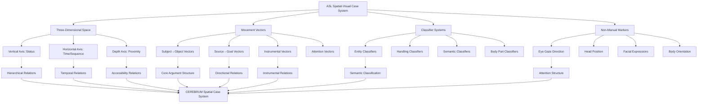

# American Sign Language (ASL) Case System and CEREBRUM Mapping

## Overview of ASL's Spatial-Visual Case Expression

American Sign Language (ASL) provides CEREBRUM with a revolutionary model of case relationship expression through spatial-visual modalities, offering insights fundamentally different from vocal-auditory languages. As a natural language expressed through visual-spatial channels, ASL demonstrates how case relationships can be encoded through three-dimensional space utilization, movement vectors, classifier constructions, and embodied reference systems that have no direct equivalent in spoken languages.

ASL's spatial case system offers unique opportunities for CEREBRUM implementations requiring spatial reasoning, three-dimensional relationship modeling, and embodied cognition integration. The language's use of signing space as a grammatical resource provides unprecedented insights into how spatial relationships can systematically encode argument structure, temporal sequencing, and discourse reference in ways that transcend traditional morphological or analytical case marking.

## Visual-Spatial Modality Characteristics

### Fundamental Modality Differences

ASL operates through fundamentally different channels than spoken languages:

**Production Modality:**
- Hand configuration (handshape)
- Hand orientation (palm direction, finger direction)
- Location in signing space
- Movement patterns (path, manner, direction)
- Non-manual markers (facial expressions, head position, eye gaze)

**Reception Modality:**
- Visual processing of spatial relationships
- Temporal tracking of movement patterns
- Integration of simultaneous information streams
- Three-dimensional spatial mapping

### Signing Space as Grammatical System

ASL uses three-dimensional signing space systematically for grammatical functions:

#### Spatial Reference System
```
Referent1 [established left side of space]
Referent2 [established right side of space]
Referent3 [established center-high space]
```

#### Spatial Case Marking
```
Subject location → Object location = transitive relationship
Source location → Goal location = directional relationship
Agent space → Patient space = causal relationship
```

## Spatial Case System Components

### Three-Dimensional Case Space

ASL employs systematic spatial positions to encode case relationships:

#### Vertical Axis (Status/Authority)
```
Upper space: Authority figures, formal discourse, abstract concepts
Middle space: Neutral participants, normal discourse
Lower space: Children, informal address, concrete objects
```

#### Horizontal Axis (Temporal/Discourse Sequence)
```
Left space: Past events, first mentioned referents
Center space: Present events, currently discussed referents  
Right space: Future events, subsequently mentioned referents
```

#### Depth Axis (Proximity/Accessibility)
```
Near space: Immediate participants, accessible referents
Mid space: General discourse participants
Far space: Distant/abstract referents, reported speech
```

### Movement Vectors for Case Relationships

ASL encodes case relationships through directional movement between spatial locations:

#### Subject-to-Object Vectors [NOM→ACC]
```
GIVE: Hand moves from subject space to object space
SEE: Eye gaze direction from subject toward object
HELP: Hands move from agent space toward patient space
```

#### Source-to-Goal Vectors [ABL→DAT]
```
GO: Movement from source location to destination location
SEND: Object handed from source space to goal space
MOVE: Displacement from origin point to target point
```

#### Instrumental Vectors [INS]
```
USE: Tool movement coordinated with action space
WITH: Parallel movement indicating accompaniment
BY-MEANS-OF: Sequential instrument-then-action movement
```

## Classifier System for Case Expression

ASL employs extensive classifier constructions that interact systematically with spatial case assignment:

### Entity Classifiers (CL)

#### Whole Entity Classifiers
```
CL:1 (index finger) - people, thin vertical objects
CL:3 (thumb-pinkie) - vehicles, large objects
CL:4 (four fingers) - groups of people, parallel objects
CL:5 (flat hand) - flat surfaces, sheets of paper
CL:B (flat hand, palm down) - vehicles, flat surfaces
CL:C (C-hand) - cups, containers, round objects
```

#### Body Part Classifiers
```
CL:legs - representing leg movement/position
CL:head - representing head position/movement  
CL:eyes - representing visual attention/gaze
```

### Handling Classifiers (HNDL)

```
HNDL:pen - grasping and manipulating writing implements
HNDL:cup - holding cup-shaped objects
HNDL:steering-wheel - manipulating vehicle controls
HNDL:book - handling book-shaped objects
```

### Semantic Classifiers (SCL)

```
SCL:spread-of-liquid - spilling/flowing patterns
SCL:growth-of-plant - organic growth patterns
SCL:vehicle-movement - transportation patterns
SCL:crowd-behavior - group movement patterns
```

## Mapping ASL Spatial System to CEREBRUM Cases

ASL's spatial-visual system provides unique mappings to CEREBRUM cases through spatial relationships and movement patterns:

| CEREBRUM Case | ASL Spatial Equivalent | Implementation Notes |
|---------------|------------------------|----------------------|
| **[NOM]** Nominative | Agent space position + subject agreement | Models in [NOM] should implement spatial agent positioning and directional verb agreement |
| **[ACC]** Accusative | Patient space position + object directionality | Models in [ACC] should implement spatial patient positioning and receiving movement vectors |
| **[GEN]** Genitive | Possessive spatial proximity + body-anchored possession | Models in [GEN] should implement spatial proximity and possessive incorporation |
| **[DAT]** Dative | Goal space position + directional movement | Models in [DAT] should implement goal positioning and beneficiary directionality |
| **[INS]** Instrumental | Tool space coordination + handling classifiers | Models in [INS] should implement tool manipulation and instrumental classifier usage |
| **[LOC]** Locative | Static spatial positioning + locative classifiers | Models in [LOC] should implement static spatial relationships and place classifiers |
| **[ABL]** Ablative | Source space position + movement origins | Models in [ABL] should implement source positioning and originating movement vectors |
| **[VOC]** Vocative | Direct spatial attention + eye gaze direction | Models in [VOC] should implement attention direction and gaze-based address |



## Unique ASL Spatial Constructions

### Directional Verb Agreement

ASL verbs systematically agree with spatial locations of arguments:

#### Person Agreement Verbs
```
ASK: Movement from questioner space toward askee space
GIVE: Transfer from giver location to receiver location
TELL: Information flow from teller space to hearer space
SHOW: Display oriented from shower toward viewer space
```

#### Spatial Agreement with Classifiers
```
CL:vehicle MOVE-TO: Vehicle classifier moves from source to destination
CL:person WALK-TO: Person classifier moves along path to goal
CL:object PLACE-AT: Object classifier positioned at specific location
```

### Topographic Space Usage

ASL can use space topographically to represent physical relationships:

#### Real-Space Mapping
```
Describing room layout:
BED [positioned right]
DESK [positioned left]  
DOOR [positioned center-back]
WINDOW [positioned front]

Movement through space corresponds to actual physical movement
```

#### Metaphorical Space Mapping
```
Timeline representation:
PAST [signed toward back/left]
PRESENT [signed at body/center]
FUTURE [signed toward front/right]
```

### Role Shift and Perspective

ASL employs body shift to indicate perspective changes that affect case relationships:

#### Direct Role Shift
```
Signer physically shifts to embody different participants:
[Shift left] "I want to go"
[Shift right] "No, you can't"
[Return center] "That's what he said to her"
```

#### Perspective Shift in Classifiers
```
CL:vehicle movements shown from:
- Bird's eye view (overhead perspective)
- Driver's perspective (first person)
- Observer's perspective (third person)
```

### Simultaneous Constructions

ASL allows simultaneous expression of multiple case relationships:

#### Two-Handed Constructions
```
Dominant hand: Agent action
Non-dominant hand: Patient state/position
Both hands coordinated to show agent-patient relationship
```

#### Multi-layered Expression
```
Hands: Express primary predicate relationship
Face: Express evaluative/modal information
Body: Express referential/locative information
Eyes: Express attention/discourse structure
```

## Computational Implementation for CEREBRUM

### 1. Spatial Case Assignment System

```python
class ASLSpatialCaseSystem:
    def __init__(self):
        self.signing_space = {
            'x_axis': {'left': -1, 'center': 0, 'right': 1},
            'y_axis': {'low': -1, 'middle': 0, 'high': 1},
            'z_axis': {'near': -1, 'mid': 0, 'far': 1}
        }
        
        self.spatial_case_mappings = {
            'agent_position': Case.NOM,
            'patient_position': Case.ACC,
            'goal_position': Case.DAT,
            'source_position': Case.ABL,
            'location_position': Case.LOC,
            'instrument_position': Case.INS,
            'attention_target': Case.VOC
        }
        
        self.movement_vectors = {
            'agent_to_patient': self._assign_transitive_cases,
            'source_to_goal': self._assign_directional_cases,
            'instrument_coordination': self._assign_instrumental_cases,
            'attention_direction': self._assign_vocative_cases
        }
    
    def assign_spatial_case(self, referent, spatial_position, movement_pattern, discourse_context):
        # Determine case based on spatial position
        position_case = self._analyze_spatial_position(spatial_position)
        
        # Refine case based on movement pattern
        movement_case = self._analyze_movement_pattern(movement_pattern, discourse_context)
        
        # Integrate spatial and movement information
        final_case = self._integrate_spatial_movement_cases(position_case, movement_case)
        
        return {
            'case': final_case,
            'spatial_position': spatial_position,
            'movement_pattern': movement_pattern,
            'spatial_encoding': 'three_dimensional'
        }
    
    def _analyze_spatial_position(self, position):
        x, y, z = position['x'], position['y'], position['z']
        
        # Agent positions (typically central-high)
        if y >= 0 and z <= 0:
            return Case.NOM
        
        # Patient positions (typically receive movement)
        if self._receives_movement(position):
            return Case.ACC
        
        # Goal positions (typically right/future space)
        if x > 0:
            return Case.DAT
        
        # Source positions (typically left/past space)
        if x < 0:
            return Case.ABL
        
        # Default to locative for static positions
        return Case.LOC
    
    def _analyze_movement_pattern(self, movement, context):
        if movement.get('type') == 'directional':
            source = movement['source']
            goal = movement['goal']
            
            if context.get('predicate_type') == 'transfer':
                return {'source_case': Case.ABL, 'goal_case': Case.DAT}
            elif context.get('predicate_type') == 'motion':
                return {'source_case': Case.ABL, 'goal_case': Case.DAT}
        
        elif movement.get('type') == 'instrumental':
            return {'instrument_case': Case.INS}
        
        return {}
```

### 2. Classifier Integration System

```python
class ASLClassifierCaseIntegration:
    def __init__(self):
        self.classifier_types = {
            'entity_classifiers': {
                'CL:1': {'semantic_type': 'person', 'shape': 'vertical_thin'},
                'CL:3': {'semantic_type': 'vehicle', 'shape': 'large_object'},
                'CL:4': {'semantic_type': 'group', 'shape': 'multiple_parallel'},
                'CL:5': {'semantic_type': 'flat_surface', 'shape': 'flat'},
                'CL:B': {'semantic_type': 'vehicle_flat', 'shape': 'flat_mobile'},
                'CL:C': {'semantic_type': 'container', 'shape': 'cylindrical'}
            },
            
            'handling_classifiers': {
                'HNDL:pen': {'manipulation': 'precision_grip', 'object_type': 'writing_tool'},
                'HNDL:cup': {'manipulation': 'container_grip', 'object_type': 'drinking_vessel'},
                'HNDL:book': {'manipulation': 'flat_object_grip', 'object_type': 'reading_material'},
                'HNDL:tool': {'manipulation': 'tool_grip', 'object_type': 'instrument'}
            },
            
            'semantic_classifiers': {
                'SCL:liquid_flow': {'semantic_field': 'fluid_dynamics', 'pattern': 'flowing'},
                'SCL:growth': {'semantic_field': 'organic_development', 'pattern': 'expanding'},
                'SCL:crowd': {'semantic_field': 'group_behavior', 'pattern': 'collective_motion'}
            }
        }
    
    def integrate_classifier_with_case(self, classifier, spatial_case_assignment, movement_context):
        classifier_info = self._get_classifier_properties(classifier)
        
        # Modify case assignment based on classifier type
        if classifier in self.classifier_types['handling_classifiers']:
            # Handling classifiers typically indicate instrumental relationships
            modified_case = self._apply_instrumental_modification(spatial_case_assignment, classifier_info)
        
        elif classifier in self.classifier_types['entity_classifiers']:
            # Entity classifiers affect how spatial cases are interpreted
            modified_case = self._apply_entity_modification(spatial_case_assignment, classifier_info)
        
        elif classifier in self.classifier_types['semantic_classifiers']:
            # Semantic classifiers add aspectual/manner information to case
            modified_case = self._apply_semantic_modification(spatial_case_assignment, classifier_info)
        
        else:
            modified_case = spatial_case_assignment
        
        return {
            'base_case': spatial_case_assignment,
            'classifier': classifier,
            'classifier_properties': classifier_info,
            'integrated_case': modified_case
        }
    
    def _apply_instrumental_modification(self, base_case, classifier_info):
        # Handling classifiers typically indicate instrumental use
        if base_case.get('case') == Case.ACC:
            # Object being handled becomes instrumental
            return {
                'case': Case.INS,
                'manipulation_type': classifier_info['manipulation'],
                'instrumental_function': 'tool_use'
            }
        return base_case
```

### 3. Movement Vector Analysis

```python
class ASLMovementVectorAnalyzer:
    def __init__(self):
        self.vector_types = {
            'linear_transfer': self._analyze_linear_transfer,
            'circular_incorporation': self._analyze_circular_incorporation,
            'vertical_status': self._analyze_vertical_status,
            'attention_vector': self._analyze_attention_vector
        }
    
    def analyze_movement_vector(self, start_position, end_position, movement_quality, predicate_context):
        vector_type = self._classify_vector_type(start_position, end_position, movement_quality)
        
        if vector_type in self.vector_types:
            case_implications = self.vector_types[vector_type](start_position, end_position, predicate_context)
        else:
            case_implications = self._default_vector_analysis(start_position, end_position)
        
        return {
            'vector_type': vector_type,
            'source_position': start_position,
            'goal_position': end_position,
            'case_implications': case_implications,
            'movement_quality': movement_quality
        }
    
    def _analyze_linear_transfer(self, start, end, context):
        # Linear movement typically indicates transfer relationships
        return {
            'source_case': Case.ABL,
            'goal_case': Case.DAT,
            'transferred_object_case': Case.ACC,
            'relationship_type': 'transfer'
        }
    
    def _analyze_attention_vector(self, start, end, context):
        # Attention vectors (eye gaze, pointing) indicate vocative/address
        return {
            'attention_source_case': Case.NOM,
            'attention_target_case': Case.VOC,
            'relationship_type': 'attention_direction'
        }
```

### 4. Non-Manual Marker Integration

```python
class ASLNonManualMarkerIntegration:
    def __init__(self):
        self.non_manual_markers = {
            'eye_gaze': self._process_eye_gaze,
            'head_position': self._process_head_position,
            'facial_expression': self._process_facial_expression,
            'body_orientation': self._process_body_orientation
        }
    
    def integrate_non_manual_markers(self, manual_case_assignment, non_manual_markers):
        integrated_assignment = dict(manual_case_assignment)
        
        for marker_type, marker_value in non_manual_markers.items():
            if marker_type in self.non_manual_markers:
                case_modification = self.non_manual_markers[marker_type](marker_value, integrated_assignment)
                integrated_assignment = self._merge_case_modifications(integrated_assignment, case_modification)
        
        return integrated_assignment
    
    def _process_eye_gaze(self, gaze_direction, current_cases):
        # Eye gaze typically indicates attention/address relationships
        if gaze_direction.get('target_space'):
            return {
                'attention_target': Case.VOC,
                'gaze_vector': gaze_direction,
                'discourse_function': 'addressee_identification'
            }
        return {}
    
    def _process_body_orientation(self, orientation, current_cases):
        # Body orientation can indicate perspective and participant roles
        if orientation.get('shifted_perspective'):
            return {
                'perspective_modification': True,
                'embodied_participant': orientation['shifted_perspective'],
                'case_perspective': 'first_person_embodied'
            }
        return {}
```

## Example Constructions with Spatial Analysis

### 1. Basic Subject-Object Relationship [NOM-ACC]

**ASL:** WOMAN SEE MAN

**Spatial Analysis:**
- WOMAN: Established left side of signing space [NOM]
- SEE: Eye gaze/pointing from woman's space toward man's space
- MAN: Established right side of signing space [ACC]

**CEREBRUM:** Woman_Model[NOM:left_space] performs seeing_operation directed toward Man_Model[ACC:right_space].

### 2. Directional Transfer [NOM-ACC-DAT]

**ASL:** MOTHER GIVE BOOK CHILD

**Spatial Analysis:**
- MOTHER: Agent position center-high space [NOM]
- GIVE: Movement from mother's space toward child's space
- BOOK: Object transferred through space [ACC]
- CHILD: Goal position lower-right space [DAT]

**CEREBRUM:** Mother_Model[NOM:center_high] performs giving_operation transferring Book_Model[ACC:mobile] to Child_Model[DAT:lower_right].

### 3. Locative Relationship with Classifiers [LOC]

**ASL:** CL:cup ON-TABLE

**Spatial Analysis:**
- CL:cup: Container classifier positioned above flat surface
- ON: Spatial relationship maintained between classifier and table space
- TABLE: Flat surface represented in lower signing space [LOC]

**CEREBRUM:** Cup_Model[NOM:container_classifier] maintains spatial_relationship on Table_Model[LOC:flat_surface].

### 4. Instrumental with Handling Classifier [INS]

**ASL:** PERSON USE HNDL:hammer NAIL

**Spatial Analysis:**
- PERSON: Agent in central space [NOM]
- USE: Coordination between agent and tool
- HNDL:hammer: Handling classifier for tool manipulation [INS]
- NAIL: Target object positioned in workspace [ACC]

**CEREBRUM:** Person_Model[NOM:central] performs using_operation with Hammer_Model[INS:handling_classifier] on Nail_Model[ACC:target].

### 5. Source-Goal Movement [ABL-DAT]

**ASL:** CL:person WALK-FROM house TO school

**Spatial Analysis:**
- CL:person: Person classifier moving through space [NOM]
- WALK-FROM: Movement vector originating from house location [ABL]
- house: Source location left-back space [ABL]
- TO: Movement vector terminating at school location
- school: Goal location right-front space [DAT]

**CEREBRUM:** Person_Model[NOM:mobile_classifier] performs walking_operation from House_Model[ABL:left_back] to School_Model[DAT:right_front].

### 6. Attention/Vocative Direction [VOC]

**ASL:** [eye gaze + point] YOU COME-HERE

**Spatial Analysis:**
- Eye gaze directed toward addressee space
- Point gesture toward addressee [VOC]
- YOU: Second person addressee in targeted space
- COME-HERE: Movement vector from addressee space to signer space

**CEREBRUM:** Direct_attention_operation toward You_Model[VOC:targeted_space] requesting coming_operation to Signer_Model[DAT:center].

### 7. Role Shift Perspective [NOM-embodied]

**ASL:** [shift left] "I HAPPY" [shift right] "YOU WRONG" [return center] SAY++

**Spatial Analysis:**
- [shift left]: Signer embodies first participant [NOM:embodied]
- [shift right]: Signer embodies second participant [NOM:embodied]
- [return center]: Signer returns to narrator perspective
- SAY++: Reported speech construction

**CEREBRUM:** Participant1_Model[NOM:embodied_left] expresses happiness, Participant2_Model[NOM:embodied_right] expresses disagreement, within reported_speech_operation.

### 8. Simultaneous Multi-layered Construction

**ASL:** [Dom: CL:vehicle DRIVE] + [Non-dom: CL:building PASS-BY] + [Face: enjoyment] + [Gaze: attention-to-scenery]

**Spatial Analysis:**
- Dominant hand: Vehicle classifier moving through space [NOM:mobile]
- Non-dominant hand: Building classifiers positioned as landmarks [LOC:static]
- Facial expression: Enjoyment/evaluation of experience
- Eye gaze: Attention directed toward passing scenery

**CEREBRUM:** Driver_Model[NOM:mobile_vehicle] performs driving_operation past Building_Models[LOC:landmarks] with enjoyment_evaluation and attention_to_scenery.

## Extension Opportunities for CEREBRUM

### 1. Three-Dimensional Spatial Case System

Based on ASL's spatial system, CEREBRUM could implement full 3D spatial case assignment:

```python
class ThreeDimensionalSpatialCases:
    def assign_spatial_case(self, model, position_3d, movement_vector_3d, discourse_context):
        x, y, z = position_3d
        
        spatial_case = {
            'base_case': self._determine_base_case_from_position(x, y, z),
            'spatial_coordinates': position_3d,
            'movement_vector': movement_vector_3d,
            'spatial_relationships': self._calculate_spatial_relationships(position_3d, discourse_context)
        }
        
        return spatial_case
```

### 2. Classifier-Enhanced Semantic Cases

ASL classifiers could inspire enhanced semantic case marking in CEREBRUM:

```python
class ClassifierEnhancedCases:
    def assign_classifier_case(self, model, base_case, semantic_classifier, manipulation_pattern):
        return {
            'syntactic_case': base_case,
            'semantic_classifier': semantic_classifier,
            'manipulation_properties': manipulation_pattern,
            'integrated_case_semantics': self._integrate_classifier_semantics(base_case, semantic_classifier)
        }
```

### 3. Embodied Perspective Case System

ASL role shift could inspire embodied perspective case assignment:

```python
class EmbodiedPerspectiveCases:
    def assign_embodied_case(self, model, base_case, perspective_shift, embodiment_context):
        if perspective_shift:
            return {
                'base_case': base_case,
                'embodied_perspective': perspective_shift,
                'first_person_embodiment': True,
                'perspective_case_modification': self._apply_embodied_modifications(base_case, embodiment_context)
            }
        return base_case
```

### 4. Simultaneous Multi-Channel Case Assignment

Based on ASL's simultaneous expression capabilities:

```python
class SimultaneousMultiChannelCases:
    def assign_simultaneous_cases(self, models, channel_assignments, integration_constraints):
        simultaneous_cases = {}
        
        for channel, channel_models in channel_assignments.items():
            channel_cases = self._assign_channel_specific_cases(channel_models, channel)
            simultaneous_cases[channel] = channel_cases
        
        # Integrate across channels with constraint resolution
        integrated_cases = self._integrate_multi_channel_cases(simultaneous_cases, integration_constraints)
        
        return integrated_cases
```

These ASL-inspired approaches would be particularly valuable for CEREBRUM implementations requiring spatial reasoning, embodied cognition, multi-modal information integration, and three-dimensional relationship modeling.

## Implications for CEREBRUM Design

American Sign Language provides revolutionary insights for CEREBRUM implementations emphasizing spatial-visual processing and embodied cognition:

1. **Spatial Case Encoding**: ASL demonstrates how three-dimensional space can systematically encode case relationships, suggesting CEREBRUM could implement spatial case systems for applications requiring spatial reasoning.

2. **Multi-Modal Integration**: The simultaneous use of multiple articulators (hands, face, body, gaze) suggests CEREBRUM could integrate multiple information channels in case assignment.

3. **Embodied Perspective**: ASL role shift provides models for perspective-sensitive case assignment where the system can embody different participant viewpoints.

4. **Classifier Integration**: The systematic integration of semantic classifiers with spatial case marking suggests sophisticated semantic-syntactic integration possibilities for CEREBRUM.

5. **Movement Vector Encoding**: The use of movement to encode case relationships suggests CEREBRUM could implement dynamic, process-oriented case systems that capture relational changes over time.

## References

1. Klima, E. S., & Bellugi, U. (1979). *The Signs of Language*. Harvard University Press.

2. Sandler, W., & Lillo-Martin, D. (2006). *Sign Language and Linguistic Universals*. Cambridge University Press.

3. Supalla, T. (1986). *The Classifier System in American Sign Language*. In C. Craig (Ed.), *Noun Classes and Categorization* (pp. 181-214). John Benjamins.

4. Liddell, S. K. (2003). *Grammar, Gesture, and Meaning in American Sign Language*. Cambridge University Press.

5. Emmorey, K. (2002). *Language, Cognition, and the Brain: Insights from Sign Language Research*. Lawrence Erlbaum Associates.

6. Meier, R. P., Cormier, K., & Quinto-Pozos, D. (Eds.). (2002). *Modality and Structure in Signed and Spoken Languages*. Cambridge University Press.

7. Mathur, G., & Rathmann, C. (2012). *Verb Agreement*. In R. Pfau, M. Steinbach, & B. Woll (Eds.), *Sign Language: An International Handbook* (pp. 136-157). De Gruyter Mouton.

8. Pyers, J. E., & Senghas, A. (2009). *Language Promotes False-Belief Understanding: Evidence from Learners of a New Sign Language*. *Psychological Science*, 20(7), 805-812. 