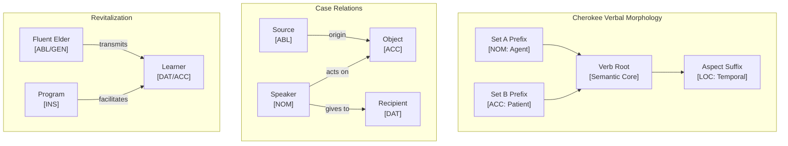

# Cherokee (ᏣᎳᎩ ᎦᏬᏂᎯᏍᏗ) Language and CEREBRUM Case Mapping

Cherokee is a polysynthetic Southern Iroquoian language spoken primarily in Oklahoma and North Carolina by the Cherokee people. It features a unique syllabary writing system developed by Sequoyah and a complex verbal morphology that encodes grammatical relationships.

## 1. Overview of Cherokee Grammar

Cherokee linguistic characteristics relevant to case relationships:

- **Polysynthetic Structure**: Single words can express complete sentences with complex internal morphology
- **Pronominal Prefixes**: Subject and object relationships encoded through verb prefixes
- **Aspect-Prominent**: Focus on whether actions are completed vs. ongoing
- **No Grammatical Gender**: Animate/inanimate distinctions instead
- **Syllabary Script**: 85-character writing system representing syllables
- **Endangered Status**: ~2,000 fluent speakers, intensive revitalization efforts

## 2. Cherokee Pronominal System and Case Relationships

Cherokee uses bound pronominal prefixes instead of separate case marking:

| Cherokee Element | Function | CEREBRUM Mapping | Precision |
|-----------------|----------|------------------|-----------|
| **Set A prefixes** | Subject of transitive verb | **NOM** (agent) | 1.5 |
| **Set B prefixes** | Object of transitive | **ACC** (patient) | 1.2 |
| **Dative construction** | Recipient marker | **DAT** | 1.3 |
| **Possessive prefix** | Indicates possession | **GEN** | 1.0 |
| **Instrumental suffix** | Means/tool marker | **INS** | 0.8 |
| **Ablative construction** | Source/origin | **ABL** | 1.1 |
| **Locative suffix** | Location/context | **LOC** | 0.9 |
| **Vocative particle** | Direct address | **VOC** | 2.0 |

### Set A Pronominal Prefixes (Nominative/Agent)

```
ᏥᏍᎦ (jisga) - I eat
ᎯᏍᎦ (hisga) - You (singular) eat
ᎠᏍᎦ (asga) - He/she eats
ᎣᏥᏍᎦ (ojisga) - We (exclusive) eat
ᎢᏗᏍᎦ (idisga) - We (inclusive) eat
ᎢᏥᏍᎦ (ijisga) - You (plural) eat
ᎠᏂᏍᎦ (anisga) - They eat
```

The Set A prefix marks the **Nominative** agent performing the action.

### Set B Pronominal Prefixes (Accusative/Patient)

```
ᎠᎩᏂᏏᏍᎦ (aginisisga) - He/she eats me
ᏣᏂᏏᏍᎦ (tsanisisga) - He/she eats you
ᎤᏂᏏᏍᎦ (unisisga) - He/she eats him/her
```

Set B marks the **Accusative** patient receiving the action.

## 3. Cherokee Verbal Morphology and Case Expression

### Polysynthetic Word Structure

```
ᎠᏆᏚᎵᏍᏗᏍᎬᎢ
(agwadulistisgvi)
a-gwa-duli-stisgv-i
1SG.A-cause-want-PROGRESSIVE-PRESENT
"I am causing (someone) to want (something)"

Morpheme breakdown:
- a-: 1st person agent (NOM)
- -gwa-: causative (INS - means of action)
- -duli-: "want" root (ACC - desired object implied)
- -stisgv-: progressive aspect (LOC - temporal context)
- -i: present tense
```

### Dative Construction

Cherokee expresses dative relationships through verb stems and special prefixes:

```
ᎯᏍᏗᏍᎪᎢ (hisdisgoî)
"I am giving it to you"
- Giver: NOM (agent prefix)
- Thing given: ACC (incorporated)
- Recipient: DAT (expressed through verb form)
```

## 4. Cherokee Case Mapping Table

| CEREBRUM Case | Cherokee Expression | Example | Gloss |
|---------------|-------------------|---------|-------|
| **NOM** | Set A prefix | ᏥᏬᏂᎭ (jiwoniha) | "I speak" |
| **ACC** | Set B prefix | ᎠᏆᏓᏅᏖᏍᎨᏍᏗ | "He saw me" |
| **DAT** | Dative verb form | ᎠᏆᏓᎾᎸᎢ | "He gave it to me" |
| **GEN** | Possessive prefix | ᎠᎩᏟ (agitli) | "My dog" |
| **INS** | Instrumental suffix | ᏗᎦᎸᏙᏗ | "Writing instrument" |
| **ABL** | Ablative construction | ᎤᏓᎷᎩ | "From the mountain" |
| **LOC** | Locative suffix | ᎦᏚᎲᎢ | "At the house" |
| **VOC** | Vocative particle | ᎥᎳ! (vla!) | "Hey!" |

## 5. Active Inference Implementation

```python
from enum import Enum
from dataclasses import dataclass, field
from typing import List, Dict, Optional, Tuple
import math

class CherokeeCase(Enum):
    """Cherokee-inspired case roles with precision modifiers."""
    NOM = ("Nominative", 1.5, "Set A prefix - agent")
    ACC = ("Accusative", 1.2, "Set B prefix - patient")
    DAT = ("Dative", 1.3, "Recipient marker")
    GEN = ("Genitive", 1.0, "Possessive prefix")
    INS = ("Instrumental", 0.8, "Means suffix")
    ABL = ("Ablative", 1.1, "Source marker")
    LOC = ("Locative", 0.9, "Location suffix")
    VOC = ("Vocative", 2.0, "Direct address")
    
    def __init__(self, label: str, precision: float, cherokee_form: str):
        self.label = label
        self.precision = precision
        self.cherokee_form = cherokee_form
    
    @property
    def valid_transitions(self) -> List['CherokeeCase']:
        transitions = {
            CherokeeCase.NOM: [CherokeeCase.ACC, CherokeeCase.GEN],
            CherokeeCase.ACC: [CherokeeCase.GEN, CherokeeCase.DAT],
            CherokeeCase.ABL: [CherokeeCase.NOM],
            CherokeeCase.LOC: [CherokeeCase.ABL],
        }
        return transitions.get(self, [])

@dataclass
class CherokeeMorpheme:
    """Represents a morpheme with case role and syllabary."""
    form: str  # Cherokee syllabary
    romanization: str
    case_role: CherokeeCase
    meaning: str
    precision: float = field(default=1.0)
    
    @property
    def effective_precision(self) -> float:
        return self.precision * self.case_role.precision

@dataclass
class BeliefState:
    """Bayesian belief state for Active Inference."""
    mean: float
    precision: float
    
    @property
    def variance(self) -> float:
        return 1.0 / self.precision if self.precision > 0 else float('inf')
    
    def update(self, observation: float, obs_precision: float) -> 'BeliefState':
        total_precision = self.precision + obs_precision
        new_mean = (self.precision * self.mean + obs_precision * observation) / total_precision
        return BeliefState(mean=new_mean, precision=total_precision)

class CherokeeCaseAgent:
    """Active Inference agent for Cherokee morphological analysis."""
    
    def __init__(self, initial_mean: float = 0.0):
        self.belief = BeliefState(mean=initial_mean, precision=1.0)
        self.morphemes: List[CherokeeMorpheme] = []
        self.analysis_history: List[Dict] = []
    
    def add_morpheme(self, morpheme: CherokeeMorpheme) -> None:
        """Add morpheme and update belief with case-weighted precision."""
        effective_precision = morpheme.effective_precision
        self.belief = self.belief.update(
            observation=len(self.morphemes),
            obs_precision=effective_precision
        )
        self.morphemes.append(morpheme)
        self.analysis_history.append({
            'morpheme': morpheme.form,
            'case': morpheme.case_role.name,
            'precision': effective_precision,
            'belief_mean': self.belief.mean
        })
    
    def analyze_word(self, word: str, morpheme_data: List[Tuple[str, str, CherokeeCase, str]]) -> Dict:
        """Analyze a Cherokee word by breaking it into case-marked morphemes."""
        self.morphemes = []
        self.belief = BeliefState(mean=0.0, precision=1.0)
        
        for form, roman, case, meaning in morpheme_data:
            morpheme = CherokeeMorpheme(
                form=form,
                romanization=roman,
                case_role=case,
                meaning=meaning
            )
            self.add_morpheme(morpheme)
        
        return {
            'word': word,
            'morpheme_count': len(self.morphemes),
            'case_distribution': self._case_distribution(),
            'final_belief': {'mean': self.belief.mean, 'precision': self.belief.precision}
        }
    
    def _case_distribution(self) -> Dict[str, int]:
        """Count morphemes by case role."""
        dist = {}
        for m in self.morphemes:
            case_name = m.case_role.name
            dist[case_name] = dist.get(case_name, 0) + 1
        return dist
    
    def free_energy(self, observation: float) -> float:
        """Calculate variational free energy."""
        pred_error = observation - self.belief.mean
        return (pred_error ** 2 * self.belief.precision) / 2.0

# Example usage
def demonstrate_cherokee_analysis():
    agent = CherokeeCaseAgent()
    
    # Analyze ᎠᏆᏚᎵᏍᏗᏍᎬᎢ (agwadulistisgvi)
    word_data = [
        ("Ꭰ", "a", CherokeeCase.NOM, "1st person agent"),
        ("ᎧᏩ", "gwa", CherokeeCase.INS, "causative"),
        ("ᏚᎵ", "duli", CherokeeCase.ACC, "want (object implied)"),
        ("ᏍᏘᏍᎬ", "stisgv", CherokeeCase.LOC, "progressive aspect"),
        ("Ꭲ", "i", CherokeeCase.LOC, "present tense"),
    ]
    
    result = agent.analyze_word("ᎠᏆᏚᎵᏍᏗᏍᎬᎢ", word_data)
    print(f"Cherokee Word Analysis: {result}")
    return result

if __name__ == "__main__":
    demonstrate_cherokee_analysis()
```

## 6. Cherokee Language Revitalization and CEREBRUM

Cherokee is critically endangered but has robust revitalization programs:

### Revitalization Efforts

| Program | Description | CEREBRUM Relevance |
|---------|-------------|-------------------|
| **Cherokee Language Immersion** | K-6 schools teaching exclusively in Cherokee | ABL source for new speakers |
| **Cherokee Nation Language App** | Mobile learning with syllabary | INS tool for acquisition |
| **Master-Apprentice Program** | Pairing fluent elders with learners | DAT/NOM interaction |
| **Cherokee Phoenix** | Bilingual newspaper since 1828 | LOC context for usage |

### Computational Applications

```python
class CherokeeRevitalizationModel:
    """Model language revitalization using Active Inference."""
    
    def __init__(self):
        self.fluent_speakers = 2000  # Approximate current count
        self.learner_agents: List[CherokeeCaseAgent] = []
        self.community_belief = BeliefState(mean=0.5, precision=0.1)
    
    def add_learner(self, proficiency: float) -> None:
        """Add a language learner with initial proficiency estimate."""
        agent = CherokeeCaseAgent(initial_mean=proficiency)
        self.learner_agents.append(agent)
        # Update community belief with new learner
        self.community_belief = self.community_belief.update(
            observation=proficiency,
            obs_precision=0.5  # Lower precision for new learner
        )
    
    def simulate_interaction(self, elder_proficiency: float, learner_idx: int) -> Dict:
        """Simulate elder-learner language transmission."""
        if learner_idx >= len(self.learner_agents):
            return {"error": "Learner index out of range"}
        
        learner = self.learner_agents[learner_idx]
        # Elder serves as ABL source, learner as DAT recipient
        learner.belief = learner.belief.update(
            observation=elder_proficiency,
            obs_precision=CherokeeCase.ABL.precision * 2  # High precision from fluent speaker
        )
        
        return {
            'learner_new_proficiency': learner.belief.mean,
            'transmission_precision': learner.belief.precision
        }
```

## 7. Mermaid Diagram: Cherokee Case Flow



## 8. Cherokee Syllabary and Case Marking

The Cherokee syllabary encodes morphological information:

| Syllable | Romanization | Common Use | Case Context |
|----------|--------------|-----------|--------------|
| Ꭰ | a | 1st singular prefix | NOM agent |
| Ꮳ | tsa | 2nd singular prefix | NOM/ACC |
| Ꮷ | tsu | 3rd plural prefix | NOM |
| Ꭹ | gi | Possessive marker | GEN |
| ᏗᎬ | digv | Locative | LOC |

## 9. Conclusion

Cherokee's polysynthetic structure provides rich case-like relationships through its pronominal prefix system. The language's endangered status makes computational modeling particularly valuable for:

1. **Documentation**: Preserving grammatical patterns (GEN source for future)
2. **Analysis**: Understanding case-like relationships (INS tools)
3. **Revitalization**: Supporting learning programs (DAT recipients)
4. **Active Inference**: Modeling language transmission dynamics

The integration of Cherokee morphology with CEREBRUM's case framework demonstrates how endangered language structures can inform computational linguistic models.

## 10. References

1. Feeling, D. (1975). Cherokee-English Dictionary. Cherokee Heritage Center.
2. Montgomery-Anderson, B. (2015). Cherokee Reference Grammar. University of Oklahoma Press.
3. Scancarelli, J. (2005). "Cherokee." In The Cambridge Handbook of Endangered Languages.
4. Cherokee Nation. (2023). Cherokee Language Revitalization Programs.
5. Friston, K. (2010). The free-energy principle. Nature Reviews Neuroscience.
