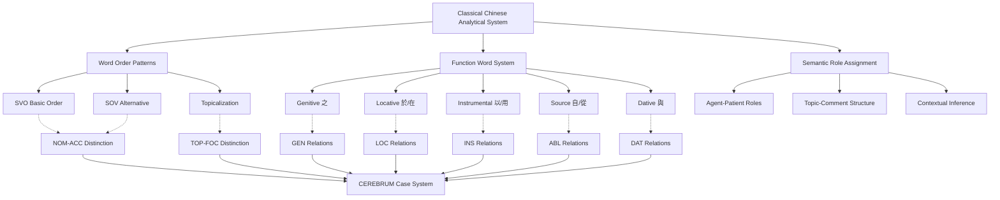

# Classical Chinese Case System and CEREBRUM Mapping

## Overview of Classical Chinese's Approach to Grammatical Relations

Classical Chinese (文言文, *wényánwén*), the literary language of ancient China used from approximately 600 BCE to 1900 CE, provides CEREBRUM with a unique model of case relationship expression in a highly isolating language with minimal morphological marking. Unlike morphologically rich languages, Classical Chinese employs word order, function words, semantic context, and pragmatic inference to express grammatical relationships that other languages encode through inflectional case systems.

This analytical approach offers valuable insights for CEREBRUM implementations where explicit morphological case marking may be computationally expensive, unnecessary, or contextually determined. Classical Chinese demonstrates how sophisticated relational information can be encoded through positional syntax, semantic role assignment, and contextual interpretation, providing a model for efficient case systems that rely on structural and semantic cues rather than explicit morphological marking.

## Morphological Characteristics

### Absence of Inflectional Morphology

Classical Chinese exhibits:

1. **No Nominal Case Marking** - Nouns and pronouns lack inflectional case endings
2. **No Verbal Conjugation** - Verbs do not inflect for person, number, tense, or mood
3. **No Grammatical Gender** - No gender distinctions in pronouns or agreement
4. **No Obligatory Number Marking** - Singular/plural distinction often unmarked or contextual
5. **Minimal Derivational Morphology** - Limited affixation; primarily compounding

### Word Class Flexibility

Classical Chinese words often function across multiple grammatical categories:

```
君 (jūn):
- As noun: "ruler, lord"
- As verb: "to rule, to govern"
- As adjective: "lordly, noble"
```

```
王 (wáng):
- As noun: "king"
- As verb: "to reign as king"
- As adjective: "royal, kingly"
```

This flexibility requires CEREBRUM implementations to handle dynamic case assignment based on syntactic context rather than lexical category alone.

## Syntactic Mechanisms for Case Expression

### Basic Word Order Patterns

Classical Chinese employs several word order patterns to express case relationships:

#### 1. Subject-Verb-Object (SVO)
```
君愛民。(jūn ài mín)
ruler love people
"The ruler loves the people."
```

**CEREBRUM:** Ruler_Model[NOM] performs love_operation on People_Model[ACC].

#### 2. Subject-Object-Verb (SOV) 
```
君民愛。(jūn mín ài)
ruler people love
"The ruler loves the people."
```

**CEREBRUM:** Ruler_Model[NOM] directs People_Model[ACC] through love_operation.

#### 3. Topicalization Structures
```
民，君愛之。(mín, jūn ài zhī)
people, ruler love them
"As for the people, the ruler loves them."
```

**CEREBRUM:** People_Model[TOP] receives love_operation from Ruler_Model[NOM] via pronoun_reference[ACC].

### Function Words and Particles

Classical Chinese employs function words to specify relationships:

#### Genitive/Possessive Relationships
```
之 (zhī) - Genitive particle
君之德 (jūn zhī dé)
ruler GEN virtue
"The ruler's virtue"
```

**CEREBRUM:** Virtue_Model derived from Ruler_Model[GEN] via possessive_particle.

#### Locative Relationships
```
於 (yú) - Locative particle
在 (zài) - Locative preposition
於宮中 (yú gōng zhōng)
at palace middle
"In the palace"
```

**CEREBRUM:** Palace_Model[LOC] with internal_position specification.

#### Dative Relationships
```
與 (yǔ) - Comitative/Dative particle
告與君 (gào yǔ jūn)
tell to ruler
"Tell (it) to the ruler"
```

**CEREBRUM:** Communication_operation directed to Ruler_Model[DAT].

#### Ablative/Source Relationships
```
自 (zì) - Source particle
從 (cóng) - Source preposition
自京師 (zì jīng shī)
from capital
"From the capital"
```

**CEREBRUM:** Capital_Model[ABL] as source of movement/origin.

## Mapping to CEREBRUM Cases

Classical Chinese's analytical system maps to CEREBRUM cases through syntactic position, function words, and semantic roles:

| CEREBRUM Case | Classical Chinese Equivalent | Implementation Notes |
|---------------|------------------------------|----------------------|
| **[NOM]** Nominative | Subject position + semantic agent role | Models in [NOM] should implement topic/subject position with agent semantics |
| **[ACC]** Accusative | Direct object position + patient role | Models in [ACC] should implement object position with patient semantics |
| **[GEN]** Genitive | 之 (zhī) constructions + possessive context | Models in [GEN] should implement possessive particles and attributive relationships |
| **[DAT]** Dative | 與 (yǔ) / 於 (yú) + recipient semantics | Models in [DAT] should implement recipient particles and beneficiary relations |
| **[INS]** Instrumental | 以 (yǐ) / 用 (yòng) + instrument semantics | Models in [INS] should implement instrumental particles and means expressions |
| **[LOC]** Locative | 於 (yú) / 在 (zài) + location semantics | Models in [LOC] should implement locative particles and spatial relations |
| **[ABL]** Ablative | 自 (zì) / 從 (cóng) + source semantics | Models in [ABL] should implement source particles and origin expressions |
| **[VOC]** Vocative | Direct address + 乎 (hū) / 哉 (zāi) | Models in [VOC] should implement direct address with exclamatory particles |



## Function Word Analysis

### 之 (zhī) - Primary Genitive Marker

**Possessive Genitive:**
```
王之臣 (wáng zhī chén)
king GEN minister
"The king's minister"
```

**Objective Genitive:**
```
愛民之心 (ài mín zhī xīn)
love people GEN heart
"A heart that loves the people"
```

**Subjective Genitive:**
```
民之怨 (mín zhī yuàn)
people GEN resentment
"The people's resentment"
```

**CEREBRUM Implementation:**
```python
class GenitiveZhiConstruction:
    def __init__(self):
        self.genitive_types = {
            'possessive': lambda possessor, possessed: 
                f"{possessor}[GEN] possesses {possessed}",
            'objective': lambda agent, object_noun:
                f"{object_noun} receives action from {agent}[GEN]",
            'subjective': lambda experiencer, emotion:
                f"{experiencer}[GEN] experiences {emotion}"
        }
    
    def parse_zhi_construction(self, noun1, noun2, context):
        # Determine relationship type based on semantic context
        if context.get('semantic_relation') == 'possession':
            return self.genitive_types['possessive'](noun1, noun2)
        elif context.get('semantic_relation') == 'action':
            return self.genitive_types['objective'](noun1, noun2)
        elif context.get('semantic_relation') == 'experience':
            return self.genitive_types['subjective'](noun1, noun2)
        
        return f"{noun1}[GEN] modifies {noun2}"
```

### 以 (yǐ) - Primary Instrumental Marker

**Instrument:**
```
以劍殺人 (yǐ jiàn shā rén)
with sword kill person
"Kill a person with a sword"
```

**Means:**
```
以德化民 (yǐ dé huà mín)
with virtue transform people
"Transform the people through virtue"
```

**Reason:**
```
以此知之 (yǐ cǐ zhī zhī)
with this know it
"Know it by this"
```

### 於 (yú) - Multifunctional Prepositional Marker

**Location:**
```
居於宮中 (jū yú gōng zhōng)
dwell at palace middle
"Dwell in the palace"
```

**Recipient/Target:**
```
告於君 (gào yú jūn)
tell to ruler
"Tell (it) to the ruler"
```

**Comparison:**
```
大於牛 (dà yú niú)
big than ox
"Bigger than an ox"
```

**Source of Action:**
```
受命於天 (shòu mìng yú tiān)
receive mandate from heaven
"Receive mandate from heaven"
```

## Unique Features for CEREBRUM Implementation

### 1. Topic-Prominent Structure

Classical Chinese often employs topic-comment structure where the topic is established first, then commented upon:

```
此人也，吾所不知 (cǐ rén yě, wú suǒ bù zhī)
this person PART, I REL not know
"This person, I don't know (him)."
```

**CEREBRUM Implementation:**
```python
class TopicCommentStructure:
    def __init__(self):
        self.topic_markers = ['也', '者', '乎']
        self.comment_structure = None
    
    def parse_topic_comment(self, sentence):
        topic_boundary = self._identify_topic_boundary(sentence)
        if topic_boundary:
            topic = sentence[:topic_boundary]
            comment = sentence[topic_boundary:]
            
            return {
                'topic': self._assign_topic_case(topic),
                'comment': self._parse_comment_structure(comment, topic)
            }
        
        return self._parse_standard_structure(sentence)
    
    def _assign_topic_case(self, topic_phrase):
        # Topics in Classical Chinese often function as frame-setters
        return topic_phrase.transform_to_case(Case.TOP)  # Topical case
```

### 2. Serial Verb Constructions

Classical Chinese frequently employs serial verb constructions where multiple verbs share arguments:

```
取書讀之 (qǔ shū dú zhī)
take book read it
"Take the book and read it"
```

**CEREBRUM Implementation:**
```python
class SerialVerbConstruction:
    def handle_serial_verbs(self, verb_sequence, shared_arguments):
        case_assignments = {}
        
        for i, verb in enumerate(verb_sequence):
            if i == 0:
                # First verb assigns primary cases
                case_assignments[verb] = self._assign_primary_cases(verb, shared_arguments)
            else:
                # Subsequent verbs inherit and potentially modify case assignments
                case_assignments[verb] = self._inherit_case_assignments(
                    verb, case_assignments[verb_sequence[i-1]], shared_arguments
                )
        
        return case_assignments
```

### 3. Null Anaphora and Pro-Drop

Classical Chinese extensively uses null pronouns and drops arguments when recoverable from context:

```
見之而喜 (jiàn zhī ér xǐ)
see it and happy
"(Someone) sees it and (becomes) happy"
```

**CEREBRUM Implementation:**
```python
class NullAnaphoraResolver:
    def __init__(self):
        self.discourse_context = {}
        self.default_referents = {}
    
    def resolve_null_arguments(self, verb, explicit_arguments, context):
        expected_arguments = self._get_expected_arguments(verb)
        explicit_roles = {arg.semantic_role for arg in explicit_arguments}
        
        missing_roles = expected_arguments - explicit_roles
        
        resolved_arguments = list(explicit_arguments)
        for role in missing_roles:
            null_argument = self._resolve_from_context(role, context)
            if null_argument:
                resolved_arguments.append(null_argument)
        
        return resolved_arguments
```

### 4. Resultative Verb Compounds

Classical Chinese employs resultative constructions where the result of an action is expressed:

```
殺死 (shā sǐ)
kill dead
"Kill to death" (kill so that dead)
```

**CEREBRUM Implementation:**
```python
class ResultativeConstruction:
    def parse_resultative(self, action_verb, result_verb, arguments):
        # Action verb assigns primary case relationships
        primary_assignments = self._assign_primary_cases(action_verb, arguments)
        
        # Result verb modifies the outcome case
        result_modifications = self._assign_result_cases(result_verb, primary_assignments)
        
        return {
            'action_phase': primary_assignments,
            'result_phase': result_modifications,
            'integrated_case_frame': self._integrate_phases(primary_assignments, result_modifications)
        }
```

## Example Sentences with Detailed Analysis

### 1. Basic SVO Construction [NOM-ACC]

**Classical Chinese:** 君愛民。(jūn ài mín)

**Morphological Analysis:**
- *君* - noun functioning as subject (positional [NOM])
- *愛* - transitive verb
- *民* - noun functioning as direct object (positional [ACC])

**CEREBRUM:** Ruler_Model[NOM] performs loving_operation on People_Model[ACC].

### 2. Genitive Construction [GEN]

**Classical Chinese:** 王之德甚高。(wáng zhī dé shèn gāo)

**Morphological Analysis:**
- *王* - noun in genitive relationship
- *之* - genitive particle marking [GEN] relationship
- *德* - possessed noun
- *甚高* - predicate adjective phrase

**CEREBRUM:** Virtue_Model derived from King_Model[GEN] exhibits high_degree property.

### 3. Instrumental Construction [INS]

**Classical Chinese:** 以劍擊賊。(yǐ jiàn jī zéi)

**Morphological Analysis:**
- *以* - instrumental preposition
- *劍* - noun marked for [INS] function
- *擊* - transitive verb
- *賊* - direct object [ACC]

**CEREBRUM:** [Null_Agent][NOM] performs striking_operation on Thief_Model[ACC] using Sword_Model[INS].

### 4. Locative Construction [LOC]

**Classical Chinese:** 王居於宮中。(wáng jū yú gōng zhōng)

**Morphological Analysis:**
- *王* - subject [NOM]
- *居* - locative verb "to dwell"
- *於* - locative preposition
- *宮中* - locative noun phrase [LOC]

**CEREBRUM:** King_Model[NOM] maintains residence within Palace_Model[LOC].

### 5. Ablative Source Construction [ABL]

**Classical Chinese:** 自京師來。(zì jīng shī lái)

**Morphological Analysis:**
- *自* - ablative/source preposition
- *京師* - source location [ABL]
- *來* - motion verb "to come"

**CEREBRUM:** [Null_Agent][NOM] performs coming_operation from Capital_Model[ABL].

### 6. Topic-Comment Structure

**Classical Chinese:** 此書也，吾甚愛之。(cǐ shū yě, wú shèn ài zhī)

**Morphological Analysis:**
- *此書也* - topic phrase with topic marker *也*
- *吾* - first person pronoun [NOM]
- *甚愛* - intensified transitive verb
- *之* - anaphoric pronoun referring to topic [ACC]

**CEREBRUM:** Book_Model[TOP] receives intensive_loving_operation from I_Model[NOM] via anaphoric_reference[ACC].

### 7. Serial Verb Construction

**Classical Chinese:** 取書讀之。(qǔ shū dú zhī)

**Morphological Analysis:**
- *取* - first verb "take"
- *書* - shared direct object
- *讀* - second verb "read"
- *之* - anaphoric pronoun [ACC]

**CEREBRUM:** [Null_Agent][NOM] performs sequential operations: taking_operation on Book_Model[ACC], then reading_operation on Book_Model[ACC].

### 8. Vocative Construction [VOC]

**Classical Chinese:** 嗟乎君子！(jiē hū jūnzǐ!)

**Morphological Analysis:**
- *嗟乎* - exclamatory vocative particles
- *君子* - noun in direct address [VOC]

**CEREBRUM:** Direct invocation of Gentleman_Model[VOC] with exclamatory marking.

### 9. Complex Multi-Case Construction

**Classical Chinese:** 君以德化民於天下。(jūn yǐ dé huà mín yú tiānxià)

**Morphological Analysis:**
- *君* - subject [NOM]
- *以德* - instrumental phrase [INS]
- *化* - transitive verb "transform"
- *民* - direct object [ACC]
- *於天下* - locative phrase [LOC]

**CEREBRUM:** Ruler_Model[NOM] performs transformation_operation on People_Model[ACC] using Virtue_Model[INS] within All_Under_Heaven_Model[LOC].

### 10. Resultative Construction

**Classical Chinese:** 學而時習之，不亦說乎？(xué ér shí xí zhī, bù yì yuè hū?)

**Morphological Analysis:**
- *學* - primary verb "learn"
- *而* - coordinative particle
- *時習* - temporal adverbial + verb "practice"
- *之* - anaphoric object [ACC]
- *不亦說乎* - rhetorical question with result state

**CEREBRUM:** [Learner][NOM] performs learning_operation on Knowledge_Model[ACC], then performs temporal_practice_operation, resulting in Joy_State[RESULT].

## Computational Implementation for CEREBRUM

### 1. Context-Sensitive Case Assignment

Classical Chinese requires sophisticated context analysis for case assignment:

```python
class ClassicalChineseCaseAssigner:
    def __init__(self):
        self.word_order_patterns = {
            'SVO': {'subject': Case.NOM, 'object': Case.ACC},
            'SOV': {'subject': Case.NOM, 'object': Case.ACC},
            'OSV': {'subject': Case.NOM, 'object': Case.TOP}  # Topicalized object
        }
        
        self.function_words = {
            '之': Case.GEN,
            '以': Case.INS,
            '於': self._analyze_yu_function,
            '自': Case.ABL,
            '從': Case.ABL,
            '與': Case.DAT
        }
    
    def assign_case(self, word, syntactic_position, semantic_context, discourse_context):
        # Check for explicit function word marking
        if syntactic_position.get('function_word'):
            function_word = syntactic_position['function_word']
            if function_word in self.function_words:
                case_assigner = self.function_words[function_word]
                if callable(case_assigner):
                    return case_assigner(word, semantic_context)
                return case_assigner
        
        # Use word order and semantic context
        word_order = self._determine_word_order(syntactic_position)
        position_case = self.word_order_patterns[word_order].get(
            syntactic_position['grammatical_role'], Case.NOM
        )
        
        # Apply semantic override if necessary
        return self._apply_semantic_override(position_case, semantic_context)
    
    def _analyze_yu_function(self, word, context):
        semantic_role = context.get('semantic_role')
        if semantic_role == 'location':
            return Case.LOC
        elif semantic_role == 'recipient':
            return Case.DAT
        elif semantic_role == 'comparison':
            return Case.COMP  # Comparative case
        elif semantic_role == 'source':
            return Case.ABL
        return Case.LOC  # Default for 於
```

### 2. Topic-Comment Structure Handler

```python
class TopicCommentStructureHandler:
    def __init__(self):
        self.topic_markers = ['也', '者', '焉', '乎']
        self.comment_parsers = {}
    
    def parse_topic_comment(self, sentence_tokens):
        topic_boundary = self._find_topic_boundary(sentence_tokens)
        
        if topic_boundary:
            topic_phrase = sentence_tokens[:topic_boundary]
            comment_phrase = sentence_tokens[topic_boundary+1:]  # Skip topic marker
            
            topic_case_assignment = self._assign_topic_case(topic_phrase)
            comment_case_assignments = self._parse_comment(comment_phrase, topic_phrase)
            
            return {
                'structure_type': 'topic_comment',
                'topic': topic_case_assignment,
                'comment': comment_case_assignments,
                'anaphoric_relations': self._establish_anaphoric_links(topic_phrase, comment_phrase)
            }
        
        return self._parse_standard_sentence(sentence_tokens)
    
    def _assign_topic_case(self, topic_phrase):
        # Topics in Classical Chinese often set the discourse frame
        return {
            'phrase': topic_phrase,
            'case': Case.TOP,
            'discourse_function': 'frame_setter'
        }
    
    def _establish_anaphoric_links(self, topic, comment):
        # Find pronouns in comment that refer back to topic
        anaphoric_pronouns = ['之', '其', '是']
        links = []
        
        for token in comment:
            if token.form in anaphoric_pronouns:
                links.append({
                    'anaphor': token,
                    'antecedent': topic,
                    'case_inheritance': self._determine_inherited_case(token, topic)
                })
        
        return links
```

### 3. Serial Verb Construction Parser

```python
class SerialVerbConstructionParser:
    def __init__(self):
        self.verb_patterns = {}
        self.argument_sharing_rules = {}
    
    def parse_serial_verbs(self, verb_sequence, argument_phrases):
        parsed_constructions = []
        shared_arguments = self._identify_shared_arguments(verb_sequence, argument_phrases)
        
        for i, verb in enumerate(verb_sequence):
            construction = {
                'verb': verb,
                'position': i,
                'primary_arguments': self._assign_primary_arguments(verb, argument_phrases),
                'inherited_arguments': self._get_inherited_arguments(verb, shared_arguments, i),
                'case_assignments': {}
            }
            
            # Assign cases based on verb's argument structure and position in series
            construction['case_assignments'] = self._assign_serial_verb_cases(
                construction, parsed_constructions
            )
            
            parsed_constructions.append(construction)
        
        return self._integrate_serial_construction(parsed_constructions)
    
    def _assign_serial_verb_cases(self, current_construction, previous_constructions):
        verb = current_construction['verb']
        case_frame = self._get_base_case_frame(verb)
        
        # Modify case frame based on serial position
        if current_construction['position'] > 0:
            case_frame = self._apply_serial_modifications(case_frame, previous_constructions)
        
        return case_frame
```

### 4. Null Argument Resolution System

```python
class NullArgumentResolver:
    def __init__(self):
        self.discourse_stack = []
        self.default_agents = {'君': 'ruler', '民': 'people', '我': 'speaker'}
        self.argument_expectation_patterns = {}
    
    def resolve_null_arguments(self, verb, explicit_arguments, discourse_context):
        expected_args = self._get_expected_arguments(verb)
        explicit_roles = {arg.semantic_role for arg in explicit_arguments}
        missing_roles = expected_args - explicit_roles
        
        resolved_arguments = list(explicit_arguments)
        
        for missing_role in missing_roles:
            resolved_arg = self._resolve_missing_argument(missing_role, discourse_context)
            if resolved_arg:
                resolved_arguments.append(resolved_arg)
        
        return resolved_arguments
    
    def _resolve_missing_argument(self, semantic_role, context):
        # Try discourse context first
        discourse_candidate = self._search_discourse_context(semantic_role, context)
        if discourse_candidate:
            return discourse_candidate
        
        # Try default agents for common roles
        if semantic_role == 'agent' and context.get('domain') == 'political':
            return self._create_default_argument('君', Case.NOM, semantic_role)
        
        # Create null placeholder
        return self._create_null_argument(semantic_role)
    
    def _create_null_argument(self, semantic_role):
        case_map = {
            'agent': Case.NOM,
            'patient': Case.ACC,
            'recipient': Case.DAT,
            'instrument': Case.INS,
            'location': Case.LOC
        }
        
        return {
            'type': 'null_argument',
            'semantic_role': semantic_role,
            'case': case_map.get(semantic_role, Case.NOM),
            'resolution_confidence': 0.3  # Low confidence for null resolution
        }
```

## Extension Opportunities for CEREBRUM

### 1. Contextual Case Inference

Based on Classical Chinese's reliance on contextual interpretation, CEREBRUM could implement sophisticated contextual case inference:

```python
class ContextualCaseInference:
    def infer_case_from_context(self, model, syntactic_context, semantic_context, discourse_context):
        # Combine multiple sources of case information
        case_probabilities = {}
        
        # Syntactic evidence
        syntactic_case = self._infer_from_syntax(model, syntactic_context)
        case_probabilities.update(syntactic_case)
        
        # Semantic evidence
        semantic_case = self._infer_from_semantics(model, semantic_context)
        case_probabilities = self._combine_probabilities(case_probabilities, semantic_case)
        
        # Discourse evidence
        discourse_case = self._infer_from_discourse(model, discourse_context)
        case_probabilities = self._combine_probabilities(case_probabilities, discourse_case)
        
        # Select most probable case
        return max(case_probabilities.items(), key=lambda x: x[1])
```

### 2. Topic-Prominence Implementation

Inspired by Classical Chinese's topic-prominent structure, CEREBRUM could implement topic-based case systems:

```python
class TopicProminentCaseSystem:
    def assign_topic_based_cases(self, models, discourse_structure):
        case_assignments = {}
        
        # Identify topic
        topic_model = discourse_structure.get('topic')
        if topic_model:
            case_assignments[topic_model] = Case.TOP
            
            # Assign comment cases relative to topic
            comment_models = discourse_structure.get('comment', [])
            for model in comment_models:
                case_assignments[model] = self._assign_comment_case(model, topic_model)
        
        return case_assignments
```

### 3. Dynamic Case Assignment

Based on Classical Chinese's word class flexibility, CEREBRUM could implement dynamic case assignment based on functional context:

```python
class DynamicCaseAssignment:
    def assign_dynamic_case(self, model, functional_context):
        # Models can take different cases based on functional role
        function = functional_context.get('grammatical_function')
        
        dynamic_case_map = {
            'nominal_subject': Case.NOM,
            'nominal_object': Case.ACC,
            'verbal_complement': Case.INS,
            'adjectival_predicate': Case.NOM,
            'adverbial_modifier': Case.INS
        }
        
        return dynamic_case_map.get(function, Case.NOM)
```

These Classical Chinese-inspired approaches would be particularly valuable for CEREBRUM implementations requiring flexible case assignment, contextual inference, and minimal explicit marking while maintaining relational precision.

## Implications for CEREBRUM Design

Classical Chinese provides crucial insights for CEREBRUM implementations emphasizing efficiency and contextual determination:

1. **Minimal Explicit Marking**: Classical Chinese demonstrates how sophisticated case relationships can be maintained with minimal morphological overhead through positional and contextual strategies.

2. **Contextual Case Inference**: The reliance on semantic and pragmatic context suggests CEREBRUM could implement intelligent case inference systems that reduce explicit marking requirements.

3. **Topic-Prominence**: Classical Chinese's topic-prominent structure provides a model for discourse-based case assignment where topic-comment organization drives relational interpretation.

4. **Functional Flexibility**: The word class flexibility suggests CEREBRUM could implement dynamic case systems where models assume different case roles based on functional context.

5. **Serial Processing**: Classical Chinese's serial verb constructions provide models for complex multi-step operations with shared case assignments across sequential processes.

## References

1. Pulleyblank, E. G. (1995). *Outline of Classical Chinese Grammar*. University of British Columbia Press.

2. Wang, Li (王力). (1980). *漢語史稿* [*A Draft History of Chinese*]. Zhonghua Book Company.

3. Harbsmeier, C. (1998). *Science and Civilisation in China, Volume 7: Language and Logic*. Cambridge University Press.

4. Graham, A. C. (1989). *Disputers of the Tao: Philosophical Argument in Ancient China*. Open Court.

5. Schuessler, A. (2007). *ABC Etymological Dictionary of Old Chinese*. University of Hawaii Press.

6. Baxter, W. H., & Sagart, L. (2014). *Old Chinese: A New Reconstruction*. Oxford University Press.

7. Feng, Shengli (冯胜利). (2000). *韵律语法研究与汉语史的分期* [*Studies in Prosodic Grammar and Periodization of Chinese History*]. Beijing Language and Culture University Press.

8. Aldridge, E. (2015). *A Minimalist Analysis of the Syntax of Classical Chinese*. In *The Oxford Handbook of Chinese Linguistics* (pp. 398-408). Oxford University Press. 