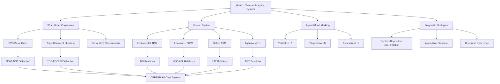

# Modern Chinese (Mandarin) Case System and CEREBRUM Mapping

## Overview of Modern Chinese's Approach to Grammatical Relations

Modern Chinese (现代汉语, *xiàndài hànyǔ*), primarily represented by Standard Mandarin, provides CEREBRUM with a contemporary model of case relationship expression in an isolating language with predominantly analytical grammar. Building upon Classical Chinese foundations while incorporating significant innovations, Modern Chinese demonstrates how CEREBRUM case systems can operate through word order constraints, coverb constructions, aspect markers, and pragmatic inference without relying on morphological case inflection.

This analytical approach offers valuable insights for CEREBRUM implementations prioritizing computational efficiency, scalability, and flexibility. Modern Chinese shows how sophisticated relational information can be encoded through systematic positional patterns, semantic role hierarchies, and contextual disambiguation, providing a model for streamlined case systems that achieve high expressive power through structural organization rather than morphological complexity.

## Morphological and Structural Characteristics

### Isolating Language Properties

Modern Chinese exhibits:

1. **Minimal Inflectional Morphology** - No case endings, verbal conjugation, or agreement marking
2. **Fixed Word Order** - Predominantly SVO with strict positional constraints
3. **Coverb System** - Grammaticalized verbs functioning as case-marking prepositions
4. **Aspect Marking** - Systematic aspect particles (了 *le*, 着 *zhe*, 过 *guo*)
5. **Classifier System** - Extensive noun classifier system for quantity expressions
6. **Complement Constructions** - Complex predicate structures encoding result and direction

### Basic Word Order Patterns

#### Subject-Verb-Object (SVO) Core
```
我爱你。(wǒ ài nǐ)
I love you
"I love you."
```

#### Temporal Expression + Subject + Verb + Object
```
昨天我买了书。(zuótiān wǒ mǎi le shū)
yesterday I buy ASP book
"Yesterday I bought a book."
```

#### Topic-Comment Variations
```
这本书，我已经读了。(zhè běn shū, wǒ yǐjīng dú le)
this CL book, I already read ASP
"This book, I have already read."
```

## Coverb System for Case Expression

Modern Chinese employs coverbs (介词 *jiècí*) - grammaticalized verbs that function as prepositions to express case relationships:

### Instrumental/Comitative Coverbs
```
用 (yòng) - "use, with (instrument)"
我用笔写字。(wǒ yòng bǐ xiě zì)
I use pen write character
"I write characters with a pen."

跟 (gēn) - "with (comitative)"
我跟朋友去。(wǒ gēn péngyou qù)
I with friend go
"I go with friends."

被 (bèi) - "by (passive agent)"
书被我读了。(shū bèi wǒ dú le)
book by I read ASP
"The book was read by me."
```

### Directional/Locative Coverbs
```
在 (zài) - "at, in (location)"
我在家。(wǒ zài jiā)
I at home
"I am at home."

到 (dào) - "to (destination)"
我到学校去。(wǒ dào xuéxiào qù)
I to school go
"I go to school."

从 (cóng) - "from (source)"
我从北京来。(wǒ cóng Běijīng lái)
I from Beijing come
"I come from Beijing."

向 (xiàng) - "toward (direction)"
我向前走。(wǒ xiàng qián zǒu)
I toward front walk
"I walk forward."
```

### Dative/Benefactive Coverbs
```
给 (gěi) - "to, for (recipient/beneficiary)"
我给你书。(wǒ gěi nǐ shū)
I give you book
"I give you a book."

为 (wèi) - "for (beneficiary)"
我为你做饭。(wǒ wèi nǐ zuòfàn)
I for you cook
"I cook for you."

替 (tì) - "for, on behalf of"
我替你写信。(wǒ tì nǐ xiě xìn)
I for you write letter
"I write a letter for you."
```

## Mapping to CEREBRUM Cases

Modern Chinese's analytical system maps to CEREBRUM cases through positional syntax and coverb constructions:

| CEREBRUM Case | Modern Chinese Equivalent | Implementation Notes |
|---------------|---------------------------|----------------------|
| **[NOM]** Nominative | Subject position + topic position | Models in [NOM] should implement subject position and topic prominence |
| **[ACC]** Accusative | Direct object position + 把 (bǎ) construction | Models in [ACC] should implement object position and 把-marked patients |
| **[GEN]** Genitive | 的 (de) constructions + juxtaposition | Models in [GEN] should implement possessive particles and attributive relations |
| **[DAT]** Dative | 给 (gěi) constructions + indirect object position | Models in [DAT] should implement recipient/beneficiary coverbs |
| **[INS]** Instrumental | 用 (yòng) / 拿 (ná) constructions | Models in [INS] should implement instrumental coverbs |
| **[LOC]** Locative | 在 (zài) / 于 (yú) constructions | Models in [LOC] should implement locative coverbs and positional expressions |
| **[ABL]** Ablative | 从 (cóng) / 自 (zì) constructions | Models in [ABL] should implement source coverbs |
| **[VOC]** Vocative | Direct address + 啊 (a) / 呀 (ya) particles | Models in [VOC] should implement direct address with sentence-final particles |



## Unique Constructions and Case Implications

### 把 (bǎ) Construction - Object Fronting

The 把 construction moves direct objects to pre-verbal position, creating a distinctive accusative marking pattern:

```
Standard SVO: 我吃了苹果。(wǒ chī le píngguǒ)
             I eat ASP apple
             "I ate an apple."

把 Construction: 我把苹果吃了。(wǒ bǎ píngguǒ chī le)
                I BA apple eat ASP
                "I ate the apple."
```

**CEREBRUM Implementation:**
```python
class BaConstruction:
    def __init__(self):
        self.ba_constraints = {
            'definiteness': 'definite',  # 把-marked objects must be definite
            'affectedness': 'high',      # Objects must be significantly affected
            'displacement': 'pre_verbal' # Objects move to pre-verbal position
        }
    
    def assign_ba_case(self, object_model, context):
        if self._meets_ba_constraints(object_model, context):
            return {
                'case': Case.ACC,
                'construction': 'ba_marking',
                'position': 'pre_verbal',
                'semantic_role': 'affected_patient'
            }
        return self._assign_standard_accusative(object_model)
    
    def _meets_ba_constraints(self, object_model, context):
        return (object_model.definiteness == 'definite' and 
                context.get('affectedness') == 'high' and
                context.get('result_orientation', False))
```

### Resultative Verb Compounds

Modern Chinese extensively uses resultative compounds where the result of an action is lexically encoded:

```
看见 (kàn jiàn) - "see" + "perceive" = "see (and perceive)"
我看见了他。(wǒ kàn jiàn le tā)
I see-perceive ASP him
"I saw him."

打破 (dǎ pò) - "hit" + "broken" = "break (by hitting)"
我打破了杯子。(wǒ dǎ pò le bēizi)
I hit-break ASP cup
"I broke the cup."
```

**CEREBRUM Implementation:**
```python
class ResultativeCompound:
    def parse_resultative_case_frame(self, action_verb, result_verb, arguments):
        # Action verb provides primary case frame
        primary_frame = self._get_action_case_frame(action_verb)
        
        # Result verb modifies patient case properties
        result_modifications = self._get_result_modifications(result_verb)
        
        # Integrate frames
        integrated_frame = self._integrate_case_frames(primary_frame, result_modifications)
        
        return {
            'construction_type': 'resultative_compound',
            'action_component': primary_frame,
            'result_component': result_modifications,
            'integrated_case_frame': integrated_frame
        }
```

### Serial Verb Constructions

Modern Chinese employs extensive serial verb constructions where multiple verbs share arguments:

```
我去买书。(wǒ qù mǎi shū)
I go buy book
"I go to buy books."

我跑着去学校。(wǒ pǎo zhe qù xuéxiào)
I run DUR go school
"I run to school."
```

### Disposal Constructions (处置式)

Besides 把, Modern Chinese has other disposal constructions:

```
将 (jiāng) - formal equivalent of 把
老师将作业批改了。(lǎoshī jiāng zuòyè pīgǎi le)
teacher JIANG homework correct ASP
"The teacher corrected the homework."
```

### Passive Constructions

Modern Chinese has multiple passive constructions:

#### 被 (bèi) Passive
```
书被我读了。(shū bèi wǒ dú le)
book BEI I read ASP
"The book was read by me."
```

#### 让 (ràng) Passive
```
我让雨淋湿了。(wǒ ràng yǔ lín shī le)
I RANG rain drench wet ASP
"I was drenched by the rain."
```

#### 给 (gěi) Passive
```
饭给他吃完了。(fàn gěi tā chī wán le)
rice GEI he eat finish ASP
"The rice was finished by him."
```

## Aspect and Case Interaction

Modern Chinese aspect markers interact with case assignment:

### Perfective 了 (le)
```
我买了书。(wǒ mǎi le shū)
I buy ASP book
"I bought a book." (completed action, definite object interpretation)
```

### Progressive 着 (zhe)
```
我看着电视。(wǒ kàn zhe diànshì)
I watch DUR television
"I am watching television." (ongoing action, process focus)
```

### Experiential 过 (guo)
```
我去过北京。(wǒ qù guo Běijīng)
I go EXP Beijing
"I have been to Beijing." (experienced action)
```

## Computational Implementation for CEREBRUM

### 1. Coverb-Based Case Assignment

```python
class CoverbCaseAssigner:
    def __init__(self):
        self.coverb_case_mapping = {
            # Instrumental/Comitative
            '用': Case.INS,
            '拿': Case.INS,
            '以': Case.INS,
            '跟': Case.COM,  # Comitative
            '和': Case.COM,
            '同': Case.COM,
            
            # Locative/Directional
            '在': Case.LOC,
            '于': Case.LOC,
            '到': Case.DAT,  # Goal/Destination as Dative
            '向': Case.DAT,
            '朝': Case.DAT,
            '从': Case.ABL,
            '自': Case.ABL,
            '由': Case.ABL,
            
            # Dative/Benefactive
            '给': Case.DAT,
            '为': Case.DAT,
            '替': Case.DAT,
            '帮': Case.DAT,
            
            # Agentive (Passive)
            '被': Case.AGT,  # Agent in passive
            '让': Case.AGT,
            '叫': Case.AGT,
            '给': Case.AGT   # Context-dependent
        }
        
        self.positional_cases = {
            'subject': Case.NOM,
            'direct_object': Case.ACC,
            'indirect_object': Case.DAT
        }
    
    def assign_case(self, model, syntactic_context):
        # Check for coverb marking first
        coverb = syntactic_context.get('coverb')
        if coverb and coverb in self.coverb_case_mapping:
            case = self.coverb_case_mapping[coverb]
            
            # Handle context-dependent coverbs
            if coverb == '给' and syntactic_context.get('construction') == 'passive':
                return Case.AGT
            elif coverb == '给':
                return Case.DAT
            
            return case
        
        # Fall back to positional assignment
        position = syntactic_context.get('position')
        return self.positional_cases.get(position, Case.NOM)
```

### 2. Construction-Specific Case Handling

```python
class ConstructionCaseHandler:
    def __init__(self):
        self.construction_handlers = {
            'ba_construction': self._handle_ba_construction,
            'passive_construction': self._handle_passive_construction,
            'serial_verb': self._handle_serial_verb,
            'resultative_compound': self._handle_resultative_compound
        }
    
    def handle_construction(self, construction_type, participants, context):
        if construction_type in self.construction_handlers:
            return self.construction_handlers[construction_type](participants, context)
        return self._default_case_assignment(participants)
    
    def _handle_ba_construction(self, participants, context):
        case_assignments = {}
        
        # Subject gets nominative
        subject = participants.get('subject')
        if subject:
            case_assignments[subject] = Case.NOM
        
        # Ba-marked object gets accusative with special properties
        ba_object = participants.get('ba_object')
        if ba_object:
            case_assignments[ba_object] = {
                'case': Case.ACC,
                'construction_properties': {
                    'definiteness': 'definite',
                    'affectedness': 'high',
                    'displacement': 'pre_verbal'
                }
            }
        
        return case_assignments
    
    def _handle_passive_construction(self, participants, context):
        case_assignments = {}
        passive_marker = context.get('passive_marker')
        
        # Logical object becomes syntactic subject
        logical_object = participants.get('logical_object')
        if logical_object:
            case_assignments[logical_object] = {
                'case': Case.NOM,
                'logical_role': 'patient',
                'syntactic_role': 'subject'
            }
        
        # Agent (if present) marked by passive coverb
        agent = participants.get('agent')
        if agent:
            case_assignments[agent] = {
                'case': Case.AGT,
                'marker': passive_marker
            }
        
        return case_assignments
```

### 3. Aspect-Case Interaction System

```python
class AspectCaseInteraction:
    def __init__(self):
        self.aspect_case_effects = {
            '了': {  # Perfective le
                'object_definiteness': 'tends_definite',
                'completion_focus': True,
                'result_state': 'achieved'
            },
            '着': {  # Progressive zhe
                'process_focus': True,
                'ongoing_state': True,
                'object_affectedness': 'partial'
            },
            '过': {  # Experiential guo
                'experience_focus': True,
                'completedness': True,
                'repeatability': 'possible'
            }
        }
    
    def apply_aspect_case_interaction(self, verb, aspect_marker, arguments):
        if aspect_marker in self.aspect_case_effects:
            aspect_properties = self.aspect_case_effects[aspect_marker]
            
            # Modify argument case properties based on aspect
            modified_arguments = {}
            
            for arg in arguments:
                modified_arg = dict(arg)  # Copy original argument
                
                if arg.get('case') == Case.ACC:
                    # Aspect affects accusative objects most directly
                    if aspect_properties.get('object_definiteness') == 'tends_definite':
                        modified_arg['definiteness_tendency'] = 'definite'
                    
                    if aspect_properties.get('object_affectedness') == 'partial':
                        modified_arg['affectedness'] = 'partial'
                
                modified_arguments[arg['id']] = modified_arg
            
            return modified_arguments
        
        return arguments
```

### 4. Topic-Comment Case Assignment

```python
class TopicCommentCaseAssignment:
    def __init__(self):
        self.topic_markers = ['的话', '嘛', '呢', '啊']
        self.comment_structure_types = ['predication', 'existence', 'possession']
    
    def assign_topic_comment_cases(self, sentence_structure):
        case_assignments = {}
        
        topic = sentence_structure.get('topic')
        comment = sentence_structure.get('comment')
        
        if topic:
            case_assignments[topic] = {
                'case': Case.TOP,
                'discourse_function': 'frame_setter',
                'information_status': 'given'
            }
        
        if comment:
            comment_cases = self._assign_comment_cases(comment, topic)
            case_assignments.update(comment_cases)
        
        return case_assignments
    
    def _assign_comment_cases(self, comment, topic):
        comment_structure = comment.get('structure_type')
        comment_cases = {}
        
        if comment_structure == 'predication':
            # Standard predication about topic
            predicate = comment.get('predicate')
            if predicate:
                comment_cases[predicate] = Case.PRED  # Predicative case
        
        elif comment_structure == 'existence':
            # Existential statement about topic
            location = comment.get('location')
            if location:
                comment_cases[location] = Case.LOC
        
        elif comment_structure == 'possession':
            # Possessive statement about topic
            possessum = comment.get('possessum')
            if possessum:
                comment_cases[possessum] = Case.ACC
        
        return comment_cases
```

## Example Sentences with Detailed Analysis

### 1. Basic SVO [NOM-ACC]

**Modern Chinese:** 我爱你。(wǒ ài nǐ)

**Analysis:**
- *我* - 1st person pronoun, subject position [NOM]
- *爱* - transitive verb "love"
- *你* - 2nd person pronoun, object position [ACC]

**CEREBRUM:** I_Model[NOM] performs loving_operation on You_Model[ACC].

### 2. 把 Construction [NOM-ACC with Pre-verbal Object]

**Modern Chinese:** 我把书读完了。(wǒ bǎ shū dú wán le)

**Analysis:**
- *我* - subject [NOM]
- *把* - object-fronting marker
- *书* - fronted definite object [ACC]
- *读完* - resultative compound "read-finish"
- *了* - perfective aspect

**CEREBRUM:** I_Model[NOM] performs reading-completion_operation on Book_Model[ACC:definite:pre-verbal].

### 3. Genitive Construction [GEN]

**Modern Chinese:** 我的书很好。(wǒ de shū hěn hǎo)

**Analysis:**
- *我* - possessor [GEN]
- *的* - genitive particle
- *书* - possessed noun
- *很好* - predicate "very good"

**CEREBRUM:** Book_Model derived from I_Model[GEN] exhibits good_quality property.

### 4. Instrumental Construction [INS]

**Modern Chinese:** 我用筷子吃饭。(wǒ yòng kuàizi chī fàn)

**Analysis:**
- *我* - subject [NOM]
- *用* - instrumental coverb
- *筷子* - instrument [INS]
- *吃饭* - verb "eat meal"

**CEREBRUM:** I_Model[NOM] performs eating_operation using Chopsticks_Model[INS].

### 5. Locative Construction [LOC]

**Modern Chinese:** 我在北京工作。(wǒ zài Běijīng gōngzuò)

**Analysis:**
- *我* - subject [NOM]
- *在* - locative coverb
- *北京* - location [LOC]
- *工作* - verb "work"

**CEREBRUM:** I_Model[NOM] performs working_operation within Beijing_Model[LOC].

### 6. Ablative Construction [ABL]

**Modern Chinese:** 我从美国来。(wǒ cóng Měiguó lái)

**Analysis:**
- *我* - subject [NOM]
- *从* - source coverb
- *美国* - source location [ABL]
- *来* - motion verb "come"

**CEREBRUM:** I_Model[NOM] performs coming_operation from America_Model[ABL].

### 7. Dative Construction [DAT]

**Modern Chinese:** 我给你买书。(wǒ gěi nǐ mǎi shū)

**Analysis:**
- *我* - subject [NOM]
- *给* - beneficiary coverb
- *你* - beneficiary [DAT]
- *买书* - verb phrase "buy books"

**CEREBRUM:** I_Model[NOM] performs book-buying_operation for You_Model[DAT].

### 8. Passive Construction [NOM-AGT]

**Modern Chinese:** 书被我读了。(shū bèi wǒ dú le)

**Analysis:**
- *书* - logical object, syntactic subject [NOM]
- *被* - passive marker
- *我* - agent [AGT]
- *读* - verb "read"
- *了* - perfective aspect

**CEREBRUM:** Book_Model[NOM:patient] undergoes reading_operation by I_Model[AGT].

### 9. Topic-Comment Structure

**Modern Chinese:** 这本书，我昨天买的。(zhè běn shū, wǒ zuótiān mǎi de)

**Analysis:**
- *这本书* - topic phrase [TOP]
- Pause indicated by comma
- *我* - subject in comment [NOM]
- *昨天* - temporal adverbial
- *买的* - verb + nominalizing particle

**CEREBRUM:** Book_Model[TOP] associated with buying_operation performed by I_Model[NOM] at Yesterday_Time[LOC].

### 10. Serial Verb Construction

**Modern Chinese:** 我开车去上班。(wǒ kāi chē qù shàngbān)

**Analysis:**
- *我* - shared subject [NOM]
- *开车* - first verb phrase "drive car"
- *去* - second verb "go"
- *上班* - purpose "go to work"

**CEREBRUM:** I_Model[NOM] performs sequential operations: driving_operation and going_operation with work_purpose.

## Extension Opportunities for CEREBRUM

### 1. Coverb-Based Case Extension

Based on Modern Chinese's productive coverb system, CEREBRUM could implement expandable coverb-case mapping:

```python
class ExpandableCoverbSystem:
    def __init__(self):
        self.core_coverbs = self._initialize_core_coverbs()
        self.extended_coverbs = {}
    
    def register_new_coverb(self, coverb_form, semantic_role, case_assignment):
        """Allow dynamic registration of new coverb-case mappings"""
        self.extended_coverbs[coverb_form] = {
            'semantic_role': semantic_role,
            'case': case_assignment,
            'productivity': 'emerging'
        }
    
    def resolve_coverb_case(self, coverb, context):
        # Check core system first
        if coverb in self.core_coverbs:
            return self.core_coverbs[coverb]
        
        # Check extended system
        if coverb in self.extended_coverbs:
            return self.extended_coverbs[coverb]['case']
        
        # Apply productive rules for new coverbs
        return self._apply_productive_coverb_rules(coverb, context)
```

### 2. Construction-Based Case Flexibility

Inspired by Modern Chinese's construction-specific case patterns, CEREBRUM could implement construction-sensitive case assignment:

```python
class ConstructionSensitiveCases:
    def __init__(self):
        self.construction_case_patterns = {}
    
    def register_construction_pattern(self, construction_name, case_pattern):
        """Register new construction-specific case patterns"""
        self.construction_case_patterns[construction_name] = case_pattern
    
    def apply_construction_cases(self, construction_type, participants):
        if construction_type in self.construction_case_patterns:
            pattern = self.construction_case_patterns[construction_type]
            return self._apply_pattern(pattern, participants)
        
        return self._default_case_assignment(participants)
```

### 3. Aspect-Driven Case Modification

Based on Modern Chinese's aspect-case interactions, CEREBRUM could implement aspect-sensitive case properties:

```python
class AspectDrivenCaseModification:
    def modify_case_properties(self, base_case_assignment, aspect_information):
        modified_assignments = {}
        
        for model, case_info in base_case_assignment.items():
            modified_case_info = dict(case_info)
            
            # Apply aspect-driven modifications
            if aspect_information.get('type') == 'perfective':
                if case_info['case'] == Case.ACC:
                    modified_case_info['definiteness_tendency'] = 'definite'
                    modified_case_info['completion_implication'] = True
            
            elif aspect_information.get('type') == 'progressive':
                if case_info['case'] == Case.ACC:
                    modified_case_info['affectedness'] = 'partial'
                    modified_case_info['process_involvement'] = True
            
            modified_assignments[model] = modified_case_info
        
        return modified_assignments
```

These Modern Chinese-inspired approaches would be particularly valuable for CEREBRUM implementations requiring efficient analytical case systems, dynamic case extension capabilities, and construction-sensitive relationship marking.

## Implications for CEREBRUM Design

Modern Chinese provides crucial insights for CEREBRUM implementations emphasizing analytical efficiency and systematic organization:

1. **Coverb Productivity**: The systematic coverb system demonstrates how CEREBRUM could implement productive analytical case marking through grammaticalized function words.

2. **Construction Specificity**: Different constructions (把, 被, etc.) show how CEREBRUM could adapt case assignment patterns based on specific construction types.

3. **Positional Constraints**: The rigid word order patterns provide models for constraint-based case assignment systems.

4. **Aspect Integration**: The interaction between aspect and case suggests how CEREBRUM could integrate temporal/aspectual information with relational marking.

5. **Contextual Flexibility**: Modern Chinese's reliance on context demonstrates how CEREBRUM could implement flexible case interpretation while maintaining systematic organization.

## References

1. Li, Charles N., & Thompson, Sandra A. (1981). *Mandarin Chinese: A Functional Reference Grammar*. University of California Press.

2. Chao, Y. R. (1968). *A Grammar of Spoken Chinese*. University of California Press.

3. Huang, C.-T. James, Li, Y.-H. Audrey, & Li, Yafei. (2009). *The Syntax of Chinese*. Cambridge University Press.

4. Liu, Feng-hsi. (1997). *An Aspectual Analysis of ba*. *Journal of East Asian Linguistics*, 6(1), 51-99.

5. Sun, Chaofen. (2006). *Chinese: A Linguistic Introduction*. Cambridge University Press.

6. Wang, Li (王力). (1985). *中国现代语法* [*Modern Chinese Grammar*]. Commercial Press.

7. Zhu, Dexi (朱德熙). (1982). *语法讲义* [*Lectures on Grammar*]. Commercial Press.

8. Her, One-Soon. (2007). *Argument-function correspondence and the ba-construction in Chinese*. *Language Sciences*, 29(4), 491-509. 