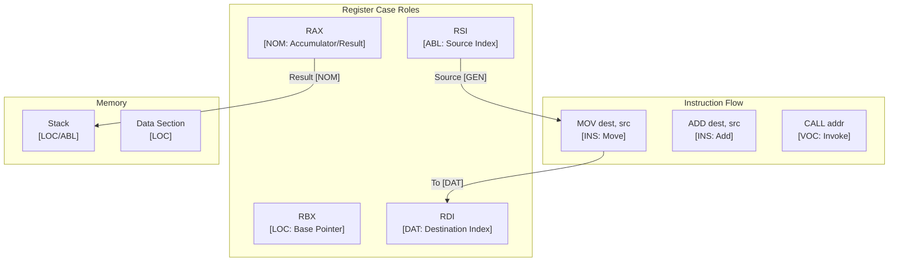

# Assembly Language Paradigms and CEREBRUM Mapping

Assembly language is a low-level programming language that has a very strong correspondence between the language instructions and the architecture's machine code instructions. It is specific to a particular computer architecture (e.g., x86, ARM, MIPS). Programming involves direct manipulation of processor registers and memory.

## 1. Overview of Assembly Paradigms

- **Imperative/Procedural**: Execution follows a sequence of instructions, with control flow managed by jumps and calls.
- **Direct Hardware Manipulation**: Instructions directly operate on CPU registers, memory locations, and I/O ports.
- **Architecture Specific**: Syntax and instructions vary significantly between different CPU families.
- **Minimal Abstraction**: Very little abstraction over the underlying hardware operations.
- **Data Representation**: Explicit handling of data sizes (byte, word, double word, etc.) and memory addresses.

Relationships are defined by data movement instructions (`MOV`), arithmetic/logic instructions (`ADD`, `AND`), control flow instructions (`JMP`, `CALL`, `RET`), and memory addressing modes.

## 2. Mapping CEREBRUM Cases to Assembly Concepts

Mapping cases requires looking at the roles of registers, memory locations, and immediate values within individual instructions.

| CEREBRUM Case | Assembly Equivalent/Analogy (Conceptual) | Correspondence Strength | Notes |
| ------------- | ---------------------------------------- | ----------------------- | ----- |
| **Nominative [NOM]** | Destination register/memory after operation; Status flags (implicitly); The instruction pointer (`IP`/`EIP`/`RIP`) | Strong | Result of an operation, the entity controlling flow. |
| **Accusative [ACC]** | Destination register/memory being overwritten/modified (`MOV dest, ...`, `ADD dest, ...`); Operand being directly changed | Strong | The register or memory location receiving the direct effect. |
| **Dative [DAT]** | Destination register/memory in `MOV dest, src`; Target address of `CALL` or `JMP` | Strong | Recipient of data or control flow transfer. |
| **Genitive [GEN]** | Source register/memory/immediate value (`MOV ..., src`); Value used in comparison (`CMP reg, val`) | Strong | Source of data or value being referenced. |
| **Instrumental [INS]** | Instruction Mnemonic (`MOV`, `ADD`, `CALL`); Addressing mode (`[base + index*scale + disp]`); Subroutine/Procedure | Strong | The instruction (tool) performing the operation; the way memory is accessed. |
| **Ablative [ABL]** | Source operand; Stack pointer (`SP`/`ESP`/`RSP`) indicating source for `POP`; Input port | Strong | Origin of data being moved or used. |
| **Locative [LOC]** | Register (as container); Memory segment/address space; Stack frame; Code segment | Strong | Container holding data or code context. |
| **Vocative [VOC]** | `CALL address`; `JMP address`; `INT number` (Interrupt); Instruction execution itself | Strong | Direct invocation of a procedure, jump, or system call. |

## 3. Key Assembly Features and Case Relationships (Conceptual x86 Examples)

*Note: Syntax varies (Intel vs. AT&T). Examples use conceptual Intel syntax.*

### Data Movement (`MOV`)

Fundamental for transferring data.

```assembly
section .data
  myVar dw 10 ; Define variable in memory (GEN source value 10 at LOC myVar)

section .text
global _start

_start:
  ; MOV destination, source
  
  ; Move immediate value (GEN) to register (DAT target)
  mov eax, 5          ; EAX is DAT recipient, 5 is GEN source
  
  ; Move register value (GEN) to another register (DAT target)
  mov ebx, eax        ; EBX is DAT recipient, EAX is GEN source 
  
  ; Move memory value (GEN) to register (DAT target)
  mov cx, [myVar]     ; CX is DAT recipient, memory at myVar is GEN source
                      ; [myVar] addressing mode is INS
                      
  ; Move register value (GEN) to memory (DAT target)
  mov [myVar], bx     ; Memory at myVar is DAT recipient, BX is GEN source
                      ; bx needs to be word-sized (16-bit) here
```

### Arithmetic Operations (`ADD`, `SUB`, etc.)

Modify register/memory content.

```assembly
  mov eax, 100       ; EAX is DAT (100 is GEN)
  mov ebx, 50        ; EBX is DAT (50 is GEN)
  
  ; ADD destination, source (destination = destination + source)
  ; ADD is INS tool
  ; EAX is ACC (modified) and ABL/GEN source
  ; EBX is ABL/GEN source
  add eax, ebx        ; EAX becomes 150 (NOM result implicitly in EAX)
                      ; Status flags (NOM) are updated
  
  ; SUB destination, source
  ; SUB is INS tool
  ; EAX is ACC (modified) and ABL/GEN source
  ; Immediate 20 is GEN source
  sub eax, 20         ; EAX becomes 130
```

### Control Flow (`JMP`, `CMP`, Conditional Jumps, `CALL`, `RET`)

Directing the flow of execution.

```assembly
section .data
  msg db "Value is 10", 0

section .text
global _start

_start:
  mov eax, 10
  
  ; Compare operation (INS tool)
  ; EAX is ABL/GEN source
  ; 10 is GEN source
  cmp eax, 10         ; Updates status flags (NOM) based on comparison
  
  ; Conditional jump (VOC invocation based on NOM flags)
  ; JE (Jump if Equal) is INS tool
  ; label_equal is DAT target address
  je label_equal      ; Jumps if zero flag (ZF) is set by CMP

  ; Unconditional jump (VOC invocation)
  ; JMP is INS tool
  ; label_notequal is DAT target address
  jmp label_notequal

label_equal:
  ; ... code if EAX was 10 ...
  ; Example: Call a printing routine (VOC)
  ; print_message is INS subroutine
  ; msg is ABL/GEN source address passed (conventionally)
  ; mov esi, msg  ; Prepare argument (ESI is DAT, msg is GEN)
  ; call print_message 
  jmp exit_program

label_notequal:
  ; ... code if EAX was not 10 ...
  jmp exit_program
  
exit_program:
  ; Terminate program (details vary by OS/environment)
  mov eax, 1          ; System call number (GEN) for exit (DAT EAX)
  xor ebx, ebx        ; Exit code 0 (GEN) for exit (DAT EBX)
  int 0x80            ; System call interrupt (VOC)

; --- Example Subroutine --- 
; print_message: (INS Tool)
;   ; Assumes message address in ESI (ABL/GEN)
;   ; ... code to print null-terminated string ...
;   ret                 ; Return (VOC) - transfers control back to caller (DAT: return address on stack)
```

### Stack Operations (`PUSH`, `POP`)

Managing data and control flow via the stack (LOC).

```assembly
  mov eax, 111
  mov ebx, 222

  ; Push register onto stack (VOC PUSH)
  ; PUSH is INS tool
  ; EAX is ABL/GEN source
  ; Stack pointer ESP (ABL/LOC) is implicitly decremented
  ; Memory at [ESP] becomes DAT target
  push eax
  
  ; Push immediate value onto stack (VOC PUSH)
  push 333          ; 333 is GEN source
  
  ; Pop value from stack into register (VOC POP)
  ; POP is INS tool
  ; Stack pointer ESP (ABL/LOC) indicates source address
  ; EBX is DAT target
  ; ESP is implicitly incremented
  pop ebx           ; EBX becomes 333 (NOM result in EBX)
  
  pop eax           ; EAX becomes 111
```

*Mermaid Diagram: `CALL` and `RET` Flow*

```mermaid
graph TD
    Start --> CallSub[VOC: CALL Subroutine];
    subgraph CallSub
        direction LR
        PushAddr[PUSH ReturnAddress onto Stack[LOC/ABL]] --> SetIP[Set IP[NOM/DAT] to Subroutine Address];
    end
    SetIP --> Subroutine[INS: Execute Subroutine Code];
    Subroutine --> RetInst[VOC: RET Instruction];
    subgraph RetInst
        direction LR
        PopAddr[POP ReturnAddress from Stack[LOC/ABL]] --> SetIPRet[Set IP[NOM/DAT] to ReturnAddress];
    end
    SetIPRet --> ContinueAfterCall(Continue Execution after CALL);
```

## 4. Implementation Approach

Case roles in Assembly are inherent in the instruction definitions and operand types:

1. **Instruction Definition**: The mnemonic (`MOV`, `ADD`, `CALL`) defines the core action (INS) and implicitly defines roles for its operands (source GEN/ABL, destination ACC/DAT).
2. **Operand Types**: Whether an operand is a register (LOC/container), memory address (LOC/container), or immediate value (GEN source) clarifies its role.
3. **Addressing Modes**: Complex modes like `[base + index*scale + disp]` act as INS mechanisms to calculate the effective memory address (GEN source address) to access data.
4. **Control Flow Instructions**: `JMP`, `CALL`, `RET`, `INT` are VOC invocations changing the instruction pointer (NOM/DAT target) based on addresses (DAT) or status flags (NOM).
5. **Stack Pointer**: `ESP`/`RSP` implicitly acts as ABL/LOC source/target for `PUSH`/`POP`/`CALL`/`RET`.

Explicit CEREBRUM modeling is not done; roles are fundamental to understanding how instructions operate on the hardware state. Comments are crucial for explaining the higher-level purpose of instruction sequences.

## 5. Conclusion

Assembly language, despite its low level, maps surprisingly well to CEREBRUM cases because instructions explicitly define operations on distinct operands:

- Registers and memory locations clearly act as **LOC** containers.
- Instructions like `MOV` show **GEN** sources and **DAT** targets.
- Arithmetic/logic instructions show **ACC**/**DAT** destinations being modified by **GEN**/**ABL** sources, with status flags as implicit **NOM** results.
- Instructions themselves (`MOV`, `ADD`) are the **INS** tools.
- Control flow instructions (`CALL`, `JMP`, `RET`) are **VOC** actions targeting **DAT** addresses and manipulating the **NOM** instruction pointer and **ABL/LOC** stack.
- Addressing modes function as **INS** mechanisms for accessing **GEN** data from **LOC** memory.

Understanding case roles in assembly is synonymous with understanding the fundamental operation of the CPU architecture itself – how data is moved, transformed, and how control flow is managed.

## 6. Advanced CEREBRUM Implementation

### Conceptual Case-Aware Register Allocation

In assembly, we can conceptually think of register roles using case semantics:

```assembly
; Case-Aware Register Convention (x86-64)
; =========================================
; RAX - NOM: Primary result/accumulator
; RBX - LOC: Base pointer for data structures
; RCX - ACC: Counter/target for loop operations
; RDX - GEN: Secondary data/dividend
; RSI - ABL: Source index (source of data)
; RDI - DAT: Destination index (data recipient)
; R8-R15 - INS: Temporary tools for computation

section .data
    ; Case annotations in data section
    source_data dq 100    ; ABL: Source value
    target_data dq 0      ; DAT: Target location
    precision dq 1.0      ; GEN: Precision value
    
section .bss
    result resq 1         ; NOM: Result storage
    
section .text
global case_aware_operation

; Function: case_aware_operation
; Demonstrates explicit case role annotations
case_aware_operation:
    push rbp
    mov rbp, rsp
    
    ; Load source data (ABL -> GEN)
    mov rax, [source_data]     ; RAX now holds GEN value from ABL source
    
    ; Process data (RAX is ACC being modified)
    imul rax, 2                 ; RAX is NOM result after operation
    
    ; Store to destination (NOM/GEN -> DAT)
    mov [target_data], rax      ; target_data is DAT recipient
    
    ; RAX contains NOM result
    mov [result], rax
    
    pop rbp
    ret
```

### Conceptual Active Inference State Machine

```assembly
; Active Inference Belief Update - Conceptual Implementation
; ===========================================================
; This demonstrates how belief updating could be structured
; in assembly with explicit case role annotations

section .data
    ; Belief state (LOC container for internal state)
    belief_mean dq 5.0        ; Current belief mean
    belief_precision dq 1.0   ; Current belief precision
    
    ; Case precision modifiers (GEN lookup table)
    case_nom_precision dq 1.5
    case_acc_precision dq 1.2
    case_gen_precision dq 1.0
    case_voc_precision dq 2.0
    
    ; Current case role (represented as integer)
    current_case dd 0         ; 0=NOM, 1=ACC, 2=GEN, 3=VOC
    
section .bss
    temp_buffer resq 4        ; Temporary computation space
    
section .text
global belief_update_asm

; belief_update_asm(observation, obs_precision)
; RDI = observation (GEN input)
; RSI = obs_precision pointer (GEN input)
; Returns updated mean in XMM0 (NOM result)
belief_update_asm:
    push rbp
    mov rbp, rsp
    
    ; Load inputs (GEN sources)
    movsd xmm0, [rdi]              ; XMM0 = observation (GEN)
    movsd xmm1, [rsi]              ; XMM1 = obs_precision (GEN)
    
    ; Load current belief state (ABL sources from LOC)
    movsd xmm2, [belief_mean]      ; XMM2 = prior mean (ABL)
    movsd xmm3, [belief_precision] ; XMM3 = prior precision (ABL)
    
    ; Get case-specific precision modifier (INS tool application)
    mov eax, [current_case]
    cmp eax, 0
    je .use_nom_precision
    cmp eax, 1
    je .use_acc_precision
    jmp .use_gen_precision         ; Default to GEN
    
.use_nom_precision:
    movsd xmm4, [case_nom_precision]
    jmp .apply_precision
    
.use_acc_precision:
    movsd xmm4, [case_acc_precision]
    jmp .apply_precision
    
.use_gen_precision:
    movsd xmm4, [case_gen_precision]
    
.apply_precision:
    ; Adjust observation precision by case modifier
    mulsd xmm1, xmm4               ; XMM1 = adjusted_precision (ACC modified)
    
    ; Calculate total precision
    movsd xmm5, xmm3               ; XMM5 = prior_precision
    addsd xmm5, xmm1               ; XMM5 = total_precision (NOM result)
    
    ; Calculate posterior mean
    ; posterior = (prior_prec * prior_mean + adj_prec * obs) / total_prec
    
    mulsd xmm2, xmm3               ; XMM2 = prior_prec * prior_mean
    mulsd xmm0, xmm1               ; XMM0 = adj_prec * observation
    addsd xmm0, xmm2               ; XMM0 = weighted sum
    divsd xmm0, xmm5               ; XMM0 = posterior_mean (NOM result)
    
    ; Store results (NOM/GEN values to DAT locations)
    movsd [belief_mean], xmm0
    movsd [belief_precision], xmm5
    
    ; Return posterior mean in XMM0 (NOM output)
    pop rbp
    ret
```

### Free Energy Calculation

```assembly
; Calculate Variational Free Energy
; ==================================
; FE = (prediction_error^2 * effective_precision) / 2

section .data
    half dq 0.5
    
section .text
global calculate_free_energy

; calculate_free_energy(observation)
; RDI = observation pointer (GEN input)
; Returns free energy in XMM0 (NOM result)
calculate_free_energy:
    push rbp
    mov rbp, rsp
    
    ; Load observation (GEN input)
    movsd xmm0, [rdi]
    
    ; Load belief mean (ABL/GEN from LOC)
    movsd xmm1, [belief_mean]
    
    ; Calculate prediction error (NOM intermediate)
    subsd xmm0, xmm1             ; XMM0 = observation - mean
    
    ; Square the error (ACC being modified)
    mulsd xmm0, xmm0             ; XMM0 = error^2
    
    ; Get effective precision (INS modifier application)
    movsd xmm1, [belief_precision]
    
    ; Apply case precision modifier
    mov eax, [current_case]
    cmp eax, 0
    jne .not_nom
    movsd xmm2, [case_nom_precision]
    mulsd xmm1, xmm2
.not_nom:
    
    ; Calculate FE = error^2 * precision / 2
    mulsd xmm0, xmm1             ; XMM0 = error^2 * precision
    movsd xmm1, [half]
    mulsd xmm0, xmm1             ; XMM0 = FE (NOM result)
    
    pop rbp
    ret
```

### Case Transition State Machine

```assembly
; Case Transition Validation
; ===========================
; Validates and performs case transitions

section .data
    ; Valid transitions table (sparse bitmap)
    ; Each row: source_case, allowed_target_mask
    ; NOM(0) -> ACC(1), GEN(2) : mask = 0b0110 = 6
    ; ACC(1) -> GEN(2), DAT(3) : mask = 0b1100 = 12
    ; ABL(4) -> NOM(0)         : mask = 0b0001 = 1
    ; LOC(5) -> ABL(4)         : mask = 0b10000 = 16
    
    transition_masks:
        dd 6    ; NOM transitions
        dd 12   ; ACC transitions
        dd 0    ; DAT transitions (none)
        dd 0    ; GEN transitions (none)
        dd 1    ; ABL transitions
        dd 16   ; LOC transitions
        dd 0    ; INS transitions (none)
        dd 0    ; VOC transitions (none)
    
    case_history times 16 dd 0  ; History buffer (LOC)
    history_index dd 0
    
section .text
global transform_case

; transform_case(current_case, target_case)
; EDI = current case (GEN input)
; ESI = target case (GEN input)
; Returns: 1 if valid, 0 if invalid (NOM result in EAX)
transform_case:
    push rbp
    mov rbp, rsp
    
    ; Validate case range (INS validation)
    cmp edi, 7
    ja .invalid
    cmp esi, 7
    ja .invalid
    
    ; Get transition mask for current case (ABL/GEN lookup)
    lea rax, [transition_masks]
    mov eax, [rax + rdi*4]     ; EAX = allowed mask (GEN)
    
    ; Create bit for target case (INS bit manipulation)
    mov ecx, esi
    mov edx, 1
    shl edx, cl                 ; EDX = (1 << target_case)
    
    ; Check if transition is valid (ACC test)
    test eax, edx
    jz .invalid
    
    ; Valid transition - record in history (DAT target)
    mov eax, [history_index]
    lea rcx, [case_history]
    
    ; Store transition: (current << 8) | target
    mov edx, edi
    shl edx, 8
    or edx, esi
    mov [rcx + rax*4], edx      ; Write to history (DAT)
    
    ; Update index
    inc eax
    and eax, 0xF                ; Wrap at 16 entries
    mov [history_index], eax
    
    ; Update current case (DAT target)
    mov [current_case], esi
    
    ; Return success (NOM result)
    mov eax, 1
    pop rbp
    ret
    
.invalid:
    ; Return failure (NOM result)
    xor eax, eax
    pop rbp
    ret
```

### Register-Based Message Passing

```assembly
; Case-Tagged Message Passing via Registers
; ==========================================
; Convention: Message structure in registers
; R8 = sender_id (ABL)
; R9 = receiver_id (DAT)
; R10 = message_type (INS)
; R11 = payload pointer (GEN)
; R12 = case_role (metadata)

section .data
    msg_buffer times 64 db 0    ; Message buffer (LOC)
    msg_count dq 0
    
section .text
global send_case_message

; send_case_message(sender, receiver, type, payload, case)
; Uses System V AMD64 ABI
send_case_message:
    push rbp
    mov rbp, rsp
    push r12
    push r13
    
    ; RDI = sender (ABL source identifier)
    ; RSI = receiver (DAT target identifier)
    ; RDX = message type (INS operation code)
    ; RCX = payload pointer (GEN data source)
    ; R8 = case role (metadata)
    
    ; Construct message in buffer (DAT target)
    lea rax, [msg_buffer]
    mov r12, [msg_count]
    shl r12, 4                  ; Each message is 16 bytes
    add rax, r12
    
    ; Store message components
    mov [rax], edi              ; Sender (ABL)
    mov [rax + 4], esi          ; Receiver (DAT)
    mov [rax + 8], edx          ; Type (INS)
    mov [rax + 12], r8d         ; Case role
    
    ; Increment message count
    inc qword [msg_count]
    
    ; Return message id (NOM result)
    mov rax, r12
    shr rax, 4
    
    pop r13
    pop r12
    pop rbp
    ret
```

## 7. Mermaid Diagram: Case Flow in Assembly



## 8. References

1. Specific Architecture Manuals (e.g., Intel® 64 and IA-32 Architectures Software Developer's Manuals, ARM Architecture Reference Manual).
2. Irvine, K. R. (2019). *Assembly Language for x86 Processors* (8th ed.). Pearson.
3. Bryant, R. E., & O'Hallaron, D. R. (2015). *Computer Systems: A Programmer's Perspective* (3rd ed.). Pearson.
4. Online Assembly Tutorials (Specific to architecture, e.g., NASM tutorial, GAS tutorial).
5. Friston, K. (2010). The free-energy principle. Nature Reviews Neuroscience.
6. Patterson, D. A., & Hennessy, J. L. (2017). Computer Organization and Design. Morgan Kaufmann.
