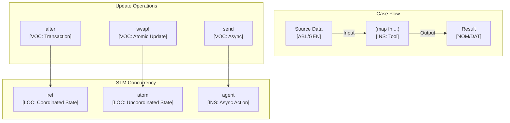

# Clojure Language Paradigms and CEREBRUM Mapping

Clojure is a dynamic, functional dialect of the Lisp programming language that primarily targets the Java Virtual Machine (JVM), but also has implementations for the Common Language Runtime (CLR) and JavaScript. It emphasizes immutability, persistent data structures, first-class functions, a powerful macro system, and built-in support for concurrency (e.g., Software Transactional Memory - STM).

## 1. Overview of Clojure Paradigms

- **Functional Programming**: Core paradigm. Immutability by default, persistent data structures, first-class functions, recursion, laziness.
- **Lisp Dialect**: Homoiconic (code is data), syntax based on S-expressions (lists), powerful macro system for compile-time code generation.
- **Concurrency Focus**: Provides mechanisms like Refs (for STM), Atoms (for uncoordinated atomic updates), Agents (for asynchronous actions), and Vars (for thread-local state) to manage state safely in concurrent environments.
- **Hosted Language**: Runs on host platforms (JVM, CLR, JS), allowing seamless interoperability with host libraries (e.g., Java libraries).
- **Dynamic Typing**: Types are checked at runtime, but optional type hinting is available for performance and clarity.
- **Data-Oriented**: Emphasis on generic data structures (lists, vectors, maps, sets) and functions that operate on them.

Relationships are primarily defined through function application (prefix notation), data structure manipulation (usually creating new structures rather than modifying), macro expansion, concurrency primitives, and host interoperability.

## 2. Mapping CEREBRUM Cases to Clojure Concepts

| CEREBRUM Case | Clojure Equivalent/Analogy | Correspondence Strength | Notes |
|---------------|----------------------------|-------------------------|-------|
| **Nominative [NOM]** | Result of function/expression; Symbol bound via `let`/`def`; Function itself; Atom/Ref/Agent state after update | Strong | Entity resulting from computation, the active function, or bound value/state. |
| **Accusative [ACC]** | Function argument; Collection being processed (`map`, `filter`); State being updated (conceptually, via Atom/Ref update functions) | Strong | Entity receiving action or being processed. Immutable data isn't directly modified. |
| **Dative [DAT]** | Symbol receiving binding (`let [sym val]`); Target of `return` value contextually; Target of `swap!` or `send` | Strong | Recipient of data, binding, or asynchronous action target. |
| **Genitive [GEN]** | Function argument (source); Function return value; Value bound to symbol; Map/Vector lookup (`(:key map)`, `(get vec idx)`); Atom/Ref dereferenced value (`@atom`) | Strong | Source of data, value, attribute, or state. |
| **Instrumental [INS]** | Function definition (`defn`); Macro definition (`defmacro`); Operator function (`+`, `*`); Protocol/Multimethod definition; The function/macro itself | Strong | The tool, function, macro, or protocol used. |
| **Ablative [ABL]** | Input argument; Source collection (`map`, `filter`); Source symbol in binding; Atom/Ref/Agent before update | Strong | Origin of data or iteration stream; source state. |
| **Locative [LOC]** | Namespace (`ns`); `let` binding scope; Function scope; Data structure (map, vector, list); JVM/Host platform | Strong | Context, container, namespace, or scope. |
| **Vocative [VOC]** | Function application (`(func arg1 arg2)`); Macro expansion; `deref` (`@`); `swap!`/`reset!`/`send`; Java interop call (`(.method obj args)`) | Strong | Direct invocation, state update trigger, or macro expansion. |

## 3. Key Clojure Features and Case Relationships

### S-Expressions and Function Calls

Prefix notation `(function arg1 arg2 ...)` is fundamental.

```clojure
; Define a variable (NOM/DAT binding, GEN source)
(def my-name "Clojure")

; Function definition (INS tool)
(defn greet [target] ; target is ACC/GEN
  ; str function is INS tool, strings are GEN sources
  (str "Hello, " target "!")) ; Returns GEN string

; Function call (VOC)
; greet is INS tool, my-name provides GEN source
(let [message (greet my-name)] ; message is NOM/DAT binding
  (println message)) ; VOC println, message is ACC/GEN

; Arithmetic (INS functions +, *)
(let [x 5
      y 3
      sum (+ x y) ; sum is NOM/DAT, x/y are GEN sources
      product (* x y)] ; product is NOM/DAT
  (println (str "Sum: " sum ", Product: " product)))
```

### Persistent Data Structures

Collections are immutable; operations return new collections.

```clojure
; Vector (NOM/LOC)
(def numbers [1 2 3 4])

; Map (NOM/LOC)
(def person {:name "Rich" :language "Clojure"})

; Accessing elements (GEN access)
(println (str "First number: " (get numbers 0))) ; get is INS tool
(println (str "Person's name: " (:name person))) ; Keyword lookup is INS tool

; "Adding" element returns new vector (assoc is INS)
; numbers is ABL/GEN source
(let [new-numbers (conj numbers 5)] ; new-numbers is NOM/DAT
  (println (str "Original numbers: " numbers))
  (println (str "New numbers: " new-numbers)))

; "Updating" map returns new map (assoc is INS)
; person is ABL/GEN source
(let [updated-person (assoc person :founded 2007)] ; updated-person is NOM/DAT
  (println (str "Original person: " person))
  (println (str "Updated person: " updated-person)))
```

### Concurrency Primitives (Atoms)

Atoms provide safe, uncoordinated, atomic updates to shared state.

```clojure
; Atom definition (NOM reference to mutable state)
; Initial state {count: 0} is GEN source
(def counter (atom {:count 0}))

; Accessing Atom state (VOC deref/@, GEN result)
(println (str "Initial count: " (:count @counter)))

; Update Atom state (VOC swap!)
; swap! is INS tool applying update function
; counter is ACC reference being updated
; update-in is INS function, [:count] is LOC path, inc is INS tool
(swap! counter update-in [:count] inc)
(swap! counter update-in [:count] inc)

(println (str "Count after increments: " (:count @counter))) ; GEN access

; Reset Atom state (VOC reset!, replaces entire state)
; counter is ACC reference
; {count: 100} is GEN new state
(reset! counter {:count 100})
(println (str "Count after reset: " (:count @counter))) ; GEN access
```

*Mermaid Diagram: `swap!` Flow*

```mermaid
graph TD
    Start --> SwapCall[VOC: swap! counter update-fn args];
    CounterRef[ACC: counter (Atom Ref)] --> SwapCall;
    UpdateFn[INS: update-fn (e.g., update-in)] --> SwapCall;
    Args[ACC/GEN: args (e.g., [:count] inc)] --> SwapCall;
    SwapCall --> ReadState{Read Current State (GEN)};
    ReadState --> ApplyFn{Apply update-fn to State + Args};
    ApplyFn --> NewState[NOM: New State Value];
    NewState --> CAS{Atomic Compare-and-Set on Atom Ref};
    CAS -- Success --> UpdateRef[Update Atom Ref with New State (DAT)];
    CAS -- Failure (State Changed) --> ReadState;  // Retry loop
    UpdateRef --> Result[Return New State (GEN)];
```

### Macros

Compile-time code generation (INS tools creating code).

```clojure
; Macro definition (INS tool)
(defmacro unless [condition & body]
  ; ` is syntax-quote, ~ is unquote
  `(if (not ~condition) ; Generates code at compile time
     (do ~@body))) ; do is INS, body is ACC/GEN code block

; Macro usage (VOC macro expansion at compile time)
(let [x 10]
  (unless (= x 5) ; Macro call
    (println "x is not 5")) ; This code is placed inside the generated if
  (unless (= x 10)
    (println "This won't print")))
```

### Java Interoperability

Seamless calls to Java code.

```clojure
; Import Java class (INS directive)
(import java.util.Date)

; Call Java constructor (VOC interop)
; Date. is LOC/INS class reference
(let [now (Date.)] ; now is NOM/DAT instance of java.util.Date
  ; Call Java instance method (VOC interop)
  ; .toString is INS method reference
  ; now is NOM/ACC receiver
  (println (str "Current time (Java Date): " (.toString now))))

; Call static Java method (VOC interop)
; System is LOC/INS class reference
; currentTimeMillis is INS method reference
(let [millis (System/currentTimeMillis)] ; millis is NOM/DAT
  (println (str "Milliseconds since epoch: " millis)))
```

## 4. Implementation Approach

Case roles in Clojure arise naturally from its functional, Lisp-based structure:

1. **Function Application**: `(func arg1 ...)` clearly shows the INS tool (`func`) and ACC/GEN arguments.
2. **Bindings (`let`, `def`)**: `=` is not assignment but binding. `let [symbol value]` binds NOM/DAT `symbol` to GEN `value` within a LOC scope.
3. **Immutability**: Operations on collections return new NOM/DAT values derived from ABL/GEN sources, reinforcing the source/result distinction.
4. **Concurrency Primitives**: Functions like `swap!`, `reset!`, `send` are VOC triggers operating on ACC references using INS functions, yielding new NOM states.
5. **Macros**: INS tools that transform ACC/GEN code structures at compile time.
6. **Keywords/Special Forms**: `if`, `let`, `fn`, `defn`, `loop` are built-in INS constructs defining control flow or structure.

Explicit CEREBRUM modeling is unnecessary; the roles are inherent in the functional, immutable, data-centric evaluation model.

## 5. Conclusion

Clojure's functional Lisp nature provides a very clear mapping to CEREBRUM cases, often more explicit due to immutability:

- Functions and macros are distinct **INS** tools invoked via **VOC** prefix notation.
- Immutable data structures serve as **ABL/GEN** sources, with functions producing new **NOM/DAT** result structures.
- `let` bindings clearly establish **NOM/DAT** symbols for **GEN** values within **LOC** scopes.
- Concurrency atoms/refs/agents encapsulate **NOM** state, updated via **VOC** calls (`swap!`, `send`) acting as triggers on the **ACC** reference using **INS** functions.
- Homoiconicity means code itself can be treated as **ACC/GEN** data by **INS** macros.

The emphasis on pure functions operating on immutable data makes the flow of information (GEN sources to NOM results via INS functions) exceptionally clear.

## 6. Advanced CEREBRUM Implementation

### Protocol-Based Case System

```clojure
(ns cerebrum.cases
  (:require [clojure.spec.alpha :as s]))

;; Case precision modifiers (Active Inference)
(def case-precision
  {:nom 1.5
   :acc 1.2
   :dat 1.3
   :gen 1.0
   :ins 0.8
   :abl 1.1
   :loc 0.9
   :voc 2.0})

;; Valid transitions
(def valid-transitions
  {:nom #{:acc :gen}
   :acc #{:gen :dat}
   :abl #{:nom}
   :loc #{:abl}})

;; Protocol for case-bearing entities
(defprotocol ICaseBearer
  (get-case [this] "Return current case role")
  (get-base [this] "Return base value")
  (effective-precision [this] "Return case-adjusted precision")
  (transform-to [this target-case] "Transform to new case"))

;; Case entity record
(defrecord CaseEntity [base case-role precision history]
  ICaseBearer
  (get-case [_] case-role)
  (get-base [_] base)
  (effective-precision [_]
    (* precision (get case-precision case-role 1.0)))
  (transform-to [this target]
    (let [valid (get valid-transitions case-role #{})]
      (if (contains? valid target)
        (assoc this
               :case-role target
               :history (conj history {:from case-role :to target :time (System/currentTimeMillis)}))
        (throw (ex-info "Invalid transition" {:from case-role :to target}))))))

(defn case-entity
  "Create a new case entity"
  ([base] (case-entity base :nom 1.0))
  ([base case-role] (case-entity base case-role 1.0))
  ([base case-role precision]
   (->CaseEntity base case-role precision [])))

;; Spec validation
(s/def ::case-role #{:nom :acc :dat :gen :ins :abl :loc :voc})
(s/def ::precision (s/and number? pos?))
(s/def ::case-entity (s/keys :req-un [::base ::case-role ::precision]))
```

### Active Inference Implementation

```clojure
(ns cerebrum.active-inference
  (:require [cerebrum.cases :refer :all]))

;; Belief state
(defrecord BeliefState [mean precision])

(defn belief-state
  "Create initial belief state"
  ([] (belief-state 0.0 1.0))
  ([mean precision] (->BeliefState mean precision)))

(defn update-belief
  "Bayesian belief update with observation"
  [belief observation obs-precision]
  (let [total-precision (+ (:precision belief) obs-precision)
        new-mean (/ (+ (* (:precision belief) (:mean belief))
                       (* obs-precision observation))
                    total-precision)]
    (->BeliefState new-mean total-precision)))

;; Active Inference Agent
(defrecord ActiveInferenceAgent [entity belief])

(defn ai-agent
  "Create Active Inference agent"
  [base case-role initial-mean]
  (->ActiveInferenceAgent
   (case-entity base case-role)
   (belief-state initial-mean 1.0)))

(defn observe
  "Update agent belief with case-adjusted precision"
  [agent observation base-obs-precision]
  (let [adjusted-precision (* base-obs-precision
                               (effective-precision (:entity agent)))]
    (update agent :belief update-belief observation adjusted-precision)))

(defn free-energy
  "Calculate variational free energy"
  [agent observation]
  (let [{:keys [mean precision]} (:belief agent)
        pred-error (- observation mean)
        eff-precision (* precision (effective-precision (:entity agent)))]
    (/ (* pred-error pred-error eff-precision) 2.0)))

(defn predict
  "Return predicted observation"
  [agent]
  (get-in agent [:belief :mean]))

(defn select-action
  "Select action minimizing expected free energy"
  [agent possible-observations]
  (reduce (fn [[best-obs min-fe] obs]
            (let [fe (free-energy agent obs)]
              (if (< fe min-fe)
                [obs fe]
                [best-obs min-fe])))
          [nil Double/POSITIVE_INFINITY]
          possible-observations))

;; Usage example
(comment
  (def agent (ai-agent "Processor" :nom 5.0))
  (def agent2 (observe agent 6.0 0.5))
  (predict agent2)
  (select-action agent2 [4.0 5.0 6.0 7.0])
  )
```

### Transactional Case State (STM)

```clojure
(ns cerebrum.stm-cases
  (:require [cerebrum.cases :refer :all]
            [cerebrum.active-inference :refer :all]))

;; Ref-based case state with STM
(defn create-case-ref
  "Create a ref-wrapped case entity"
  [base initial-case]
  (ref (case-entity base initial-case)))

;; Transactional case transformation
(defn transform-in-tx!
  "Transform case within a transaction"
  [case-ref target-case]
  (dosync
   (alter case-ref transform-to target-case)))

;; Multi-entity coordinated update
(defn coordinate-entities!
  "Perform coordinated case transformations"
  [& entity-target-pairs]
  (dosync
   (doseq [[entity-ref target] (partition 2 entity-target-pairs)]
     (alter entity-ref transform-to target))))

;; Agent-based async case operations
(defn create-case-agent
  "Create an agent-wrapped case entity for async ops"
  [base initial-case]
  (agent (case-entity base initial-case)))

(defn async-transform!
  "Transform case asynchronously"
  [case-agent target-case]
  (send case-agent transform-to target-case))

;; Active Inference with atoms
(defn create-ai-atom
  "Create an atom-wrapped AI agent"
  [base case-role initial-mean]
  (atom (ai-agent base case-role initial-mean)))

(defn observe!
  "Update belief atomically"
  [ai-atom observation obs-precision]
  (swap! ai-atom observe observation obs-precision))

;; Example coordinated system
(comment
  (def source-ref (create-case-ref "Source" :abl))
  (def target-ref (create-case-ref "Target" :dat))
  (def processor-ref (create-case-ref "Processor" :nom))
  
  ;; Coordinate transformations
  (coordinate-entities!
   source-ref :nom
   target-ref :acc)
  
  ;; AI agent updates
  (def ai (create-ai-atom "Model" :nom 5.0))
  (observe! ai 6.0 0.5)
  @ai
  )
```

### Spec-Validated Case Operations

```clojure
(ns cerebrum.validated
  (:require [clojure.spec.alpha :as s]
            [cerebrum.cases :refer :all]))

;; Spec definitions
(s/def ::case-role #{:nom :acc :dat :gen :ins :abl :loc :voc})
(s/def ::base any?)
(s/def ::precision (s/and number? pos?))
(s/def ::transition (s/tuple ::case-role ::case-role))

(s/def ::case-entity
  (s/and (s/keys :req-un [::base ::case-role ::precision])
         #(satisfies? ICaseBearer %)))

;; Validated transformation
(s/fdef transform-to
  :args (s/cat :entity ::case-entity :target ::case-role)
  :ret ::case-entity
  :fn (fn [{:keys [args ret]}]
        (contains? (get valid-transitions (:case-role (:entity args)) #{})
                   (:target args))))

;; Case-aware function composition
(defn with-case-context
  "Execute function with case context"
  [case-role f]
  (fn [& args]
    {:result (apply f args)
     :case case-role
     :precision (get case-precision case-role 1.0)}))

;; Pipeline with case tracking
(defn case-pipeline
  "Execute pipeline tracking case at each step"
  [initial-case & steps]
  (reduce
   (fn [acc [step-fn target-case]]
     (let [result (step-fn (:value acc))]
       (-> acc
           (assoc :value result)
           (assoc :case target-case)
           (update :history conj {:from (:case acc)
                                   :to target-case
                                   :value result}))))
   {:value nil :case initial-case :history []}
   steps))

;; Example usage
(comment
  (case-pipeline :abl
                 [identity :nom]
                 [#(* % 2) :acc]
                 [#(+ % 5) :gen])
  )
```

### Macro-Based Case DSL

```clojure
(ns cerebrum.dsl
  (:require [cerebrum.cases :refer :all]))

;; DSL macro for case operations
(defmacro with-case
  "Execute body with case context"
  [case-role & body]
  `(let [~'current-case ~case-role
         ~'case-precision (get case-precision ~case-role 1.0)]
     ~@body))

(defmacro defcase-fn
  "Define a function with case role documentation"
  [name case-role args & body]
  `(defn ~name
     ~(str "Case role: " case-role)
     {:case-role ~case-role}
     ~args
     (with-case ~case-role
       ~@body)))

;; Case transition macro
(defmacro case-transition
  "Execute transition with logging"
  [entity from-case to-case & body]
  `(do
     (println (format "[TRANSITION] %s -> %s" ~from-case ~to-case))
     (let [result# (transform-to ~entity ~to-case)]
       ~@body
       result#)))

;; Example DSL usage
(defcase-fn process-data :nom
  [data]
  (str "Processed: " data " with precision " case-precision))

(comment
  (process-data "test")
  
  (with-case :nom
    (println "Current case:" current-case)
    (println "Precision:" case-precision))
  
  (def entity (case-entity "Test" :nom))
  (case-transition entity :nom :acc
    (println "Transition complete"))
  )
```

## 7. Mermaid Diagram: Clojure Case Architecture



## 8. References

1. Halloway, S., & Bedra, A. (2014). *Programming Clojure* (3rd ed.). Pragmatic Bookshelf.
2. Hickey, R. (Creator of Clojure) - Various talks (e.g., "Simple Made Easy").
3. Clojure Official Website & Documentation. (<https://clojure.org/>)
4. ClojureDocs - Community Documentation. (<https://clojuredocs.org/>)
5. Fogus, M., & Houser, C. (2011). *The Joy of Clojure*. Manning Publications.
6. Friston, K. (2010). The free-energy principle. Nature Reviews Neuroscience.
7. Emerick, C., Carper, B., & Grand, C. (2012). Clojure Programming. O'Reilly Media.
