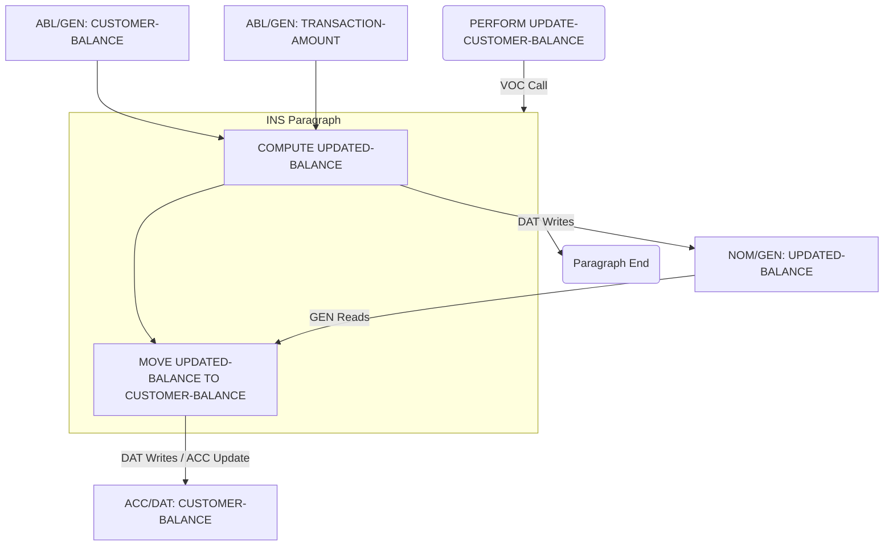

# COBOL Language Paradigms and CEREBRUM Mapping

COBOL (Common Business-Oriented Language) is one of the oldest programming languages, designed specifically for business, finance, and administrative systems. Its paradigm is primarily procedural and highly structured, with a verbose, English-like syntax. Mapping CEREBRUM cases requires interpreting COBOL's data structures and procedural flow.

## 1. Overview of COBOL Paradigms

COBOL is characterized by:

- **Procedural Programming**: Programs organized into Divisions, Sections, Paragraphs, and Sentences (statements).
- **Structured Data**: Highly structured data definitions in the `DATA DIVISION`, using levels (e.g., 01, 05, 10) and `PICTURE` clauses.
- **Verbosity**: English-like syntax intended for readability by non-programmers (e.g., `MOVE A TO B`, `ADD X TO Y GIVING Z`).
- **File Handling**: Strong focus on processing files, especially record-oriented files.
- **Mainframe Heritage**: Widely used on mainframe systems for batch and transaction processing.
- **Object-Oriented COBOL**: An extension exists but is less common than the procedural style.

Relationships in COBOL are defined by data structures, control flow verbs (`PERFORM`, `CALL`), and data manipulation verbs (`MOVE`, `ADD`, `COMPUTE`).

## 2. Mapping CEREBRUM Cases to COBOL Concepts

Mapping cases involves looking at the roles of data items and paragraphs/subprograms within the procedural flow.

| CEREBRUM Case | COBOL Equivalent/Analogy | Correspondence Strength | Notes |
|---------------|--------------------------|-------------------------|-------|
| **Nominative [NOM]** | Subject data item (e.g., result of `COMPUTE`); Paragraph being performed | Strong | The entity resulting from computation or the active procedure. |
| **Accusative [ACC]** | Data item being modified (`MOVE ... TO target`); Record being processed | Strong | The entity receiving data or undergoing processing. |
| **Dative [DAT]** | Target data item in `MOVE`, `ADD ... GIVING target`; Subprogram receiving parameters | Strong | Recipient of data or result. |
| **Genitive [GEN]** | Source data item (`MOVE source TO ...`); Component of a group item (accessed via qualified name) | Strong | Source of data or component part. |
| **Instrumental [INS]** | Paragraph/Section performing logic; Subprogram (`CALL 'PROG' USING ...`); Control verb (`PERFORM`) | Strong | The procedure, tool, or mechanism used. |
| **Ablative [ABL]** | Input file/record; Source data item in calculation | Strong | Origin of data. |
| **Locative [LOC]** | `WORKING-STORAGE SECTION`; `FILE SECTION`; Group data item; Program scope | Strong | Context or container for data or procedures. |
| **Vocative [VOC]** | `PERFORM paragraph`; `CALL 'subprogram'`; `READ file` | Strong | Direct invocation of procedure or I/O operation. |

## 3. Key COBOL Features and Case Relationships

### Data Division

Data structures define entities and their relationships (LOC, GEN):

```cobol
       IDENTIFICATION DIVISION.
       PROGRAM-ID. DATA-DEMO.
       DATA DIVISION.
       WORKING-STORAGE SECTION.  *> LOC Container
       01  CUSTOMER-RECORD.      *> LOC Group Item
           05 CUSTOMER-ID    PIC 9(5).    *> GEN Component
           05 CUSTOMER-NAME   PIC X(30).   *> GEN Component
           05 CUSTOMER-BALANCE PIC S9(7)V99. *> GEN Component (Signed, Decimal)
       
       01  TRANSACTION-AMOUNT    PIC S9(5)V99. *> NOM/GEN Variable
       01  UPDATED-BALANCE       PIC S9(7)V99. *> NOM/GEN Variable
```

### Procedure Division

Verbs control data flow and procedure execution:

```cobol
       PROCEDURE DIVISION.
       MAIN-LOGIC.
           *> Initialization (Define NOM values)
           MOVE 12345 TO CUSTOMER-ID.       *> 12345 is GEN source, CUSTOMER-ID is DAT target
           MOVE "Alice Wonderland" TO CUSTOMER-NAME. *> String literal is GEN source
           MOVE +1500.75 TO CUSTOMER-BALANCE. *> Numeric literal is GEN source
           MOVE -250.25 TO TRANSACTION-AMOUNT. *> Literal is GEN source

           DISPLAY "Initial Record: " CUSTOMER-RECORD. *> CUSTOMER-RECORD is ACC

           *> Perform a paragraph (VOC invocation of INS paragraph)
           PERFORM UPDATE-CUSTOMER-BALANCE.
           
           DISPLAY "Updated Record: " CUSTOMER-RECORD.
           DISPLAY "Final Balance Separately: " UPDATED-BALANCE.

           STOP RUN.

       *> Paragraph definition (INS tool)
       UPDATE-CUSTOMER-BALANCE.
           DISPLAY "Performing Balance Update..."
           *> COMPUTE statement (INS tool)
           *> CUSTOMER-BALANCE is ABL/GEN source
           *> TRANSACTION-AMOUNT is ABL/GEN source
           *> UPDATED-BALANCE is DAT target (also NOM result)
           COMPUTE UPDATED-BALANCE = CUSTOMER-BALANCE + TRANSACTION-AMOUNT.
           
           *> MOVE statement (INS tool)
           *> UPDATED-BALANCE is GEN source
           *> CUSTOMER-BALANCE is DAT target (also ACC being updated)
           MOVE UPDATED-BALANCE TO CUSTOMER-BALANCE.
```

*Mermaid Diagram: `UPDATE-CUSTOMER-BALANCE` Paragraph Flow*


### File Handling

Processing records from files:

```cobol
       IDENTIFICATION DIVISION.
       PROGRAM-ID. FILE-DEMO.
       ENVIRONMENT DIVISION.
       INPUT-OUTPUT SECTION.
       FILE-CONTROL.
           *> Define file (LOC/ABL source)
           SELECT INPUT-FILE ASSIGN TO "input.dat"
               ORGANIZATION IS LINE SEQUENTIAL. *> File structure details
       DATA DIVISION.
       FILE SECTION. *> LOC for file record descriptions
       FD  INPUT-FILE.
       01  INPUT-RECORD        PIC X(80). *> GEN layout for file data
       
       WORKING-STORAGE SECTION. *> LOC container
       01  WS-EOF-FLAG         PIC X VALUE 'N'. *> NOM variable
           88 EOF              VALUE 'Y'. *> Condition name (GEN)
       01  WS-RECORD-COUNT     PIC 9(5) VALUE ZERO. *> NOM variable

       PROCEDURE DIVISION.
       MAIN-PROCESSING.
           *> Open file (VOC/INS action on ABL source)
           OPEN INPUT INPUT-FILE.

           *> Perform read loop (VOC call to INS paragraph)
           PERFORM READ-NEXT-RECORD UNTIL EOF.
           
           *> Close file (VOC/INS action)
           CLOSE INPUT-FILE.
           
           DISPLAY "Total records processed: " WS-RECORD-COUNT.
           STOP RUN.

       READ-NEXT-RECORD. *> INS paragraph
           *> Read from file (VOC action)
           *> INPUT-FILE is ABL source
           *> INPUT-RECORD is ACC/DAT target
           READ INPUT-FILE 
               AT END MOVE 'Y' TO WS-EOF-FLAG *> Modify NOM flag on condition
               NOT AT END PERFORM PROCESS-RECORD *> Conditional VOC call
           END-READ.

       PROCESS-RECORD. *> INS paragraph
           *> INPUT-RECORD is ACC data being processed
           DISPLAY "Processing Record: " INPUT-RECORD.
           ADD 1 TO WS-RECORD-COUNT. *> Modify NOM counter (1 is GEN source)
```

### Subprograms (`CALL`)

Invoking separate programs:

```cobol
       *> --- Calling Program --- 
       IDENTIFICATION DIVISION.
       PROGRAM-ID. CALLER.
       DATA DIVISION.
       WORKING-STORAGE SECTION.
       01  PARAM-A PIC 9(3) VALUE 10.
       01  PARAM-B PIC X(5) VALUE "TEST".
       01  RESULT-C PIC 9(4).
       PROCEDURE DIVISION.
           DISPLAY "Calling SUBPROG..."
           *> CALL statement (VOC invocation)
           *> 'SUBPROG' is INS tool (subprogram name)
           *> USING specifies parameters (ACC/DAT depending on subprogram)
           CALL 'SUBPROG' USING PARAM-A, PARAM-B, RESULT-C.
           
           DISPLAY "Returned from SUBPROG."
           DISPLAY "Result C: " RESULT-C. *> RESULT-C is potentially updated (DAT)
           STOP RUN.

       *> --- Called Subprogram (SUBPROG.cob) --- 
       IDENTIFICATION DIVISION.
       PROGRAM-ID. SUBPROG.
       DATA DIVISION.
       LINKAGE SECTION. *> LOC for parameters received
       01  LINK-A   PIC 9(3).
       01  LINK-B   PIC X(5).
       01  LINK-C   PIC 9(4).
       PROCEDURE DIVISION USING LINK-A, LINK-B, LINK-C. *> Receive params (ACC/DAT)
           DISPLAY "SUBPROG Entered."
           DISPLAY "Received A: " LINK-A.
           DISPLAY "Received B: " LINK-B.
           
           *> Process received data (ACC)
           COMPUTE LINK-C = LINK-A * 5. *> LINK-C is DAT target
           
           DISPLAY "SUBPROG Exiting."
           EXIT PROGRAM.
```

## 4. Implementation Approach

Explicit CEREBRUM modeling is unnatural in standard procedural COBOL. Case roles are inferred from:

1.  **Data Item Usage**: Whether a data item is primarily a source (`MOVE source ...`, operands in `COMPUTE`), a target (`MOVE ... TO target`, `GIVING target`), or both.
2.  **Paragraph/Subprogram Role**: Paragraphs (`PERFORM`) and subprograms (`CALL`) act as instruments (INS) performing actions.
3.  **Control Flow**: Verbs like `READ`, `WRITE`, `PERFORM`, `CALL` represent direct invocations (VOC) on sources (ABL), targets (DAT), or instruments (INS).
4.  **Data Structure**: Group items (LOC) contain elementary items (GEN).

Documentation (comments) is the primary way to denote intended case roles in traditional COBOL.

```cobol
       *> Example with comments indicating roles
       PROCESS-TRANSACTION.
           *> MOVE CUSTOMER-ID (GEN) TO WS-CUSTOMER-KEY (DAT).
           MOVE CUSTOMER-ID IN CUSTOMER-INPUT-RECORD 
             TO WS-CUSTOMER-KEY.
           
           *> PERFORM (VOC) VALIDATE-CUSTOMER (INS) USING WS-CUSTOMER-KEY (ACC).
           PERFORM VALIDATE-CUSTOMER USING WS-CUSTOMER-KEY.
           
           *> IF VALID-CUSTOMER-FLAG (NOM) = 'Y' (GEN)
           IF VALID-CUSTOMER-FLAG = 'Y'
               *> PERFORM (VOC) APPLY-UPDATE (INS) 
               *>   USING CUSTOMER-INPUT-RECORD (ACC)
               *>   GIVING UPDATE-STATUS (DAT).
               PERFORM APPLY-UPDATE 
                   USING CUSTOMER-INPUT-RECORD
                   GIVING UPDATE-STATUS
           END-IF.
```

## 5. Conclusion

COBOL's procedural and data-centric nature provides analogies for CEREBRUM cases, although less explicit than in OO or functional languages:

- Data items clearly map to **GEN** (source), **DAT** (target), **ACC** (modified), **NOM** (result) based on their use in statements.
- `DATA DIVISION` structures define **LOC** (Sections, Group Items) and **GEN** (Elementary Items) relationships.
- Procedural verbs like `PERFORM`, `CALL`, `READ`, `WRITE` represent **VOC** invocations.
- Paragraphs and called subprograms act as **INS** mechanisms.
- Files and input records serve as primary **ABL** sources.

Understanding case roles in COBOL relies heavily on analyzing the procedural flow and how specific verbs manipulate data items defined in the `DATA DIVISION`. Explicit modeling is generally not idiomatic.

## 6. References

1. Stern, N. B., Stern, R. A., & Ley, J. P. (2015). COBOL for the 21st Century (11th ed.). Wiley.
2. IBM COBOL Language Reference (Specific version relevant to environment).
3. Micro Focus COBOL Documentation (Specific version).
4. Online COBOL Tutorials (e.g., TutorialsPoint, Mainframe Gurukul). 