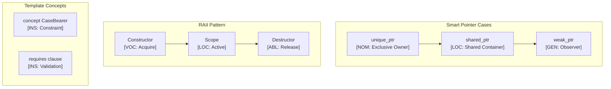

# C++ Language Paradigms and CEREBRUM Mapping

C++ is a general-purpose programming language with multiple paradigms, known for its performance, efficiency, and flexibility. This document explores how C++'s features map to CEREBRUM's case system.

## 1. Overview of C++ Paradigms

C++ supports several programming paradigms:

- **Procedural Programming**: Derived from C, with functions and structured code
- **Object-Oriented Programming**: Classes, inheritance, polymorphism, encapsulation
- **Generic Programming**: Templates for type-agnostic code
- **Functional Programming**: First-class functions, lambdas
- **Low-level Memory Manipulation**: Direct memory access, pointers

C++ allows fine-grained control over system resources while supporting high-level abstractions.

## 2. Mapping CEREBRUM Cases to C++ Concepts

| CEREBRUM Case | C++ Equivalent/Analogy | Correspondence Strength | Notes |
|---------------|------------------------|-------------------------|-------|
| **Nominative [NOM]** | Object (`obj.method()`); `this` pointer; Variable declaration (`Type var`) | Strong | The acting entity or subject. |
| **Accusative [ACC]** | Function parameter (by value); Object being modified | Strong | Entity receiving the action. |
| **Dative [DAT]** | Function parameter (destination); Output parameter (`&result`); Callback recipient | Strong | Recipient of data or result. |
| **Genitive [GEN]** | Member access (`obj.member`); Namespace access (`ns::item`); Return value | Strong | Source or possession. |
| **Instrumental [INS]** | Function/algorithm as parameter; Utility classes; Iterator; Smart pointer | Strong | Tool or means for operation. |
| **Ablative [ABL]** | Container being iterated; Input stream; Source object | Moderate | Origin of data or operation. |
| **Locative [LOC]** | Scope/namespace; Container object; Memory address | Strong | Location or context. |
| **Vocative [VOC]** | Function call; Constructor invocation; Operator overload call | Strong | Direct invocation. |

## 3. Key C++ Features and Case Relationships

### Classes and Objects

```cpp
#include <iostream>
#include <string>

// Class definition (blueprint for NOM entities)
class Person {
private:
    // Member variables (GEN sources for object attributes)
    std::string name;
    int age;
    
public:
    // Constructor (creates ACC entity)
    Person(std::string n, int a) : name(n), age(a) {
        // 'this' is ACC (receiving initialization)
    }
    
    // Method with 'this' as NOM (performing action)
    void celebrateBirthday() {
        // 'this' is NOM (acting entity)
        age++;
        std::cout << name << " is now " << age << " years old!" << std::endl;
    }
    
    // Getter (returns GEN derived value)
    std::string getName() const {
        return name;  // GEN (derived value)
    }
    
    // Method with parameters (message = DAT receiving data)
    void receiveMessage(const std::string& message) const {
        std::cout << name << " received: " << message << std::endl;
    }
};

int main() {
    // Create object (person is ACC being created)
    Person person("Alice", 30);  // Constructor is VOC (directly invoked)
    
    // Method call (person is NOM acting entity)
    person.celebrateBirthday();
    
    // Get property (person is GEN source)
    std::string name = person.getName();
    
    // Call with parameter
    person.receiveMessage("Hello!");  // "Hello!" is DAT (content received)
    
    return 0;
}
```

### Memory Management and Pointers

```cpp
#include <memory>
#include <iostream>

void processData(int* data, size_t size, int* result) {
    // data is ABL (source of data)
    // result is DAT (destination for output)
    *result = 0;
    for (size_t i = 0; i < size; i++) {
        *result += data[i];
    }
}

int main() {
    // Raw pointers
    int numbers[] = {1, 2, 3, 4, 5};  // ABL (source array)
    int sum = 0;  // DAT (will receive result)
    
    // Function call with pointers
    processData(numbers, 5, &sum);  // &sum is DAT (address as destination)
    std::cout << "Sum: " << sum << std::endl;
    
    // Smart pointers
    {
        // Create a unique_ptr (INS tool for memory management)
        std::unique_ptr<int[]> data(new int[5]{10, 20, 30, 40, 50});
        
        // Use smart pointer (data is ABL source)
        int result = 0;  // DAT (will receive result)
        processData(data.get(), 5, &result);
        std::cout << "Result: " << result << std::endl;
        
        // Memory automatically freed when unique_ptr goes out of scope
    }
    
    return 0;
}
```

### Templates and Generic Programming

```cpp
#include <iostream>
#include <vector>
#include <algorithm>

// Generic function template (INS tool with type flexibility)
template <typename T>
void printCollection(const std::vector<T>& collection, const std::string& label) {
    // collection is ABL (source of data)
    // label is INS (helps with formatting)
    std::cout << label << ": ";
    for (const auto& item : collection) {
        std::cout << item << " ";
    }
    std::cout << std::endl;
}

// Function object (INS tool)
struct Multiplier {
    int factor;
    
    Multiplier(int f) : factor(f) {}
    
    // Operator() makes this a function object
    int operator()(int value) const {
        return value * factor;
    }
};

int main() {
    // Create vector (ABL source)
    std::vector<int> numbers = {1, 2, 3, 4, 5};
    
    // Use generic function (numbers is ABL source)
    printCollection(numbers, "Original");
    
    // Create transformed vector (result is ACC receiving transformed values)
    std::vector<int> result;
    result.resize(numbers.size());
    
    // Use std::transform algorithm with function object
    // numbers is ABL (source)
    // Multiplier(3) is INS (tool for transformation)
    // result.begin() points to DAT (destination for results)
    std::transform(
        numbers.begin(), numbers.end(),  // Source range (ABL)
        result.begin(),                  // Destination (DAT)
        Multiplier(3)                    // Tool (INS)
    );
    
    // Print result
    printCollection(result, "Multiplied by 3");
    
    return 0;
}
```

## 4. Implementation Approach

Here's a simplified example of implementing CEREBRUM cases in C++:

```cpp
#include <iostream>
#include <string>
#include <unordered_map>
#include <memory>

// Case enumeration
enum class Case {
    NOM, ACC, DAT, GEN, INS, ABL, LOC, VOC
};

// Base wrapper for case-bearing objects
template <typename T>
class CaseWrapper {
private:
    std::shared_ptr<T> baseObject;
    Case currentCase;
    std::unordered_map<std::string, std::string> properties;

public:
    // Constructor
    CaseWrapper(T* obj, Case initialCase)
        : baseObject(obj), currentCase(initialCase) {}
    
    // Get the current case
    Case getCase() const { return currentCase; }
    
    // Access the base object
    T* get() { return baseObject.get(); }
    const T* get() const { return baseObject.get(); }
    
    // Transform to a different case
    CaseWrapper<T> as(Case newCase) const {
        CaseWrapper<T> result(baseObject.get(), newCase);
        // Copy properties
        result.properties = this->properties;
        return result;
    }
    
    // Property management
    void setProperty(const std::string& key, const std::string& value) {
        properties[key] = value;
    }
    
    std::string getProperty(const std::string& key) const {
        auto it = properties.find(key);
        return (it != properties.end()) ? it->second : "";
    }
    
    // Output representation
    friend std::ostream& operator<<(std::ostream& os, const CaseWrapper<T>& wrapper) {
        os << "[" << getCaseName(wrapper.currentCase) << "] " 
           << *wrapper.baseObject;
        return os;
    }
    
private:
    // Helper to convert case enum to string
    static std::string getCaseName(Case c) {
        switch (c) {
            case Case::NOM: return "NOM";
            case Case::ACC: return "ACC";
            case Case::DAT: return "DAT";
            case Case::GEN: return "GEN";
            case Case::INS: return "INS";
            case Case::ABL: return "ABL";
            case Case::LOC: return "LOC";
            case Case::VOC: return "VOC";
            default: return "UNKNOWN";
        }
    }
};

// Example usage
class Message {
private:
    std::string content;
    
public:
    Message(const std::string& c) : content(c) {}
    
    const std::string& getContent() const { return content; }
    
    friend std::ostream& operator<<(std::ostream& os, const Message& msg) {
        os << "Message(\"" << msg.content << "\")";
        return os;
    }
};

// Function that enforces case relationships
void processMessage(
    const CaseWrapper<Message>& source,  // NOM (acting entity)
    CaseWrapper<Message>& target         // ACC (receiving entity)
) {
    // Verify cases
    if (source.getCase() != Case::NOM) {
        std::cout << "Warning: Source should be NOM" << std::endl;
    }
    
    if (target.getCase() != Case::ACC) {
        std::cout << "Warning: Target should be ACC" << std::endl;
    }
    
    // Process the message
    std::string content = source.get()->getContent();
    *target.get() = Message("Processed: " + content);
}

int main() {
    // Create case-bearing objects
    Message* msg1 = new Message("Hello");
    Message* msg2 = new Message("Empty");
    
    CaseWrapper<Message> source(msg1, Case::NOM);
    CaseWrapper<Message> target(msg2, Case::ACC);
    
    // Display initial state
    std::cout << "Initial: " << source << ", " << target << std::endl;
    
    // Process with correct cases
    processMessage(source, target);
    std::cout << "After processing: " << source << ", " << target << std::endl;
    
    // Transform and try again
    CaseWrapper<Message> sourceAsABL = source.as(Case::ABL);
    std::cout << "Transformed: " << sourceAsABL << std::endl;
    
    // This should generate a warning
    processMessage(sourceAsABL, target);
    
    return 0;
}
```

## 5. Conclusion

C++ offers rich case analogies through its various features:

- Pointers and references model different types of relationships (NOM, ACC, DAT)
- Member access and namespaces provide **Genitive** relationships
- Templates and function objects exemplify **Instrumental** tools
- Containers and iterators demonstrate **Locative** and **Ablative** concepts

C++'s explicit memory management and multiple inheritance present unique opportunities for modeling complex case relationships that may not be as directly expressible in languages with more constrained paradigms.

## 6. Advanced CEREBRUM Implementation

### C++20 Concepts for Case Constraints

```cpp
#include <concepts>
#include <type_traits>
#include <string>
#include <vector>
#include <memory>
#include <iostream>
#include <cmath>

// Case enumeration
enum class CaseRole {
    NOM, ACC, DAT, GEN, INS, ABL, LOC, VOC
};

// Case precision modifiers (Active Inference)
constexpr double case_precision(CaseRole role) {
    switch (role) {
        case CaseRole::NOM: return 1.5;
        case CaseRole::ACC: return 1.2;
        case CaseRole::DAT: return 1.3;
        case CaseRole::GEN: return 1.0;
        case CaseRole::INS: return 0.8;
        case CaseRole::ABL: return 1.1;
        case CaseRole::LOC: return 0.9;
        case CaseRole::VOC: return 2.0;
        default: return 1.0;
    }
}

// Concept: Type must be a CaseBearer
template<typename T>
concept CaseBearer = requires(T t) {
    { t.get_case() } -> std::same_as<CaseRole>;
    { t.get_base() } -> std::convertible_to<decltype(t.get_base())>;
    { t.effective_precision() } -> std::convertible_to<double>;
};

// Concept: Valid case transition
template<CaseRole From, CaseRole To>
concept ValidTransition = 
    (From == CaseRole::NOM && (To == CaseRole::ACC || To == CaseRole::GEN)) ||
    (From == CaseRole::ACC && (To == CaseRole::GEN || To == CaseRole::DAT)) ||
    (From == CaseRole::ABL && To == CaseRole::NOM) ||
    (From == CaseRole::LOC && To == CaseRole::ABL);

// Case-bearing wrapper with RAII semantics
template<typename T>
class CaseEntity {
private:
    T base_;
    CaseRole case_role_;
    double precision_;
    std::vector<std::pair<CaseRole, CaseRole>> history_;

public:
    // Constructor
    CaseEntity(T base, CaseRole role = CaseRole::NOM, double precision = 1.0)
        : base_(std::move(base)), case_role_(role), precision_(precision) {}
    
    // Copy constructor with case preservation
    CaseEntity(const CaseEntity& other) = default;
    
    // Move constructor
    CaseEntity(CaseEntity&& other) noexcept = default;
    
    // Getters
    CaseRole get_case() const { return case_role_; }
    const T& get_base() const { return base_; }
    T& get_base() { return base_; }
    
    double effective_precision() const {
        return precision_ * case_precision(case_role_);
    }
    
    // Case transformation (checked at compile time if possible)
    template<CaseRole Target>
    CaseEntity<T> transform() const requires ValidTransition<CaseRole::NOM, Target> {
        auto result = CaseEntity<T>(base_, Target, precision_);
        result.history_ = history_;
        result.history_.emplace_back(case_role_, Target);
        return result;
    }
    
    // Runtime case transformation with validation
    CaseEntity<T> transform_to(CaseRole target) const {
        auto result = CaseEntity<T>(base_, target, precision_);
        result.history_ = history_;
        result.history_.emplace_back(case_role_, target);
        return result;
    }
    
    // Get history
    const auto& get_history() const { return history_; }
    
    // String representation
    std::string to_string() const {
        static const char* case_names[] = {
            "NOM", "ACC", "DAT", "GEN", "INS", "ABL", "LOC", "VOC"
        };
        std::string result = "[" + std::string(case_names[static_cast<int>(case_role_)]) + "]";
        result += "(p=" + std::to_string(effective_precision()) + ")";
        return result;
    }
};

// Deduction guide
template<typename T>
CaseEntity(T, CaseRole) -> CaseEntity<T>;
```

### Active Inference Agent

```cpp
#include <optional>
#include <algorithm>
#include <limits>

// Active Inference belief state
class BeliefState {
private:
    double mean_;
    double precision_;

public:
    BeliefState(double mean = 0.0, double precision = 1.0)
        : mean_(mean), precision_(precision) {}
    
    double mean() const { return mean_; }
    double precision() const { return precision_; }
    double variance() const { return 1.0 / precision_; }
    
    // Update belief with new observation
    BeliefState update(double observation, double obs_precision) const {
        double total_precision = precision_ + obs_precision;
        double new_mean = (precision_ * mean_ + obs_precision * observation) / total_precision;
        return BeliefState(new_mean, total_precision);
    }
};

// Active Inference Agent with case-aware precision
template<typename T>
class ActiveInferenceAgent {
private:
    CaseEntity<T> entity_;
    BeliefState belief_;

public:
    ActiveInferenceAgent(T base, CaseRole role, double initial_mean)
        : entity_(std::move(base), role), belief_(initial_mean, 1.0) {}
    
    // Update belief with case-adjusted precision
    void observe(double observation, double base_obs_precision = 1.0) {
        double adjusted_precision = base_obs_precision * entity_.effective_precision();
        belief_ = belief_.update(observation, adjusted_precision);
    }
    
    // Calculate variational free energy
    double free_energy(double observation) const {
        double pred_error = observation - belief_.mean();
        double eff_precision = belief_.precision() * entity_.effective_precision();
        return (pred_error * pred_error * eff_precision) / 2.0;
    }
    
    // Predict next observation
    double predict() const {
        return belief_.mean();
    }
    
    // Select action minimizing expected free energy
    template<typename Container>
    std::pair<double, double> select_action(const Container& possible_observations) const {
        double best_obs = 0.0;
        double min_fe = std::numeric_limits<double>::infinity();
        
        for (double obs : possible_observations) {
            double fe = free_energy(obs);
            if (fe < min_fe) {
                min_fe = fe;
                best_obs = obs;
            }
        }
        return {best_obs, min_fe};
    }
    
    // Transform case
    void transform_case(CaseRole new_role) {
        entity_ = entity_.transform_to(new_role);
    }
    
    // Getters
    const CaseEntity<T>& entity() const { return entity_; }
    const BeliefState& belief() const { return belief_; }
};
```

### Smart Pointer Case Semantics

```cpp
#include <memory>
#include <functional>

// Case-aware unique pointer wrapper
template<typename T>
class UniqueCasePtr {
private:
    std::unique_ptr<CaseEntity<T>> ptr_;

public:
    // Factory for creating case-bearing unique pointers
    static UniqueCasePtr<T> make(T value, CaseRole role = CaseRole::NOM) {
        UniqueCasePtr<T> result;
        result.ptr_ = std::make_unique<CaseEntity<T>>(std::move(value), role);
        return result;
    }
    
    // NOM: Acting agent accessing resource
    const T& operator*() const { return ptr_->get_base(); }
    T& operator*() { return ptr_->get_base(); }
    
    // GEN: Deriving pointer to resource
    const T* operator->() const { return &ptr_->get_base(); }
    T* operator->() { return &ptr_->get_base(); }
    
    // Case operations
    CaseRole get_case() const { return ptr_->get_case(); }
    
    // Transform: Returns new ptr (moves ownership)
    UniqueCasePtr<T> transform_to(CaseRole target) && {
        auto new_entity = ptr_->transform_to(target);
        ptr_.reset();
        return UniqueCasePtr<T>::make(std::move(new_entity.get_base()), target);
    }
    
    explicit operator bool() const { return ptr_ != nullptr; }
};

// Case-aware shared pointer with reference counting
template<typename T>
class SharedCasePtr {
private:
    std::shared_ptr<CaseEntity<T>> ptr_;

public:
    // Factory
    static SharedCasePtr<T> make(T value, CaseRole role = CaseRole::NOM) {
        SharedCasePtr<T> result;
        result.ptr_ = std::make_shared<CaseEntity<T>>(std::move(value), role);
        return result;
    }
    
    // Create alias with different case
    SharedCasePtr<T> as(CaseRole role) const {
        SharedCasePtr<T> result;
        result.ptr_ = std::make_shared<CaseEntity<T>>(
            ptr_->get_base(),
            role,
            1.0  // Same base, different role view
        );
        return result;
    }
    
    const T& operator*() const { return ptr_->get_base(); }
    const T* operator->() const { return &ptr_->get_base(); }
    
    CaseRole get_case() const { return ptr_->get_case(); }
    long use_count() const { return ptr_.use_count(); }
};
```

### RAII Case Logger

```cpp
#include <chrono>
#include <sstream>

// RAII logger for case transitions
class CaseTransitionLogger {
private:
    CaseRole from_;
    CaseRole to_;
    std::chrono::steady_clock::time_point start_;
    std::string context_;
    bool committed_;

public:
    CaseTransitionLogger(CaseRole from, CaseRole to, const std::string& context = "")
        : from_(from), to_(to), start_(std::chrono::steady_clock::now()),
          context_(context), committed_(false) {
        std::cout << "[TRANSITION START] " << case_name(from_) 
                  << " -> " << case_name(to_);
        if (!context_.empty()) std::cout << " (" << context_ << ")";
        std::cout << std::endl;
    }
    
    ~CaseTransitionLogger() {
        auto end = std::chrono::steady_clock::now();
        auto duration = std::chrono::duration_cast<std::chrono::microseconds>(end - start_);
        
        std::cout << "[TRANSITION " << (committed_ ? "COMMITTED" : "ABORTED") << "] "
                  << case_name(from_) << " -> " << case_name(to_)
                  << " (" << duration.count() << "µs)" << std::endl;
    }
    
    void commit() { committed_ = true; }
    
private:
    static const char* case_name(CaseRole role) {
        static const char* names[] = {"NOM", "ACC", "DAT", "GEN", "INS", "ABL", "LOC", "VOC"};
        return names[static_cast<int>(role)];
    }
};

// Scoped case guard
template<typename T>
class CaseGuard {
private:
    CaseEntity<T>& entity_;
    CaseRole original_case_;
    bool restored_;

public:
    CaseGuard(CaseEntity<T>& entity, CaseRole temporary_case)
        : entity_(entity), original_case_(entity.get_case()), restored_(false) {
        entity_ = entity_.transform_to(temporary_case);
    }
    
    ~CaseGuard() {
        if (!restored_) {
            entity_ = entity_.transform_to(original_case_);
        }
    }
    
    void release() { restored_ = true; }
};
```

### Usage Example

```cpp
int main() {
    // Create case-bearing entities
    auto agent = ActiveInferenceAgent<std::string>("Processor", CaseRole::NOM, 5.0);
    
    std::cout << "Initial belief: mean=" << agent.belief().mean() 
              << ", precision=" << agent.belief().precision() << std::endl;
    
    // Observe with case-adjusted precision
    agent.observe(6.0, 0.5);
    std::cout << "After observation: mean=" << agent.belief().mean() 
              << ", precision=" << agent.belief().precision() << std::endl;
    
    // Select action
    std::vector<double> possible = {4.0, 5.0, 6.0, 7.0};
    auto [best, fe] = agent.select_action(possible);
    std::cout << "Best action: observe " << best << " (FE=" << fe << ")" << std::endl;
    
    // Smart pointer usage
    auto data = UniqueCasePtr<int>::make(42, CaseRole::GEN);
    std::cout << "Data value: " << *data << " [" << static_cast<int>(data.get_case()) << "]" << std::endl;
    
    // Shared case with multiple views
    auto shared = SharedCasePtr<std::string>::make("SharedResource", CaseRole::LOC);
    auto as_gen = shared.as(CaseRole::GEN);  // Same resource, different role
    auto as_abl = shared.as(CaseRole::ABL);  // Same resource, source view
    
    std::cout << "Shared use count: " << shared.use_count() << std::endl;
    
    return 0;
}
```

## 7. Mermaid Diagram: C++ Case Architecture



## 8. References

1. Stroustrup, B. (2013). The C++ Programming Language (4th ed.). Addison-Wesley.
2. Meyers, S. (2014). Effective Modern C++. O'Reilly Media.
3. ISO/IEC. (2020). ISO/IEC 14882:2020 - Programming Language C++.
4. Friston, K. (2010). The free-energy principle. Nature Reviews Neuroscience.
5. Sutter, H. & Alexandrescu, A. (2004). C++ Coding Standards. Addison-Wesley.
