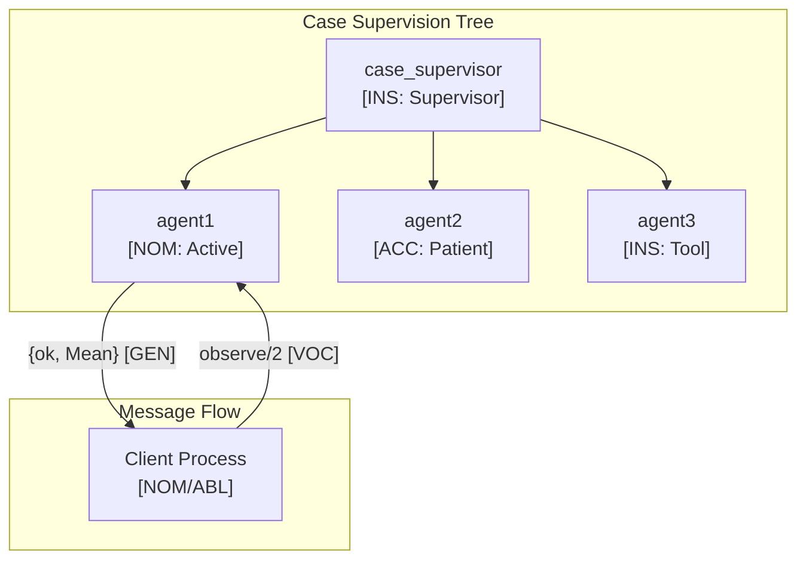

# Erlang Language Paradigms and CEREBRUM Mapping

Erlang is a functional, concurrent programming language designed for building highly scalable, distributed, fault-tolerant systems (often used in telecommunications, banking, e-commerce). It runs on the BEAM virtual machine. This document explores how Erlang's unique features map to CEREBRUM cases.

## 1. Overview of Erlang Paradigms

Erlang is characterized by:

- **Functional Programming**: Immutable data, recursion, pattern matching, first-class functions.
- **Concurrency Oriented**: Based on the Actor Model with lightweight, isolated processes.
- **Message Passing**: Processes communicate via asynchronous message passing (no shared memory).
- **Fault Tolerance**: Linked processes and supervisors enable building self-healing systems ("Let it crash" philosophy).
- **Distribution**: Built-in support for distributing processes across multiple nodes.
- **Dynamic Typing**: Types are checked at runtime.

Relationships in Erlang are primarily defined by function calls, pattern matching, process communication, and supervision trees.

## 2. Mapping CEREBRUM Cases to Erlang Concepts

| CEREBRUM Case | Erlang Equivalent/Analogy | Correspondence Strength | Notes |
|---------------|---------------------------|-------------------------|-------|
| **Nominative [NOM]** | Result of function call/expression; Variable bound in pattern match; Process identifier (Pid) | Strong | Entity resulting from computation or being identified. |
| **Accusative [ACC]** | Argument to a function; Message content being sent/received | Strong | Data being operated upon or communicated. |
| **Dative [DAT]** | Process receiving a message (`Pid ! Message`); Target of a function call | Strong | Recipient of message or control flow. |
| **Genitive [GEN]** | Return value; Element extracted via pattern matching; State within a process | Strong | Derived value, component, or internal state. |
| **Instrumental [INS]** | Function definition; Module providing functions; Supervisor process | Strong | Tool, mechanism, or controlling entity. |
| **Ablative [ABL]** | Process sending a message; List being processed; ETS table (data source) | Strong | Origin of data, message, or process. |
| **Locative [LOC]** | Module scope; Process scope; Node; Record/Map definition | Strong | Context, container, or location (process/node). |
| **Vocative [VOC]** | Function call (`module:function(...)`); Message send (`Pid ! Message`); Process spawn (`spawn(...)`) | Strong | Direct invocation, communication, or process creation. |

## 3. Key Erlang Features and Case Relationships

### Functions and Pattern Matching

Functions with multiple clauses using pattern matching are core:

```erlang
-module(math_ops).
-export([factorial/1, process_shape/1]).

% Function definition (INS tool)
% Clause 1: Base case (Pattern matches 0 - VOC)
factorial(0) -> 1; % Returns GEN value 1

% Clause 2: Recursive step (Pattern matches N - VOC)
factorial(N) when N > 0 ->
    % N is ACC argument
    % factorial(N-1) is VOC recursive call
    N * factorial(N - 1). % Returns GEN value

% Function with record/map pattern matching (INS tool)
% Shape is ACC argument
process_shape({rectangle, Width, Height}) -> % VOC pattern match
    % Width, Height are GEN extracted values
    {area, Width * Height}; % Returns GEN tuple
process_shape({circle, Radius}) -> % VOC pattern match
    % Radius is GEN extracted value
    {area, 3.14159 * Radius * Radius}; % Returns GEN tuple
process_shape(_) -> % Wildcard match (VOC)
    {error, unknown_shape}. % Returns GEN tuple

% Usage in Erlang shell:
% c(math_ops).
% math_ops:factorial(5).
% 120
% math_ops:process_shape({rectangle, 10, 5}).
% {area, 50}
% math_ops:process_shape({circle, 3}).
% {area, 28.27431}
```

### Concurrency (Processes and Message Passing)

The Actor Model is central:

```erlang
-module(pingpong).
-export([start/0, ping/2, pong/0]).

% pong process function (defines behavior of INS actor)
pong() ->
    receive % Blocks waiting for a message (Dative role)
        % Pattern match on message (VOC)
        {ping, PingPid, Ref} -> % Message is ACC, PingPid is ABL source
            io:format("Pong received ping~n"),
            % Send reply message (VOC)
            % PingPid is DAT recipient
            % {pong, Ref} is ACC message content
            PingPid ! {pong, Ref}, 
            pong(); % Recurse to wait for next message
        Other -> % Wildcard match
            io:format("Pong received unexpected: ~p~n", [Other]),
            pong()
    end.

% ping process function (defines behavior of INS actor)
% PongPid is DAT target, Count is ACC data
ping(PongPid, Count) when Count > 0 ->
    Ref = make_ref(), % Create unique reference (NOM/GEN)
    io:format("Ping sending ping ~p~n", [Count]),
    % Send message (VOC)
    PongPid ! {ping, self(), Ref}, % self() is ABL source Pid
    receive % Wait for reply (Dative role)
        {pong, Ref} -> % Match reply (VOC)
            io:format("Ping received pong ~p~n", [Count]),
            ping(PongPid, Count - 1); % Recurse
        _ -> % Timeout or unexpected message
            io:format("Ping timeout or unexpected message~n")
    after 1000 -> % Timeout
            io:format("Ping timeout waiting for pong ~p~n", [Count])
    end;
ping(_PongPid, 0) ->
    io:format("Ping finished~n").

% Start function (VOC)
start() ->
    % Spawn pong process (VOC)
    % pong/0 is INS function defining behavior
    % PongPid is NOM/GEN process identifier
    PongPid = spawn(pingpong, pong, []),
    % Spawn ping process (VOC)
    % ping/2 is INS function
    % Self() is ABL (parent process)
    spawn(pingpong, ping, [PongPid, 3]), % Start with 3 pings
    ok.

% Usage in Erlang shell:
% c(pingpong).
% pingpong:start().
% Output showing message exchange...
```

### Fault Tolerance (Supervisors)

Supervisors (INS) manage child processes (NOM/ACC):

```erlang
% --- This is conceptual - Requires OTP supervisor behavior --- 
-module(my_supervisor).
-behaviour(supervisor).
-export([start_link/0, init/1]).

% Define child process specification (INS configuration)
% ChildSpec = #{id => worker_id,       % NOM identifier
%               start => {my_worker, start_link, []}, % VOC start
%               restart => permanent, % Restart strategy
%               type => worker},      % Type (worker/supervisor)

% start_link function (VOC)
start_link() ->
    supervisor:start_link({local, ?MODULE}, ?MODULE, []).

% init function (called by supervisor behavior - INS)
init([]) ->
    SupFlags = #{strategy => one_for_one, intensity => 1, period => 5},
    % Define children to supervise
    ChildSpecs = [
        % #{id => ..., start => ...} - Specs define supervised NOM entities
        #{id => worker1, start => {my_worker, start_link, [1]}, restart => permanent, type => worker}
    ],
    % Return supervisor configuration (GEN)
    {ok, {SupFlags, ChildSpecs}}.

% --- my_worker module (conceptual) ---
% -module(my_worker).
% -export([start_link/1, init/1]).
% 
% start_link(Id) -> gen_server:start_link({local, {?MODULE, Id}}, ?MODULE, [Id], []).
% init([Id]) -> {ok, #{id => Id}}.
% % ... gen_server callbacks ...
```

## 4. Implementation Approach

Erlang's focus on message passing and pattern matching allows modeling case roles within messages or process state:

```erlang
% Define records or maps to hold case-tagged data
-record(case_entity, {role :: atom(), base_object :: any()}).

% Function expecting specific case roles via pattern matching
process_request(#case_entity{role=nom, base_object=Agent}, 
                  #case_entity{role=acc, base_object=ActionData},
                  #case_entity{role=ins, base_object=Tool}) ->
    io:format("Processing: Agent=~p [NOM], Action=~p [ACC], Tool=~p [INS]~n", 
              [Agent, ActionData, Tool]),
    % ... perform action ...
    {ok, #case_entity{role=gen, base_object=result}}; % Return GEN result

process_request(Agent, Action, Tool) -> % Catch-all for incorrect roles
    io:format("Error: Incorrect case roles - Agent:~p, Action:~p, Tool:~p~n", 
              [Agent, Action, Tool]),
    {error, incorrect_roles}.

% Example usage
% Agent = #case_entity{role=nom, base_object=user123}.
% Action = #case_entity{role=acc, base_object={update, data}}.
% Tool = #case_entity{role=ins, base_object=update_module}.
% Result = process_request(Agent, Action, Tool).

% Representing cases in message passing
% Server process:
% handle_call({process, Agent, Patient, Tool}, _From, State) ->
%     if 
%         Agent#case_entity.role == nom, 
%         Patient#case_entity.role == acc, 
%         Tool#case_entity.role == ins ->
%             Result = do_processing(Agent#case_entity.base_object, ...),
%             {reply, {ok, #case_entity{role=gen, base_object=Result}}, State};
%         true ->
%             {reply, {error, bad_roles}, State}
%     end.
```

## 5. Conclusion

Erlang maps CEREBRUM cases through its unique concurrency and functional features:

- The Actor Model directly represents interactions: processes (**NOM**/**INS**/**LOC**), messages (**ACC**), sending (**VOC**), receiving (**DAT**), sender (**ABL**), recipient (**DAT**).
- Pattern matching provides powerful **VOC** for deconstructing data (**ACC**) and extracting components (**GEN**).
- Functional purity means operations typically produce new values (**GEN**) rather than modifying (**ACC**) in place.
- Supervision trees model hierarchical control (**INS** supervisor managing **NOM** children).

While lacking explicit syntax for cases, Erlang's core design principles for building robust, concurrent systems align well with modeling distinct roles and interactions between computational entities, mirroring the relationships CEREBRUM aims to capture.

## 6. Advanced CEREBRUM Implementation

### Case-Bearing Records with OTP

```erlang
-module(case_entity).
-export([new/3, transform/2, effective_precision/1, info/1]).

%% Case enumeration
-define(CASES, #{
    nom => #{name => <<"Nominative">>, precision => 1.5},
    acc => #{name => <<"Accusative">>, precision => 1.2},
    dat => #{name => <<"Dative">>, precision => 1.3},
    gen => #{name => <<"Genitive">>, precision => 1.0},
    ins => #{name => <<"Instrumental">>, precision => 0.8},
    abl => #{name => <<"Ablative">>, precision => 1.1},
    loc => #{name => <<"Locative">>, precision => 0.9},
    voc => #{name => <<"Vocative">>, precision => 2.0}
}).

%% Valid transitions
-define(VALID_TRANSITIONS, #{
    nom => [acc, gen],
    acc => [gen, dat],
    abl => [nom],
    loc => [abl]
}).

%% Record definition
-record(case_entity, {
    base :: any(),
    case_role :: atom(),
    precision :: float(),
    history :: list()
}).

%% Create new case entity
new(Base, CaseRole, Precision) ->
    #case_entity{
        base = Base,
        case_role = CaseRole,
        precision = Precision,
        history = []
    }.

%% Transform to new case (with validation)
transform(Entity = #case_entity{case_role = Current, history = History}, TargetCase) ->
    ValidTransitions = maps:get(Current, ?VALID_TRANSITIONS, []),
    case lists:member(TargetCase, ValidTransitions) of
        true ->
            Entity#case_entity{
                case_role = TargetCase,
                history = [{Current, TargetCase, erlang:timestamp()} | History]
            };
        false ->
            {error, {invalid_transition, Current, TargetCase}}
    end.

%% Calculate effective precision
effective_precision(#case_entity{case_role = Role, precision = BasePrecision}) ->
    CaseData = maps:get(Role, ?CASES, #{precision => 1.0}),
    CasePrecision = maps:get(precision, CaseData),
    BasePrecision * CasePrecision.

%% Get entity info
info(#case_entity{base = Base, case_role = Role} = Entity) ->
    EffPrec = effective_precision(Entity),
    io_lib:format("~p [~p](p=~.2f)", [Base, Role, EffPrec]).
```

### Gen_Server with Case State

```erlang
-module(case_server).
-behaviour(gen_server).

-export([start_link/2, get_case/1, transform/2, update_belief/3]).
-export([init/1, handle_call/3, handle_cast/2, handle_info/2, terminate/2]).

-record(state, {
    entity :: case_entity:case_entity(),
    belief_mean :: float(),
    belief_precision :: float()
}).

%% API Functions

%% Start a case-bearing server (VOC spawn)
start_link(Name, InitialCase) ->
    gen_server:start_link({local, Name}, ?MODULE, [Name, InitialCase], []).

%% Get current case (VOC call)
get_case(Name) ->
    gen_server:call(Name, get_case).

%% Transform to new case (VOC call, server is DAT recipient)
transform(Name, TargetCase) ->
    gen_server:call(Name, {transform, TargetCase}).

%% Update belief with observation (VOC call)
update_belief(Name, Observation, ObsPrecision) ->
    gen_server:call(Name, {update_belief, Observation, ObsPrecision}).

%% Gen_Server Callbacks

init([Name, InitialCase]) ->
    Entity = case_entity:new(Name, InitialCase, 1.0),
    {ok, #state{
        entity = Entity,
        belief_mean = 0.0,
        belief_precision = 1.0
    }}.

handle_call(get_case, _From, State = #state{entity = Entity}) ->
    Info = case_entity:info(Entity),
    {reply, {ok, Info}, State};

handle_call({transform, TargetCase}, _From, State = #state{entity = Entity}) ->
    case case_entity:transform(Entity, TargetCase) of
        {error, Reason} ->
            {reply, {error, Reason}, State};
        NewEntity ->
            {reply, ok, State#state{entity = NewEntity}}
    end;

handle_call({update_belief, Observation, ObsPrecision}, _From, 
            State = #state{entity = Entity, 
                          belief_mean = Mean, 
                          belief_precision = Precision}) ->
    %% Get case-specific precision modifier
    EffPrec = case_entity:effective_precision(Entity),
    AdjustedPrecision = ObsPrecision * (EffPrec / Precision),
    
    %% Bayesian update
    TotalPrecision = Precision + AdjustedPrecision,
    PosteriorMean = (Precision * Mean + AdjustedPrecision * Observation) / TotalPrecision,
    
    NewState = State#state{
        belief_mean = PosteriorMean,
        belief_precision = TotalPrecision
    },
    {reply, {ok, PosteriorMean, TotalPrecision}, NewState};

handle_call(_Request, _From, State) ->
    {reply, {error, unknown_request}, State}.

handle_cast(_Msg, State) ->
    {noreply, State}.

handle_info(_Info, State) ->
    {noreply, State}.

terminate(_Reason, _State) ->
    ok.
```

### Active Inference Agent Process

```erlang
-module(active_inference_agent).
-behaviour(gen_statem).

-export([start_link/3, observe/2, predict/1, select_action/2, get_state/1]).
-export([init/1, callback_mode/0, handle_event/4, terminate/3]).

-record(agent_state, {
    name :: atom(),
    case_role :: atom(),
    belief_mean :: float(),
    belief_precision :: float(),
    observations :: list()
}).

%% API

start_link(Name, InitialMean, CaseRole) ->
    gen_statem:start_link({local, Name}, ?MODULE, 
                          [Name, InitialMean, CaseRole], []).

observe(Name, Observation) ->
    gen_statem:call(Name, {observe, Observation}).

predict(Name) ->
    gen_statem:call(Name, predict).

select_action(Name, PossibleObservations) ->
    gen_statem:call(Name, {select_action, PossibleObservations}).

get_state(Name) ->
    gen_statem:call(Name, get_state).

%% Callbacks

init([Name, InitialMean, CaseRole]) ->
    State = #agent_state{
        name = Name,
        case_role = CaseRole,
        belief_mean = InitialMean,
        belief_precision = 1.0,
        observations = []
    },
    {ok, active, State}.

callback_mode() ->
    handle_event_function.

handle_event({call, From}, {observe, Observation}, _StateName,
             State = #agent_state{case_role = Role,
                                  belief_mean = Mean,
                                  belief_precision = Precision,
                                  observations = Obs}) ->
    %% Get case precision modifier
    CasePrecisions = #{nom => 1.5, acc => 1.2, dat => 1.3, 
                       gen => 1.0, ins => 0.8, voc => 2.0},
    CaseMod = maps:get(Role, CasePrecisions, 1.0),
    
    %% Bayesian update with case-aware precision
    ObsPrecision = 0.5 * CaseMod,
    TotalPrecision = Precision + ObsPrecision,
    NewMean = (Precision * Mean + ObsPrecision * Observation) / TotalPrecision,
    
    NewState = State#agent_state{
        belief_mean = NewMean,
        belief_precision = TotalPrecision,
        observations = [Observation | Obs]
    },
    {keep_state, NewState, [{reply, From, {ok, NewMean, TotalPrecision}}]};

handle_event({call, From}, predict, _StateName,
             State = #agent_state{belief_mean = Mean}) ->
    {keep_state, State, [{reply, From, {ok, Mean}}]};

handle_event({call, From}, {select_action, Observations}, _StateName,
             State = #agent_state{belief_mean = Mean, 
                                  belief_precision = Precision,
                                  case_role = Role}) ->
    %% Calculate free energy for each possible observation
    CasePrecisions = #{nom => 1.5, acc => 1.2, dat => 1.3,
                       gen => 1.0, ins => 0.8, voc => 2.0},
    CaseMod = maps:get(Role, CasePrecisions, 1.0),
    EffPrecision = Precision * CaseMod,
    
    FreeEnergies = lists:map(fun(Obs) ->
        PredError = math:pow(Obs - Mean, 2),
        FE = PredError * EffPrecision / 2,
        {Obs, FE}
    end, Observations),
    
    %% Select observation with minimum free energy
    {BestObs, MinFE} = lists:foldl(fun({O, FE}, {_BO, BFE}) when FE < BFE ->
        {O, FE};
    (_, Acc) -> Acc
    end, {undefined, infinity}, FreeEnergies),
    
    {keep_state, State, [{reply, From, {ok, BestObs, MinFE}}]};

handle_event({call, From}, get_state, _StateName, State) ->
    {keep_state, State, [{reply, From, {ok, State}}]};

handle_event(_EventType, _EventContent, _StateName, State) ->
    {keep_state, State}.

terminate(_Reason, _StateName, _State) ->
    ok.
```

### Supervision Tree for Case Entities

```erlang
-module(case_supervisor).
-behaviour(supervisor).

-export([start_link/0, start_agent/3, stop_agent/1]).
-export([init/1]).

start_link() ->
    supervisor:start_link({local, ?MODULE}, ?MODULE, []).

start_agent(Name, InitialMean, CaseRole) ->
    ChildSpec = #{
        id => Name,
        start => {active_inference_agent, start_link, [Name, InitialMean, CaseRole]},
        restart => transient,
        type => worker
    },
    supervisor:start_child(?MODULE, ChildSpec).

stop_agent(Name) ->
    supervisor:terminate_child(?MODULE, Name),
    supervisor:delete_child(?MODULE, Name).

init([]) ->
    SupFlags = #{
        strategy => one_for_one,
        intensity => 5,
        period => 10
    },
    {ok, {SupFlags, []}}.

%% Example usage:
%% case_supervisor:start_link().
%% case_supervisor:start_agent(agent1, 5.0, nom).
%% active_inference_agent:observe(agent1, 6.0).
%% active_inference_agent:predict(agent1).
%% active_inference_agent:select_action(agent1, [4.0, 5.0, 6.0, 7.0]).
```

### Message Protocol with Case Roles

```erlang
-module(case_protocol).
-export([send_with_case/4, receive_with_case/0]).

%% Send message with explicit case tagging
%% Sender is ABL, Target is DAT, Message is ACC
send_with_case(Target, MessageType, Payload, CaseRole) ->
    Message = #{
        from => {self(), abl},           %% Sender is ABL source
        to_case => CaseRole,             %% Recipient role
        type => MessageType,
        payload => Payload,
        timestamp => erlang:timestamp()
    },
    Target ! {case_message, Message}.

%% Receive with case-aware pattern matching
receive_with_case() ->
    receive
        {case_message, #{from := {Pid, abl},
                         to_case := dat,
                         type := Type,
                         payload := Payload}} ->
            %% DAT: We are receiving data
            io:format("Received [DAT] from ~p: ~p~n", [Pid, Payload]),
            {ok, Type, Payload};
            
        {case_message, #{from := {Pid, abl},
                         to_case := acc,
                         type := Type,
                         payload := Payload}} ->
            %% ACC: We are target of action
            io:format("Acting on [ACC] from ~p: ~p~n", [Pid, Payload]),
            {process, Type, Payload};
            
        {case_message, Msg} ->
            io:format("Unknown case message: ~p~n", [Msg]),
            {unknown, Msg}
    after 5000 ->
        {error, timeout}
    end.
```

## 7. Mermaid Diagram: OTP Case Architecture



## 8. References

1. Armstrong, J. (2013). Programming Erlang: Software for a Concurrent World (2nd ed.). Pragmatic Bookshelf.
2. Cesarini, F., & Thompson, S. (2009). Erlang Programming. O'Reilly Media.
3. Erlang Documentation. (<https://www.erlang.org/docs>)
4. Learn You Some Erlang for Great Good! (<http://learnyousomeerlang.com/>)
5. Friston, K. (2010). The free-energy principle. Nature Reviews Neuroscience.
6. Logan, M., Merritt, E., & Carlsson, R. (2010). Erlang and OTP in Action. Manning Publications.
