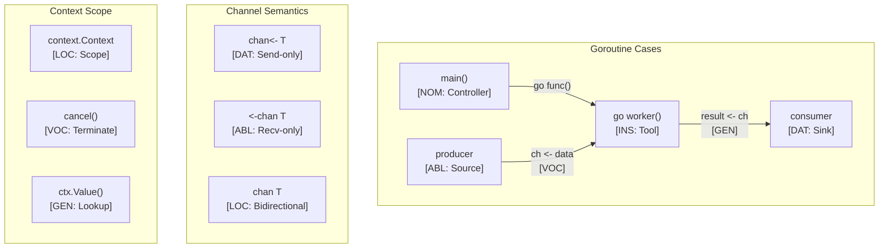

# Go Language Paradigms and CEREBRUM Mapping

Go (or Golang) is a statically typed, compiled programming language designed at Google. It's known for its simplicity, efficiency, built-in concurrency features, and garbage collection. This document explores how Go's design principles map to CEREBRUM's case system.

## 1. Overview of Go Paradigms

Go emphasizes:

- **Simplicity and Readability**: Minimalist syntax, focus on clear code.
- **Concurrency**: Goroutines and channels provide first-class support for concurrent programming.
- **Static Typing**: Strong type system checked at compile time.
- **Compiled Language**: Compiles directly to machine code.
- **Interfaces**: Implicit interface satisfaction (structural typing).
- **Composition over Inheritance**: Encourages using embedding and interfaces instead of classical inheritance.
- **Packages**: Module system for code organization and reuse.

Relationships in Go are often defined by function calls, struct composition, interface satisfaction, and channel communication.

## 2. Mapping CEREBRUM Cases to Go Concepts

| CEREBRUM Case | Go Equivalent/Analogy | Correspondence Strength | Notes |
|---------------|-----------------------|-------------------------|-------|
| **Nominative [NOM]** | Subject of a method call (`receiver.Method()`); Variable defined (`var x Type`) | Strong | The acting entity or subject being defined. |
| **Accusative [ACC]** | Function argument (passed by value); Struct being modified (via pointer) | Strong | Entity receiving action or being processed. |
| **Dative [DAT]** | Channel receiving data (`ch <- data`); Return parameter | Strong | Recipient of data or control flow. |
| **Genitive [GEN]** | Struct field access (`obj.Field`); Return value; Embedded type | Strong | Source, possession, or derived value. |
| **Instrumental [INS]** | Function used as argument; Interface constraint; Goroutine | Strong | Tool, mechanism, or concurrent process. |
| **Ablative [ABL]** | Channel sending data (`<-ch`); Data source (e.g., slice in `range`) | Strong | Origin of data or concurrent signal. |
| **Locative [LOC]** | Package scope; Struct definition; Slice/Map container; Function scope | Strong | Context, container, or location. |
| **Vocative [VOC]** | Function/method call; Goroutine launch (`go func()`); Channel send/receive op | Strong | Direct invocation or communication action. |

## 3. Key Go Features and Case Relationships

### Structs and Methods

Go uses structs for data aggregation and methods associated with types:

```go
package main

import "fmt"

// Struct definition (LOC blueprint)
type Rectangle struct {
 // Fields (GEN sources)
 Width  float64
 Height float64
}

// Method associated with Rectangle (Receiver is NOM acting)
// (r Rectangle) means method operates on a copy (ACC)
func (r Rectangle) Area() float64 {
 // r.Width and r.Height are GEN accesses
 return r.Width * r.Height // Result is GEN
}

// Method with pointer receiver (NOM modifying itself)
// (r *Rectangle) means method operates on the original (ACC)
func (r *Rectangle) Scale(factor float64) {
 // factor is ACC (value applied)
 // r is NOM (subject being modified)
 r.Width *= factor
 r.Height *= factor
}

func main() {
 // Create instance (rect is ACC being created)
 rect := Rectangle{Width: 10, Height: 5}

 // Call method on value (rect is NOM acting on copy)
 // Area is GEN derived value
 area := rect.Area() // VOC call
 fmt.Println("Area:", area)

 // Call method on pointer (rect is NOM modifying original)
 // &rect provides pointer (address acts as LOC)
 // 2.0 is ACC factor
 (&rect).Scale(2.0) // VOC call
 // Alternative: Go automatically converts value to pointer for method call
 // rect.Scale(2.0)

 // Access fields (GEN access)
 fmt.Printf("Scaled Width: %.1f, Height: %.1f\n", rect.Width, rect.Height)
}
```

### Interfaces

Interfaces define behavior sets (INS) and are satisfied implicitly:

```go
package main

import (
 "fmt"
 "math"
)

// Interface definition (INS contract)
type Shape interface {
 Area() float64 // Method signature
}

// Struct definitions (LOC blueprints)
type Circle struct {
 Radius float64 // GEN
}
type Square struct {
 Side float64 // GEN
}

// Circle implements Shape (INS contract satisfied)
// c is NOM
func (c Circle) Area() float64 { // GEN result
 return math.Pi * c.Radius * c.Radius
}

// Square implements Shape (INS contract satisfied)
// s is NOM
func (s Square) Area() float64 { // GEN result
 return s.Side * s.Side
}

// Function accepting any Shape (s is ACC conforming to INS)
func PrintArea(s Shape) {
 // s.Area() is VOC call via interface
 fmt.Printf("Area of shape: %.2f\n", s.Area()) // Area is GEN
}

func main() {
 c := Circle{Radius: 5}  // c is ACC being created
 s := Square{Side: 4}  // s is ACC being created

 // Call function with interface types
 PrintArea(c) // c passed as ACC satisfying Shape (INS)
 PrintArea(s) // s passed as ACC satisfying Shape (INS)
}

```

### Concurrency (Goroutines and Channels)

Go's concurrency primitives map well to cases:

```go
package main

import (
 "fmt"
 "time"
 "sync"
)

// worker function (designed to run as Goroutine - INS mechanism)
// id is ACC, jobs is ABL source, results is DAT destination
func worker(id int, jobs <-chan int, results chan<- int, wg *sync.WaitGroup) {
 defer wg.Done() // Notify WaitGroup on exit
 
 // Range over channel (jobs is ABL source)
 // j is NOM iterating
 for j := range jobs {
  fmt.Printf("Worker %d started job %d\n", id, j)
  time.Sleep(time.Millisecond * 500) // Simulate work
  fmt.Printf("Worker %d finished job %d\n", id, j)
  // Send result to results channel (VOC action)
  // results is DAT destination, j*2 is ACC data being sent
  results <- j * 2 
 }
}

func main() {
 const numJobs = 5
 // Create channels (LOC communication primitives)
 jobs := make(chan int, numJobs)
 results := make(chan int, numJobs)
 
 var wg sync.WaitGroup // Synchronization primitive (LOC)

 // Start workers (VOC launch of Goroutines - INS)
 for w := 1; w <= 3; w++ {
  wg.Add(1)
  go worker(w, jobs, results, &wg) // Pass channels (ABL/DAT)
 }

 // Send jobs (VOC action)
 // jobs is DAT destination, i is ACC data
 for j := 1; j <= numJobs; j++ {
  jobs <- j
 }
 close(jobs) // Signal no more jobs (VOC action on ABL source)

 // Wait for all workers to finish
 wg.Wait() // Blocks until counter is zero
 
 close(results) // Signal no more results (VOC action on DAT destination)

 // Collect results (VOC receive operation)
 // results is ABL source
 // result is NOM iterating
 fmt.Println("\nResults:")
 for result := range results {
  fmt.Println(result)
 }
}

```

## 4. Implementation Approach

Go's static typing and focus on composition allow modeling cases using structs and interfaces:

```go
package main

import "fmt"

// Case enumeration (using constants)
type CaseRole string

const (
 NOM CaseRole = "NOM"
 ACC CaseRole = "ACC"
 DAT CaseRole = "DAT"
 GEN CaseRole = "GEN"
 INS CaseRole = "INS"
 ABL CaseRole = "ABL"
 LOC CaseRole = "LOC"
 VOC CaseRole = "VOC"
)

// Interface for any case-bearing entity
type ICaseBearer interface {
 GetBaseObject() interface{}
 GetCase() CaseRole
 // As(newCase CaseRole) ICaseBearer // Transformation method (conceptual)
}

// Generic wrapper struct (Go doesn't have generics pre-1.18)
// Using interface{} for base object (less type-safe)

type CaseWrapper struct {
 BaseObject interface{}
 Role       CaseRole
}

func NewCaseWrapper(base interface{}, role CaseRole) *CaseWrapper {
 return &CaseWrapper{BaseObject: base, Role: role}
}

func (cw *CaseWrapper) GetBaseObject() interface{} { return cw.BaseObject }
func (cw *CaseWrapper) GetCase() CaseRole        { return cw.Role }

// As creates a new wrapper with a different role
func (cw *CaseWrapper) As(newRole CaseRole) *CaseWrapper {
    fmt.Printf("Transforming %v from %s to %s\n", cw.BaseObject, cw.Role, newRole)
    // In a real scenario, might copy properties if any
    return NewCaseWrapper(cw.BaseObject, newRole)
}

// Example Domain Objects
type Document struct {
 Title string
}

type Printer struct {
 Name string
}

// Function requiring specific case roles
func PrintDocument(docSource *CaseWrapper, printerTool *CaseWrapper) error {
 if docSource.GetCase() != GEN {
  return fmt.Errorf("document source must be GEN, got %s", docSource.GetCase())
 }
 if printerTool.GetCase() != INS {
  return fmt.Errorf("printer tool must be INS, got %s", printerTool.GetCase())
 }

 doc, okDoc := docSource.GetBaseObject().(*Document)
 printer, okPrinter := printerTool.GetBaseObject().(*Printer)

 if !okDoc || !okPrinter {
     return fmt.Errorf("type assertion failed")
 }

 fmt.Printf("Using %s [%s] to print %s [%s]\n", 
     printer.Name, printerTool.GetCase(), 
     doc.Title, docSource.GetCase())
 // Actual printing logic
 return nil
}

func main() {
 doc := &Document{Title: "Manual.pdf"}
 printer := &Printer{Name: "OfficeJet"}

 // Create wrappers
 docWrapper := NewCaseWrapper(doc, ACC) // Initially Accusative
 printerWrapper := NewCaseWrapper(printer, INS)

 fmt.Printf("Initial: %v [%s], %v [%s]\n", 
     docWrapper.GetBaseObject(), docWrapper.GetCase(),
     printerWrapper.GetBaseObject(), printerWrapper.GetCase())

 // Transform case
 docAsSource := docWrapper.As(GEN)

 // Call function
 err := PrintDocument(docAsSource, printerWrapper)
 if err != nil {
  fmt.Println("Error:", err)
 }
}

```

## 5. Conclusion

Go provides clear mappings to CEREBRUM cases despite its minimalist design:

- Structs and methods model **NOM**, **ACC**, and **GEN** interactions.
- Implicit interfaces serve as flexible **INS** constraints.
- Goroutines and channels directly model concurrency with **INS** (goroutine), **ABL** (sender), and **DAT** (receiver) roles.
- Explicit passing by value (often **ACC**) vs. pointer (**ACC** modified in place) distinguishes modes of action.
- Packages provide strong **LOC** boundaries.

Go's emphasis on simplicity means explicit case modeling might rely on wrapper structs or careful function signature design rather than more complex metaprogramming or type system features found in other languages.

## 6. Advanced CEREBRUM Implementation

### Go 1.18+ Generic Case System

```go
package cerebrum

import (
 "fmt"
 "math"
 "sync"
 "time"
)

// CaseRole enumeration
type CaseRole string

const (
 NOM CaseRole = "NOM" // Nominative: Active agent
 ACC CaseRole = "ACC" // Accusative: Patient/target
 DAT CaseRole = "DAT" // Dative: Recipient
 GEN CaseRole = "GEN" // Genitive: Source/possessor
 INS CaseRole = "INS" // Instrumental: Tool/means
 ABL CaseRole = "ABL" // Ablative: Origin
 LOC CaseRole = "LOC" // Locative: Location/context
 VOC CaseRole = "VOC" // Vocative: Direct address
)

// Case precision modifiers
var casePrecision = map[CaseRole]float64{
 NOM: 1.5,
 ACC: 1.2,
 DAT: 1.3,
 GEN: 1.0,
 INS: 0.8,
 ABL: 1.1,
 LOC: 0.9,
 VOC: 2.0,
}

// Valid case transitions
var validTransitions = map[CaseRole][]CaseRole{
 NOM: {ACC, GEN},
 ACC: {GEN, DAT},
 ABL: {NOM},
 LOC: {ABL},
}

// CaseEntity is a generic case-bearing wrapper
type CaseEntity[T any] struct {
 Base      T
 Role      CaseRole
 Precision float64
 History   []Transition
 mu        sync.RWMutex
}

// Transition records a case change
type Transition struct {
 From CaseRole
 To   CaseRole
 Time time.Time
}

// NewCaseEntity creates a new case-bearing entity
func NewCaseEntity[T any](base T, role CaseRole) *CaseEntity[T] {
 return &CaseEntity[T]{
  Base:      base,
  Role:      role,
  Precision: 1.0,
  History:   make([]Transition, 0),
 }
}

// EffectivePrecision returns case-adjusted precision
func (ce *CaseEntity[T]) EffectivePrecision() float64 {
 ce.mu.RLock()
 defer ce.mu.RUnlock()
 return ce.Precision * casePrecision[ce.Role]
}

// TransformTo changes the case role with validation
func (ce *CaseEntity[T]) TransformTo(target CaseRole) error {
 ce.mu.Lock()
 defer ce.mu.Unlock()

 valid, ok := validTransitions[ce.Role]
 if !ok {
  return fmt.Errorf("no transitions defined for %s", ce.Role)
 }

 for _, v := range valid {
  if v == target {
   ce.History = append(ce.History, Transition{
    From: ce.Role,
    To:   target,
    Time: time.Now(),
   })
   ce.Role = target
   return nil
  }
 }
 return fmt.Errorf("invalid transition: %s -> %s", ce.Role, target)
}

// String representation
func (ce *CaseEntity[T]) String() string {
 ce.mu.RLock()
 defer ce.mu.RUnlock()
 return fmt.Sprintf("<%v>[%s](p=%.2f)", ce.Base, ce.Role, ce.EffectivePrecision())
}
```

### Active Inference Agent

```go
package cerebrum

import (
 "math"
 "sync"
)

// BeliefState represents Bayesian beliefs
type BeliefState struct {
 Mean      float64
 Precision float64
 mu        sync.RWMutex
}

// NewBeliefState creates a new belief state
func NewBeliefState(mean, precision float64) *BeliefState {
 return &BeliefState{
  Mean:      mean,
  Precision: precision,
 }
}

// Update performs Bayesian belief update
func (b *BeliefState) Update(observation, obsPrecision float64) {
 b.mu.Lock()
 defer b.mu.Unlock()

 totalPrecision := b.Precision + obsPrecision
 b.Mean = (b.Precision*b.Mean + obsPrecision*observation) / totalPrecision
 b.Precision = totalPrecision
}

// ActiveInferenceAgent combines case entity with beliefs
type ActiveInferenceAgent[T any] struct {
 Entity *CaseEntity[T]
 Belief *BeliefState
}

// NewActiveInferenceAgent creates a new agent
func NewActiveInferenceAgent[T any](base T, role CaseRole, initialMean float64) *ActiveInferenceAgent[T] {
 return &ActiveInferenceAgent[T]{
  Entity: NewCaseEntity(base, role),
  Belief: NewBeliefState(initialMean, 1.0),
 }
}

// Observe updates belief with case-adjusted precision
func (a *ActiveInferenceAgent[T]) Observe(observation, baseObsPrecision float64) {
 adjustedPrecision := baseObsPrecision * a.Entity.EffectivePrecision()
 a.Belief.Update(observation, adjustedPrecision)
}

// FreeEnergy calculates variational free energy
func (a *ActiveInferenceAgent[T]) FreeEnergy(observation float64) float64 {
 a.Belief.mu.RLock()
 defer a.Belief.mu.RUnlock()

 predError := observation - a.Belief.Mean
 effPrecision := a.Belief.Precision * a.Entity.EffectivePrecision()
 return (predError * predError * effPrecision) / 2.0
}

// Predict returns the predicted observation
func (a *ActiveInferenceAgent[T]) Predict() float64 {
 a.Belief.mu.RLock()
 defer a.Belief.mu.RUnlock()
 return a.Belief.Mean
}

// SelectAction selects the action minimizing expected free energy
func (a *ActiveInferenceAgent[T]) SelectAction(possibleObs []float64) (float64, float64) {
 bestObs := 0.0
 minFE := math.Inf(1)

 for _, obs := range possibleObs {
  fe := a.FreeEnergy(obs)
  if fe < minFE {
   minFE = fe
   bestObs = obs
  }
 }
 return bestObs, minFE
}
```

### Channel-Based Case Communication

```go
package cerebrum

import (
 "context"
 "fmt"
)

// CaseMessage represents a message with case semantics
type CaseMessage[T any] struct {
 Sender      CaseRole // ABL: Origin of message
 Receiver    CaseRole // DAT: Recipient role
 MessageType string   // INS: Type of operation
 Payload     T        // ACC: Content being transferred
}

// CaseChannel wraps a channel with case semantics
type CaseChannel[T any] struct {
 ch       chan CaseMessage[T]
 role     CaseRole
 capacity int
}

// NewCaseChannel creates a new case-aware channel
func NewCaseChannel[T any](role CaseRole, capacity int) *CaseChannel[T] {
 return &CaseChannel[T]{
  ch:       make(chan CaseMessage[T], capacity),
  role:     role,
  capacity: capacity,
 }
}

// Send sends a message with explicit case roles
func (cc *CaseChannel[T]) Send(ctx context.Context, msgType string, payload T, receiverRole CaseRole) error {
 msg := CaseMessage[T]{
  Sender:      ABL, // Sender is always ABL (origin)
  Receiver:    receiverRole,
  MessageType: msgType,
  Payload:     payload,
 }

 select {
 case cc.ch <- msg:
  return nil
 case <-ctx.Done():
  return ctx.Err()
 }
}

// Receive receives a message, validating expected case
func (cc *CaseChannel[T]) Receive(ctx context.Context, expectedRole CaseRole) (CaseMessage[T], error) {
 select {
 case msg := <-cc.ch:
  if msg.Receiver != expectedRole {
   return msg, fmt.Errorf("role mismatch: expected %s, got %s", expectedRole, msg.Receiver)
  }
  return msg, nil
 case <-ctx.Done():
  return CaseMessage[T]{}, ctx.Err()
 }
}

// Close closes the channel
func (cc *CaseChannel[T]) Close() {
 close(cc.ch)
}

// CaseActor is a goroutine-based actor with case semantics
type CaseActor[T any] struct {
 Name     string
 Role     CaseRole
 inbox    *CaseChannel[T]
 handlers map[string]func(CaseMessage[T]) error
 ctx      context.Context
 cancel   context.CancelFunc
}

// NewCaseActor creates a new actor
func NewCaseActor[T any](name string, role CaseRole) *CaseActor[T] {
 ctx, cancel := context.WithCancel(context.Background())
 return &CaseActor[T]{
  Name:     name,
  Role:     role,
  inbox:    NewCaseChannel[T](DAT, 10), // Inbox is DAT (receiving)
  handlers: make(map[string]func(CaseMessage[T]) error),
  ctx:      ctx,
  cancel:   cancel,
 }
}

// RegisterHandler registers a message handler
func (a *CaseActor[T]) RegisterHandler(msgType string, handler func(CaseMessage[T]) error) {
 a.handlers[msgType] = handler
}

// Start begins the actor's message processing loop
func (a *CaseActor[T]) Start() {
 go func() {
  for {
   select {
   case msg := <-a.inbox.ch:
    if handler, ok := a.handlers[msg.MessageType]; ok {
     if err := handler(msg); err != nil {
      fmt.Printf("[%s] Error handling %s: %v\n", a.Name, msg.MessageType, err)
     }
    }
   case <-a.ctx.Done():
    return
   }
  }
 }()
}

// Stop stops the actor
func (a *CaseActor[T]) Stop() {
 a.cancel()
 a.inbox.Close()
}

// Send sends a message to this actor
func (a *CaseActor[T]) Send(ctx context.Context, msgType string, payload T) error {
 return a.inbox.Send(ctx, msgType, payload, a.Role)
}
```

### Context-Based Case Scoping

```go
package cerebrum

import (
 "context"
)

// CaseContext key type
type caseContextKey struct{}

// WithCase adds case role to context (LOC container)
func WithCase(ctx context.Context, role CaseRole) context.Context {
 return context.WithValue(ctx, caseContextKey{}, role)
}

// GetCase extracts case role from context
func GetCase(ctx context.Context) (CaseRole, bool) {
 role, ok := ctx.Value(caseContextKey{}).(CaseRole)
 return role, ok
}

// CaseAwareFunc is a function that operates with case context
type CaseAwareFunc[T any, R any] func(ctx context.Context, input T) (R, error)

// WithCaseEnforcement wraps a function with case validation
func WithCaseEnforcement[T any, R any](
 fn CaseAwareFunc[T, R],
 requiredCase CaseRole,
) CaseAwareFunc[T, R] {
 return func(ctx context.Context, input T) (R, error) {
  var zero R
  currentCase, ok := GetCase(ctx)
  if !ok {
   return zero, fmt.Errorf("no case in context")
  }
  if currentCase != requiredCase {
   return zero, fmt.Errorf("case mismatch: expected %s, got %s", requiredCase, currentCase)
  }
  return fn(ctx, input)
 }
}

// Example usage
func ProcessData(ctx context.Context, data string) (string, error) {
 return fmt.Sprintf("Processed: %s", data), nil
}

func main() {
 ctx := WithCase(context.Background(), NOM)

 // Create agent
 agent := NewActiveInferenceAgent("Processor", NOM, 5.0)
 fmt.Printf("Initial: %s, belief=%.2f\n", agent.Entity, agent.Predict())

 // Observe
 agent.Observe(6.0, 0.5)
 fmt.Printf("After obs: belief=%.2f, precision=%.2f\n",
  agent.Belief.Mean, agent.Belief.Precision)

 // Select action
 best, fe := agent.SelectAction([]float64{4.0, 5.0, 6.0, 7.0})
 fmt.Printf("Best action: %.1f (FE=%.4f)\n", best, fe)

 // Case-aware function
 enforcedFn := WithCaseEnforcement(ProcessData, NOM)
 result, err := enforcedFn(ctx, "test")
 if err != nil {
  fmt.Printf("Error: %v\n", err)
 } else {
  fmt.Printf("Result: %s\n", result)
 }
}
```

## 7. Mermaid Diagram: Go Case Architecture



## 8. References

1. Donovan, A. A., & Kernighan, B. W. (2015). The Go Programming Language. Addison-Wesley.
2. Go Authors. (2023). Effective Go. (<https://go.dev/doc/effective_go>)
3. Go Authors. (2023). Go Language Specification. (<https://go.dev/ref/spec>)
4. Go Authors. (2023). A Tour of Go. (<https://go.dev/tour/>)
5. Friston, K. (2010). The free-energy principle. Nature Reviews Neuroscience.
6. Cox, R., Griesemer, R., & Pike, R. (2022). Go 1.18 Generics. Go Blog.
