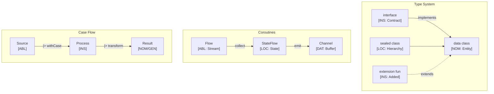

# Kotlin Language Paradigms and CEREBRUM Mapping

Kotlin is a modern, statically typed programming language developed by JetBrains that runs on the Java Virtual Machine (JVM), Android, JavaScript, and Native platforms. It's designed to be concise, safe, and interoperable with Java. This document explores how Kotlin features map to CEREBRUM cases.

## 1. Overview of Kotlin Paradigms

Kotlin combines features from multiple paradigms:

- **Object-Oriented Programming**: Classes, interfaces, inheritance, properties, primary constructors.
- **Functional Programming**: First-class functions, lambdas, extension functions, immutability (`val`).
- **Conciseness and Safety**: Null safety (nullable types `?`), smart casts, data classes, type inference.
- **Coroutines**: Built-in support for asynchronous programming.
- **Interoperability**: Seamless integration with Java code and libraries.
- **Extension Functions**: Ability to extend existing classes without inheritance.

Relationships in Kotlin are defined via classes, functions, interfaces, extension functions, and coroutines.

## 2. Mapping CEREBRUM Cases to Kotlin Concepts

| CEREBRUM Case | Kotlin Equivalent/Analogy | Correspondence Strength | Notes |
|---------------|--------------------------|-------------------------|-------|
| **Nominative [NOM]** | Object calling method/property (`obj.member`); `this` reference; Variable defined (`val`/`var x: Type`) | Strong | Acting entity or subject being defined. |
| **Accusative [ACC]** | Function parameter; Object being modified; Receiver in `apply`/`also` scope functions | Strong | Entity receiving action or update. |
| **Dative [DAT]** | Target of assignment; Recipient in callback/listener; Receiver in `let`/`run` scope functions | Strong | Recipient of data, result, or context. |
| **Genitive [GEN]** | Property access (`obj.property`); Return value; Enum class member; Delegated property source | Strong | Source, possession, or derived value. |
| **Instrumental [INS]** | Extension function; Higher-order function parameter; Interface constraint; Coroutine context/dispatcher | Strong | Tool, mechanism, added capability, or constraint. |
| **Ablative [ABL]** | Collection being iterated; Coroutine producing value (`Flow`); Source in delegation (`by source`) | Strong | Origin of data, value, or process. |
| **Locative [LOC]** | Scope (function, class); Package; File; Collection; Receiver object in scope functions | Strong | Context, container, or location. |
| **Vocative [VOC]** | Function/method call; Constructor call; Operator invocation; Coroutine launch | Strong | Direct invocation or addressing. |

## 3. Key Kotlin Features and Case Relationships

### Classes and Objects

Kotlin's OOP features with concise syntax:

```kotlin
import java.util.UUID

// Data class (LOC blueprint, automatically generates accessors, etc.)
data class User(val id: UUID, var name: String) // id is GEN, name is GEN/NOM

// Regular class (LOC blueprint)
class Repository {
    // Mutable map (LOC container)
    private val users = mutableMapOf<UUID, User>()

    // Method (this/Repository is NOM acting)
    // user is ACC being added
    fun addUser(user: User) {
        users[user.id] = user
        println("User ${user.name} added.")
    }

    // Method returning nullable type (GEN source)
    fun findUserById(id: UUID): User? { // Result is GEN (potentially nil)
        return users[id]
    }

    // Method modifying user (foundUser is ACC modified)
    fun updateUserName(id: UUID, newName: String): Boolean {
        val foundUser = findUserById(id) // foundUser is NOM/GEN
        return if (foundUser != null) {
            foundUser.name = newName // Modifies ACC User; newName is GEN source
            true
        } else {
            false
        }
    }
}

fun main() {
    val repo = Repository() // repo is ACC created
    val user1 = User(UUID.randomUUID(), "Alice") // user1 is ACC created

    repo.addUser(user1) // VOC call, repo is NOM, user1 is ACC

    // Safe call (?.) and elvis operator (?:) handle GEN optional
    val fetchedName = repo.findUserById(user1.id)?.name ?: "Unknown"
    println("Fetched name: $fetchedName")

    // Scope function 'let' (user is DAT receiver, it is NOM/GEN)
    repo.findUserById(user1.id)?.let { 
        println("Found user in let: ${it.name}")
    }
    
    repo.updateUserName(user1.id, "Alice Smith") // VOC call
    println("Updated name: ${repo.findUserById(user1.id)?.name}") 
}
```

### Extension Functions

Adding capabilities (INS) without modifying the original class:

```kotlin
// Extension function for String (INS tool)
// Adds capitalizeWords capability to String class
fun String.capitalizeWords(): String {
    // 'this' refers to the String instance (NOM/ACC)
    return this.split(' ').joinToString(" ") { 
        it.replaceFirstChar { char -> 
            if (char.isLowerCase()) char.titlecase() else char.toString() 
        }
    }
}

fun main() {
    val message = "hello world from kotlin" // message is NOM/GEN
    
    // Call extension function (VOC on capitalizeWords)
    // message is the receiver (NOM)
    val capitalized = message.capitalizeWords() // capitalized is NOM/GEN
    
    println("Original: $message")
    println("Capitalized: $capitalized") // Output: Capitalized: Hello World From Kotlin
}
```

### Higher-Order Functions and Lambdas

Functional programming building blocks:

```kotlin
fun main() {
    val numbers = listOf(1, -2, 3, -4, 5) // numbers is NOM/GEN (list)

    // filter function (INS higher-order function)
    // { it > 0 } is lambda (INS tool)
    // numbers is ABL source
    val positiveNumbers = numbers.filter { it > 0 } // NOM/GEN result: [1, 3, 5]
    println("Positive: $positiveNumbers")

    // map function (INS higher-order function)
    // { it * it } is lambda (INS tool)
    // positiveNumbers is ABL source
    val squares = positiveNumbers.map { it * it } // NOM/GEN result: [1, 9, 25]
    println("Squares: $squares")

    // Function taking lambda as parameter (INS tool)
    fun processList(list: List<Int>, operation: (Int) -> Unit) { // operation is INS
        // list is ABL source
        for (item in list) { // item is NOM iterating
            operation(item) // VOC call on lambda, item is ACC
        }
    }

    // Call with lambda (lambda acts as INS tool)
    processList(squares) { println("Processing square: $it") }
}
```

### Null Safety

Explicitly handling nulls influences case interactions:

```kotlin
fun main() {
    // Nullable type (GEN source that might be null)
    var name: String? = "Bob"
    // name = null

    // Safe call (?.) - VOC only if name is not null
    // length is NOM/GEN (nullable Int?)
    val length = name?.length 
    println("Length: ${length ?: 0}") // Elvis operator (?:) provides default GEN

    // Scope function let with safe call
    // name is ABL source
    name?.let { nonNullName ->
        // nonNullName is NOM/GEN (guaranteed non-null)
        println("Name inside let: $nonNullName")
    }

    // Force unwrap (!!) - Use with caution!
    // Asserts name is not null; throws exception otherwise
    // val forceLength = name!!.length
}
```

### Coroutines

Structured concurrency:

```kotlin
import kotlinx.coroutines.*
import kotlinx.coroutines.flow.*

// suspend function (INS mechanism for async ops)
// Returns a Flow (ABL asynchronous stream source)
suspend fun generateNumbers(count: Int): Flow<Int> = flow {
    for (i in 1..count) {
        delay(100) // Simulate async work
        println("Generating $i")
        emit(i) // Emits value (GEN) into the Flow (ABL)
    }
}

// Consuming the flow
fun main() = runBlocking { // runBlocking creates coroutine scope (LOC)
    println("Starting number generation...")

    // launch creates a new coroutine (VOC)
    val job = launch { // Coroutine itself is INS
        // Collect values from Flow (ABL source)
        generateNumbers(5).collect { number -> // collect is VOC on Flow
            // number is NOM received from Flow
            println("Collected: $number")
        }
    }

    println("Launched collection...")
    job.join() // Wait for the launched coroutine (INS) to complete
    println("Finished.")
}
```

## 4. Implementation Approach

Kotlin's features facilitate case modeling, potentially using sealed classes or interfaces:

```kotlin
import java.time.Instant

// Case enum
enum class CaseRole { NOM, ACC, DAT, GEN, INS, ABL, LOC, VOC }

// Interface for case-bearing entities
interface CaseBearer<out T> {
    val baseObject: T
    val caseRole: CaseRole
    val properties: Map<String, Any>
    
    // Function to conceptually change case (returns new instance)
    fun <R> `as`(newRole: CaseRole): CaseBearer<T> // `as` is keyword, use backticks
}

// Wrapper data class
data class CaseWrapper<T>(
    override val baseObject: T,
    override val caseRole: CaseRole,
    override val properties: Map<String, Any> = emptyMap()
) : CaseBearer<T> {
    
    override fun <R> `as`(newRole: CaseRole): CaseBearer<T> {
        println("Transforming $baseObject from $caseRole to $newRole")
        // Create new wrapper, copy properties
        return this.copy(caseRole = newRole)
    }

    override fun toString(): String {
        return "[$caseRole] $baseObject"
    }
}

// Example Domain
data class Email(val subject: String, val body: String)
data class EmailService(val address: String) {
    fun send(email: Email, recipient: String) {
        println("Service $address sending '${email.subject}' to $recipient")
    }
}

// Function requiring specific case roles
fun processEmail(
    sender: CaseBearer<User>,        // Expected NOM
    emailContent: CaseBearer<Email>, // Expected ACC
    recipient: CaseBearer<String>,   // Expected DAT
    service: CaseBearer<EmailService> // Expected INS
) {
    if (sender.caseRole != CaseRole.NOM) { println("Error: Sender must be NOM"); return }
    if (emailContent.caseRole != CaseRole.ACC) { println("Error: Email must be ACC"); return }
    if (recipient.caseRole != CaseRole.DAT) { println("Error: Recipient must be DAT"); return }
    if (service.caseRole != CaseRole.INS) { println("Error: Service must be INS"); return }

    println("${sender.baseObject.name} [NOM] uses ${service.baseObject.address} [INS] to send email [ACC] to ${recipient.baseObject} [DAT]")
    service.baseObject.send(emailContent.baseObject, recipient.baseObject)
}

// Demo
fun main() {
    val alice = User(UUID.randomUUID(), "Alice")
    val email = Email("Meeting Update", "See attached notes.")
    val bobEmail = "bob@example.com"
    val mailService = EmailService("smtp.example.com")

    // Create wrappers
    val senderW = CaseWrapper(alice, CaseRole.NOM)
    val emailW = CaseWrapper(email, CaseRole.ACC)
    val recipientW = CaseWrapper(bobEmail, CaseRole.DAT)
    val serviceW = CaseWrapper(mailService, CaseRole.INS)

    println("Initial: $senderW, $emailW, $recipientW, $serviceW")

    // Execute
    processEmail(senderW, emailW, recipientW, serviceW)

    // Try with incorrect role
    val emailAsGen = emailW.`as`(CaseRole.GEN)
    processEmail(senderW, emailAsGen, recipientW, serviceW)
}

```

## 5. Conclusion

Kotlin offers a pragmatic and expressive way to map CEREBRUM cases:

- Concise OOP features clearly define **NOM**, **ACC**, **GEN**, **LOC** roles.
- Extension functions provide non-intrusive **INS** capabilities.
- Null safety integrates seamlessly, affecting how **GEN** and **ABL** sources are handled.
- Scope functions (`let`, `run`, `apply`, `also`) provide nuanced context (**LOC**) and subject (**DAT/ACC**) handling.
- Coroutines offer a powerful model for asynchronous operations involving **INS**, **ABL**, and **DAT** communication.

Kotlin's blend of OOP and functional programming, along with its focus on safety and conciseness, makes it well-suited for building systems where clearly defined entity relationships, like those modeled by CEREBRUM cases, are important.

## 6. Advanced CEREBRUM Implementation

### Case Precision and Active Inference

```kotlin
import java.time.Instant
import kotlin.math.pow

// Case roles with precision modifiers for Active Inference
enum class CaseRole(val precision: Double) {
    NOM(1.5),  // Agent - high precision
    ACC(1.2),  // Patient - moderate
    DAT(1.3),  // Recipient - moderate
    GEN(1.0),  // Source - baseline
    INS(0.8),  // Instrument - lower
    ABL(1.1),  // Origin - moderate
    LOC(0.9),  // Location - lower
    VOC(2.0);  // Vocative - highest

    // Valid transitions from this case
    fun validTransitions(): List<CaseRole> = when (this) {
        NOM -> listOf(ACC, GEN)
        ACC -> listOf(GEN, DAT)
        ABL -> listOf(NOM)
        LOC -> listOf(ABL)
        else -> emptyList()
    }
    
    fun canTransitionTo(target: CaseRole): Boolean = target in validTransitions()
}

// Transition record
data class CaseTransition(
    val from: CaseRole,
    val to: CaseRole,
    val timestamp: Instant = Instant.now()
)

// Case-bearing entity with immutable history
data class CaseEntity<T>(
    val base: T,
    val caseRole: CaseRole = CaseRole.NOM,
    val precision: Double = 1.0,
    val history: List<CaseTransition> = emptyList()
) {
    fun effectivePrecision(): Double = precision * caseRole.precision
    
    fun transformTo(target: CaseRole): Result<CaseEntity<T>> {
        return if (caseRole.canTransitionTo(target)) {
            val transition = CaseTransition(caseRole, target)
            Result.success(copy(
                caseRole = target,
                history = history + transition
            ))
        } else {
            Result.failure(IllegalStateException(
                "Invalid transition: $caseRole -> $target"
            ))
        }
    }
}
```

### Active Inference Agent

```kotlin
// Belief state for Bayesian updating
data class BeliefState(
    val mean: Double,
    val precision: Double
) {
    val variance: Double get() = 1.0 / precision
    
    fun update(observation: Double, obsPrecision: Double): BeliefState {
        val totalPrecision = precision + obsPrecision
        val newMean = (precision * mean + obsPrecision * observation) / totalPrecision
        return BeliefState(newMean, totalPrecision)
    }
}

// Active Inference agent with case-aware precision
class ActiveInferenceAgent<T>(
    private var entity: CaseEntity<T>,
    initialMean: Double = 0.0
) {
    private var belief = BeliefState(initialMean, 1.0)
    
    // Observe with case-adjusted precision
    fun observe(observation: Double, basePrecision: Double = 1.0) {
        val adjustedPrecision = basePrecision * entity.effectivePrecision()
        belief = belief.update(observation, adjustedPrecision)
    }
    
    // Current prediction
    fun predict(): Double = belief.mean
    
    // Free energy calculation
    fun freeEnergy(observation: Double): Double {
        val predError = observation - belief.mean
        val effPrecision = belief.precision * entity.effectivePrecision()
        return (predError.pow(2) * effPrecision) / 2.0
    }
    
    // Select action minimizing expected free energy
    fun selectAction(possibilities: List<Double>): Pair<Double, Double>? {
        if (possibilities.isEmpty()) return null
        return possibilities
            .map { it to freeEnergy(it) }
            .minByOrNull { it.second }
    }
    
    // Transform entity case
    fun transformCase(target: CaseRole): Result<Unit> {
        return entity.transformTo(target).map { newEntity ->
            entity = newEntity
        }
    }
    
    val currentEntity: CaseEntity<T> get() = entity
    val currentBelief: BeliefState get() = belief
}
```

### Coroutines and Flow with Case Semantics

```kotlin
import kotlinx.coroutines.*
import kotlinx.coroutines.flow.*

// Case-aware flow wrapper
fun <T> Flow<T>.withCase(role: CaseRole): Flow<CaseEntity<T>> =
    map { CaseEntity(it, role) }

// Case-transforming flow operator
fun <T> Flow<CaseEntity<T>>.transformCase(target: CaseRole): Flow<CaseEntity<T>> =
    mapNotNull { entity ->
        entity.transformTo(target).getOrNull()
    }

// Case-filtered collection
fun <T> Flow<CaseEntity<T>>.filterByCase(role: CaseRole): Flow<CaseEntity<T>> =
    filter { it.caseRole == role }

// Active Inference flow processor
class CaseFlowProcessor<T>(
    private val agent: ActiveInferenceAgent<T>
) {
    // Process stream with case-aware Active Inference
    fun processFlow(
        source: Flow<Double>,
        sourceCase: CaseRole = CaseRole.ABL
    ): Flow<Pair<Double, Double>> = flow {
        source.collect { observation ->
            // Transform agent entity to match source
            if (agent.currentEntity.caseRole != sourceCase) {
                agent.transformCase(sourceCase)
            }
            
            // Observe and emit prediction with free energy
            agent.observe(observation)
            val prediction = agent.predict()
            val fe = agent.freeEnergy(observation)
            emit(prediction to fe)
        }
    }
}

// Usage example
suspend fun demonstrateCaseFlow() = coroutineScope {
    val entity = CaseEntity("processor", CaseRole.NOM)
    val agent = ActiveInferenceAgent(entity, initialMean = 5.0)
    val processor = CaseFlowProcessor(agent)
    
    // Create source flow (ABL)
    val sourceFlow = flowOf(4.0, 5.0, 6.0, 5.5, 4.8)
    
    // Process with Active Inference
    processor.processFlow(sourceFlow)
        .collect { (prediction, freeEnergy) ->
            println("Prediction: ${"%.2f".format(prediction)}, FE: ${"%.4f".format(freeEnergy)}")
        }
}
```

### StateFlow-Based Case Management

```kotlin
import kotlinx.coroutines.flow.*

// Observable case state using StateFlow
class CaseStateManager<T>(initialEntity: CaseEntity<T>) {
    private val _entityState = MutableStateFlow(initialEntity)
    val entityState: StateFlow<CaseEntity<T>> = _entityState.asStateFlow()
    
    private val _beliefState = MutableStateFlow(BeliefState(0.0, 1.0))
    val beliefState: StateFlow<BeliefState> = _beliefState.asStateFlow()
    
    // Current case role
    val currentCase: CaseRole get() = _entityState.value.caseRole
    
    // Transform case with validation
    suspend fun transformTo(target: CaseRole): Boolean {
        val result = _entityState.value.transformTo(target)
        return result.map { newEntity ->
            _entityState.value = newEntity
            true
        }.getOrDefault(false)
    }
    
    // Update belief with observation
    fun observe(observation: Double, basePrecision: Double = 1.0) {
        val effPrecision = basePrecision * _entityState.value.effectivePrecision()
        _beliefState.value = _beliefState.value.update(observation, effPrecision)
    }
    
    // Calculate current free energy
    fun freeEnergy(observation: Double): Double {
        val predError = observation - _beliefState.value.mean
        val effPrecision = _beliefState.value.precision * _entityState.value.effectivePrecision()
        return (predError.pow(2) * effPrecision) / 2.0
    }
}
```

### DSL for Case Operations

```kotlin
// DSL builder for case-aware operations
class CaseOperationBuilder<T>(private var entity: CaseEntity<T>) {
    private var operations = mutableListOf<String>()
    
    fun observe(value: Double): CaseOperationBuilder<T> {
        operations.add("Observed $value with precision ${entity.effectivePrecision()}")
        return this
    }
    
    fun transformTo(target: CaseRole): CaseOperationBuilder<T> {
        entity.transformTo(target).onSuccess { newEntity ->
            entity = newEntity
            operations.add("Transformed to ${target.name}")
        }.onFailure { e ->
            operations.add("Failed: ${e.message}")
        }
        return this
    }
    
    fun build(): CaseOperationResult<T> = CaseOperationResult(entity, operations)
}

data class CaseOperationResult<T>(
    val entity: CaseEntity<T>,
    val log: List<String>
)

// DSL entry point
fun <T> caseOperations(
    base: T,
    initialRole: CaseRole = CaseRole.NOM,
    block: CaseOperationBuilder<T>.() -> Unit
): CaseOperationResult<T> {
    val builder = CaseOperationBuilder(CaseEntity(base, initialRole))
    builder.block()
    return builder.build()
}

// Usage
fun demonstrateDSL() {
    val result = caseOperations("data", CaseRole.ABL) {
        observe(5.0)
        transformTo(CaseRole.NOM)
        observe(6.0)
        transformTo(CaseRole.ACC)
    }
    
    println("Final case: ${result.entity.caseRole}")
    result.log.forEach { println("  - $it") }
}
```

## 7. Mermaid Diagram: Kotlin Case Architecture



## 8. References

1. Kotlin Documentation. (<https://kotlinlang.org/docs/home.html>)
2. Jemerov, D., & Isakova, S. (2017). Kotlin in Action. Manning Publications.
3. Kotlin Coroutines Guide. (<https://kotlinlang.org/docs/coroutines-guide.html>)
4. Effective Kotlin. (<https://github.com/MarcinMoskala/EffectiveKotlin>)
5. Friston, K. (2010). The free-energy principle. Nature Reviews Neuroscience.
6. Kotlin Flow Documentation. (<https://kotlinlang.org/docs/flow.html>)
