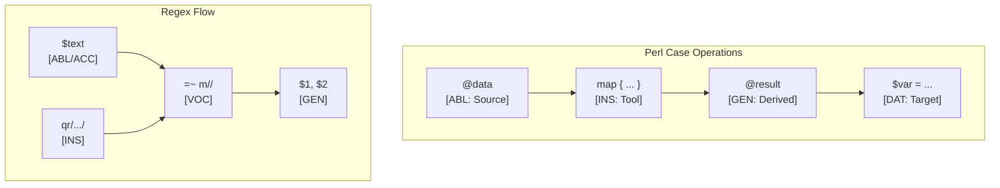

# Perl Language Paradigms and CEREBRUM Mapping

Perl (Practical Extraction and Report Language) is a high-level, general-purpose, interpreted, dynamic programming language. Originally developed for text manipulation, it borrowed features from C, sed, awk, and shell scripting. Perl 5 is known for its powerful regular expressions, CPAN archive, and flexibility (often summarized as "There's More Than One Way To Do It" - TMTOWTDI).

## 1. Overview of Perl Paradigms

- **Procedural Programming**: Strong support for subroutines, packages (namespaces), and traditional control flow.
- **Object-Oriented Programming**: Supported via packages, blessings, and conventions (Moose/Moo frameworks enhance this significantly).
- **Functional Programming**: Supports first-class functions (subroutine references), closures, `map`, `grep`.
- **Regular Expressions**: Deeply integrated and highly expressive regex engine.
- **Context Sensitivity**: Operations and variables often behave differently depending on scalar or list context.
- **Sigils**: Variables have prefixes (`$`, `@`, `%`, `&`) indicating their type (scalar, array, hash, subroutine).

Relationships are defined through subroutine calls, variable assignments, package interactions (method calls), regular expression matching/substitution, and operators.

## 2. Mapping CEREBRUM Cases to Perl Concepts

| CEREBRUM Case | Perl Equivalent/Analogy | Correspondence Strength | Notes |
|---------------|-------------------------|-------------------------|-------|
| **Nominative [NOM]** | Result of expression/subroutine call; Variable being defined (`my $var`); Object instance (`bless {}`) | Strong | The entity performing action or resulting from it. |
| **Accusative [ACC]** | Subroutine argument (`$_[0]`, named params); Variable being modified (LHS of assignment); Target of regex substitution (`s///`) | Strong | Entity directly receiving action or modification. |
| **Dative [DAT]** | Variable receiving assignment result; Target of `return` value contextually; Hash key being assigned | Strong | Recipient of data or result. |
| **Genitive [GEN]** | Subroutine argument (source); Variable on RHS of assignment; Regex capture group (`$1`); Hash/Array element access; Return value | Strong | Source of data, value, attribute. |
| **Instrumental [INS]** | Subroutine definition; Operator (`+`, `.`, `=~`); Regular expression pattern (`qr//`, `m//`); Module used (`use Module`) | Strong | The tool, subroutine, regex, or operator used. |
| **Ablative [ABL]** | Input source (file handle `<FH>`, array in `map`/`grep`); Source variable in copy; Default variable `$_` in loops/regex | Strong | Origin of data or iteration stream. |
| **Locative [LOC]** | Package scope; Subroutine scope (`my`); Lexical scope block (`{}`); Hash/Array container | Strong | Context, namespace, or container. |
| **Vocative [VOC]** | Subroutine call (`sub_name()`); Method call (`$obj->method()`); Regex match/subst (`=~ m//`, `=~ s///`); `use Module` statement | Strong | Direct invocation, application, or pattern match trigger. |

## 3. Key Perl Features and Case Relationships

### Variables and Sigils

Sigils denote variable types (`$calar`, `@rray`, `%hash`).

```perl
use strict;
use warnings;

# Scalar variable (NOM/DAT)
my $name = "Perl"; # "Perl" is GEN source

# Array (NOM/LOC container)
my @versions = (5, 6); # 5, 6 are GEN elements

# Hash (NOM/LOC container)
my %features = (
    regex => 1,     # key/value pairs are GEN
    cpan  => 1,
);

# Assignment (DAT target, GEN source)
my $current_version = $versions[0]; # $versions[0] is GEN element access

# Modifying hash element (ACC target)
$features{oop} = 1; # 1 is GEN source

# Accessing hash value (GEN access)
print "Name: $name\n";
print "First Version: $current_version\n";
print "OOP Feature Enabled: $features{oop}\n";

# Concatenation (INS operator `.`, GEN sources)
my $description = $name . " version " . $current_version;
print "Description: $description\n"; # $description is NOM/DAT
```

### Subroutines

Subroutines encapsulate logic (INS tool).

```perl
use strict;
use warnings;

# Subroutine definition (INS tool)
sub greet {
    my ($target) = @_; # @_ is ABL source array, $target is NOM/ACC argument
    return "Hello, $target!"; # Returns GEN string
}

# Subroutine call (VOC)
my $person = "World"; # NOM/DAT
my $greeting = greet($person); # $greeting is NOM/DAT, $person is ACC/GEN

print $greeting, "\n";

# Subroutine modifying argument (via reference - less common than return)
sub increment {
    my ($counter_ref) = @_; # $counter_ref is ACC/GEN (reference)
    $$counter_ref++;        # Dereference (ACC/DAT target)
}

my $count = 10; # NOM/DAT
increment(\$count); # Pass reference (ACC/GEN), VOC call
print "Incremented Count: $count\n"; # GEN access
```

### Regular Expressions

Regex operations are central (INS tools).

```perl
use strict;
use warnings;

my $text = "The quick brown fox jumps over the lazy dog."; # NOM/DAT

# Match operator (VOC `=~`, INS `m//`)
# $text is ABL source
if ($text =~ m/quick (brown) fox/) {
    # $1 is GEN capture group result
    print "Match found! Captured: $1\n"; 
} else {
    print "No match.\n";
}

# Substitution operator (VOC `=~`, INS `s///`)
# $text is ACC target being modified
my $count = ($text =~ s/lazy/energetic/g); # $count is NOM/DAT result (num changes), "energetic" is GEN source

print "After substitution ($count changes): $text\n";

# Split using regex (VOC `split`, INS `qr//`)
# $text is ABL source
my @words = split(qr/\s+/, $text); # @words is NOM/DAT result array
print "Words: ", join(", ", @words), "\n";
```

*Mermaid Diagram: Regex Substitution Flow*

```mermaid
graph TD
    InputText[ABL/ACC: $text] --> MatchOp{VOC: =~ s/lazy/energetic/g};
    Regex[INS: s/lazy/energetic/g] --> MatchOp;
    MatchOp -- Found 'lazy' --> Subst{Substitute with 'energetic'[GEN]};
    Subst --> OutputText[ACC/DAT: $text (modified)];
    MatchOp -- Not Found --> OutputText;
    MatchOp --> Count[NOM/DAT: $count];
```

### Context (Scalar vs. List)

Operations behave differently based on expected return context.

```perl
use strict;
use warnings;

my @letters = ('a', 'b', 'c'); # NOM/LOC

# List context assignment (DAT target expecting list)
my @copy = @letters; # @copy gets ('a', 'b', 'c')
print "List copy: @copy\n";

# Scalar context assignment (DAT target expecting scalar)
# Gets the number of elements
my $count = @letters; # $count gets 3 (GEN source)
print "Scalar count: $count\n";

# Function returning list in list context
sub get_coords { return (10, 20); } # Returns GEN list
my ($x, $y) = get_coords(); # $x, $y are NOM/DAT targets
print "Coords: x=$x, y=$y\n";

# Function returning last element in scalar context (example behavior)
# sub get_last { my @arr = @_; return $arr[-1]; } # Simplified example
# my $last_letter = get_last(@letters); # Would get 'c' (GEN)
```

### Packages and Basic OOP

OOP relies on packages (LOC), `bless` (INS), and method calls (VOC).

```perl
package Counter; # LOC namespace
use strict;
use warnings;

# Constructor (INS tool)
sub new {
    my ($class) = @_; # $class is GEN (package name)
    my $self = { count => 0 }; # $self is NOM hash reference
    bless $self, $class; # INS bless associates hash with package
    return $self; # Returns NOM blessed reference
}

# Method (INS tool)
sub increment {
    my ($self) = @_; # $self is NOM/ACC instance
    $self->{count}++; # Access hash element (GEN), increment (ACC/DAT)
}

# Method (INS tool)
sub get_count {
    my ($self) = @_; # $self is NOM/ACC instance
    return $self->{count}; # Access hash element (GEN), return value
}

# Switch back to main package (LOC)
package main;
use strict;
use warnings;

# Create object (VOC call to constructor)
my $c1 = Counter->new(); # $c1 is NOM/DAT instance

# Call methods (VOC)
$c1->increment(); # $c1 is NOM/ACC receiver
$c1->increment();

my $current_val = $c1->get_count(); # $current_val is NOM/DAT
print "Counter value: $current_val\n";

```

## 4. Implementation Approach

Directly modeling CEREBRUM cases in Perl is uncommon. Roles are inferred from:

1. **Sigils**: Indicate basic type (`$`, `@`, `%`).
2. **Syntax**: Assignment (`=`), subroutine calls (`&sub()` or `sub()`), method calls (`->`), regex operators (`=~`).
3. **Context**: How values are used (scalar vs list context).
4. **Built-ins**: Functions like `map`, `grep`, `split` imply ABL sources and INS operations.
5. **References**: Passing references (`\`) allows modification of originals (ACC/DAT role for referenced variable).
6. **Comments**: Explaining the intended roles of variables and arguments.

Frameworks like Moose/Moo provide more structured OOP, potentially making roles clearer through attribute definitions (`has 'attr' => (is => 'rw')` implies ACC/DAT, `is => 'ro'` implies GEN).

## 5. Conclusion

Perl's flexible, context-sensitive, and regex-centric nature provides diverse mappings to CEREBRUM cases:

- Sigils and variable usage define **NOM**, **ACC**, **DAT**, **GEN** roles dynamically.
- Subroutines and operators are primary **INS** tools, invoked via **VOC** calls.
- Regex matching and substitution (`=~`) are core **VOC**/**INS** mechanisms acting on **ABL**/**ACC** strings.
- Context sensitivity influences whether an **ABL** source yields a list or scalar **GEN** result.
- Packages define **LOC** namespaces, and blessing objects links data (**NOM** hash) to behavior (**INS** methods).

While Perl's TMTOWTDI philosophy can sometimes obscure strict roles compared to more rigid languages, its powerful operators and built-ins often clearly imply the case relationships involved in common text processing and scripting tasks.

## 6. Advanced CEREBRUM Implementation

### Moose-Based Case System

```perl
package CerebrumCase;
use Moose;
use Moose::Util::TypeConstraints;
use namespace::autoclean;

# Define case type constraint
enum 'CaseRole' => [qw(nom acc dat gen ins abl loc voc)];

# Case precision modifiers
our %CASE_PRECISION = (
    nom => 1.5,
    acc => 1.2,
    dat => 1.3,
    gen => 1.0,
    ins => 0.8,
    abl => 1.1,
    loc => 0.9,
    voc => 2.0,
);

# Valid transitions
our %VALID_TRANSITIONS = (
    nom => [qw(acc gen)],
    acc => [qw(gen dat)],
    abl => [qw(nom)],
    loc => [qw(abl)],
);

# Attributes
has 'base' => (
    is       => 'ro',
    isa      => 'Any',
    required => 1,
);

has 'case_role' => (
    is      => 'rw',
    isa     => 'CaseRole',
    default => 'nom',
);

has 'precision' => (
    is      => 'rw',
    isa     => 'Num',
    default => 1.0,
);

has 'history' => (
    is      => 'ro',
    isa     => 'ArrayRef',
    default => sub { [] },
    traits  => ['Array'],
    handles => {
        add_history => 'push',
        get_history => 'elements',
    },
);

# Methods
sub effective_precision {
    my $self = shift;
    return $self->precision * ($CASE_PRECISION{$self->case_role} // 1.0);
}

sub transform_to {
    my ($self, $target_case) = @_;
    
    my $valid = $VALID_TRANSITIONS{$self->case_role} // [];
    unless (grep { $_ eq $target_case } @$valid) {
        die "Invalid transition: " . $self->case_role . " -> $target_case";
    }
    
    $self->add_history({
        from => $self->case_role,
        to   => $target_case,
        time => time(),
    });
    
    $self->case_role($target_case);
    return $self;
}

sub to_string {
    my $self = shift;
    return sprintf("<%s>[%s](p=%.2f)", 
        $self->base, 
        uc($self->case_role), 
        $self->effective_precision);
}

__PACKAGE__->meta->make_immutable;

# Usage example
package main;
use strict;
use warnings;

my $agent = CerebrumCase->new(base => 'Processor', case_role => 'nom');
print $agent->to_string, "\n";  # <Processor>[NOM](p=1.50)

$agent->transform_to('acc');
print $agent->to_string, "\n";  # <Processor>[ACC](p=1.20)
```

### Active Inference Implementation

```perl
package ActiveInferenceAgent;
use Moose;
use namespace::autoclean;

has 'belief_mean' => (
    is      => 'rw',
    isa     => 'Num',
    default => 0.0,
);

has 'belief_precision' => (
    is      => 'rw',
    isa     => 'Num',
    default => 1.0,
);

has 'case_role' => (
    is      => 'rw',
    isa     => 'Str',
    default => 'nom',
);

# Case precision modifiers
my %CASE_PRECISION = (
    nom => 1.5,
    acc => 1.2,
    dat => 1.3,
    gen => 1.0,
    ins => 0.8,
    abl => 1.1,
    loc => 0.9,
    voc => 2.0,
);

# Bayesian belief update with case-aware precision
sub update {
    my ($self, $observation, $obs_precision) = @_;
    
    my $case_mod = $CASE_PRECISION{$self->case_role} // 1.0;
    my $adjusted_precision = $obs_precision * $case_mod;
    
    my $total_precision = $self->belief_precision + $adjusted_precision;
    my $posterior_mean = ($self->belief_precision * $self->belief_mean + 
                          $adjusted_precision * $observation) / $total_precision;
    
    $self->belief_mean($posterior_mean);
    $self->belief_precision($total_precision);
    
    return $self;
}

# Calculate variational free energy
sub free_energy {
    my ($self, $observation) = @_;
    
    my $case_mod = $CASE_PRECISION{$self->case_role} // 1.0;
    my $eff_precision = $self->belief_precision * $case_mod;
    
    my $pred_error = ($observation - $self->belief_mean) ** 2;
    return $pred_error * $eff_precision / 2.0;
}

# Predict next observation
sub predict {
    my $self = shift;
    return $self->belief_mean;
}

# Select action to minimize expected free energy
sub select_action {
    my ($self, @possible_observations) = @_;
    
    my $best_obs;
    my $min_fe = 'inf';
    
    for my $obs (@possible_observations) {
        my $fe = $self->free_energy($obs);
        if ($fe < $min_fe) {
            $min_fe = $fe;
            $best_obs = $obs;
        }
    }
    
    return ($best_obs, $min_fe);
}

sub to_string {
    my $self = shift;
    return sprintf("Agent[mean=%.3f, precision=%.3f, case=%s]",
        $self->belief_mean,
        $self->belief_precision,
        $self->case_role);
}

__PACKAGE__->meta->make_immutable;

# Usage
package main;
use strict;
use warnings;

my $agent = ActiveInferenceAgent->new(
    belief_mean => 5.0,
    belief_precision => 1.0,
    case_role => 'nom',
);

print "Initial: ", $agent->to_string, "\n";

$agent->update(6.0, 0.5);
print "After update: ", $agent->to_string, "\n";

my ($best, $fe) = $agent->select_action(4, 5, 6, 7);
print "Best action: observe $best (FE=$fe)\n";
```

### Case-Aware Regex Operations

```perl
package CaseRegex;
use strict;
use warnings;
use Exporter 'import';
our @EXPORT_OK = qw(case_match case_substitute case_transform);

# Apply regex match with case metadata
sub case_match {
    my ($text, $pattern, $case_role) = @_;
    $case_role //= 'gen';
    
    my @captures = ($text =~ $pattern);
    
    return {
        matched   => scalar(@captures) > 0,
        captures  => \@captures,
        case_role => $case_role,  # GEN for source text
        pattern_role => 'ins',    # Regex is INS tool
    };
}

# Apply regex substitution with case tracking
sub case_substitute {
    my ($text_ref, $pattern, $replacement, $case_role) = @_;
    $case_role //= 'acc';
    
    my $count = ($$text_ref =~ s/$pattern/$replacement/g);
    
    return {
        count        => $count,
        text_case    => $case_role,  # ACC for modified text
        pattern_role => 'ins',
        replacement_role => 'gen',   # Replacement is GEN source
    };
}

# Transform text through case-aware pipeline
sub case_transform {
    my ($text, @transforms) = @_;
    
    my @history;
    for my $t (@transforms) {
        my ($pattern, $replacement, $case) = @$t;
        $case //= 'acc';
        
        my $before = $text;
        $text =~ s/$pattern/$replacement/g;
        
        push @history, {
            before => $before,
            after  => $text,
            case   => $case,
        };
    }
    
    return ($text, \@history);
}

# Usage example
package main;
use strict;
use warnings;

my $text = "The quick brown fox jumps over the lazy dog.";

# Match with case tracking
my $result = CaseRegex::case_match($text, qr/(\w+)\s+fox/, 'abl');
print "Match result: ", $result->{matched} ? "found" : "not found", "\n";
print "Capture: $result->{captures}[0]\n" if $result->{matched};

# Substitution with case tracking
my $modified = $text;
my $sub_result = CaseRegex::case_substitute(\$modified, qr/lazy/, 'energetic');
print "Modified ($sub_result->{count} changes): $modified\n";

# Pipeline transformation
my ($final, $history) = CaseRegex::case_transform($text, 
    [qr/quick/, 'slow', 'acc'],
    [qr/brown/, 'white', 'acc'],
    [qr/lazy/, 'busy', 'acc'],
);
print "Final: $final\n";
```

### Case-Based Data Processing

```perl
package CaseProcessor;
use strict;
use warnings;
use List::Util qw(reduce sum);

# Process data with explicit case roles
sub process_with_cases {
    my ($source_data, $transform_fn, $case_config) = @_;
    
    # Source is ABL
    my @source = @$source_data;
    
    # Transform is INS
    my @results = map { $transform_fn->($_) } @source;
    
    # Results are GEN
    return {
        source_case   => 'abl',
        transform_case => 'ins',
        result_case    => 'gen',
        data          => \@results,
    };
}

# Aggregate with case semantics
sub aggregate_with_cases {
    my ($data, $agg_fn) = @_;
    
    return {
        source_case => 'abl',
        tool_case   => 'ins',
        result_case => 'nom',
        value       => $agg_fn->(@$data),
    };
}

# Example pipeline
package main;
use strict;
use warnings;

my @numbers = (1, 2, 3, 4, 5);

# Transform: square each number
my $squared = CaseProcessor::process_with_cases(
    \@numbers,
    sub { $_[0] ** 2 },
);
print "Squared (case: $squared->{result_case}): @{$squared->{data}}\n";

# Aggregate: sum the squares
my $total = CaseProcessor::aggregate_with_cases(
    $squared->{data},
    sub { List::Util::sum(@_) },
);
print "Sum (case: $total->{result_case}): $total->{value}\n";
```

## 7. Mermaid Diagram: Perl Case Flow



## 8. References

1. Schwartz, R. L., foy, b., & Phoenix, T. (2016). *Learning Perl* (7th ed.). O'Reilly Media.
2. Christiansen, T., foy, b., & Wall, L. (2012). *Programming Perl* (4th ed.). O'Reilly Media.
3. Perl Documentation. (<https://perldoc.perl.org/>)
4. CPAN - Comprehensive Perl Archive Network. (<https://www.cpan.org/>)
5. Moose Manual. (<https://metacpan.org/pod/Moose::Manual>)
6. Friston, K. (2010). The free-energy principle. Nature Reviews Neuroscience.
7. Stevan Little et al. (2023). Moose: A Modern Object System for Perl. CPAN.
