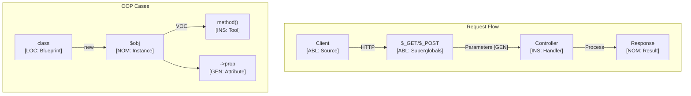

# PHP Language Paradigms and CEREBRUM Mapping

PHP (Hypertext Preprocessor) is a widely-used, open-source scripting language primarily designed for web development. It can be embedded into HTML and supports procedural, object-oriented, and functional programming paradigms (increasingly so in recent versions).

## 1. Overview of PHP Paradigms

- **Server-Side Scripting**: Core focus on generating dynamic web content.
- **Dynamic Typing**: Variable types are determined at runtime.
- **Procedural Programming**: C-like syntax for functions and control structures.
- **Object-Oriented Programming**: Robust support for classes, objects, inheritance, interfaces, traits.
- **Web Context**: Built-in superglobals (`$_GET`, `$_POST`, `$_SERVER`, etc.) provide access to request and server data.
- **Extensive Libraries**: Large standard library and community packages (via Composer).

Relationships are defined through function/method calls, class instantiation, variable assignments, and interaction with web request data.

## 2. Mapping CEREBRUM Cases to PHP Concepts

| CEREBRUM Case | PHP Equivalent/Analogy                      | Correspondence Strength | Notes                                                                 |
|---------------|---------------------------------------------|-------------------------|-----------------------------------------------------------------------|
| **Nominative [NOM]** | Variable result of expression/assignment; Object instance (`new Class()`); Function/Method itself | Strong                  | The entity created, assigned, or performing the action.                 |
| **Accusative [ACC]** | Function/Method argument (passed by value/ref); Object being acted upon; LHS of assignment | Strong                  | Entity receiving the direct action or being modified.                 |
| **Dative [DAT]** | Variable receiving assignment result; Function/Method argument passed by reference (`&`); Target of `return` statement contextually | Strong                  | Recipient of data or result.                                          |
| **Genitive [GEN]** | Function/Method argument (source data); Property access (`$obj->prop`); Array element access (`$arr['key']`); `return` value | Strong                  | Source of data, value, or attribute.                                |
| **Instrumental [INS]** | Function/Method definition; Class definition (as blueprint); Operator (`+`, `.`, `->`) | Strong                  | The tool, function, method, or operator used.                       |
| **Ablative [ABL]** | Superglobals (`$_GET`, `$_POST`, `$_FILES`); Input function argument; Source variable in copy assignment | Strong                  | Origin of external data or source in a transfer.                    |
| **Locative [LOC]** | Class scope; Function/Method scope; Global scope; Namespace; Included file context (`include`/`require`) | Strong                  | Context or environment where variables/functions exist.             |
| **Vocative [VOC]** | Function call (`func()`); Method call (`$obj->method()`); `echo`/`print`; `include`/`require` | Strong                  | Direct invocation or action trigger.                                  |

## 3. Key PHP Features and Case Relationships

### Variables and Assignment

PHP uses dynamic typing, with the dollar sign (`$`) prefixing variables.

```php
<?php
// Variable Definition (NOM)
$message = "Hello"; // $message is NOM, "Hello" is GEN source

// Assignment (DAT/ACC)
$greeting = $message; // $greeting is DAT, $message is GEN source

// Modification (ACC/DAT)
$count = 0;           // $count is NOM/DAT
$count = $count + 1;  // $count is ACC/DAT, 1 is GEN
$count++;             // $count is ACC/DAT (implicit operation)

echo $greeting . ", World! Count: " . $count; // VOC echo, GEN sources for concatenation
?>
```

### Functions

Functions encapsulate reusable code blocks.

```php
<?php
// Function definition (INS tool)
function greet(string $name, string $prefix = "Hello"): string {
    // $name, $prefix are ACC/GEN arguments
    $result = $prefix . ", " . $name . "!"; // $result is NOM/DAT
    return $result; // Returns GEN value
}

// Function call (VOC)
$person_name = "Alice"; // NOM/DAT
$salutation = greet($person_name); // $salutation is NOM/DAT, greet() is INS, $person_name is ACC/GEN

echo $salutation; // VOC

// Pass by reference (DAT role for argument)
function increment(int &$counter): void { // $counter is ACC/DAT
    $counter++;
}

$value = 5; // NOM/DAT
increment($value); // VOC call, $value passed as DAT
echo "\nIncremented value: " . $value; // GEN access to $value
?>
```

### Classes and Objects

PHP has strong OOP support.

```php
<?php
// Class definition (LOC blueprint, INS for methods)
class User {
    // Properties (GEN sources within object LOC)
    public string $username;
    private string $email;

    // Constructor (INS tool, invoked by `new`)
    public function __construct(string $username, string $email) {
        // `this` is NOM/ACC instance being initialized
        // $username, $email are ACC/GEN arguments
        $this->username = $username; // $this->username is ACC/DAT target
        $this->email = $email;
    }

    // Method (INS tool)
    public function getProfileSummary(): string {
        // `this` is NOM/ACC instance
        // Accessing properties (GEN access from LOC object)
        return "User: " . $this->username . " (Email hidden)"; // GEN result
    }
}

// Object Instantiation (VOC `new`, creates NOM instance)
$user1 = new User("bob_the_builder", "bob@example.com"); // $user1 is NOM/DAT

// Method Call (VOC)
// $user1 is NOM/ACC instance receiving the call
// getProfileSummary() is INS tool
$summary = $user1->getProfileSummary(); // $summary is NOM/DAT

echo $summary; // VOC
echo "\nUsername: " . $user1->username; // VOC, GEN access to public property
?>
```

### Arrays

PHP supports indexed and associative arrays.

```php
<?php
// Indexed Array (NOM container)
$colors = ["Red", "Green", "Blue"]; // GEN source elements

// Associative Array (NOM container)
$config = [
    'database' => 'mysql', // GEN key-value pairs
    'host' => 'localhost',
    'port' => 3306
];

// Accessing elements (GEN access)
echo "First color: " . $colors[0]; // VOC echo, GEN access $colors[0]
echo "\nDatabase Host: " . $config['host']; // VOC echo, GEN access $config['host']

// Modifying element (ACC/DAT target)
$config['port'] = 3307;

// Adding element (ACC/DAT target)
$colors[] = "Yellow"; // Implicit index

print_r($colors); // VOC print_r, $colors is ACC/GEN argument
print_r($config);
?>
```

### Web Request Handling (Superglobals)

Superglobals provide access to external context, acting as ABL sources.

```php
<?php
// Assuming request URL: /script.php?id=123&name=Example

// Accessing GET parameters (ABL source)
$itemId = $_GET['id'] ?? 'default'; // $itemId is NOM/DAT, $_GET['id'] is ABL/GEN
$itemName = $_GET['name'] ?? 'Unknown'; // $itemName is NOM/DAT, $_GET['name'] is ABL/GEN

echo "Item ID: " . htmlspecialchars($itemId); // VOC echo, GEN access
echo "\nItem Name: " . htmlspecialchars($itemName); // VOC echo, GEN access

// Example using POST (ABL source)
// $username = $_POST['username'] ?? null;
?>
```

*Mermaid Diagram: Simplified PHP Web Request Flow*

```mermaid
graph LR
    ClientRequest[Client Browser] -->|HTTP GET/POST (ABL)| WebServer{Web Server (Apache/Nginx)};
    WebServer -->|VOC Invoke| PHP_Script[LOC: script.php];
    PHP_Script -->|ABL Read| Superglobals($_GET, $_POST);
    Superglobals -->|GEN Data| PHP_Script;
    PHP_Script -->|INS Call (e.g., DB query)| Database[LOC: Database];
    Database -->|GEN Result| PHP_Script;
    PHP_Script -->|INS Logic/Function Calls| Processing{Business Logic};
    Processing -->|GEN Data| PHP_Script;
    PHP_Script -->|VOC echo/print| HTML_Output[ACC/DAT: Generated HTML];
    HTML_Output -->|HTTP Response| WebServer;
    WebServer --> ClientRequest;
```

## 4. Implementation Approach

Case roles in PHP are primarily inferred from syntax and context:

1. **Variable Usage**: Assignment (`=`), modification (`++`, `+=`), function/method calls determine NOM, ACC, DAT, GEN roles.
2. **Function/Method Signatures**: Parameter types (by value, by reference `&`), return types indicate ACC, DAT, GEN roles.
3. **Object Interaction**: `new` creates NOM, `->` invokes INS methods on NOM/ACC objects or accesses GEN properties.
4. **Array Syntax**: `[]` for access (GEN) or assignment (ACC/DAT).
5. **Superglobals**: Direct access to `$_GET`, `$_POST`, etc., represents ABL sources.
6. **Control Structures**: `if`, `foreach`, `while` act as INS mechanisms controlling flow based on GEN conditions or iterating over ABL/GEN sources.

```php
<?php
// Function simulating processing user input (INS tool)
function processUserData(array $inputData): array { // $inputData is ACC/GEN
    $output = []; // NOM/DAT
    if (!empty($inputData['name'])) { // INS if, GEN access
        // ACC/DAT assignment, GEN access & concatenation
        $output['greeting'] = "Welcome, " . htmlspecialchars($inputData['name']);
    } else {
        $output['error'] = "Name is missing."; // ACC/DAT assignment, GEN literal
    }
    return $output; // Returns NOM/GEN array
}

// Simulate receiving POST data (ABL source)
$simulatedPost = ['name' => 'Charlie']; // NOM container

// Call processing function (VOC)
// $simulatedPost is ACC/GEN argument
// $result is NOM/DAT target
$result = processUserData($simulatedPost);

// Output result (VOC echo, GEN access)
echo $result['greeting'] ?? $result['error'] ?? 'Unknown outcome';
?>
```

## 5. Conclusion

PHP's blend of procedural and object-oriented features within a web-centric environment provides clear mappings to CEREBRUM cases.

- Functions and methods are explicit **INS** tools invoked via **VOC** calls.
- Variables fluidly take on **NOM**, **ACC**, **DAT**, and **GEN** roles based on assignment and usage.
- Objects serve as **NOM** entities within **LOC** class scopes, with properties as **GEN** sources.
- Superglobals (`$_GET`, `$_POST`) are canonical **ABL** sources of external data.
- Control structures and operators act as implicit **INS** mechanisms.

While dynamic typing can sometimes obscure intent compared to statically typed languages, PHP's syntax generally provides sufficient cues to infer the case roles of participants in operations, particularly within the context of handling web requests and generating responses.

## 6. Advanced CEREBRUM Implementation

### Case-Bearing Entity Classes

```php
<?php

declare(strict_types=1);

namespace Cerebrum;

/**
 * Case role enumeration
 */
enum CaseRole: string
{
    case NOM = 'Nominative';
    case ACC = 'Accusative';
    case DAT = 'Dative';
    case GEN = 'Genitive';
    case INS = 'Instrumental';
    case ABL = 'Ablative';
    case LOC = 'Locative';
    case VOC = 'Vocative';
    
    public function precision(): float
    {
        return match($this) {
            self::NOM => 1.5,
            self::ACC => 1.2,
            self::DAT => 1.3,
            self::GEN => 1.0,
            self::INS => 0.8,
            self::ABL => 1.1,
            self::LOC => 0.9,
            self::VOC => 2.0,
        };
    }
}

/**
 * Transition record
 */
readonly class Transition
{
    public function __construct(
        public CaseRole $from,
        public CaseRole $to,
        public \DateTimeImmutable $timestamp,
    ) {}
}

/**
 * Case-bearing entity interface
 */
interface CaseBearerInterface
{
    public function getCase(): CaseRole;
    public function getBase(): mixed;
    public function effectivePrecision(): float;
    public function transformTo(CaseRole $target): self;
}

/**
 * Generic case-bearing entity
 */
class CaseEntity implements CaseBearerInterface
{
    private const array VALID_TRANSITIONS = [
        'NOM' => ['ACC', 'GEN'],
        'ACC' => ['GEN', 'DAT'],
        'ABL' => ['NOM'],
        'LOC' => ['ABL'],
    ];
    
    /** @var Transition[] */
    private array $history = [];
    
    public function __construct(
        private mixed $base,
        private CaseRole $case = CaseRole::NOM,
        private float $precision = 1.0,
    ) {}
    
    public function getCase(): CaseRole
    {
        return $this->case;
    }
    
    public function getBase(): mixed
    {
        return $this->base;
    }
    
    public function effectivePrecision(): float
    {
        return $this->precision * $this->case->precision();
    }
    
    public function transformTo(CaseRole $target): self
    {
        $validTargets = self::VALID_TRANSITIONS[$this->case->name] ?? [];
        
        if (!in_array($target->name, $validTargets, true)) {
            throw new \InvalidArgumentException(
                "Invalid transition: {$this->case->name} -> {$target->name}"
            );
        }
        
        $new = clone $this;
        $new->history[] = new Transition($this->case, $target, new \DateTimeImmutable());
        $new->case = $target;
        
        return $new;
    }
    
    /** @return Transition[] */
    public function getHistory(): array
    {
        return $this->history;
    }
}
```

### Active Inference Implementation

```php
<?php

namespace Cerebrum\ActiveInference;

/**
 * Belief state for Active Inference
 */
class BeliefState
{
    public function __construct(
        public float $mean = 0.0,
        public float $precision = 1.0,
    ) {}
    
    public function variance(): float
    {
        return 1.0 / $this->precision;
    }
    
    public function update(float $observation, float $obsPrecision): self
    {
        $totalPrecision = $this->precision + $obsPrecision;
        $newMean = ($this->precision * $this->mean + $obsPrecision * $observation) / $totalPrecision;
        
        return new self($newMean, $totalPrecision);
    }
}

/**
 * Active Inference agent with case-aware precision
 */
class ActiveInferenceAgent
{
    private BeliefState $belief;
    
    public function __construct(
        private CaseEntity $entity,
        float $initialMean = 0.0,
    ) {
        $this->belief = new BeliefState($initialMean, 1.0);
    }
    
    public function observe(float $observation, float $baseObsPrecision = 1.0): void
    {
        $adjustedPrecision = $baseObsPrecision * $this->entity->effectivePrecision();
        $this->belief = $this->belief->update($observation, $adjustedPrecision);
    }
    
    public function freeEnergy(float $observation): float
    {
        $predError = $observation - $this->belief->mean;
        $effPrecision = $this->belief->precision * $this->entity->effectivePrecision();
        
        return ($predError ** 2 * $effPrecision) / 2.0;
    }
    
    public function predict(): float
    {
        return $this->belief->mean;
    }
    
    /**
     * @param float[] $possibleObservations
     * @return array{observation: float, freeEnergy: float}
     */
    public function selectAction(array $possibleObservations): array
    {
        $best = ['observation' => 0.0, 'freeEnergy' => PHP_FLOAT_MAX];
        
        foreach ($possibleObservations as $obs) {
            $fe = $this->freeEnergy($obs);
            if ($fe < $best['freeEnergy']) {
                $best = ['observation' => $obs, 'freeEnergy' => $fe];
            }
        }
        
        return $best;
    }
    
    public function getEntity(): CaseEntity
    {
        return $this->entity;
    }
    
    public function getBelief(): BeliefState
    {
        return $this->belief;
    }
}
```

### PSR-15 Case-Aware Middleware

```php
<?php

namespace Cerebrum\Http;

use Psr\Http\Message\ServerRequestInterface;
use Psr\Http\Message\ResponseInterface;
use Psr\Http\Server\MiddlewareInterface;
use Psr\Http\Server\RequestHandlerInterface;

/**
 * Middleware that annotates requests with case semantics
 */
class CaseAnnotationMiddleware implements MiddlewareInterface
{
    public const ATTR_CASE_CONTEXT = 'cerebrum.case_context';
    
    public function process(
        ServerRequestInterface $request,
        RequestHandlerInterface $handler
    ): ResponseInterface {
        // Request arrives as ABL (source of data)
        $context = new CaseContext(CaseRole::ABL);
        
        // Parse query parameters as GEN sources
        foreach ($request->getQueryParams() as $key => $value) {
            $context->addParameter(
                new CaseEntity($value, CaseRole::GEN),
                $key
            );
        }
        
        // Parse body parameters as GEN sources
        $body = $request->getParsedBody() ?? [];
        foreach ($body as $key => $value) {
            $context->addParameter(
                new CaseEntity($value, CaseRole::GEN),
                $key
            );
        }
        
        // Handler will act as INS tool
        $context->setRole(CaseRole::INS);
        
        $request = $request->withAttribute(self::ATTR_CASE_CONTEXT, $context);
        
        // VOC: Invoke handler
        $response = $handler->handle($request);
        
        // Response becomes NOM (result)
        $context->setRole(CaseRole::NOM);
        
        return $response;
    }
}

/**
 * Case context container
 */
class CaseContext
{
    /** @var array<string, CaseEntity> */
    private array $parameters = [];
    
    public function __construct(
        private CaseRole $role,
    ) {}
    
    public function addParameter(CaseEntity $entity, string $key): void
    {
        $this->parameters[$key] = $entity;
    }
    
    public function getParameter(string $key): ?CaseEntity
    {
        return $this->parameters[$key] ?? null;
    }
    
    public function setRole(CaseRole $role): void
    {
        $this->role = $role;
    }
    
    public function getRole(): CaseRole
    {
        return $this->role;
    }
    
    public function totalPrecision(): float
    {
        $total = $this->role->precision();
        foreach ($this->parameters as $entity) {
            $total += $entity->effectivePrecision();
        }
        return $total;
    }
}
```

### Usage Example

```php
<?php

use Cerebrum\CaseEntity;
use Cerebrum\CaseRole;
use Cerebrum\ActiveInference\ActiveInferenceAgent;

// Create case-bearing entities
$processor = new CaseEntity('DataProcessor', CaseRole::NOM);
echo "Processor case: " . $processor->getCase()->name . "\n";
echo "Effective precision: " . $processor->effectivePrecision() . "\n";

// Transform case
try {
    $processorAsAcc = $processor->transformTo(CaseRole::ACC);
    echo "Transformed to: " . $processorAsAcc->getCase()->name . "\n";
} catch (\InvalidArgumentException $e) {
    echo "Error: " . $e->getMessage() . "\n";
}

// Active Inference agent
$agent = new ActiveInferenceAgent($processor, 5.0);
echo "Initial prediction: " . $agent->predict() . "\n";

// Observe
$agent->observe(6.0, 0.5);
echo "After observation: " . $agent->predict() . "\n";

// Select action
$result = $agent->selectAction([4.0, 5.0, 6.0, 7.0]);
echo "Best action: observe " . $result['observation'] . 
     " (FE=" . number_format($result['freeEnergy'], 4) . ")\n";
```

## 7. Mermaid Diagram: PHP Case Architecture



## 8. References

1. PHP Manual. (<https://www.php.net/manual/en/>)
2. Sklar, D., & Trachtenberg, A. (2014). PHP Cookbook: Solutions & Examples for PHP Programmers. O'Reilly Media.
3. PHP The Right Way. (<https://phptherightway.com/>)
4. PSR Standards (PHP Standards Recommendations). (<https://www.php-fig.org/psr/>)
5. Friston, K. (2010). The free-energy principle. Nature Reviews Neuroscience.
6. Lockhart, J. (2015). Modern PHP: New Features and Good Practices. O'Reilly Media.
