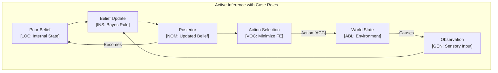

# R Language Paradigms and CEREBRUM Mapping

R is a language and environment primarily designed for statistical computing, data analysis, and graphics. It evolved from the S language and features a mix of functional and object-oriented paradigms, with a strong emphasis on vectorized operations.

## 1. Overview of R Paradigms

- **Vectorized Operations**: Core principle where operations apply element-wise to vectors, matrices, and lists, often implicitly.
- **Functional Programming**: Functions are first-class objects; supports anonymous functions, closures, and higher-order functions (`lapply`, `sapply`, `apply`).
- **Object-Oriented Systems**: Several OO systems coexist (S3, S4, R6), S3 being the most common (uses generic functions and class attributes).
- **Interactive Environment**: Designed for interactive data exploration and analysis.
- **Lazy Evaluation**: Function arguments are often evaluated only when needed.
- **Data Structures**: Rich set of data structures tailored for statistics (vectors, factors, matrices, arrays, lists, data frames).
- **Extensibility**: Massive ecosystem of packages via CRAN (Comprehensive R Archive Network).

Relationships are defined by function calls, assignment (`<-` or `=`), vectorized operations, formula specifications (e.g., in modeling functions), and object system interactions (method dispatch).

## 2. Mapping CEREBRUM Cases to R Concepts

| CEREBRUM Case | R Equivalent/Analogy | Correspondence Strength | Notes |
|---------------|------------------------|-------------------------|-------|
| **Nominative [NOM]** | Result of function/expression; Variable defined (`var <- ...`); Object returned by function | Strong | Entity resulting from computation or the active object. |
| **Accusative [ACC]** | Function argument (data input); Data frame being modified; Vector element being assigned to | Strong | Entity receiving action, being processed, or modified. |
| **Dative [DAT]** | Variable receiving assignment result (`target <- ...`); Argument receiving output (less common, usually return value) | Strong | Recipient of data or result. |
| **Genitive [GEN]** | Function argument (source); Value on RHS of assignment; Element/Column access (`vec[i]`, `df$col`, `df[["col"]]`); Return value | Strong | Source of data, value, attribute, or component. |
| **Instrumental [INS]** | Function definition; Operator (`+`, `%*%`, `~`); Package providing functions (`library(pkg)`) | Strong | The tool, function, formula, or operator used. |
| **Ablative [ABL]** | Data source vector/list/data frame; Input argument; File connection (`read.csv`) | Strong | Origin of data or iteration stream. |
| **Locative [LOC]** | Environment (global, package, function); List/Data frame container; Function scope | Strong | Context, container, or environment where objects exist. |
| **Vocative [VOC]** | Function call (`func(arg)`); Formula evaluation (`lm(y ~ x)`); Method dispatch (S3/S4/R6) | Strong | Direct invocation, formula application, or function execution. |

## 3. Key R Features and Case Relationships

### Vectors and Vectorized Operations

The fundamental data structure.

```R
# Vector creation (NOM/DAT assignment)
# c() is INS constructor, numbers are GEN sources
x <- c(1, 3, 5, 7)

# Vectorized operation (INS operator `+`)
# x is ABL/GEN source, 10 is GEN source
# y is NOM/DAT result
y <- x + 10

# Print results (VOC call `print`)
# y is ACC/GEN argument
print(y) # Output: [1] 11 13 15 17

# Logical subsetting (INS operator `[`)
# x > 4 is INS condition using GEN sources
# x is ABL source for subsetting
# subset_x is NOM/DAT result
subset_x <- x[x > 4]
print(subset_x) # Output: [1] 5 7

# Assignment to subset (ACC/DAT target)
# 99 is GEN source
x[x == 5] <- 99 
print(x) # Output: [1]  1  3 99  7
```

### Data Frames

Tabular data structure (LOC container).

```R
# Data frame creation (NOM/DAT assignment, LOC container)
# data.frame() is INS constructor
# name, age, score are GEN source vectors
df <- data.frame(
  name = c("Alice", "Bob", "Charlie"),
  age = c(25, 30, 28),
  score = c(88, 95, 72)
)

# Accessing column (GEN access using INS `$`/`[[` operator)
# df is LOC container
names_col <- df$name
print(names_col)

# Accessing element (GEN access)
first_age <- df[1, "age"]
print(first_age)

# Adding a new column (ACC/DAT target column)
# df$score / 100 is GEN source expression
df$score_pct <- df$score / 100 

# Modifying data frame (subsetting + assignment - ACC/DAT target)
# df$age > 25 is INS condition
df[df$age > 25, "score_pct"] <- df[df$age > 25, "score_pct"] * 1.1 # Increase score_pct by 10%

# Print modified data frame (VOC print, df is ACC/GEN argument)
print(df)
```

### Functions

Functions are first-class objects (INS tools).

```R
# Function definition (INS tool)
calculate_stats <- function(data_vector) { # data_vector is ACC/GEN argument
  # mean(), sd() are INS functions
  # data_vector is ABL/GEN source for them
  list( # Returns NOM/GEN list
    mean_val = mean(data_vector),
    sd_val = sd(data_vector)
  )
}

# Create data vector (NOM/DAT)
measurements <- c(10.2, 11.5, 9.8, 10.5, 11.1)

# Call function (VOC)
# measurements is ACC/GEN argument
# stats_result is NOM/DAT target
stats_result <- calculate_stats(measurements)

# Access list elements (GEN access using INS `$`/`[[`)
print(paste("Mean:", stats_result$mean_val))
print(paste("SD:", stats_result$sd_val))

# Higher-order function `lapply` (INS tool)
# list_of_vectors is ABL source
# calculate_stats is INS function argument
list_of_vectors <- list(a = 1:5, b = 6:10)
all_stats <- lapply(list_of_vectors, calculate_stats) # all_stats is NOM/DAT result

print(all_stats)
```

*Mermaid Diagram: `lapply` Flow*

```mermaid
graph TD
    InputList[ABL: list_of_vectors] --> Lapply{VOC: lapply(list, func)};
    Func[INS: calculate_stats] --> Lapply;
    subgraph Lapply Iteration
        Lapply -- Element 1 'a' (ACC) --> Call1[VOC: calculate_stats(a)];
        Call1 --> Result1[GEN: list(mean_a, sd_a)];
        Lapply -- Element 2 'b' (ACC) --> Call2[VOC: calculate_stats(b)];
        Call2 --> Result2[GEN: list(mean_b, sd_b)];
    end
    Result1 --> OutputList[NOM/DAT: all_stats];
    Result2 --> OutputList;
```

### Formulas

Formulas define relationships, typically for modeling (INS tools).

```R
# Create sample data frame (NOM/DAT, LOC)
data <- data.frame(x = 1:10, y = 2*(1:10) + rnorm(10, 0, 2))

# Define formula (INS tool)
# Represents relationship y depends on x
model_formula <- y ~ x

# Use formula in linear model function (VOC `lm`)
# `lm` is INS modeling tool
# model_formula is INS specification
# data is ABL source
linear_model <- lm(formula = model_formula, data = data)

# `linear_model` is NOM/DAT result (complex object)

# Print model summary (VOC `summary`, INS tool)
# linear_model is ACC/GEN argument
print(summary(linear_model))

# Extract coefficients (GEN access using INS `coef()`)
coefficients <- coef(linear_model)
print(coefficients)
```

### Plotting

Base R and packages like ggplot2 provide plotting functions (INS tools).

```R
# Base R plot (VOC `plot`, INS tool)
# data$x, data$y are ABL/GEN sources
plot(data$x, data$y, main = "Scatter Plot", xlab = "X Value", ylab = "Y Value")

# Add regression line (VOC `abline`, INS tool)
# linear_model provides GEN coefficients implicitly
abline(linear_model, col = "red")

# Using ggplot2 (requires installation: install.packages("ggplot2"))
# library(ggplot2)
# ggplot(data, aes(x = x, y = y)) + # VOC ggplot, aes; INS +, geom_point, geom_smooth
#   geom_point() + 
#   geom_smooth(method = "lm", se = FALSE, color = "blue") + 
#   ggtitle("Scatter Plot with Regression Line")
```

## 4. Implementation Approach

Case roles in R are primarily inferred from:

1. **Function Signatures**: Argument names often suggest roles (e.g., `data = ...` is often ABL/ACC). Return values are NOM/GEN.
2. **Assignment Operator (`<-`)**: LHS is DAT, RHS is GEN.
3. **Vectorized Nature**: Operations implicitly treat vectors/columns as ABL sources and produce NOM results or modify ACC targets.
4. **Formulas (`~`)**: Define relationships (INS) between variables (GEN sources within a data LOC).
5. **Subsetting Operators (`[`, `[[`, `$`)**: Access GEN components from LOC containers.
6. **OO Systems**: Method dispatch (VOC) acts on objects (NOM/ACC).

Explicit CEREBRUM modeling isn't idiomatic. Documentation (comments, function help files) clarifies intent.

## 5. Conclusion

R's design for data analysis provides natural mappings to CEREBRUM cases:

- Vectors, data frames, lists serve as **ABL** sources and **LOC** containers.
- Function calls (**VOC**) apply **INS** tools (functions, operators) to **ACC**/**GEN** arguments.
- Assignment (`<-`) clearly marks **DAT** recipients and **GEN** sources.
- Vectorization implies implicit iteration over **ABL** sources.
- Formulas (`~`) are explicit **INS** representations of relationships between **GEN** variables.
- Subsetting provides **GEN** access to components within **LOC** structures.

While R's flexibility and multiple OO systems can sometimes lead to ambiguity, its focus on applying functions to data structures aligns well with interpreting operations through the lens of case relationships.

## 6. Advanced CEREBRUM Implementation

### R6 Class-Based Case System

```R
# Using R6 for mutable case-bearing entities
library(R6)

# Define CEREBRUM Case enumeration
Case <- list(
  NOM = "NOM",  # Nominative: Active agent
  ACC = "ACC",  # Accusative: Patient/target  
  DAT = "DAT",  # Dative: Recipient
  GEN = "GEN",  # Genitive: Source/possessor
  INS = "INS",  # Instrumental: Tool/means
  ABL = "ABL",  # Ablative: Origin
  LOC = "LOC",  # Locative: Location/context
  VOC = "VOC"   # Vocative: Direct address
)

# Case precision modifiers for Active Inference
CasePrecision <- c(
  NOM = 1.5,
  ACC = 1.2,
  DAT = 1.3,
  GEN = 1.0,
  INS = 0.8,
  ABL = 1.1,
  LOC = 0.9,
  VOC = 2.0
)

# Case-bearing entity class
CaseEntity <- R6Class("CaseEntity",
  public = list(
    base = NULL,
    case = NULL,
    precision = NULL,
    history = NULL,
    
    initialize = function(base, case = "NOM", precision = 1.0) {
      self$base <- base
      self$case <- case
      self$precision <- precision
      self$history <- list()
    },
    
    # Transform to new case
    transform_to = function(target_case) {
      old_case <- self$case
      self$history <- c(self$history, list(
        list(from = old_case, to = target_case, time = Sys.time())
      ))
      self$case <- target_case
      invisible(self)
    },
    
    # Get effective precision (case-adjusted)
    effective_precision = function() {
      self$precision * CasePrecision[[self$case]]
    },
    
    # Print representation
    print = function(...) {
      cat(sprintf("<%s>[%s](p=%.2f)\n", 
                  as.character(self$base), 
                  self$case, 
                  self$effective_precision()))
      invisible(self)
    }
  )
)

# Example usage
agent <- CaseEntity$new("Processor", "NOM", 1.0)
patient <- CaseEntity$new("Data", "ACC", 0.9)
print(agent)
print(patient)

agent$transform_to("GEN")
print(agent)
```

### Active Inference Implementation

```R
# Active Inference agent using CEREBRUM cases
ActiveInferenceAgent <- R6Class("ActiveInferenceAgent",
  public = list(
    belief_mean = NULL,
    belief_precision = NULL,
    case = NULL,
    
    initialize = function(initial_mean, initial_precision, case = "NOM") {
      self$belief_mean <- initial_mean
      self$belief_precision <- initial_precision
      self$case <- case
    },
    
    # Update beliefs with new observation
    update = function(observation, obs_precision) {
      case_mod <- CasePrecision[[self$case]]
      adjusted_precision <- obs_precision * case_mod
      
      total_precision <- self$belief_precision + adjusted_precision
      posterior_mean <- (self$belief_precision * self$belief_mean + 
                        adjusted_precision * observation) / total_precision
      
      self$belief_mean <- posterior_mean
      self$belief_precision <- total_precision
      invisible(self)
    },
    
    # Calculate variational free energy
    free_energy = function(observation) {
      case_mod <- CasePrecision[[self$case]]
      eff_precision <- self$belief_precision * case_mod
      
      pred_error <- (observation - self$belief_mean)^2
      return(pred_error * eff_precision / 2)
    },
    
    # Predict next observation
    predict = function() {
      return(self$belief_mean)
    },
    
    # Select action to minimize expected free energy
    select_action = function(possible_observations) {
      fe_values <- sapply(possible_observations, self$free_energy)
      best_idx <- which.min(fe_values)
      return(list(
        observation = possible_observations[best_idx],
        free_energy = fe_values[best_idx]
      ))
    }
  )
)

# Example Active Inference workflow
model <- ActiveInferenceAgent$new(5.0, 1.0, "NOM")
cat(sprintf("Initial: mean=%.2f, precision=%.2f\n", 
            model$belief_mean, model$belief_precision))

# Update with observation
model$update(6.0, 0.5)
cat(sprintf("After update: mean=%.2f, precision=%.2f\n", 
            model$belief_mean, model$belief_precision))

# Action selection
result <- model$select_action(c(4, 5, 6, 7))
cat(sprintf("Best action: observe %.1f (FE=%.4f)\n", 
            result$observation, result$free_energy))
```

### Tidyverse Integration with Case Roles

```R
library(dplyr)
library(tidyr)
library(purrr)

# Case-aware data transformations using tidyverse
case_transform <- function(data, case_role) {
  # Attach case metadata as attribute
  attr(data, "case_role") <- case_role
  attr(data, "case_time") <- Sys.time()
  return(data)
}

get_case <- function(data) {
  attr(data, "case_role") %||% "UNDEFINED"
}

# Pipeline with case transitions
# df is ABL source, transformations produce GEN results
process_with_cases <- function(df) {
  df %>%
    case_transform("ABL") %>%  # Mark as source
    mutate(
      processed = value * 2  # GEN derived
    ) %>%
    case_transform("GEN") %>%  # Now a derived result
    filter(processed > 10) %>%  # ACC being filtered
    case_transform("ACC") %>%
    summarize(
      mean_val = mean(processed),
      n = n()
    ) %>%
    case_transform("GEN")  # Final aggregated result
}

# Example
sample_df <- data.frame(value = c(5, 10, 15, 20))
result <- process_with_cases(sample_df)
cat("Result case:", get_case(result), "\n")
print(result)
```

### Formula-Based Case Modeling

```R
# Statistical models with case-aware formulas
# The formula y ~ x represents:
#   y: NOM/ACC (response, being modeled)
#   x: GEN/ABL (predictor, source of information)
#   ~: INS (relationship specification)

# Create case-tagged model
fit_case_aware_model <- function(formula, data, cases = list()) {
  # Default case assignments
  response_var <- all.vars(formula)[1]
  predictor_vars <- all.vars(formula)[-1]
  
  model <- lm(formula, data = data)
  
  # Attach case metadata
  attr(model, "case_roles") <- list(
    response = list(var = response_var, case = "ACC"),
    predictors = lapply(predictor_vars, function(v) list(var = v, case = "GEN")),
    formula = list(role = "INS"),
    data = list(role = "ABL")
  )
  
  class(model) <- c("case_aware_lm", class(model))
  return(model)
}

# Print method for case-aware model
print.case_aware_lm <- function(x, ...) {
  cat("Case-Aware Linear Model\n")
  cat("Case Roles:\n")
  roles <- attr(x, "case_roles")
  cat(sprintf("  Response [ACC]: %s\n", roles$response$var))
  for (p in roles$predictors) {
    cat(sprintf("  Predictor [GEN]: %s\n", p$var))
  }
  cat("  Formula [INS]\n")
  cat("  Data [ABL]\n\n")
  NextMethod("print", x)
}

# Example
data <- data.frame(x = 1:10, y = 2*(1:10) + rnorm(10))
model <- fit_case_aware_model(y ~ x, data)
print(model)
```

### Bayesian Modeling with Case Semantics

```R
# Conceptual: Bayesian model with case-aware priors
# Using case roles to specify prior strengths

bayesian_case_update <- function(prior_mean, prior_precision, 
                                  observations, obs_case = "GEN") {
  # Case modifies observation weight
  case_weight <- CasePrecision[[obs_case]]
  
  n <- length(observations)
  data_mean <- mean(observations)
  data_precision <- n * case_weight  # Case affects precision
  
  # Posterior calculation (conjugate normal-normal)
  posterior_precision <- prior_precision + data_precision
  posterior_mean <- (prior_precision * prior_mean + 
                     data_precision * data_mean) / posterior_precision
  
  return(list(
    mean = posterior_mean,
    precision = posterior_precision,
    sd = 1 / sqrt(posterior_precision),
    case_influence = case_weight
  ))
}

# Example
prior <- list(mean = 0, precision = 1)
observations <- c(2.1, 2.5, 1.9, 2.3)

# Standard update (GEN case - neutral precision)
result_gen <- bayesian_case_update(prior$mean, prior$precision, 
                                    observations, "GEN")

# Update with VOC case (higher precision - more weight)
result_voc <- bayesian_case_update(prior$mean, prior$precision,
                                    observations, "VOC")

cat("GEN update: mean=", round(result_gen$mean, 3), 
    " precision=", round(result_gen$precision, 3), "\n")
cat("VOC update: mean=", round(result_voc$mean, 3), 
    " precision=", round(result_voc$precision, 3), "\n")
```

## 7. Mermaid Diagram: Active Inference Cycle



## 8. References

1. Chambers, J. M. (2008). *Software for Data Analysis: Programming with R*. Springer.
2. Wickham, H. (2019). *Advanced R* (2nd ed.). Chapman and Hall/CRC.
3. Grolemund, G., & Wickham, H. (2017). *R for Data Science*. O'Reilly Media.
4. R Core Team (2023). *R: A language and environment for statistical computing*. R Foundation for Statistical Computing, Vienna, Austria. (<https://www.R-project.org/>)
5. CRAN (Comprehensive R Archive Network). (<https://CRAN.R-project.org/>)
6. Friston, K. (2010). The free-energy principle: a unified brain theory? Nature Reviews Neuroscience.
7. Chang, W. (2022). *R6: Encapsulated Classes with Reference Semantics*. CRAN.
