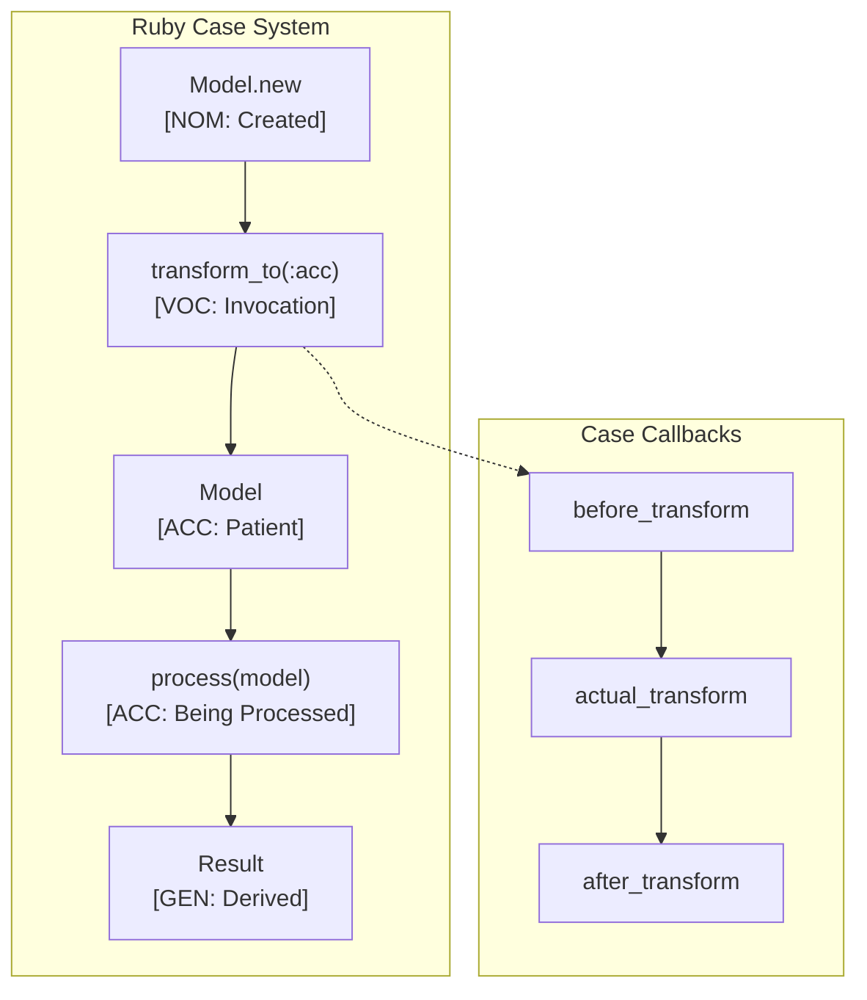

# Ruby Language Paradigms and CEREBRUM Mapping

Ruby is a dynamic, open-source programming language with a focus on simplicity and productivity. It features an elegant syntax that is natural to read and easy to write. This document explores how Ruby's paradigms map to CEREBRUM cases.

## 1. Overview of Ruby Paradigms

Ruby is primarily known for:

- **Object-Oriented Programming**: Everything is an object, including primitive types. Strong support for classes, mixins (modules).
- **Dynamic Typing**: Types are checked at runtime.
- **Metaprogramming**: Extensive capabilities to modify language constructs at runtime (e.g., monkey patching, `method_missing`).
- **Blocks, Procs, and Lambdas**: Flexible constructs for functional programming patterns.
- **Expressive Syntax**: Aims for readability and developer happiness.
- **Mixins**: Using modules (`include`, `extend`) for code reuse instead of multiple inheritance.

Relationships in Ruby are defined through message passing (method calls), object state, blocks, and module inclusion.

## 2. Mapping CEREBRUM Cases to Ruby Concepts

| CEREBRUM Case | Ruby Equivalent/Analogy | Correspondence Strength | Notes |
|---------------|-------------------------|-------------------------|-------|
| **Nominative [NOM]** | Object receiving message (`receiver.method`); Variable defined (`var = value`) | Strong | The acting entity or subject being defined. |
| **Accusative [ACC]** | Argument to a method; Object being modified; Block parameter | Strong | Entity receiving action or being processed. |
| **Dative [DAT]** | Target of assignment; Block passed to method (yield target) | Moderate | Recipient of value or control flow. |
| **Genitive [GEN]** | Instance variable access (`@ivar`); Method return value; Module/Class source | Strong | Source, possession, or derived value. |
| **Instrumental [INS]** | Module included/prepended; Block/Proc/Lambda used as tool; Method definition | Strong | Tool, mechanism, or added capability. |
| **Ablative [ABL]** | Collection being iterated (`each`); Source object in method call | Strong | Origin of data or process. |
| **Locative [LOC]** | Class/Module definition scope; Block scope; Object containing instance vars | Strong | Context, container, or location. |
| **Vocative [VOC]** | Method call (`receiver.method(args)`); Block invocation (`yield`, `call`) | Strong | Direct invocation or addressing. |

## 3. Key Ruby Features and Case Relationships

### Everything is an Object

Message passing is fundamental:

```ruby
# String object (NOM)
message = "hello world"

# Method call (VOC on `message` - NOM receiver)
# Result is NOM/GEN
upper_message = message.upcase
puts upper_message # => HELLO WORLD

# Number object (NOM)
count = 5

# Method call (VOC on `count` - NOM receiver)
# Block `{ |i| ... }` is INS tool passed to method
# `i` is NOM iterating from ABL source (implicit range 0..4)
count.times do |i|
  puts "Iteration: #{i}" # i is GEN here
end

# Variable assignment (NOM `result` defined)
# + is VOC message send to 1 (NOM receiver)
# 2 is ACC argument
result = 1 + 2 # result is NOM/GEN 3
```

### Classes and Modules (Mixins)

OOP with flexible composition:

```ruby
# Module definition (INS providing capabilities)
module Loggable
  # Method defined in module (INS tool)
  def log(message)
    # `self` here is the object including Loggable (NOM)
    puts "LOG [#{self.class}] (#{(self.object_id rescue 'N/A')}): #{message}"
  end
end

# Class definition (LOC blueprint)
class Order
  # Include module (INS tool applied to LOC)
  include Loggable

  # Accessors create getter/setter methods (GEN/DAT)
  attr_accessor :id, :amount

  # Constructor (VOC `new` call creates ACC instance)
  def initialize(id, amount)
    # `@id`, `@amount` are GEN instance variables
    # `id`, `amount` are ACC arguments
    @id = id 
    @amount = amount
    log("Order created") # VOC call to included method, self is NOM
  end

  # Instance method (self is NOM)
  def process
    log("Processing order...")
    # ... processing logic ...
    @processed = true # @processed is GEN
  end
end

# Usage
order = Order.new("123", 99.99) # order is ACC created
order.process # VOC call, order is NOM

puts "Order amount: #{order.amount}" # GEN access via accessor
order.amount = 105.50 # DAT assignment via accessor
puts "Updated amount: #{order.amount}"
```

### Blocks, Procs, and Lambdas

Code blocks as arguments or objects:

```ruby
# Array (ABL source)
numbers = [1, 2, 3, 4, 5]

# Using `map` with a block (INS higher-order method)
# Block `{ |n| n * n }` is INS tool
# `n` is ACC block parameter
# `squares` is NOM/GEN result
squares = numbers.map { |n| n * n }
puts "Squares: #{squares.inspect}" # => [1, 4, 9, 16, 25]

# Method yielding to a block (method is INS)
# Block acts as DAT recipient of control/values
def with_timing(label)
  start_time = Time.now
  result = yield # VOC invocation of block, result is NOM/GEN
  end_time = Time.now
  puts "#{label} took #{end_time - start_time} seconds."
  result
end

# Calling method with a block
# Block is DAT recipient
result = with_timing("Calculation") do 
  sleep(0.1) # Simulate work
  100 + 200 # Block returns NOM/GEN value
end
puts "Calculation result: #{result}"

# Creating a Proc (INS tool object)
multiplier = Proc.new { |x, factor=2| x * factor }

# Calling a Proc (VOC)
# 10 is ACC argument
puts multiplier.call(10) # => 20 
# 5, 3 are ACC arguments
puts multiplier.call(5, 3) # => 15 
```

### Metaprogramming

Modifying structures at runtime:

```ruby
class Greeter
  def initialize(greeting)
    @greeting = greeting # GEN instance var
  end

  # Define methods dynamically (INS metaprogramming)
  def self.define_greeting_method(name)
    define_method(name) do |target|
      # self is NOM instance
      # target is ACC argument
      puts "#{@greeting}, #{target}!"
    end
  end

  define_greeting_method :say_hello_to
  define_greeting_method :wave_at
end

# Usage
hi_greeter = Greeter.new("Hi") # ACC created
hello_greeter = Greeter.new("Hello") # ACC created

# Call dynamically defined methods (VOC)
hi_greeter.say_hello_to("Alice") # => Hi, Alice!
hello_greeter.wave_at("Bob")   # => Hello, Bob!

# Monkey patching (Modifying existing class - INS)
class String
  def shout
    # self is NOM String instance
    self.upcase + "!!!"
  end
end

puts "quiet message".shout # => QUIET MESSAGE!!!
```

## 4. Implementation Approach

Ruby's dynamic nature allows various approaches, often using modules or simple objects:

```ruby
# Case roles as symbols
module CaseRoles
  NOM = :nom
  ACC = :acc
  DAT = :dat
  GEN = :gen
  INS = :ins
  ABL = :abl
  LOC = :loc
  VOC = :voc
end

# Wrapper class (optional, could use modules/mixins)
class CaseWrapper
  include CaseRoles
  
  attr_reader :base_object, :case_role, :properties
  
  def initialize(base, role, props = {})
    @base_object = base
    @case_role = role
    @properties = props
  end
  
  def as(new_role)
    puts "Transforming #{@base_object} from #{@case_role} to #{new_role}"
    # Create new wrapper, copy properties
    CaseWrapper.new(@base_object, new_role, @properties.dup)
  end

  def to_s
    "[#{@case_role.to_s.upcase}] #{@base_object}"
  end
end

# Example Domain
class File
  attr_reader :path
  def initialize(path); @path = path; end
  def read; "Content of #{path}"; end
  def to_s; "File(#{@path})"; end
end

class Parser
  def parse(content); "Parsed<#{content}>" ; end
  def to_s; "Parser"; end
end

# Function enforcing roles
def process_file(file_source, parser_tool)
  # Check roles (duck typing could also be used)
  unless file_source.is_a?(CaseWrapper) && file_source.case_role == CaseRoles::GEN
    raise ArgumentError, "File source must be GEN"
  end
   unless parser_tool.is_a?(CaseWrapper) && parser_tool.case_role == CaseRoles::INS
    raise ArgumentError, "Parser tool must be INS"
  end
  
  file = file_source.base_object
  parser = parser_tool.base_object
  
  puts "Using #{parser} [INS] to parse content from #{file.path} [GEN]"
  content = file.read # NOM file reads its GEN content
  parsed_content = parser.parse(content) # NOM parser parses ACC content
  
  # Return result wrapped as GEN
  CaseWrapper.new(parsed_content, CaseRoles::GEN)
end

# Demo
file = File.new("data.txt")
parser = Parser.new

file_wrapper = CaseWrapper.new(file, CaseRoles::ACC) # Initially ACC
parser_wrapper = CaseWrapper.new(parser, CaseRoles::INS)

puts "Initial: #{file_wrapper}, #{parser_wrapper}"

# Transform file to source (GEN)
file_as_source = file_wrapper.as(CaseRoles::GEN)

# Process
begin
  result_wrapper = process_file(file_as_source, parser_wrapper)
  puts "Result: #{result_wrapper}"
rescue ArgumentError => e
  puts "Error: #{e.message}"
end
```

## 5. Conclusion

Ruby's dynamic and object-oriented nature provides intuitive mappings for CEREBRUM cases:

- Message passing (`receiver.method`) directly models **NOM** acting via **VOC** invocation.
- Blocks are versatile, acting as **INS** (tools) or **DAT** (recipients of `yield`).
- Modules/mixins clearly represent adding **INS** capabilities.
- Metaprogramming allows dynamic modification, often acting as an **INS** mechanism itself.
- Everything being an object simplifies the model, as all entities can potentially be **NOM** receivers.

Ruby's flexibility allows for implicit case understanding through convention or more explicit modeling using wrappers or mixins, adapting to the desired level of formality.

## 6. Advanced CEREBRUM Implementation

### Case-Aware Module System

```ruby
# CEREBRUM Case System with Modules
module CerebrumCases
  CASES = {
    nom: { name: 'Nominative', precision: 1.5 },
    acc: { name: 'Accusative', precision: 1.2 },
    dat: { name: 'Dative', precision: 1.3 },
    gen: { name: 'Genitive', precision: 1.0 },
    ins: { name: 'Instrumental', precision: 0.8 },
    abl: { name: 'Ablative', precision: 1.1 },
    loc: { name: 'Locative', precision: 0.9 },
    voc: { name: 'Vocative', precision: 2.0 }
  }.freeze
  
  VALID_TRANSITIONS = {
    nom: [:acc, :gen],
    acc: [:gen, :dat],
    abl: [:nom],
    loc: [:abl]
  }.freeze
  
  # Mixin for case-bearing behavior
  module CaseBearing
    attr_accessor :case_role, :case_precision, :case_history
    
    def self.included(base)
      base.extend(ClassMethods)
    end
    
    module ClassMethods
      def case_defaults(role: :nom, precision: 1.0)
        define_method(:initialize_case) do
          @case_role = role
          @case_precision = precision
          @case_history = []
        end
      end
    end
    
    def transform_to(new_role)
      valid = CerebrumCases::VALID_TRANSITIONS[@case_role] || []
      unless valid.include?(new_role)
        raise ArgumentError, "Invalid transition: #{@case_role} -> #{new_role}"
      end
      
      @case_history << { from: @case_role, to: new_role, at: Time.now }
      @case_role = new_role
      self
    end
    
    def effective_precision
      case_data = CerebrumCases::CASES[@case_role]
      @case_precision * (case_data ? case_data[:precision] : 1.0)
    end
    
    def case_info
      "[#{@case_role.to_s.upcase}](p=#{effective_precision.round(2)})"
    end
  end
end

# Example usage
class Model
  include CerebrumCases::CaseBearing
  case_defaults role: :nom, precision: 1.0
  
  attr_reader :name
  
  def initialize(name)
    @name = name
    initialize_case
  end
  
  def to_s
    "#{@name} #{case_info}"
  end
end

agent = Model.new("Processor")
puts agent  # => Processor [NOM](p=1.5)

agent.transform_to(:acc)
puts agent  # => Processor [ACC](p=1.2)
```

### Active Inference Implementation

```ruby
# Active Inference Agent in Ruby
class ActiveInferenceAgent
  include CerebrumCases::CaseBearing
  
  attr_accessor :belief_mean, :belief_precision
  
  def initialize(initial_mean, initial_precision, role: :nom)
    @belief_mean = initial_mean
    @belief_precision = initial_precision
    @case_role = role
    @case_precision = 1.0
    @case_history = []
  end
  
  # Bayesian belief update with case-aware precision
  def update(observation, obs_precision)
    case_mod = CerebrumCases::CASES[@case_role][:precision]
    adjusted_precision = obs_precision * case_mod
    
    total_precision = @belief_precision + adjusted_precision
    @belief_mean = (@belief_precision * @belief_mean + 
                    adjusted_precision * observation) / total_precision
    @belief_precision = total_precision
    self
  end
  
  # Calculate variational free energy
  def free_energy(observation)
    case_mod = CerebrumCases::CASES[@case_role][:precision]
    eff_precision = @belief_precision * case_mod
    
    pred_error = (observation - @belief_mean) ** 2
    pred_error * eff_precision / 2.0
  end
  
  # Predict next observation
  def predict
    @belief_mean
  end
  
  # Select action to minimize expected free energy
  def select_action(possible_observations)
    possible_observations.min_by { |obs| free_energy(obs) }
  end
  
  def to_s
    "Agent[mean=#{@belief_mean.round(3)}, " \
    "precision=#{@belief_precision.round(3)}, " \
    "case=#{@case_role}]"
  end
end

# Example workflow
agent = ActiveInferenceAgent.new(5.0, 1.0, role: :nom)
puts "Initial: #{agent}"

agent.update(6.0, 0.5)
puts "After update: #{agent}"

best = agent.select_action([4.0, 5.0, 6.0, 7.0])
puts "Best observation: #{best} (FE=#{agent.free_energy(best).round(4)})"
```

### DSL Builder for Case Operations

```ruby
# Domain-Specific Language for case-based workflows
class CaseWorkflow
  attr_reader :steps, :entities
  
  def initialize(&block)
    @steps = []
    @entities = {}
    instance_eval(&block) if block_given?
  end
  
  # DSL methods
  def entity(name, **options)
    @entities[name] = Model.new(name.to_s)
    @entities[name].transform_to(options[:role]) if options[:role]
    self
  end
  
  def step(description, &block)
    @steps << { description: description, action: block }
    self
  end
  
  def transition(entity_name, from:, to:)
    step "Transform #{entity_name}: #{from} -> #{to}" do
      @entities[entity_name].transform_to(to)
    end
  end
  
  def execute
    puts "=== Executing Workflow ==="
    @steps.each_with_index do |step, idx|
      puts "\nStep #{idx + 1}: #{step[:description]}"
      instance_exec(&step[:action])
    end
    puts "\n=== Workflow Complete ==="
    @entities
  end
end

# Example DSL usage
workflow = CaseWorkflow.new do
  entity :processor, role: :nom
  entity :data, role: :acc
  entity :tool, role: :ins
  
  step "Initialize processing context" do
    puts "  Entities: #{@entities.map { |k, v| "#{k}=#{v}" }.join(', ')}"
  end
  
  transition :processor, from: :nom, to: :acc
  
  step "Transform data to source" do
    @entities[:data].transform_to(:gen)
    puts "  Data is now: #{@entities[:data]}"
  end
end

result = workflow.execute
```

### ActiveRecord-Style Case Callbacks

```ruby
# ActiveRecord-inspired case lifecycle callbacks
module CaseCallbacks
  def self.included(base)
    base.extend(ClassMethods)
    base.class_eval do
      @before_transform_callbacks = []
      @after_transform_callbacks = []
    end
  end
  
  module ClassMethods
    def before_transform(method_name = nil, &block)
      @before_transform_callbacks << (method_name || block)
    end
    
    def after_transform(method_name = nil, &block)
      @after_transform_callbacks << (method_name || block)
    end
    
    def before_transform_callbacks
      @before_transform_callbacks || []
    end
    
    def after_transform_callbacks
      @after_transform_callbacks || []
    end
  end
  
  def transform_to_with_callbacks(new_role)
    run_callbacks(:before_transform, new_role)
    old_role = @case_role
    transform_to(new_role)
    run_callbacks(:after_transform, old_role, new_role)
    self
  end
  
  private
  
  def run_callbacks(type, *args)
    callbacks = case type
                when :before_transform then self.class.before_transform_callbacks
                when :after_transform then self.class.after_transform_callbacks
                else []
                end
    
    callbacks.each do |callback|
      if callback.is_a?(Symbol)
        send(callback, *args)
      else
        instance_exec(*args, &callback)
      end
    end
  end
end

# Example with callbacks
class TrackedModel < Model
  include CaseCallbacks
  
  before_transform do |new_role|
    puts "  About to transform from #{@case_role} to #{new_role}"
  end
  
  after_transform do |old_role, new_role|
    puts "  Transformed: #{old_role} -> #{new_role}"
  end
end

tracked = TrackedModel.new("TrackedEntity")
tracked.transform_to(:acc)
tracked.transform_to_with_callbacks(:gen)
```

### Enumerable Extensions for Case Operations

```ruby
# Extend Enumerable with case-aware operations
module CaseEnumerable
  # Map preserving case role
  def case_map(role = nil)
    map do |item|
      result = yield(item)
      if result.respond_to?(:case_role=) && role
        result.case_role = role
      end
      result
    end
  end
  
  # Filter by case role
  def with_case(role)
    select { |item| item.respond_to?(:case_role) && item.case_role == role }
  end
  
  # Partition by case role
  def partition_by_case
    each_with_object(Hash.new { |h, k| h[k] = [] }) do |item, hash|
      role = item.respond_to?(:case_role) ? item.case_role : :unknown
      hash[role] << item
    end
  end
  
  # Transform all items to target case
  def transform_all_to(role)
    map do |item|
      item.respond_to?(:transform_to) ? item.transform_to(role) : item
    end
  end
end

# Include in Array
class Array
  include CaseEnumerable
end

# Example usage
models = [
  Model.new("A"),
  Model.new("B").tap { |m| m.transform_to(:acc) },
  Model.new("C")
]

puts "All models: #{models.map(&:to_s)}"
puts "NOM models: #{models.with_case(:nom).map(&:to_s)}"
puts "Partitioned: #{models.partition_by_case.transform_keys(&:to_s)}"
```

## 7. Mermaid Diagram: Case Workflow



## 8. References

1. Flanagan, D., & Matsumoto, Y. (2008). The Ruby Programming Language. O'Reilly Media.
2. Thomas, D., Fowler, C., & Hunt, A. (2019). Programming Ruby 3.2 (5th ed.). Pragmatic Bookshelf.
3. Ruby Documentation. (<https://www.ruby-lang.org/en/documentation/>)
4. Black, D. A. (2014). The Well-Grounded Rubyist (3rd ed.). Manning Publications.
5. Friston, K. (2010). The free-energy principle. Nature Reviews Neuroscience.
6. Martin, R. C. (2008). Clean Code: A Handbook of Agile Software. Prentice Hall.
