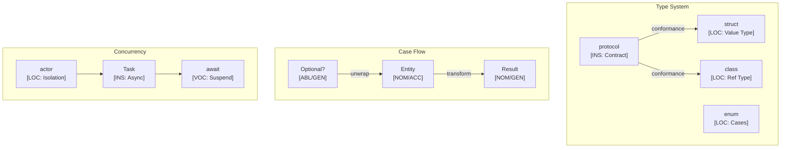

# Swift Language Paradigms and CEREBRUM Mapping

Swift is a general-purpose, multi-paradigm, compiled programming language developed by Apple. Known for its safety, performance, and modern syntax, Swift is widely used for developing applications for Apple platforms (iOS, macOS, etc.) and beyond. This document explores how Swift features map to CEREBRUM cases.

## 1. Overview of Swift Paradigms

Swift integrates concepts from various paradigms:

- **Object-Oriented Programming**: Classes with inheritance, methods, properties.
- **Protocol-Oriented Programming**: Emphasis on protocols (similar to interfaces) for abstraction and composition.
- **Functional Programming**: First-class functions, immutable values (`let`), map/filter/reduce, optionals.
- **Value Types vs. Reference Types**: Clear distinction between structs/enums (value types) and classes (reference types).
- **Safety**: Strong typing, optionals for handling nil, memory safety features.
- **Generics**: Type-agnostic code using generic parameters.

Relationships in Swift are defined through method calls, protocol conformance, value/reference semantics, optionals, and closures.

## 2. Mapping CEREBRUM Cases to Swift Concepts

| CEREBRUM Case | Swift Equivalent/Analogy | Correspondence Strength | Notes |
|---------------|--------------------------|-------------------------|-------|
| **Nominative [NOM]** | Instance calling method (`instance.method()`); `self` keyword; Variable defined (`let`/`var name: Type`) | Strong | The acting entity or subject being defined. |
| **Accusative [ACC]** | Function/method parameter (value type copy); `inout` parameter being modified | Strong | Entity receiving action or being processed. |
| **Dative [DAT]** | Completion handler/callback; Delegate receiving message; Target of assignment | Strong | Recipient of data, result, or notification. |
| **Genitive [GEN]** | Property access (`instance.property`); Return value; Enum case associated value; Protocol/superclass source | Strong | Source, possession, derived value, or associated data. |
| **Instrumental [INS]** | Function/closure parameter; Protocol constraint; Extension method; Operator overload | Strong | Tool, mechanism, protocol, or constraint. |
| **Ablative [ABL]** | Collection being iterated; Optional containing value (`if let`); Asynchronous source (`async let`) | Strong | Origin of data, value, or process. |
| **Locative [LOC]** | Scope (function, class, struct); Module; Enum definition; Tuple | Strong | Context, container, or location. |
| **Vocative [VOC]** | Function/method call; Initializer call (`Type()`); Enum case instantiation | Strong | Direct invocation or addressing. |

## 3. Key Swift Features and Case Relationships

### Structs, Classes, and Enums

Swift's type system clearly defines entities:

```swift
import Foundation

// Struct definition (Value type - LOC blueprint)
struct Point {
    // Stored properties (GEN sources)
    var x: Double
    var y: Double
    
    // Method (self is NOM acting)
    // Value types are copied (ACC) unless marked `mutating`
    mutating func moveBy(dx: Double, dy: Double) {
        // self is ACC (being modified)
        self.x += dx // dx is ACC
        self.y += dy // dy is ACC
    }
    
    // Computed property (GEN derived value)
    var magnitude: Double {
        sqrt(x * x + y * y)
    }
}

// Class definition (Reference type - LOC blueprint)
class Vehicle {
    // Stored property (GEN source)
    var numberOfWheels: Int
    
    // Initializer (VOC invocation, creates ACC entity)
    init(wheels: Int) {
        // self is ACC (receiving initialization)
        self.numberOfWheels = wheels // wheels is GEN source
    }
    
    // Method (self is NOM acting)
    func describe() {
        print("Vehicle with \(numberOfWheels) wheels.")
    }
}

// Enum definition (LOC for cases)
enum Status {
    case loading
    // Associated value (GEN)
    case success(message: String)
    case failure(error: Error)
}

// Usage
var p1 = Point(x: 1.0, y: 2.0) // p1 is ACC being created
p1.moveBy(dx: 3.0, dy: 1.0) // VOC call, p1 is ACC modified
print("Point magnitude: \(p1.magnitude)") // GEN access

let car = Vehicle(wheels: 4) // car is ACC created
car.describe() // VOC call, car is NOM

let currentStatus = Status.success(message: "Data loaded") // NOM/GEN
// Pattern matching (VOC on case)
switch currentStatus {
case .success(let msg): // msg is NOM/GEN extracted value
    print("Success: \(msg)")
case .failure(let err): // err is NOM/GEN
    print("Error: \(err.localizedDescription)")
case .loading:
    print("Loading...")
}
```

### Protocols and Extensions

Protocol-oriented programming emphasizes capabilities (INS):

```swift
// Protocol definition (INS contract)
protocol Nameable {
    var name: String { get } // Read-only property requirement (GEN)
    func identify() // Method requirement
}

// Struct conforming to protocol (INS)
struct Dog: Nameable {
    var name: String // Conforms to GEN requirement
    
    func identify() { // Conforms to method requirement
        // self is NOM
        print("Woof! My name is \(name).")
    }
}

// Extension adding functionality (INS tool)
extension Dog {
    func speak() { // Method added via extension
        print("Bark!")
    }
}

// Generic function constrained by protocol (INS)
// T must conform to Nameable
func printName<T: Nameable>(item: T) { 
    // item is ACC conforming to INS
    print("Item name: \(item.name)") // GEN access via protocol
    item.identify() // VOC call via protocol
}

// Usage
let fido = Dog(name: "Fido") // ACC created
fido.speak() // VOC call (extension method)
printName(item: fido) // Pass ACC conforming to INS
```

### Closures and Higher-Order Functions

Closures act as tools (INS) or recipients (DAT):

```swift
import Foundation

let numbers = [1, 5, 2, 8, 3]

// map function (INS)
// { $0 * 2 } is closure (INS tool)
// numbers is ABL source
let doubledNumbers = numbers.map { $0 * 2 } // NOM/GEN result: [2, 10, 4, 16, 6]

// filter function (INS)
// { $0 > 3 } is closure (INS tool)
let filteredNumbers = numbers.filter { $0 > 3 } // NOM/GEN result: [5, 8]

// sorted function (INS)
// { $0 < $1 } is closure (INS tool)
let sortedNumbers = numbers.sorted { $0 < $1 } // NOM/GEN result: [1, 2, 3, 5, 8]

// Function with completion handler (DAT recipient)
func fetchData(url: URL, completion: @escaping (Result<Data, Error>) -> Void) {
    // url is ABL source
    print("Fetching data...")
    // Simulate network request
    DispatchQueue.global().asyncAfter(deadline: .now() + 1) {
        // Dummy data
        let result: Result<Data, Error> = .success(Data("Fake data".utf8))
        
        // Call completion handler (VOC on closure)
        // completion is DAT recipient
        // result is ACC data being passed
        completion(result)
    }
}

// Calling function with completion handler
if let url = URL(string: "http://example.com") {
    fetchData(url: url) { result in // Closure acts as DAT
        switch result {
        case .success(let data):
            print("Received data: \(String(data: data, encoding: .utf8) ?? "")")
        case .failure(let error):
            print("Fetch error: \(error)")
        }
    }
}

// Need to keep program running to see async result
// RunLoop.main.run(until: Date(timeIntervalSinceNow: 2))
```

### Optionals

Optionals handle the potential absence of values (ABL/GEN):

```swift
// Optional variable (may contain GEN value or be nil)
var maybeName: String? = "Alice"
maybeName = nil

// Optional binding (if let/guard let)
// maybeName is ABL source
if let name = maybeName {
    // name is NOM/GEN (unwrapped value)
    print("Name found: \(name)")
} else {
    print("Name is nil")
}

// Optional chaining (VOC call only if not nil)
struct Address { var street: String? }
struct Person { var address: Address? }

let person: Person? = Person(address: Address(street: "123 Main St"))

// person is ABL source
// ?. performs VOC only if value exists
// streetName is NOM/GEN (optional result)
let streetName = person?.address?.street
print("Street: \(streetName ?? "Unknown")")

// Nil-coalescing operator (provides default GEN value)
let nameOrDefault = maybeName ?? "Guest" // GEN result
```

### Concurrency (`async`/`await`)

Swift's modern concurrency features:

```swift
import Foundation

// Asynchronous function (INS tool)
func downloadImage(from url: URL) async throws -> Data {
    // url is ABL source
    print("Downloading...")
    // URLSession.shared.data is VOC call returning tuple (Data, URLResponse)
    let (data, _) = try await URLSession.shared.data(from: url)
    return data // GEN result
}

// Function using async/await
func processImage() async {
    guard let url = URL(string: "https://www.example.com/image.png") else { return }
    
    do {
        // Call async function (VOC)
        // imageData is NOM/GEN (derived from async call)
        let imageData = try await downloadImage(from: url)
        print("Downloaded \(imageData.count) bytes.")
        // Process image data...
    } catch {
        // error is DAT recipient
        print("Error downloading image: \(error)")
    }
}

// Start the async task (VOC)
// Task { ... } creates an INS concurrent task
// Task {
//     await processImage()
// }

// Need structured concurrency context or way to wait
```

## 4. Implementation Approach

Swift's strong type system with protocols and generics allows for robust case modeling:

```swift
import Foundation

// Case enum
enum CaseRole { case nom, acc, dat, gen, ins, abl, loc, voc }

// Protocol for case-bearing types
protocol CaseBearing {
    associatedtype BaseType
    var baseObject: BaseType { get }
    var caseRole: CaseRole { get }
    var properties: [String: Any] { get }
}

// Wrapper struct implementing the protocol
struct CaseWrapper<T>: CaseBearing {
    typealias BaseType = T
    
    let baseObject: T
    let caseRole: CaseRole
    var properties: [String: Any] = [:]
    
    init(_ base: T, role: CaseRole, props: [String: Any] = [:]) {
        self.baseObject = base
        self.caseRole = role
        self.properties = props
    }
    
    // Function to conceptually change case
    func `as`(_ newRole: CaseRole) -> CaseWrapper<T> {
        print("Transforming \(baseObject) from \(caseRole) to \(newRole)")
        // Copy properties if needed
        return CaseWrapper(self.baseObject, role: newRole, props: self.properties)
    }
}

// Example Domain Objects
struct User { 
    let name: String 
    func description() -> String { "User(\(name))" }
}
struct Resource { 
    let id: UUID 
    func description() -> String { "Resource(\(id))" }
}
protocol Service { 
    func process(user: User, resource: Resource) -> String
}

class ConcreteService: Service {
    func process(user: User, resource: Resource) -> String {
        return "Service processed \(user.name) for \(resource.id)"
    }
}

// Function enforcing case roles using generics and protocols
func execute<A: CaseBearing, P: CaseBearing, I: CaseBearing>(
    agent: A, 
    patient: P, 
    instrument: I
) -> String where A.BaseType == User, P.BaseType == Resource, I.BaseType: Service {
    
    guard agent.caseRole == .nom else { return "Error: Agent must be NOM" }
    guard patient.caseRole == .acc else { return "Error: Patient must be ACC" }
    guard instrument.caseRole == .ins else { return "Error: Instrument must be INS" }
    
    let service = instrument.baseObject
    return service.process(user: agent.baseObject, resource: patient.baseObject)
}

// Demo
let user = User(name: "Alice")
let resource = Resource(id: UUID())
let service = ConcreteService()

// Create wrappers
let agentWrapper = CaseWrapper(user, role: .nom)
let patientWrapper = CaseWrapper(resource, role: .acc)
let instrumentWrapper = CaseWrapper(service, role: .ins)

print("Initial: \(agentWrapper), \(patientWrapper), \(instrumentWrapper)")

// Execute with correct roles
let result = execute(agent: agentWrapper, patient: patientWrapper, instrument: instrumentWrapper)
print("Result: \(result)")

// Try with incorrect role
let agentAsGen = agentWrapper.as(.gen)
let resultError = execute(agent: agentAsGen, patient: patientWrapper, instrument: instrumentWrapper)
print("Result (Error): \(resultError)")
```

## 5. Conclusion

Swift provides a modern and safe environment for mapping CEREBRUM cases:

- Strong distinction between value (`struct`, `enum`) and reference (`class`) types influences **ACC** semantics (copy vs. modify).
- Protocol-oriented programming directly models **INS** constraints and capabilities.
- Optionals represent potential **ABL** sources or **GEN** results that might be absent.
- Closures serve as flexible **INS** tools or **DAT** recipients.
- `async`/`await` provides structured concurrency, mapping well to sequences involving **INS**, **ABL**, and **GEN** roles.

Swift's focus on safety and expressiveness, combined with protocols and generics, allows for creating type-safe and potentially compile-time-checked implementations of CEREBRUM case systems.

## 6. Advanced CEREBRUM Implementation

### Case Precision and Active Inference

```swift
import Foundation

// Case roles with precision modifiers for Active Inference
enum CaseRole: String, CaseIterable {
    case nom = "Nominative"
    case acc = "Accusative"
    case dat = "Dative"
    case gen = "Genitive"
    case ins = "Instrumental"
    case abl = "Ablative"
    case loc = "Locative"
    case voc = "Vocative"
    
    // Precision modifier for Active Inference
    var precision: Double {
        switch self {
        case .nom: return 1.5
        case .acc: return 1.2
        case .dat: return 1.3
        case .gen: return 1.0
        case .ins: return 0.8
        case .abl: return 1.1
        case .loc: return 0.9
        case .voc: return 2.0
        }
    }
    
    // Valid transition targets
    var validTransitions: [CaseRole] {
        switch self {
        case .nom: return [.acc, .gen]
        case .acc: return [.gen, .dat]
        case .abl: return [.nom]
        case .loc: return [.abl]
        default: return []
        }
    }
    
    func canTransition(to target: CaseRole) -> Bool {
        validTransitions.contains(target)
    }
}

// Transition record for history tracking
struct CaseTransition: CustomStringConvertible {
    let from: CaseRole
    let to: CaseRole
    let timestamp: Date
    
    var description: String {
        "\(from.rawValue) → \(to.rawValue)"
    }
}

// Protocol for case-bearing entities
protocol CaseBearing {
    associatedtype BaseType
    var base: BaseType { get }
    var caseRole: CaseRole { get }
    var precision: Double { get }
    var history: [CaseTransition] { get }
    
    func effectivePrecision() -> Double
    func transformTo(_ target: CaseRole) throws -> Self
}

// Errors for case operations
enum CaseError: Error {
    case invalidTransition(from: CaseRole, to: CaseRole)
}

// Generic case-bearing entity
struct CaseEntity<T>: CaseBearing {
    let base: T
    private(set) var caseRole: CaseRole
    private(set) var precision: Double
    private(set) var history: [CaseTransition]
    
    init(_ base: T, role: CaseRole = .nom, precision: Double = 1.0) {
        self.base = base
        self.caseRole = role
        self.precision = precision
        self.history = []
    }
    
    func effectivePrecision() -> Double {
        precision * caseRole.precision
    }
    
    func transformTo(_ target: CaseRole) throws -> CaseEntity<T> {
        guard caseRole.canTransition(to: target) else {
            throw CaseError.invalidTransition(from: caseRole, to: target)
        }
        
        var newEntity = CaseEntity(base, role: target, precision: precision)
        newEntity.history = history + [CaseTransition(from: caseRole, to: target, timestamp: Date())]
        return newEntity
    }
}
```

### Active Inference Agent

```swift
import Foundation

// Belief state for Active Inference
struct BeliefState {
    var mean: Double
    var precision: Double
    
    var variance: Double { 1.0 / precision }
    
    func update(observation: Double, obsPrecision: Double) -> BeliefState {
        let totalPrecision = precision + obsPrecision
        let newMean = (precision * mean + obsPrecision * observation) / totalPrecision
        return BeliefState(mean: newMean, precision: totalPrecision)
    }
}

// Active Inference agent with case-aware processing
class ActiveInferenceAgent<T> {
    private var entity: CaseEntity<T>
    private var belief: BeliefState
    
    init(entity: CaseEntity<T>, initialMean: Double = 0.0) {
        self.entity = entity
        self.belief = BeliefState(mean: initialMean, precision: 1.0)
    }
    
    // Observe with case-adjusted precision
    func observe(_ observation: Double, basePrecision: Double = 1.0) {
        let adjustedPrecision = basePrecision * entity.effectivePrecision()
        belief = belief.update(observation: observation, obsPrecision: adjustedPrecision)
    }
    
    // Predict current state
    func predict() -> Double {
        belief.mean
    }
    
    // Calculate free energy (prediction error cost)
    func freeEnergy(observation: Double) -> Double {
        let predError = observation - belief.mean
        let effPrecision = belief.precision * entity.effectivePrecision()
        return (predError * predError * effPrecision) / 2.0
    }
    
    // Select action minimizing expected free energy
    func selectAction(from possibilities: [Double]) -> (observation: Double, freeEnergy: Double)? {
        guard !possibilities.isEmpty else { return nil }
        
        return possibilities
            .map { ($0, freeEnergy(observation: $0)) }
            .min { $0.1 < $1.1 }
    }
    
    // Transform entity case
    func transformCase(to target: CaseRole) throws {
        entity = try entity.transformTo(target)
    }
    
    // Access current state
    var currentEntity: CaseEntity<T> { entity }
    var currentBelief: BeliefState { belief }
}
```

### Combine Framework Integration

```swift
import Foundation
import Combine

// Case-aware publisher wrapper
struct CasePublisher<Upstream: Publisher>: Publisher {
    typealias Output = CaseEntity<Upstream.Output>
    typealias Failure = Upstream.Failure
    
    let upstream: Upstream
    let caseRole: CaseRole
    
    func receive<S>(subscriber: S) where S: Subscriber, 
        Failure == S.Failure, 
        Output == S.Input {
        upstream
            .map { CaseEntity($0, role: caseRole) }
            .receive(subscriber: subscriber)
    }
}

extension Publisher {
    // Wrap values in case entities
    func withCase(_ role: CaseRole) -> CasePublisher<Self> {
        CasePublisher(upstream: self, caseRole: role)
    }
}

// Case-aware subscriber
class CaseSubscriber<Input>: Subscriber {
    typealias Input = CaseEntity<Input>
    typealias Failure = Never
    
    let expectedRole: CaseRole
    let handler: (CaseEntity<Input>) -> Void
    
    init(expecting role: CaseRole, handler: @escaping (CaseEntity<Input>) -> Void) {
        self.expectedRole = role
        self.handler = handler
    }
    
    func receive(subscription: Subscription) {
        subscription.request(.unlimited)
    }
    
    func receive(_ input: CaseEntity<Input>) -> Subscribers.Demand {
        if input.caseRole == expectedRole {
            handler(input)
        } else {
            print("Warning: Expected \(expectedRole), got \(input.caseRole)")
        }
        return .none
    }
    
    func receive(completion: Subscribers.Completion<Never>) {
        print("Stream completed")
    }
}

// Usage example
func demonstrateCombine() {
    let numbers = [1, 2, 3, 4, 5]
    var cancellables = Set<AnyCancellable>()
    
    // Create case-aware stream
    numbers.publisher
        .withCase(.abl)  // Source data
        .map { entity -> CaseEntity<Int> in
            // Transform to ACC (being processed)
            let newValue = entity.base * 2
            return CaseEntity(newValue, role: .acc)
        }
        .sink { entity in
            print("Received [\(entity.caseRole)]: \(entity.base)")
        }
        .store(in: &cancellables)
}
```

### SwiftUI Case-Aware View Model

```swift
import Foundation
import Combine

// Observable case-bearing view model
class CaseViewModel<T>: ObservableObject {
    @Published private(set) var entity: CaseEntity<T>
    @Published private(set) var beliefState: BeliefState
    
    private var agent: ActiveInferenceAgent<T>
    
    init(base: T, initialRole: CaseRole = .nom) {
        let entity = CaseEntity(base, role: initialRole)
        self.entity = entity
        self.beliefState = BeliefState(mean: 0, precision: 1)
        self.agent = ActiveInferenceAgent(entity: entity)
    }
    
    func observe(_ value: Double) {
        agent.observe(value)
        beliefState = agent.currentBelief
    }
    
    func transformCase(to role: CaseRole) {
        do {
            try agent.transformCase(to: role)
            entity = agent.currentEntity
        } catch {
            print("Transform failed: \(error)")
        }
    }
    
    var prediction: Double {
        agent.predict()
    }
    
    var effectivePrecision: Double {
        entity.effectivePrecision()
    }
}
```

## 7. Mermaid Diagram: Swift Case Architecture



## 8. References

1. Apple Inc. (2023). The Swift Programming Language (Swift 5.9). (<https://docs.swift.org/swift-book/>)
2. Hegarty, P. (2023). Developing Apps for iOS (CS193p). Stanford University.
3. Apple Inc. (2023). Swift Standard Library Documentation.
4. Swift Evolution Proposals. (<https://github.com/apple/swift-evolution>)
5. Friston, K. (2010). The free-energy principle. Nature Reviews Neuroscience.
6. Apple Inc. (2023). Combine Framework Documentation.
