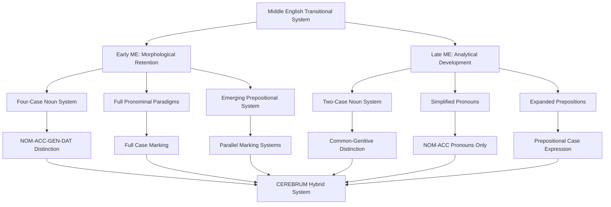

# Middle English Case System and CEREBRUM Mapping

## Overview of Middle English's Approach to Grammatical Relations

Middle English (c. 1150–1500) represents a critical transitional period in Germanic case system evolution, providing unique insights for CEREBRUM implementations dealing with morphological leveling and syntactic reorganization. During this period, English underwent systematic simplification of its inherited Germanic case system while developing the analytical constructions that characterize Modern English. This transitional state offers CEREBRUM a model for dynamic case system evolution and adaptive relationship marking under changing computational or environmental pressures.

The Middle English period demonstrates how CEREBRUM case systems might evolve from highly synthetic (morphologically complex) to increasingly analytical (syntactically based) forms while maintaining semantic precision in model relationships. The systematic loss of case distinctions, compensated by prepositional expansion and word order rigidification, provides valuable insights for CEREBRUM implementations requiring adaptive case systems that can maintain functional precision while optimizing computational efficiency.

## Morphological Case System Evolution in Middle English

### Early Middle English Case System (c. 1150–1300)

Early Middle English retained substantial morphological case marking, though with significant simplification from Old English:

#### Noun Declension Classes

**Strong Masculine Nouns (e.g., *stān* "stone")**
| Case | Singular | Plural |
|------|----------|--------|
| Nominative | stān | stānes |
| Accusative | stān | stānes |
| Genitive | stānes | stāna |
| Dative | stāne | stānum |

**Strong Feminine Nouns (e.g., *gief* "gift")**
| Case | Singular | Plural |
|------|----------|--------|
| Nominative | gief | giefa |
| Accusative | giefe | giefa |
| Genitive | giefe | giefa |
| Dative | giefe | giefum |

**Strong Neuter Nouns (e.g., *word* "word")**
| Case | Singular | Plural |
|------|----------|--------|
| Nominative | word | word |
| Accusative | word | word |
| Genitive | wordes | worda |
| Dative | worde | wordum |

#### Pronominal System in Early Middle English

**Personal Pronouns**
| Person | Case | Singular | Plural |
|--------|------|----------|--------|
| **1st** | Nom | ich/I | wē |
| | Acc | mē | ūs |
| | Gen | mīn | ūre |
| | Dat | mē | ūs |
| **2nd** | Nom | thū | gē |
| | Acc | thē | ēow |
| | Gen | thīn | ēower |
| | Dat | thē | ēow |
| **3rd Masc** | Nom | hē | hīe |
| | Acc | hine | hīe |
| | Gen | his | hiera |
| | Dat | him | him |
| **3rd Fem** | Nom | hēo | hīe |
| | Acc | hīe | hīe |
| | Gen | hire | hiera |
| | Dat | hire | him |
| **3rd Neut** | Nom | hit | hīe |
| | Acc | hit | hīe |
| | Gen | his | hiera |
| | Dat | him | him |

### Late Middle English Case System (c. 1300–1500)

By Late Middle English, extensive leveling had occurred:

#### Simplified Noun Paradigm

**General Pattern (most nouns)**
| Case | Singular | Plural |
|------|----------|--------|
| Common (Nom/Acc) | word | wordes |
| Genitive | wordes | wordes |
| Dative | word(e) | wordes |

#### Late Middle English Pronouns

**Personal Pronouns (London dialect)**
| Person | Nominative | Accusative/Oblique | Genitive Possessive |
|--------|------------|-------------------|-------------------|
| **1st Sg** | I | me | my(n) |
| **2nd Sg** | thou | thee | thy(n) |
| **3rd Masc** | he | him | his |
| **3rd Fem** | she | hire/her | hire/her |
| **3rd Neut** | it | it | his/its |
| **1st Pl** | we | us | oure |
| **2nd Pl** | ye | you | youre |
| **3rd Pl** | they | them | theire |

## Mapping to CEREBRUM Cases

Middle English's transitional system demonstrates how CEREBRUM cases can be implemented through hybrid morphological-syntactic marking:

| CEREBRUM Case | Early Middle English | Late Middle English | Implementation Notes |
|---------------|---------------------|-------------------|----------------------|
| **[NOM]** Nominative | Morphological nominative + subject position | Subject position + nominative pronouns | Models should implement decreasing morphological dependency |
| **[ACC]** Accusative | Morphological accusative + object position | Object position + accusative pronouns | Models should adapt to positional marking with pronominal retention |
| **[GEN]** Genitive | Morphological genitive (-es/-e) | Genitive marking (-es) + of-phrases | Models should implement parallel morphological and prepositional strategies |
| **[DAT]** Dative | Morphological dative + to-phrases | Primarily prepositional (to/for) + some morphological survival | Models should transition from morphological to prepositional marking |
| **[INS]** Instrumental | Morphological dative + with-phrases | Prepositional phrases (with/by/through) | Models should implement fully prepositional instrumental marking |
| **[LOC]** Locative | Morphological dative + prepositional phrases | Prepositional phrases (at/in/on) | Models should implement spatial preposition systems |
| **[ABL]** Ablative | Prepositional phrases (from/of) | Prepositional phrases (from/out of) | Models should maintain prepositional ablative marking |
| **[VOC]** Vocative | Direct address + O + intonation | Direct address + intonation patterns | Models should implement pragmatic vocative marking |



## Morphological Leveling Processes

### Case Syncretism Patterns

Middle English demonstrates systematic case syncretism that provides models for CEREBRUM case optimization:

#### Masculine Nouns
```
Old English: stān (nom) / stān (acc) / stānes (gen) / stāne (dat)
Early ME: stān (nom/acc) / stānes (gen) / stāne (dat)
Late ME: stān (nom/acc/dat) / stānes (gen)
```

#### Feminine Nouns  
```
Old English: giefu (nom) / giefe (acc) / giefe (gen) / giefe (dat)
Early ME: giefe (nom/acc/gen/dat) [complete syncretism]
Late ME: giefe (common) / giefes (gen)
```

#### Neuter Nouns
```
Old English: word (nom/acc) / wordes (gen) / worde (dat)
Early ME: word (nom/acc) / wordes (gen) / worde (dat)
Late ME: word (nom/acc/dat) / wordes (gen)
```

### Analogical Restructuring

Middle English shows extensive analogical leveling where high-frequency patterns replace irregular ones:

**Strong → Weak Noun Transition:**
```
Old English: fōt (nom) / fēt (nom.pl) [ablaut plural]
Middle English: fōt / fōtes [regularized with -es suffix]
```

**Case Marker Generalization:**
```
Early ME: Genitive -es spreads from masculine to all genders
Late ME: Genitive -es becomes universal marker
```

## Prepositional System Development

### Emergence of Analytical Constructions

Middle English demonstrates the systematic development of prepositional phrases to replace morphological case marking:

#### Dative Replacement
```
Old English: Ic sealde hlāforde hlāf (I gave lord.DAT bread.ACC)
Early ME: Ich ȝaf hlauerde hlaf (I gave lord.DAT bread)
Late ME: I gaf bred to the lord (I gave bread to the lord)
```

#### Instrumental Development
```
Old English: Hē wrāt stylu (He wrote stylus.INST)
Early ME: He wrot mid stylu (He wrote with stylus)
Late ME: He wrote with a penne (He wrote with a pen)
```

#### Genitive Supplementation
```
Old English: cyninges hūs (king.GEN house)
Middle English: kinges hous OR hous of the king
Late ME: the kynges hous OR the hous of the kyng
```

### Prepositional Semantic Development

Middle English prepositions underwent semantic extension and grammaticalization:

**Spatial → Temporal Extension:**
```
Spatial: at the gate → Temporal: at nyght
Spatial: in the hous → Temporal: in somer
```

**Spatial → Abstract Extension:**
```
Physical: with honde → Instrumental: with swerd
Locative: on table → Abstract: on payne of deeth
```

**Grammaticalization Chains:**
```
Physical motion: He com from London
Source: He com from pouerte
Causal: He deyde from hunger
```

## Unique Features of Middle English

### 1. Parallel Marking Systems

Middle English demonstrates parallel morphological and prepositional case marking:

```
Morphological: the kynges hors (the king's horse)
Prepositional: the hors of the kyng (the horse of the king)

Morphological: him (dative pronoun)
Prepositional: to hym (prepositional dative)
```

### 2. Variable Case Assignment

Middle English allows variable case assignment based on dialectal, temporal, and stylistic factors:

**Temporal Variation:**
```
1200: Ic seah hine (I saw him.ACC) [retention of accusative]
1400: I saw hym (I saw him) [accusative form, positional function]
```

**Dialectal Variation:**
```
Northern: Thai went (They went) [early adoption of 'they']
Southern: Hi wenten (They went) [retention of Old English forms]
```

**Stylistic Variation:**
```
Formal/Legal: to whom hit belongeth (dative 'whom')
Informal: to who hit belonges (nominative 'who' in oblique position)
```

### 3. Gender System Collapse

Middle English demonstrates systematic gender system loss with case implications:

```
Old English: sēo gōde hlǣfdige (the.FEM good.FEM lady.FEM)
Early ME: the gode leuedi (the good lady) [loss of gender marking]
Late ME: the good lady (fully analytical)
```

The loss of gender eliminated a major conditioning factor for case assignment, leading to simplified paradigms.

### 4. French Influence on Case Marking

Middle English shows Norman French influence on case expression:

**Prepositional Calques:**
```
French: par le roi → Middle English: by the kyng
French: pour la dame → Middle English: for the lady
```

**Word Order Influence:**
```
French: la maison du roi → Middle English: the hous of the kyng
Native: cyninges hūs → the kynges hous
```

## Dialectal Variation in Case Systems

### Northern Middle English (Yorkshire, Scots)

Northern dialects showed accelerated case loss:

**Noun System:**
```
Common Case: buk (book)
Genitive: bukis (book's/books')
```

**Pronoun System:**
```
Nominative: thai, sho, it
Accusative: thaim, hir, it
```

### Southern Middle English (West Saxon tradition)

Southern dialects retained more conservative case marking:

**Noun System:**
```
Nominative/Accusative: bōc
Genitive: bōces  
Dative: bōce
```

**Pronoun System:**
```
Nominative: hi, heo, hit
Accusative: hom, hire, hit
Dative: hom, hire, him
```

### West Midland Middle English (Worcestershire)

West Midland dialects showed intermediate development:

**Mixed Case Marking:**
```
Morphological: kinges (genitive)
Prepositional: of þe king (genitive periphrasis)
```

## Example Texts with Case Analysis

### 1. Early Middle English (c. 1200): Layamon's Brut

**Text:** *Þa com Arður þe king ridende mid his dugupe*
**Analysis:** 
- *Arður* - proper noun, nominative (subject)
- *þe king* - definite article + noun, nominative (appositive)
- *mid his dugupe* - preposition + genitive pronoun + dative noun

**CEREBRUM:** Arthur_Model[NOM] approaches with Retinue_Model[INS].

### 2. Mid Middle English (c. 1300): Cursor Mundi

**Text:** *Of mans saul and of his lif*
**Analysis:**
- *mans* - genitive noun with retained case marking
- *saul* - nominative/accusative (object of preposition *of*)
- *his* - genitive pronoun
- *lif* - nominative/accusative

**CEREBRUM:** Soul_Model and Life_Model derived from Man_Model[GEN].

### 3. Late Middle English (c. 1400): Chaucer's Canterbury Tales

**Text:** *Whan that Aprille with his shoures soote*
**Analysis:**
- *Aprille* - proper noun, common case (temporal expression)
- *his* - genitive pronoun (possessive)
- *shoures* - plural noun, common case

**CEREBRUM:** April_Model[LOC] accompanied by Shower_Model[INS] derived from April_Model[GEN].

### 4. Complex Case Construction (c. 1350): Sir Gawain and the Green Knight

**Text:** *Þe kyng and þe quene and alle þe court* 
**Analysis:**
- *kyng* - common case noun (coordinate subject)
- *quene* - common case noun (coordinate subject)  
- *court* - common case noun (coordinate subject)

**CEREBRUM:** King_Model[NOM] and Queen_Model[NOM] and Court_Model[NOM] function as coordinate agents.

### 5. Dative Construction Evolution

**Early ME:** *Him was levere reste than trauaille*
**Analysis:** 
- *Him* - dative pronoun (experiencer subject)
- Impersonal construction with dative experiencer

**Late ME:** *He hadde levere reste than trauaille*
**Analysis:**
- *He* - nominative pronoun (personal subject)
- Reanalysis to personal construction

**CEREBRUM Evolution:** Experiencer_Model[DAT] → Experiencer_Model[NOM] (structural reanalysis).

## Computational Implementation for CEREBRUM

### 1. Hybrid Case Marking System

Middle English suggests CEREBRUM could implement a hybrid system allowing both morphological and analytical case marking:

```python
class MiddleEnglishCaseSystem:
    def __init__(self):
        self.morphological_paradigms = {
            'early_me': {
                'strong_masc': {'nom': '-∅', 'acc': '-∅', 'gen': '-es', 'dat': '-e'},
                'strong_fem': {'nom': '-e', 'acc': '-e', 'gen': '-e', 'dat': '-e'},
                'strong_neut': {'nom': '-∅', 'acc': '-∅', 'gen': '-es', 'dat': '-e'}
            },
            'late_me': {
                'general': {'common': '-∅', 'genitive': '-es'}
            }
        }
        
        self.prepositional_cases = {
            'to': Case.DAT,
            'for': Case.DAT,
            'with': Case.INS,
            'by': Case.INS,
            'of': Case.GEN,
            'from': Case.ABL,
            'at': Case.LOC,
            'in': Case.LOC,
            'on': Case.LOC
        }
    
    def assign_case(self, model, context, period='late_me'):
        # Check for morphological marking first
        if self._has_morphological_case(model, period):
            return self._assign_morphological_case(model, period)
        
        # Fall back to prepositional or positional assignment
        if context.get('preposition'):
            return self.prepositional_cases.get(context['preposition'], Case.OBL)
        
        # Use positional assignment
        return self._assign_positional_case(model, context)
    
    def _has_morphological_case(self, model, period):
        if period == 'early_me':
            return model.word_class in ['noun', 'pronoun', 'adjective']
        elif period == 'late_me':
            return model.word_class == 'pronoun' or model.has_genitive_marking()
        return False
```

### 2. Analogical Case Leveling

Based on Middle English analogical processes, CEREBRUM could implement automatic case leveling:

```python
class AnalogicalCaseLeveler:
    def __init__(self):
        self.frequency_threshold = 0.7  # Threshold for analogical extension
        self.case_paradigms = {}
        
    def apply_analogical_leveling(self, model_ecosystem):
        # Identify high-frequency case patterns
        frequency_patterns = self._analyze_case_frequency(model_ecosystem)
        
        # Apply leveling to low-frequency irregular patterns
        for model in model_ecosystem:
            if self._is_irregular(model) and self._below_frequency_threshold(model):
                self._apply_regular_pattern(model, frequency_patterns)
    
    def _analyze_case_frequency(self, ecosystem):
        pattern_counts = {}
        for model in ecosystem:
            pattern = self._extract_case_pattern(model)
            pattern_counts[pattern] = pattern_counts.get(pattern, 0) + 1
        
        total_models = len(ecosystem)
        return {pattern: count/total_models 
                for pattern, count in pattern_counts.items()}
    
    def _apply_regular_pattern(self, model, patterns):
        # Find most frequent compatible pattern
        compatible_patterns = [p for p in patterns 
                              if self._is_compatible(model, p)]
        if compatible_patterns:
            most_frequent = max(compatible_patterns, 
                               key=lambda p: patterns[p])
            model.apply_case_pattern(most_frequent)
```

### 3. Dialectal Case Variation

Middle English's dialectal variation suggests CEREBRUM could implement regional case variation:

```python
class DialectalCaseVariation:
    def __init__(self):
        self.dialect_systems = {
            'northern': {
                'case_retention': 'minimal',
                'pronoun_system': 'simplified',
                'prepositional_preference': 'high'
            },
            'southern': {
                'case_retention': 'conservative', 
                'pronoun_system': 'traditional',
                'prepositional_preference': 'moderate'
            },
            'west_midland': {
                'case_retention': 'moderate',
                'pronoun_system': 'mixed',
                'prepositional_preference': 'variable'
            }
        }
    
    def apply_dialectal_variation(self, model, dialect_region, context):
        dialect_settings = self.dialect_systems.get(dialect_region, 
                                                   self.dialect_systems['southern'])
        
        if dialect_settings['case_retention'] == 'minimal':
            return self._apply_minimal_case_system(model, context)
        elif dialect_settings['case_retention'] == 'conservative':
            return self._apply_conservative_case_system(model, context)
        else:
            return self._apply_mixed_case_system(model, context)
```

### 4. Temporal Case Evolution

Middle English's temporal development suggests CEREBRUM could implement evolutionary case systems:

```python
class TemporalCaseEvolution:
    def __init__(self):
        self.evolution_stages = {
            'early_me': {'morphological_weight': 0.8, 'positional_weight': 0.2},
            'mid_me': {'morphological_weight': 0.5, 'positional_weight': 0.5},
            'late_me': {'morphological_weight': 0.2, 'positional_weight': 0.8}
        }
    
    def evolve_case_system(self, current_system, usage_patterns, time_period):
        stage_settings = self.evolution_stages[time_period]
        
        # Adjust case marking based on temporal stage
        if stage_settings['morphological_weight'] < 0.5:
            # Transition to analytical marking
            current_system = self._strengthen_positional_marking(current_system)
            current_system = self._expand_prepositional_system(current_system)
        
        # Apply frequency-based leveling
        current_system = self._apply_frequency_leveling(current_system, usage_patterns)
        
        return current_system
    
    def _strengthen_positional_marking(self, system):
        # Increase reliance on word order for case assignment
        system.positional_case_assignment = True
        system.morphological_case_requirement = False
        return system
    
    def _expand_prepositional_system(self, system):
        # Add new prepositional case marking options
        new_prepositions = {
            'unto': Case.DAT,  # Middle English dative expansion
            'throughout': Case.LOC,  # Locative expansion
            'concerning': Case.GEN  # Genitive expansion
        }
        system.prepositional_cases.update(new_prepositions)
        return system
```

## Extension Opportunities for CEREBRUM

### 1. Adaptive Case Systems

Based on Middle English's systematic case evolution, CEREBRUM could implement adaptive case systems that respond to usage patterns and computational efficiency requirements:

```python
class AdaptiveCaseSystem:
    def monitor_usage_patterns(self, model_interactions):
        # Track which case distinctions are computationally valuable
        case_utility_scores = self._calculate_case_utility(model_interactions)
        
        # Identify cases with low utility for potential elimination
        candidates_for_syncretism = [case for case, score in case_utility_scores.items() 
                                   if score < self.utility_threshold]
        
        return candidates_for_syncretism
    
    def implement_case_syncretism(self, case_pairs):
        # Merge cases with low functional load
        for case1, case2 in case_pairs:
            self._merge_case_functions(case1, case2)
    
    def expand_analytical_marking(self, context_requirements):
        # Develop new prepositional or positional marking
        for requirement in context_requirements:
            if requirement not in self.current_case_system:
                self._create_analytical_construction(requirement)
```

### 2. Parallel Marking Systems

Inspired by Middle English's parallel morphological and prepositional marking, CEREBRUM could implement redundant case marking for robustness:

```python
class ParallelCaseMarking:
    def assign_parallel_cases(self, model, context):
        # Assign both morphological and analytical case marking
        morphological_case = self._assign_morphological_case(model, context)
        analytical_case = self._assign_analytical_case(model, context)
        
        return {
            'primary': morphological_case,
            'secondary': analytical_case,
            'confidence': self._calculate_agreement_confidence(morphological_case, analytical_case)
        }
    
    def resolve_case_conflicts(self, parallel_assignments):
        # Resolve conflicts between parallel case assignments
        if parallel_assignments['primary'] == parallel_assignments['secondary']:
            return parallel_assignments['primary']
        else:
            # Use confidence scores to resolve conflicts
            return self._select_highest_confidence_case(parallel_assignments)
```

### 3. Gradual Case Transition

Based on Middle English's gradual transition patterns, CEREBRUM could implement gradual case system changes:

```python
class GradualCaseTransition:
    def implement_gradual_change(self, old_system, new_system, transition_rate):
        # Gradually transition from old to new case system
        current_stage = self._calculate_transition_stage(transition_rate)
        
        hybrid_system = self._create_hybrid_system(old_system, new_system, current_stage)
        
        return hybrid_system
    
    def _create_hybrid_system(self, old_system, new_system, stage):
        # Weight old and new systems based on transition stage
        old_weight = 1.0 - stage
        new_weight = stage
        
        hybrid_assignments = {}
        for case in Case:
            old_assignment = old_system.get_assignment_pattern(case)
            new_assignment = new_system.get_assignment_pattern(case)
            
            hybrid_assignments[case] = self._blend_assignment_patterns(
                old_assignment, new_assignment, old_weight, new_weight)
        
        return hybrid_assignments
```

These Middle English-inspired approaches would be particularly valuable for CEREBRUM implementations requiring adaptive case systems, robust parallel marking, and gradual evolution capabilities in dynamic computational environments.

## Implications for CEREBRUM Design

Middle English provides crucial insights for CEREBRUM implementations dealing with system evolution and morphological optimization:

1. **Evolutionary Adaptability**: Middle English demonstrates how case systems can systematically evolve while maintaining functional adequacy, suggesting CEREBRUM could implement adaptive case evolution.

2. **Parallel Redundancy**: The coexistence of morphological and prepositional case marking provides a model for robust parallel case assignment in CEREBRUM.

3. **Frequency-Based Optimization**: Middle English's analogical leveling based on frequency patterns suggests CEREBRUM could optimize case systems based on usage patterns.

4. **Dialectal Flexibility**: Regional variation in Middle English case systems provides a model for context-sensitive case assignment in CEREBRUM.

5. **Gradual Transition Management**: The systematic transition from synthetic to analytical case marking offers a model for managing case system evolution in CEREBRUM.

## References

1. Hogg, R. M. (Ed.). (1992-2001). *The Cambridge History of the English Language* (Vols. 1-2). Cambridge University Press.

2. Fisiak, J. (1968). *A Short Grammar of Middle English*. Oxford University Press.

3. Wright, J., & Wright, E. M. (1928). *An Elementary Middle English Grammar*. Oxford University Press.

4. Mustanoja, T. F. (1960). *A Middle English Syntax*. Société Néophilologique.

5. Blake, N. F. (1996). *A History of the English Language*. Macmillan.

6. Barber, C., Beal, J. C., & Shaw, P. A. (2009). *The English Language: A Historical Introduction*. Cambridge University Press.

7. Mitchell, B., & Robinson, F. C. (2012). *A Guide to Old English* (8th ed.). Wiley-Blackwell.

8. Burrow, J. A., & Turville-Petre, T. (2005). *A Book of Middle English* (3rd ed.). Wiley-Blackwell. 