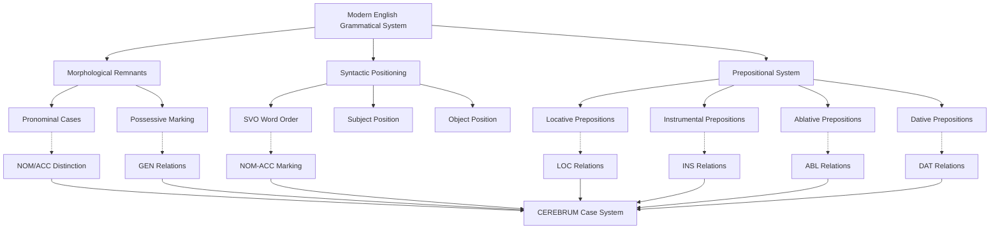

# Modern English Case System and CEREBRUM Mapping

## Overview of Modern English's Approach to Grammatical Relations

Modern English (c. 1500–present) represents a fascinating case study for CEREBRUM implementations due to its nearly complete transition from a synthetic morphological case system to an analytic positional and prepositional system. Unlike its Germanic relatives, Modern English has largely abandoned morphological case marking on nouns and adjectives, retaining it only in the pronominal system and possessive constructions. This analytical approach to grammatical relations provides a unique model for CEREBRUM systems where explicit morphological marking is replaced by positional syntax, prepositional phrases, and auxiliary constructions.

The Modern English system demonstrates how CEREBRUM's case relationships can be expressed through word order (predominantly Subject-Verb-Object), prepositional phrases, auxiliary verbs, and pragmatic context rather than through inflectional morphology. This offers valuable insights for CEREBRUM implementations in environments where explicit case marking may be computationally expensive or where flexibility in relationship expression is prioritized over morphological precision.

## Morphological Case Inventory in Modern English

Modern English maintains only vestigial morphological case marking:

### Pronominal Case System

| Pronoun | Nominative | Accusative/Oblique | Genitive (Possessive) | Genitive (Independent) |
|---------|------------|-------------------|----------------------|----------------------|
| **1st Singular** | I | me | my | mine |
| **2nd Person** | you | you | your | yours |
| **3rd Masc.** | he | him | his | his |
| **3rd Fem.** | she | her | her | hers |
| **3rd Neuter** | it | it | its | its |
| **1st Plural** | we | us | our | ours |
| **3rd Plural** | they | them | their | theirs |

### Nominal Case Marking

1. **Common Case** (Unmarked) - Functions as both subject and object
   - Examples: *book*, *house*, *computer*, *information*

2. **Possessive Case** (Marked with *'s* or *'*)
   - Singular: *book's*, *house's*, *computer's*
   - Plural: *books'*, *houses'*, *computers'*

### Interrogative and Relative Pronouns

| Function | Nominative | Accusative/Oblique | Genitive |
|----------|------------|-------------------|----------|
| **Interrogative** | who | whom | whose |
| **Relative** | who/that | whom/that | whose |

## Mapping to CEREBRUM Cases

Modern English's analytical system maps to CEREBRUM's eight standard cases through syntactic position, prepositional phrases, and semantic roles:

| CEREBRUM Case | Modern English Equivalent | Implementation Notes |
|---------------|---------------------------|----------------------|
| **[NOM]** Nominative | Subject position + nominative pronouns | Models in [NOM] should implement subject position and nominative pronominal marking |
| **[ACC]** Accusative | Direct object position + accusative pronouns | Models in [ACC] should implement direct object position and accusative pronominal marking |
| **[GEN]** Genitive | Possessive marking (*'s*, *'*) + genitive pronouns + *of*-phrases | Models in [GEN] should implement possessive constructions and *of*-phrase relationships |
| **[DAT]** Dative | Indirect object position + *to*/*for* prepositional phrases | Models in [DAT] should implement beneficiary/recipient constructions |
| **[INS]** Instrumental | *with*/*by*/*using* prepositional phrases | Models in [INS] should implement instrumental prepositional constructions |
| **[LOC]** Locative | *at*/*in*/*on* prepositional phrases + adverbial constructions | Models in [LOC] should implement locative prepositions and spatial expressions |
| **[ABL]** Ablative | *from*/*out of*/*away from* prepositional phrases | Models in [ABL] should implement source/origin prepositional constructions |
| **[VOC]** Vocative | Direct address with optional *O* + comma intonation | Models in [VOC] should implement direct address patterns with prosodic marking |



## Syntactic Mechanisms for Case Expression

### Subject-Verb-Object Word Order

Modern English's rigid SVO order provides the primary mechanism for [NOM] and [ACC] case assignment:

```
[NOM] The researcher [V] analyzed [ACC] the data [LOC] in the laboratory.
[NOM] Machine learning algorithms [V] process [ACC] natural language [INS] with neural networks.
```

**CEREBRUM Implementation:**
```
Researcher_Model[NOM] performs analysis_operation on Data_Model[ACC] within Laboratory_Model[LOC].
ML_Algorithm_Model[NOM] executes processing_operation on Language_Model[ACC] using Neural_Network_Model[INS].
```

### Double Object Construction

English allows both direct and indirect objects, providing [ACC] and [DAT] distinctions:

```
[NOM] The system [V] gave [DAT] the user [ACC] the results.
[NOM] She [V] sent [DAT] him [ACC] a message.
```

**Alternative Prepositional Construction:**
```
[NOM] The system [V] gave [ACC] the results [DAT] to the user.
[NOM] She [V] sent [ACC] a message [DAT] to him.
```

### Prepositional Case Marking

Modern English employs an extensive prepositional system to express case relationships:

#### Dative Relationships [DAT]
- **to** (recipient): *She gave the book to Mary*
- **for** (beneficiary): *He made dinner for his family*
- **toward/towards** (direction): *The data flows toward the processor*

#### Instrumental Relationships [INS]
- **with** (comitative/instrumental): *She wrote with a pen*
- **by** (agent/means): *The problem was solved by computer*
- **using** (instrumental): *Processing data using advanced algorithms*
- **through** (means): *Communication through neural networks*

#### Locative Relationships [LOC]
- **in** (containment): *The data resides in memory*
- **on** (surface/topic): *The program runs on Linux*
- **at** (point location): *Processing occurs at runtime*
- **within** (boundaries): *Operating within system constraints*

#### Ablative Relationships [ABL]
- **from** (source): *Data flows from sensors*
- **out of** (emergence): *Patterns emerge out of chaos*
- **away from** (separation): *Moving away from legacy systems*
- **off** (detachment): *Taking the system off-line*

#### Genitive Relationships [GEN]
- **of** (possession/association): *The result of computation*
- **'s** (possessive): *The algorithm's efficiency*
- **'** (plural possessive): *The users' preferences*

## Unique Features of Modern English

### 1. Morphological Leveling and Positional Syntax

Modern English's loss of morphological case distinctions has resulted in a highly positional syntax where grammatical relations are primarily determined by word order rather than inflection. This provides a model for CEREBRUM implementations where explicit case marking might be computationally expensive.

```
Active: [NOM] The model [V] predicts [ACC] the outcome.
Passive: [NOM] The outcome [V] is predicted [AGT] by the model.
```

The passive transformation demonstrates how Modern English maintains semantic case relationships while altering syntactic positions.

### 2. Prepositional Productivity

Modern English shows remarkable productivity in prepositional usage, with prepositions regularly extended to new domains (especially technological):

```
Technology Domain Extensions:
- "logging into the system" (directional metaphor)
- "data flowing through pipelines" (conduit metaphor)
- "algorithms running on hardware" (support metaphor)
- "interfacing with databases" (connection metaphor)
```

### 3. Auxiliary Verb Constructions

Modern English employs auxiliary verbs to express aspectual, modal, and voice distinctions that interact with case assignment:

```
Progressive: [NOM] The system [AUX] is [V] processing [ACC] requests.
Perfect: [NOM] The algorithm [AUX] has [V] learned [ACC] the pattern.
Modal: [NOM] The model [AUX] should [V] predict [ACC] accurately.
Passive: [ACC→NOM] The data [AUX] was [V] analyzed [AGT] by the researcher.
```

### 4. Null Pronoun Systems

Modern English exhibits null pronouns in specific constructions, particularly in imperative and infinitival contexts:

```
Imperative: ∅[NOM] Process [ACC] the data.
Infinitival: The system wants ∅[NOM] to analyze [ACC] the input.
```

### 5. Pragmatic Case Assignment

Modern English allows pragmatic factors to influence case assignment, particularly in informal registers:

```
Formal: [NOM] Who called?
Informal: [ACC] Who did they call?
Pragmatic: Him and me went to the store. (vs. formal: He and I went...)
```

## Extension Opportunities

Modern English's analytical nature suggests several extension opportunities for CEREBRUM:

### 1. Prepositional Case Compounds

Drawing from Modern English's productive prepositional system, CEREBRUM could implement compound case markers where prepositions specify sub-case relationships:

```
[LOC:in] - Containment locative
[LOC:on] - Surface/support locative  
[LOC:at] - Point locative
[INS:with] - Comitative instrumental
[INS:by] - Agentive instrumental
[INS:through] - Means instrumental
```

### 2. Positional Case Assignment

Based on Modern English's word order dependencies, CEREBRUM could implement positional case assignment where syntactic position determines case relationship:

```
Position 1: [NOM] (subject)
Position 2: [V] (predicate)
Position 3: [ACC] (direct object)
Position 4: [DAT] (indirect object) or [prepositional case]
```

### 3. Auxiliary-Mediated Case Relationships

Inspired by Modern English auxiliary constructions, CEREBRUM could implement auxiliary-mediated case relationships where auxiliary operations modify case assignment patterns:

```
Base: Model[NOM] processes Data[ACC]
Progressive_Aux: Model[NOM] is_processing Data[ACC]
Perfect_Aux: Model[NOM] has_processed Data[ACC]
Passive_Aux: Data[NOM] was_processed by_Model[AGT]
```

### 4. Pragmatic Case Flexibility

Based on Modern English's pragmatic case variations, CEREBRUM could implement context-sensitive case assignment where pragmatic factors influence formal case relationships:

```
Formal_Context: Model[NOM] → strict case marking
Informal_Context: Model[flexible] → relaxed case constraints
Performance_Context: Model[optimized] → computational efficiency priority
```

### 5. Metaphorical Case Extension

Drawing from Modern English's metaphorical extensions of spatial prepositions to abstract domains, CEREBRUM could implement metaphorical case extensions:

```
Spatial → Temporal: [LOC:at] time → [LOC:at] runtime
Spatial → Abstract: [ABL:from] location → [ABL:from] data source
Physical → Digital: [INS:through] conduit → [INS:through] API
```

## Example Sentences with Detailed Analysis

### 1. Basic SVO Construction [NOM-ACC]

**English:** The machine learning algorithm processes natural language data.

**Morphological Analysis:**
- *machine learning algorithm* - common case noun phrase (functions as [NOM] through position)
- *processes* - 3rd person singular present verb (agrees with [NOM] subject)
- *natural language data* - common case noun phrase (functions as [ACC] through position)

**CEREBRUM:** ML_Algorithm_Model[NOM] performs processing_operation on Language_Data_Model[ACC].

### 2. Ditransitive Construction [NOM-DAT-ACC]

**English:** The system gives users comprehensive feedback.

**Morphological Analysis:**
- *system* - common case (positional [NOM])
- *gives* - ditransitive verb allowing both [DAT] and [ACC] objects
- *users* - common case (positional [DAT] - indirect object)
- *comprehensive feedback* - common case (positional [ACC] - direct object)

**CEREBRUM:** System_Model[NOM] transfers Feedback_Model[ACC] to User_Model[DAT].

### 3. Prepositional Dative [NOM-ACC-DAT]

**English:** The developer sent the code to the repository.

**Morphological Analysis:**
- *developer* - common case (positional [NOM])
- *sent* - transfer verb
- *code* - common case (positional [ACC])
- *to the repository* - prepositional phrase marking [DAT] recipient

**CEREBRUM:** Developer_Model[NOM] transfers Code_Model[ACC] to Repository_Model[DAT].

### 4. Instrumental Construction [NOM-ACC-INS]

**English:** The researcher analyzed the dataset with machine learning techniques.

**Morphological Analysis:**
- *researcher* - common case (positional [NOM])
- *analyzed* - transitive verb
- *dataset* - common case (positional [ACC])
- *with machine learning techniques* - prepositional phrase marking [INS] means

**CEREBRUM:** Researcher_Model[NOM] performs analysis_operation on Dataset_Model[ACC] using ML_Techniques_Model[INS].

### 5. Genitive Possession [GEN]

**English:** The algorithm's performance exceeded expectations.

**Morphological Analysis:**
- *algorithm's* - possessive case marking with *'s* ([GEN] possessor)
- *performance* - common case possessed noun
- *exceeded* - transitive verb
- *expectations* - common case (positional [ACC])

**CEREBRUM:** Performance_Model derived from Algorithm_Model[GEN] exceeds Expectations_Model[ACC].

### 6. Locative Construction [NOM-ACC-LOC]

**English:** The data resides in distributed databases.

**Morphological Analysis:**
- *data* - common case (positional [NOM])
- *resides* - locative verb
- *in distributed databases* - prepositional phrase marking [LOC] location

**CEREBRUM:** Data_Model[NOM] maintains residence within Database_Model[LOC].

### 7. Ablative Source [NOM-ACC-ABL]

**English:** The model extracts patterns from training data.

**Morphological Analysis:**
- *model* - common case (positional [NOM])
- *extracts* - transitive verb with source implication
- *patterns* - common case (positional [ACC])
- *from training data* - prepositional phrase marking [ABL] source

**CEREBRUM:** Model[NOM] derives Pattern_Model[ACC] from Training_Data_Model[ABL].

### 8. Vocative Address [VOC]

**English:** Computer, process this request immediately.

**Morphological Analysis:**
- *Computer* - common case in direct address position ([VOC])
- Comma intonation marking direct address
- *process* - imperative verb with null [NOM] subject
- *this request* - demonstrative + common case ([ACC])
- *immediately* - adverbial modifier

**CEREBRUM:** Direct invocation of Computer_Model[VOC] to execute processing_operation on Request_Model[ACC].

### 9. Passive Construction with Agent

**English:** The data was processed by advanced algorithms.

**Morphological Analysis:**
- *data* - common case (logical [ACC] promoted to syntactic [NOM])
- *was processed* - passive auxiliary + past participle
- *by advanced algorithms* - agentive prepositional phrase (demoted [NOM])

**CEREBRUM:** Data_Model[ACC→NOM] undergoes processing_operation performed by Algorithm_Model[AGT].

### 10. Complex Multi-Case Construction

**English:** The researchers provided the university with detailed reports about their findings.

**Morphological Analysis:**
- *researchers* - common case (positional [NOM])
- *provided* - ditransitive verb
- *university* - common case (positional [DAT] indirect object)
- *with detailed reports* - prepositional phrase (alternative [ACC] marking)
- *about their findings* - prepositional phrase marking [GEN] content relationship

**CEREBRUM:** Researcher_Model[NOM] transfers Report_Model[ACC] to University_Model[DAT] concerning Findings_Model[GEN].

## Computational Implications for CEREBRUM Design

### 1. Positional Case Assignment Architecture

Modern English's reliance on word order suggests CEREBRUM could implement a positional case assignment architecture where syntactic positions map to case relationships:

```python
class PositionalCaseAssigner:
    def __init__(self):
        self.position_case_map = {
            'subject': Case.NOM,
            'direct_object': Case.ACC,
            'indirect_object': Case.DAT,
            'prepositional_object': self._determine_prepositional_case
        }
    
    def assign_case(self, constituent, syntactic_position, context):
        if syntactic_position in self.position_case_map:
            case_assignment = self.position_case_map[syntactic_position]
            if callable(case_assignment):
                return case_assignment(constituent, context)
            return case_assignment
        return Case.COMMON  # Default for Modern English
    
    def _determine_prepositional_case(self, constituent, context):
        preposition = context.get('preposition')
        prep_case_map = {
            'to': Case.DAT,
            'with': Case.INS,
            'from': Case.ABL,
            'in': Case.LOC,
            'of': Case.GEN
        }
        return prep_case_map.get(preposition, Case.OBL)
```

### 2. Prepositional Case Specification

Based on Modern English's productive prepositional system, CEREBRUM could implement detailed prepositional case specifications:

```python
class PrepositionalCaseSpec:
    def __init__(self):
        self.preposition_semantics = {
            # Dative specifications
            'to': {'case': Case.DAT, 'semantic_role': 'recipient'},
            'for': {'case': Case.DAT, 'semantic_role': 'beneficiary'},
            
            # Instrumental specifications  
            'with': {'case': Case.INS, 'semantic_role': 'comitative'},
            'by': {'case': Case.INS, 'semantic_role': 'agent'},
            'using': {'case': Case.INS, 'semantic_role': 'tool'},
            'through': {'case': Case.INS, 'semantic_role': 'means'},
            
            # Locative specifications
            'in': {'case': Case.LOC, 'semantic_role': 'containment'},
            'on': {'case': Case.LOC, 'semantic_role': 'support'},
            'at': {'case': Case.LOC, 'semantic_role': 'point'},
            
            # Ablative specifications
            'from': {'case': Case.ABL, 'semantic_role': 'source'},
            'out_of': {'case': Case.ABL, 'semantic_role': 'emergence'},
            
            # Genitive specifications
            'of': {'case': Case.GEN, 'semantic_role': 'possession'}
        }
    
    def get_case_specification(self, preposition):
        return self.preposition_semantics.get(preposition, 
                                            {'case': Case.OBL, 
                                             'semantic_role': 'unspecified'})
```

### 3. Morphological Case Preservation

For Modern English's limited morphological case system, CEREBRUM could implement targeted preservation:

```python
class EnglishMorphologicalCases:
    def __init__(self):
        self.pronoun_cases = {
            # Nominative forms
            ('I', 'we', 'he', 'she', 'they', 'who'): Case.NOM,
            # Accusative/Oblique forms  
            ('me', 'us', 'him', 'her', 'them', 'whom'): Case.ACC,
            # Genitive forms
            ('my', 'our', 'his', 'her', 'their', 'whose'): Case.GEN,
            ('mine', 'ours', 'his', 'hers', 'theirs'): Case.GEN
        }
        
        self.possessive_markers = ("'s", "'")
    
    def identify_morphological_case(self, word_form):
        for pronoun_set, case in self.pronoun_cases.items():
            if word_form.lower() in pronoun_set:
                return case
        
        if any(marker in word_form for marker in self.possessive_markers):
            return Case.GEN
            
        return Case.COMMON  # Unmarked common case
```

### 4. Pragmatic Case Flexibility

Inspired by Modern English's pragmatic case variations, CEREBRUM could implement context-sensitive case assignment:

```python
class PragmaticCaseAdjuster:
    def __init__(self):
        self.register_variations = {
            'formal': {'case_strictness': 'high', 'morphological_precision': True},
            'informal': {'case_strictness': 'medium', 'morphological_precision': False},
            'computational': {'case_strictness': 'high', 'optimization_priority': True}
        }
    
    def adjust_case_assignment(self, base_case, context_register, pragmatic_factors):
        register_settings = self.register_variations.get(context_register, 
                                                        self.register_variations['formal'])
        
        if register_settings['case_strictness'] == 'low':
            # Allow more flexible case assignment
            return self._relax_case_constraints(base_case, pragmatic_factors)
        
        if register_settings.get('optimization_priority'):
            # Prioritize computational efficiency
            return self._optimize_case_representation(base_case)
        
        return base_case
    
    def _relax_case_constraints(self, base_case, factors):
        # Implement pragmatic case flexibility
        if factors.get('frequency') == 'high':
            return Case.COMMON  # Use unmarked form for frequent items
        return base_case
    
    def _optimize_case_representation(self, base_case):
        # Implement computational optimization
        optimization_map = {
            Case.NOM: Case.COMMON,  # Reduce to binary distinction
            Case.ACC: Case.MARKED,
            # Other cases maintain distinction for semantic clarity
        }
        return optimization_map.get(base_case, base_case)
```

These Modern English-inspired approaches would be particularly valuable for CEREBRUM implementations requiring flexible case assignment, positional syntax management, and productive prepositional relationship specification in analytic language environments.

## Implications for CEREBRUM Design

Modern English offers critical insights for CEREBRUM implementations seeking to balance morphological economy with expressive power:

1. **Analytical Efficiency**: Modern English demonstrates how complex case relationships can be expressed through word order and prepositional systems without extensive morphological marking.

2. **Positional Predictability**: The rigid SVO order provides predictable case assignment patterns that could optimize CEREBRUM processing efficiency.

3. **Prepositional Productivity**: The extensive and productive prepositional system offers a model for expandable case relationship specifications.

4. **Pragmatic Flexibility**: Modern English's tolerance for pragmatic case variation suggests CEREBRUM could implement context-sensitive case assignment.

5. **Computational Scalability**: The analytical nature of Modern English case relationships provides a model for computationally efficient case systems.

## References

1. Huddleston, R., & Pullum, G. K. (2002). *The Cambridge Grammar of the English Language*. Cambridge University Press.

2. Quirk, R., Greenbaum, S., Leech, G., & Svartvik, J. (1985). *A Comprehensive Grammar of the English Language*. Longman.

3. Biber, D., Johansson, S., Leech, G., Conrad, S., & Finegan, E. (1999). *Longman Grammar of Spoken and Written English*. Pearson Education.

4. Greenbaum, S. (1996). *The Oxford English Grammar*. Oxford University Press.

5. Miller, J. (2002). *An Introduction to English Syntax*. Edinburgh University Press.

6. Blake, B. J. (2001). *Case* (2nd ed.). Cambridge University Press.

7. Emonds, J. (1976). *A Transformational Approach to English Syntax*. Academic Press.

8. Radford, A. (2009). *Analysing English Sentences: A Minimalist Approach*. Cambridge University Press. 