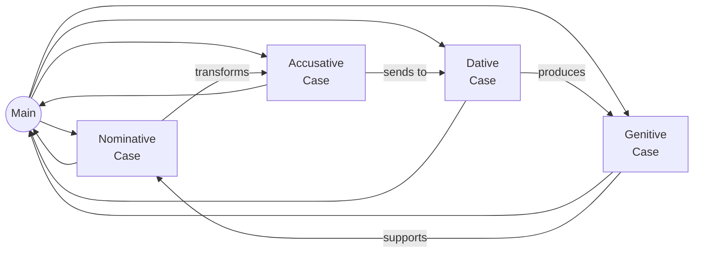
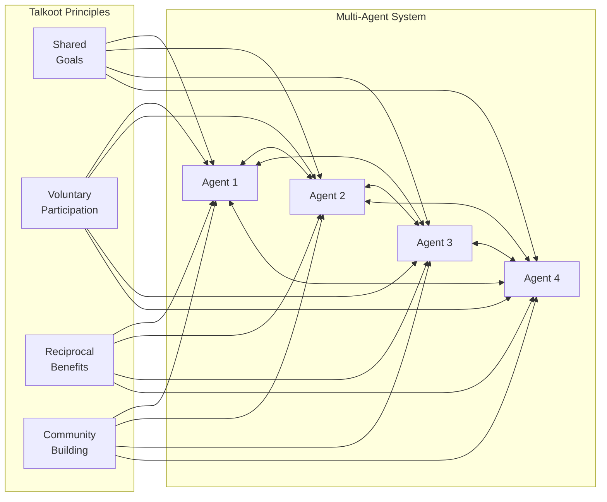
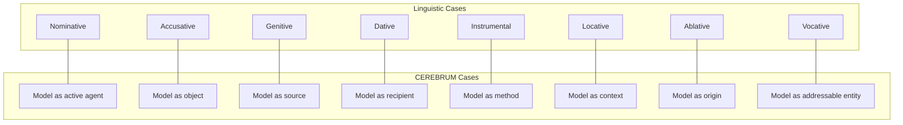

# Finnish Concepts and CEREBRUM Integration - Technical Figures

This document presents a series of Mermaid diagrams illustrating the connections between Finnish concepts and the CEREBRUM framework.


## Core Finnish Concepts Harmony


## The Essence of Luonto (Nature)


## Finnish Locative Cases - Poetry of Place


## Sisu - Finnish Determination


## Paikka: The Spatial Intelligence of Finnish


## Talkoot: Communal Harmony


## Verkosto: The Living Networks


## Finnish Concepts to Application Domains


## Finnish-CEREBRUM Case Resonance


## Käsityö: Craft Intelligence


## Finnish Case Transformation Cycle


## The Dance of CEREBRUM Cases



## Sisu in Active Inference Implementation


## Reuna, Raja, Välitila: The Poetry of Boundaries


## Luonto-Based Model Ecology


## Finnish-Inspired Interface Ecology


## The Rhythm of Vuodenkierto (Cycle of the Year)


## Talkoot Principles in Multi-Agent Systems



## Finnish Linguistic Case System in CEREBRUM



## Cross-Cutting Themes: Paikallisuus & Kestävyys


## Metsäpuutarha: Forest Garden as System Metaphor

```mermaid
graph TD
    subgraph Forest Garden Layers
        C[Canopy Layer]
        S[Shrub Layer]
        H[Herbaceous Layer]
        R[Root Layer]
        M[Soil Microbiome]
    end
    
    subgraph System Architecture Layers
        UI[User Interface]
        ML[Middle Logic]
        DS[Data Services]
        DB[Database]
        IS[Infrastructure]
    end
    
    C --- UI
    S --- ML
    H --- DS
    R --- DB
    M --- IS
    
    C --> S
    S --> H
    H --> R
    R --> M
    
    UI --> ML
    ML --> DS
    DS --> DB
    DB --> IS
```

## Syntactic Case Structure for Models

```mermaid
sequenceDiagram
    participant NOM as Nominative
    participant ACC as Accusative
    participant GEN as Genitive
    participant DAT as Dative
    
    Note over NOM,DAT: Simple Model Sentence Structure
    
    NOM->>ACC: Transforms
    Note right of ACC: Model[NOM] transforms Model[ACC]
    ACC->>GEN: Generates
    Note right of GEN: Result from Model[GEN]
    GEN->>DAT: Transfers to
    Note right of DAT: Given to Model[DAT]
    
    Note over NOM,DAT: Example: Prediction Flow
    
    NOM->>ACC: Perceptual model predicts sensory data
    ACC->>GEN: Prediction creates insight
    GEN->>DAT: Insight delivered to action model
```

## Vuodenkierto Impact on Model Development

```mermaid
gantt
    title Seasonal Approach to Model Development
    dateFormat YYYY-MM-DD
    axisFormat %b
    
    section Conceptualization (Spring)
    Idea Generation      :a1, 2025-03-01, 30d
    Requirement Gathering:a2, after a1, 30d
    Proof of Concept     :a3, after a2, 30d
    
    section Implementation (Summer)
    Core Development     :b1, 2025-06-01, 60d
    Integration          :b2, after b1, 30d
    Testing              :b3, after b2, 30d
    
    section Refinement (Autumn)
    Evaluation           :c1, 2025-09-21, 21d
    Optimization         :c2, after c1, 30d
    Documentation        :c3, after c2, 30d
    
    section Conservation (Winter)
    Maintenance          :d1, 2025-12-21, 30d
    Planning Next Cycle  :d2, after d1, 30d
    Knowledge Transfer   :d3, after d2, 21d
```

## Emotional Dimensions of Finnish Concepts

*   **Luonto:** Communal=0, Practical=2
*   **Paikka:** Communal=1, Practical=4
*   **Talkoot:** Communal=-2.5, Practical=-1
*   **Sisu:** Communal=3.5, Practical=3
*   **Käsityö:** Communal=-3, Practical=-2
*   **Verkosto:** Communal=2, Practical=0
*   **Reuna:** Communal=-4, Practical=-3.5

(Note: xychart-beta is not reliably supported in GitHub Markdown)

## Finnish-CEREBRUM Integration: Precision & Context

```mermaid
pie
    title "Value Integration Areas"
    "Contextual Intelligence" : 30
    "Precision Mechanics" : 25
    "Relational Modeling" : 20
    "Resilient Architecture" : 15
    "Craft Quality" : 10
```

## Model Ecosystem as Forest

```mermaid
graph TB
    subgraph Forest Ecosystem
        T1[Tall Trees]
        T2[Mid-Canopy]
        T3[Understory]
        S[Shrubs]
        H[Herbs]
        M[Mushrooms]
        SO[Soil]
    end
    
    subgraph Model Ecosystem
        M1[Core Models]
        M2[Support Models]
        M3[Interface Models]
        M4[Processing Models]
        M5[Data Models]
        M6[Integration Models]
        M7[Infrastructure]
    end
    
    T1 --- M1
    T2 --- M2
    T3 --- M3
    S --- M4
    H --- M5
    M --- M6
    SO --- M7
```

## The Simple Beauty of Finnish Design Principles

```mermaid
graph TD
    subgraph Finnish_Design_Ethos
        F[Functionality]
        S[Simplicity]
        H[Harmony]
        D[Durability]
        M[Materials]
    end
```

## The Simple Beauty of Finnish Design Principles

```mermaid
graph TD
    F[Functionality]
    S[Simplicity]
    H[Harmony]
    D[Durability]
    M[Materials]
    
    F --- S
    S --- H
    H --- D
    D --- M
    M --- F
```

## CEREBRUM Morphological Grammar

```mermaid
graph LR
    subgraph Model_NOM
        N1[Active Agent]
    end
    
    subgraph Model_ACC
        A1[Object of Process]
    end
    
    subgraph Model_GEN
        G1[Source Generator]
    end
    
    subgraph Model_DAT
        D1[Recipient]
    end
    
    N1 -->|transforms| A1
    A1 -->|produces| G1
    G1 -->|delivers to| D1
```

## CEREBRUM Morphological Grammar

```mermaid
graph LR
    N1[Active Agent<br>NOM]
    A1[Object of Process<br>ACC]
    G1[Source Generator<br>GEN]
    D1[Recipient<br>DAT]
    
    N1 -->|transforms| A1
    A1 -->|produces| G1
    G1 -->|delivers to| D1
```

## Bridging Linguistic and Computational Boundaries

```mermaid
flowchart LR
    L1[Case System] --> C1[Model Structure]
    L2[Agglutination] --> C2[Function Chaining]
    L3[Vowel Harmony] --> C3[Process Harmony]
```

## Core Finnish Concepts Hierarchy

```mermaid
mindmap
  root((Finnish Concepts))
    (Luonto and Metsa)
      (Nature)
      (Forest)
      (Ecological systems)
      (Biodiversity Monimuotoisuus)
      (Cycles Vuodenkierto)
    (Paikka and Locative Cases)
      (Place)
      (Inessive -ssa -ssä)
      (Elative -sta -stä)
      (Illative -an -en etc)
      (Adessive -lla -llä)
      (Ablative -lta -ltä)
      (Allative -lle)
    (Talkoot and Yhteiso)
      (Communal work)
      (Community)
      (Cooperation)
      (Naapuriapu Neighborly help)
      (Osuuskunta Cooperative)
    (Sisu)
      (Resilience)
      (Perseverance)
      (Anti-fragility)
      (Robustness)
    (Kasityo and Muotoilu)
      (Handicraft)
      (Design)
      (Functional aesthetics)
      (Durability)
    (Reuna Raja Valitila)
      (Edge)
      (Boundary)
      (In-between space)
      (Transition zones)
    (Verkosto)
      (Network)
      (Connections)
      (Web of relationships)
    (Keraily and Vuodenkierto)
      (Foraging)
      (Cyclical processes)
      (Seasonal knowledge)
```

## Core Finnish Concepts Hierarchy

```mermaid
graph TD
    root((Finnish Concepts))
    
    L[Luonto/Nature]
    P[Paikka/Place]
    T[Talkoot/Community]
    S[Sisu/Resilience]
    K[Käsityö/Craft]
    R[Reuna/Edge]
    V[Verkosto/Network]
    KV[Keräily/Cycles]
    
    root --> L
    root --> P
    root --> T
    root --> S
    root --> K
    root --> R
    root --> V
    root --> KV
    
    L --> L1[Forest]
    L --> L2[Ecosystems]
    L --> L3[Biodiversity]
    
    P --> P1[Locative Cases]
    P --> P2[Spatial Awareness]
    
    T --> T1[Communal Work]
    T --> T2[Cooperation]
    
    S --> S1[Perseverance]
    S --> S2[Anti-fragility]
    
    K --> K1[Handicraft]
    K --> K2[Design]
    
    R --> R1[Boundaries]
    R --> R2[Transitions]
    
    V --> V1[Connections]
    V --> V2[Relationships]
    
    KV --> KV1[Seasonal Knowledge]
    KV --> KV2[Cyclical Processes]
```

## Finnish Concepts to Application Domains Flow

```mermaid
flowchart TD
    FC(Finnish Concepts) --> SW(Spatial Web & AR)
    FC --> W3(Web3 & Decentralized Systems)
    FC --> NW(Network Weaving)
    FC --> ED(Ecotones & Interface Design)
    FC --> PT(Participatory Technology)
    FC --> FF(Food Forests & Permaculture)
    
    L[Luonto/Nature] --> SW
    L --> FF
    
    P[Paikka/Place] --> SW
    P --> W3
    P --> ED
    
    T[Talkoot/Communal Work] --> W3
    T --> NW
    
    S[Sisu/Resilience] --> W3
    S --> PT
    
    K[Käsityö/Craft] --> PT
    
    R[Reuna/Edge] --> ED
    R --> FF
    
    V[Verkosto/Network] --> NW
    V --> W3
    
    KV[Keräily/Foraging] --> FF
    
    SW --> A1[Place-aware AR layers]
    SW --> A2[Contextual digital overlays]
    
    W3 --> B1[Community DAOs]
    W3 --> B2[Resilient protocols]
    
    NW --> C1[Yhteisö-based connections]
    NW --> C2[Trust networks]
    
    ED --> D1[System interfaces as ecotones]
    ED --> D2[Välitila transition spaces]
    
    PT --> E1[Käsityö-inspired durability]
    PT --> E2[Co-creation/Yhteiskehittäminen]
    
    FF --> F1[Metsäpuutarhat design]
    FF --> F2[Biodiversity focus]
```

## Finnish Concepts and CEREBRUM Cases Integration

```mermaid
erDiagram
    FINNISH-CONCEPT ||--o{ CEREBRUM-CASE : informs
    
    FINNISH-CONCEPT {
        string name
        string definition
        string cultural_context
        string ecological_relevance
    }
    
    CEREBRUM-CASE {
        string case_name
        string function
        string transformation_type
        string precision_weighting
    }
    
    LUONTO ||--o{ NOMINATIVE : grounds
    LUONTO {
        string essence
        string cycles
        string biodiversity
    }
    
    NOMINATIVE {
        string function
        string parameters
        string precision
    }
    
    PAIKKA ||--o{ LOCATIVE : structures
    PAIKKA {
        string location_types
        string context
        string awareness
    }
    
    LOCATIVE {
        string function
        string parameters
        string precision
    }
    
    TALKOOT ||--o{ DATIVE : facilitates
    TALKOOT {
        string communal_work
        string cooperation
        string helping
    }
    
    DATIVE {
        string function
        string parameters
        string precision
    }
    
    SISU ||--o{ ABLATIVE : strengthens
    SISU {
        string perseverance
        string anti_fragility
        string endurance
    }
    
    ABLATIVE {
        string function
        string parameters
        string precision
    }
    
    KASITYO ||--o{ INSTRUMENTAL : implements
    KASITYO {
        string craft
        string design
        string durability
    }
    
    INSTRUMENTAL {
        string function
        string parameters
        string precision
    }
    
    VERKOSTO ||--o{ GENITIVE : generates
    VERKOSTO {
        string connections
        string structure
        string quality
    }
    
    GENITIVE {
        string function
        string parameters
        string precision
    }
    
    REUNA ||--o{ ACCUSATIVE : transforms
    REUNA {
        string boundary
        string transition
        string interface
    }
    
    ACCUSATIVE {
        string function
        string parameters
        string precision
    }
```

## Finnish Locative Cases and Spatial Computing Flow

```mermaid
sequenceDiagram
    participant User
    participant System
    participant Inessive
    participant Elative
    participant Illative
    participant Adessive
    participant Ablative
    participant Allative
    
    User->>System: Initiate location query
    System->>Inessive: Check if entity is IN location
    Inessive-->>System: Return containment status
    System->>Elative: Request data FROM WITHIN location
    Elative-->>System: Return internal source data
    System->>Illative: Direct entity INTO location
    Illative-->>System: Confirm directional movement
    System->>Adessive: Check if entity is ON/AT location
    Adessive-->>System: Return surface relationship
    System->>Ablative: Request data FROM UPON location
    Ablative-->>System: Return surface-sourced data
    System->>Allative: Direct entity ONTO location
    Allative-->>System: Confirm surface destination
    System-->>User: Present spatial relationship results
```

## Finnish Concept Impact on CEREBRUM Implementation

```mermaid
pie
    title Finnish Concept Integration in CEREBRUM
    "Luonto (Nature)" : 20
    "Paikka (Place)" : 25
    "Talkoot (Community)" : 15
    "Sisu (Resilience)" : 12
    "Käsityö (Craft)" : 10
    "Reuna (Edge)" : 10
    "Verkosto (Network)" : 8
```

## Talkoot Principles in Distributed Workflows

```mermaid
gantt
    title Talkoot-inspired Collaborative Workflow
    dateFormat YYYY-MM-DD
    
    section Planning
    Community Goal Setting       :a1, 2025-01-01, 30d
    Resource Assessment          :a2, after a1, 20d
    
    section Preparation
    Environment Setup            :b1, after a1, 20d
    Tool Distribution            :b2, after b1, 10d
    
    section Execution
    Collaborative Development    :c1, after b1, 40d
    Quality Checking             :c2, after c1, 15d
    
    section Completion
    Integration                  :d1, after c2, 20d
    Communal Celebration         :d2, after d1, 5d
```

## Active Inference in Finnish-Inspired CEREBRUM

```mermaid
flowchart TD
    %% Finnish Concepts
    L[Luonto]
    P[Paikka]
    T[Talkoot]
    S[Sisu]
    K[Käsityö]
    R[Reuna/Raja]
    V[Verkosto]
    
    %% CEREBRUM Active Inference
    GM[Generative Model]
    FE[Free Energy Principle]
    MB[Markov Blanket]
    PP[Predictive Processing]
    PS[Precision Scaling]
    AC[Active Control]
    
    %% Implementation
    M1[Ecological Priors]
    M2[Place-Specific Boundaries]
    M3[Network Message Passing]
    M4[Context-Sensitive Precision]
    M5[Resilient Optimization]
    M6[Craft-Based Control]
    
    %% Connections
    L --> GM
    L --> PP
    P --> MB
    P --> PS
    T --> AC
    S --> FE
    K --> AC
    R --> MB
    V --> PP
    
    GM --> M1
    MB --> M2
    PP --> M3
    PS --> M4
    FE --> M5
    AC --> M6
```

## Finnish Case Transformations in CEREBRUM

```mermaid
stateDiagram-v2
    [*] --> NominativeCase
    
    NominativeCase --> AccusativeCase: Becomes target of process
    AccusativeCase --> DativeCase: Becomes data recipient
    DativeCase --> GenitiveCase: Becomes output generator
    GenitiveCase --> InstrumentalCase: Becomes method tool
    InstrumentalCase --> LocativeCase: Becomes context provider
    LocativeCase --> AblativeCase: Becomes information source
    AblativeCase --> VocativeCase: Becomes addressable entity
    VocativeCase --> NominativeCase: Resumes active role
    
    state NominativeCase {
        [*] --> ActivePrediction
        ActivePrediction --> ControlDispatch
        ControlDispatch --> [*]
    }
    
    state AccusativeCase {
        [*] --> ReceiveUpdates
        ReceiveUpdates --> ParameterAdjustment
        ParameterAdjustment --> [*]
    }
    
    state GenitiveCase {
        [*] --> OutputGeneration
        OutputGeneration --> ProductDelivery
        ProductDelivery --> [*]
    }
```

## Finnish-Hungarian-Navajo Intersectional Framework

```mermaid
classDiagram
    class FinnishConcept {
        +String name
        +String definition
        +apply(Context)
    }
    
    class HungarianCase {
        +String caseName
        +String suffix
        +transform(Entity)
    }
    
    class NavajoAspect {
        +String aspectName
        +String verbForm
        +process(Action)
    }
    
    class ActiveInferenceApplication {
        +String applicationName
        +String domain
        +implement(Model)
    }
    
    FinnishConcept <|-- Paikka
    FinnishConcept <|-- Reuna
    FinnishConcept <|-- Verkosto
    FinnishConcept <|-- Luonto
    FinnishConcept <|-- Sisu
    FinnishConcept <|-- Talkoot
    
    HungarianCase <|-- Superessive
    HungarianCase <|-- Sublative
    HungarianCase <|-- Delative
    
    NavajoAspect <|-- Imperfective
    NavajoAspect <|-- Seriative
    NavajoAspect <|-- Continuative
    NavajoAspect <|-- Iterative
    NavajoAspect <|-- DClassifier
    
    Paikka --> Superessive: parallels
    Paikka --> Imperfective: parallels
    Paikka --> ContextualInference: enables
    
    Reuna --> HungarianCaseSystem: parallels
    Reuna --> ClassifierStems: parallels
    Reuna --> MarkovBlanket: implements
    
    Verkosto --> SublativeDelative: parallels
    Verkosto --> Seriative: parallels
    Verkosto --> MessagePassing: facilitates
    
    class ContextualInference {
        +situatedCognition()
        +spatialModeling()
    }
    
    class MarkovBlanket {
        +boundaryFormalization()
        +interfaceDesign()
    }
    
    class MessagePassing {
        +generativeModels()
        +causalNetworks()
    }
```

## Cross-Cutting Themes in Finnish-CEREBRUM Integration

```mermaid
flowchart LR
    P[Paikallisuus\nLocality/Place-based] --- C1[Context-Specific Models]
    P --- C2[Place-Aware Computing]
    P --- C3[Local Knowledge Integration]
    
    K[Kestävyys\nSustainability/Durability] --- D1[Long-Term System Resilience]
    K --- D2[Durable Model Architecture]
    K --- D3[Sustainable Resource Use]
    
    subgraph "CEREBRUM Framework"
        C1 --- CM[Cognitive Modeling]
        C2 --- AI[Active Inference]
        C3 --- LC[Linguistic Cases]
        D1 --- LC
        D2 --- CM
        D3 --- AI
    end
```

## Place-Based CEREBRUM Architecture

```mermaid
graph TB
    subgraph "Paikka-Inspired Model Architecture"
        P1[Inessive Context] --> ML1[Internal Model Logic]
        P2[Elative Context] --> ML2[Data Source Logic]
        P3[Illative Context] --> ML3[Target Direction Logic]
        P4[Adessive Context] --> ML4[Surface Relationship Logic]
        P5[Ablative Context] --> ML5[Origin Extraction Logic]
        P6[Allative Context] --> ML6[Destination Routing Logic]
    end
    
    subgraph "Case-Based Processing"
        ML1 --> NOM[Nominative Processing]
        ML2 --> GEN[Genitive Processing]
        ML3 --> DAT[Dative Processing]
        ML4 --> LOC[Locative Processing]
        ML5 --> ABL[Ablative Processing]
        ML6 --> ACC[Accusative Processing]
    end
    
    subgraph "Active Inference Engine"
        NOM --> FE1[Prediction Generation]
        GEN --> FE2[Output Production]
        DAT --> FE3[Input Reception]
        LOC --> FE4[Context Provision]
        ABL --> FE5[Origin Representation]
        ACC --> FE6[Parameter Updates]
    end
    
    FE1 & FE2 & FE3 & FE4 & FE5 & FE6 --> FEM[Free Energy Minimization]
```

## Verkosto Network Model in CEREBRUM

```mermaid
graph TD
    subgraph "Verkosto Network Structure"
        V1[Node Type 1] --- V2[Node Type 2]
        V2 --- V3[Node Type 3]
        V3 --- V4[Node Type 4]
        V4 --- V1
        V1 --- V3
        V2 --- V4
    end
    
    V1 -.- N1[Nominative Model]
    V2 -.- A1[Accusative Model]
    V3 -.- G1[Genitive Model]
    V4 -.- D1[Dative Model]
    
    subgraph "CEREBRUM Message Passing"
        N1 --> |Predictions| A1
        A1 --> |Updates| G1
        G1 --> |Outputs| D1
        D1 --> |Inputs| N1
    end
    
    MP[Message Priority] --> N1 & A1 & G1 & D1
    SU[Sisu-Based Resilience] --> MP
```

## Sisu Principles in CEREBRUM Resilience

```mermaid
flowchart TD
    subgraph "Sisu Resilience Principles"
        S1[Perseverance]
        S2[Determination]
        S3[Anti-Fragility]
        S4[Long-Term Focus]
    end
    
    subgraph "CEREBRUM Resilience Implementation"
        R1[Error Recovery Mechanisms]
        R2[Persistent Model Operation]
        R3[Adaptive Parameter Adjustment]
        R4[Degradation Resistance]
    end
    
    S1 --> R1
    S2 --> R2
    S3 --> R3
    S4 --> R4
    
    R1 & R2 & R3 & R4 --> RM[Resilience Module]
    
    subgraph "Active Inference Components"
        RM --> P1[Precision Weighting]
        RM --> P2[Belief Updating]
        RM --> P3[Policy Selection]
        RM --> P4[Error Normalization]
    end
```

## Käsityö Craft Principles in Model Design

```mermaid
flowchart LR
    subgraph "Käsityö Craft Principles"
        K1[Quality Materials]
        K2[Skilled Craftsmanship]
        K3[Functional Design]
        K4[Durability]
        K5[Aesthetic Value]
    end
    
    subgraph "Model Design Principles"
        M1[Quality Data Selection]
        M2[Expert Algorithm Implementation]
        M3[Practical Model Architecture]
        M4[Long-Term Stability]
        M5[Elegant Code Structure]
    end
    
    K1 --> M1
    K2 --> M2
    K3 --> M3
    K4 --> M4
    K5 --> M5
    
    subgraph "Implementation Phases"
        M1 --> I1[Data Curation]
        M2 --> I2[Algorithm Refinement]
        M3 --> I3[Architecture Design]
        M4 --> I4[Stability Testing]
        M5 --> I5[Code Review]
    end
```

## Luonto-Based Ecological Modeling in CEREBRUM

```mermaid
graph TD
    subgraph "Luonto Nature Principles"
        L1[Biodiversity/Monimuotoisuus]
        L2[Ecological Cycles/Vuodenkierto]
        L3[Systems Thinking/Systeemiajattelu]
        L4[Natural Balance/Luonnontasapaino]
    end
    
    subgraph "CEREBRUM Ecological Implementation"
        E1[Model Diversity]
        E2[Cyclical Processing]
        E3[Systems-Level Integration]
        E4[Homeostatic Mechanisms]
    end
    
    L1 --> E1
    L2 --> E2
    L3 --> E3
    L4 --> E4
    
    subgraph "Case-Based Ecological Processing"
        E1 --> C1[Multi-Case Model Ecosystem]
        E2 --> C2[Temporal Case Transitions]
        E3 --> C3[Cross-Case Relationships]
        E4 --> C4[Case-Balance Mechanisms]
    end
```

## Ecological Transitions: Finnish Ecotones and CEREBRUM Boundaries

```mermaid
graph TB
    subgraph "Finnish Ecotone Concepts"
        E1[Vaihettumisvyöhyke<br>Transition Zone]:::ecotone
        E2[Reunavyöhyke<br>Edge Zone]:::ecotone
        E3[Metsänreuna<br>Forest Edge]:::ecotone
        E4[Rantavyöhyke<br>Shoreline Zone]:::ecotone
        E5[Kosteikko<br>Wetland]:::ecotone
    end

    subgraph "CEREBRUM Boundary Systems"
        B1[Markov Blanket]:::boundary
        B2[Case Interfaces]:::boundary
        B3[Morphism Boundaries]:::boundary
        B4[Precision Barriers]:::boundary
        B5[Information Gradients]:::boundary
    end

    E1 --> B1
    E2 --> B2
    E3 --> B3
    E4 --> B4
    E5 --> B5

    classDef ecotone fill:#8FAD88,stroke:#4F6746,color:white
    classDef boundary fill:#9590A8,stroke:#5F5676,color:white
```

## Suomalainen Luontosuhde: Finnish Nature Relationship and Active Inference

```mermaid
mindmap
    root((Luontosuhde<br>Nature Relationship))
        (Jokamiehenoikeus)
            (Freedom to Roam)
            (Universal Access)
            (Responsible Use)
        (Luonnonsuojelu)
            (Conservation)
            (Biodiversity Preservation)
            (Ecological Awareness)
        (Metsäsuhde)
            (Forest Relationship)
            (Cultural Heritage)
            (Resource Management)
        (Vesistöt)
            (Lakes/Järvet)
            (Rivers/Joet)
            (Coastal Areas/Rannikkoalueet)
        (Suot)
            (Peatlands)
            (Carbon Sinks)
            (Ecosystem Services)
        (Vuodenajat)
            (Seasonal Cycles)
            (Adaptation Patterns)
            (Temporal Knowledge)
```

## CEREBRUM Linguistic Cases and Finnish Ecological Knowledge

```mermaid
flowchart TD
    subgraph Finnish Ecological Knowledge Types
        F1[Perinnetieto<br>Traditional Knowledge]
        F2[Paikallinen Tieto<br>Local Knowledge]
        F3[Kokemusperäinen Tieto<br>Experiential Knowledge]
        F4[Kansanekologia<br>Folk Ecology]
        F5[Luonnontieto<br>Nature Knowledge]
    end

    subgraph CEREBRUM Case Structure
        C1[Nominative Case]
        C2[Accusative Case]
        C3[Genitive Case]
        C4[Dative Case]
        C5[Instrumental Case]
        C6[Locative Case]
        C7[Ablative Case]
        C8[Vocative Case]
    end

    F1 --> C1
    F2 --> C6
    F3 --> C5
    F4 --> C3
    F5 --> C7
```

## Metsäekosysteemi: Finnish Forest Ecosystem as Model Architecture

```mermaid
graph TD
    subgraph Finnish Forest Layers
        L1[Latvuskerros<br>Canopy Layer]
        L2[Alikasvos<br>Understory]
        L3[Pensaskerros<br>Shrub Layer]
        L4[Kenttäkerros<br>Field Layer]
        L5[Pohjakerros<br>Ground Layer]
        L6[Maaperä<br>Soil]
    end

    subgraph CEREBRUM Architecture
        M1[Interface Models]
        M2[Integration Models]
        M3[Processing Models]
        M4[Data Models]
        M5[Utility Models]
        M6[Infrastructure]
    end

    L1 --- M1
    L2 --- M2
    L3 --- M3
    L4 --- M4
    L5 --- M5
    L6 --- M6
```

## Finnish Ecosystem Types and CEREBRUM Model Categories

```mermaid
pie
    title "Finnish Ecosystem Diversity and Model Types"
    "Metsat Forests" : 35
    "Suot Peatlands" : 20
    "Jarvet Lakes" : 15
    "Tunturit Fells" : 10
    "Saaristo Archipelago" : 10
    "Maatalousmaisema Agricultural Landscape" : 10
```

## Suomalainen Ekotoni: Finnish Ecotones and Boundary Phenomena

*   **Metsänreuna (Forest Edge):** Complexity=0.7, Biodiversity=0.8
*   **Rantavyöhyke (Shoreline):** Complexity=0.8, Biodiversity=0.9
*   **Suo-metsä Vaihettumisvyöhyke (Peatland-Forest Transition):** Complexity=0.75, Biodiversity=0.85
*   **Tunturikoivikko (Mountain Birch Zone):** Complexity=0.6, Biodiversity=0.7
*   **CEREBRUM Markov Blanket:** Complexity=0.85, Biodiversity=0.65
*   **CEREBRUM Case Transformations:** Complexity=0.9, Biodiversity=0.75

(Note: quadrantChart is not reliably supported in GitHub Markdown)

## Aktiivinen Päättely: Finnish Active Inference Implementation

```mermaid
sequenceDiagram
    participant E as Ennuste_Prediction
    participant H as Havainto_Observation
    participant V as Virhe_Error
    participant T as Tarkkuus_Precision
    participant P as Paivitys_Update
    
    Note over E,P: Finnish Active Inference
    E->>H: Generate prediction
    H->>V: Compare to observation
    V->>T: Weight by precision
    T->>P: Update parameters
    P->>E: Update model
```

## Kiertotalous: Finnish Circular Economy as Model Workflow

```mermaid
graph LR
    subgraph "Kiertotalous (Circular Economy)"
        K1[Suunnittelu<br>Design]:::circular
        K2[Tuotanto<br>Production]:::circular
        K3[Käyttö<br>Usage]:::circular
        K4[Uudelleenkäyttö<br>Reuse]:::circular
        K5[Kierrätys<br>Recycling]:::circular
        K6[Uudistaminen<br>Regeneration]:::circular
    end

    K1 --> K2 --> K3 --> K4 --> K5 --> K6 --> K1

    subgraph "CEREBRUM Model Lifecycle"
        C1[Design]:::cerebrum
        C2[Implementation]:::cerebrum
        C3[Deployment]:::cerebrum
        C4[Redeployment]:::cerebrum
        C5[Transformation]:::cerebrum
        C6[Evolution]:::cerebrum
    end

    C1 --> C2 --> C3 --> C4 --> C5 --> C6 --> C1

    K1 -.-> C1
    K2 -.-> C2
    K3 -.-> C3
    K4 -.-> C4
    K5 -.-> C5
    K6 -.-> C6

    classDef circular fill:#7CB342,stroke:#558B2F,color:white
    classDef cerebrum fill:#5C6BC0,stroke:#3949AB,color:white
```

## Finnish Ecological Succession and Model Evolution

```mermaid
timeline
    title Sukkessio (Ecological Succession) as Model Evolution
    section Pioneeriyhteisö (Pioneer Community)
        Initialization : Model scaffolding
        Basic structures : Simple parameters
        Foundation layers : Core functions
    section Väliyhteisö (Intermediate Community)
        Complexity growth : Expanded capabilities
        Interaction patterns : Inter-model relations
        Resource optimization : Efficiency improvements
    section Kliimaksiyhteisö (Climax Community)
        Stability : Optimized performance
        Self-regulation : Autonomous adaptation
        Homeostasis : Balance maintenance
```

## Seasonal Free Energy Minimization

```mermaid
xychart-beta
    title "Vuodenaikojen Vapaaenergian Minimointi (Seasonal Free Energy Minimization)"
    x-axis "Kevät (Spring) --> Kesä (Summer) --> Syksy (Autumn) --> Talvi (Winter)" 0 --> 12
    y-axis "Free Energy (Vapaaenergia)" 0 --> 100
    line [80, 40, 60, 90]
    line [70, 30, 50, 85]
```

## Finnish Ecotone-Based Adaptive Active Inference

```mermaid
graph TB
    subgraph "Finnish Ecotone Types"
        E1[Metsä-suo<br>Forest-Peatland]:::ecotone1
        E2[Metsä-pelto<br>Forest-Field]:::ecotone2
        E3[Järvi-maa<br>Lake-Land]:::ecotone3
        E4[Rannikko<br>Coastal Zone]:::ecotone4
        E5[Tunturi-metsä<br>Alpine-Forest]:::ecotone5
    end

    subgraph "Ecotone Properties"
        P1[Lajirunsaus<br>Species Richness]:::property
        P2[Ekologinen Häiriö<br>Ecological Disturbance]:::property
        P3[Rajat ja Vaihdot<br>Boundaries & Exchanges]:::property
        P4[Sopeutumismallit<br>Adaptation Patterns]:::property
    end

    subgraph "CEREBRUM Case Transitions"
        C1[Nominative-Accusative<br>Agent-Object]:::case
        C2[Accusative-Genitive<br>Object-Source]:::case
        C3[Genitive-Dative<br>Source-Recipient]:::case
        C4[Dative-Instrumental<br>Recipient-Tool]:::case
        C5[Instrumental-Locative<br>Tool-Context]:::case
    end

    E1 --> P1 & P3
    E2 --> P2 & P4
    E3 --> P1 & P4
    E4 --> P2 & P3
    E5 --> P3 & P4

    P1 --> C1
    P2 --> C2
    P3 --> C3 & C5
    P4 --> C4

    classDef ecotone1 fill:#8B4513,stroke:#5E2F0D,color:white
    classDef ecotone2 fill:#556B2F,stroke:#3A4D21,color:white
    classDef ecotone3 fill:#1E90FF,stroke:#0068D6,color:white
    classDef ecotone4 fill:#48D1CC,stroke:#38A19D,color:white
    classDef ecotone5 fill:#9932CC,stroke:#6A1B9A,color:white
    classDef property fill:#FF7F50,stroke:#E63F00,color:white
    classDef case fill:#6A5ACD,stroke:#483D8B,color:white
```

## Markov Blanket and Finnish Ecotone Parallel

```mermaid
erDiagram
    MARKOV-BLANKET ||--|| ECOTONE : models
    
    MARKOV-BLANKET {
        string external "Environmental states"
        string boundary "Interface conditions"
        string internal "System states"
    }
    
    ECOTONE {
        string ekosysteemi1 "First ecosystem"
        string vaihettumisvyohyke "Transition zone"
        string ekosysteemi2 "Second ecosystem"
    }
    
    EXTERNAL-STATES ||--|| ECOSYSTEM1 : corresponds-to
    EXTERNAL-STATES {
        string environmental_conditions "External factors"
        string outside_influences "Neighboring effects"
    }
    
    ECOSYSTEM1 {
        string metsatyyppi "Forest type"
        string suotyyppi "Wetland type"
        string vesistotyyppi "Water system type"
    }
    
    BOUNDARY-STATES ||--|| TRANSITION-ZONE : corresponds-to
    BOUNDARY-STATES {
        string sensors "Information reception"
        string actions "Information transmission"
        string interface "Information exchange"
    }
    
    TRANSITION-ZONE {
        string lajistomuutos "Species change"
        string fysikaaliset_gradientit "Physical gradients"
        string vaihtovyohyke "Exchange zone"
    }
    
    INTERNAL-STATES ||--|| ECOSYSTEM2 : corresponds-to
    INTERNAL-STATES {
        string beliefs "Internal model"
        string inferences "Derived conclusions"
        string expectations "Predicted states"
    }
    
    ECOSYSTEM2 {
        string mikroilmasto "Microclimate"
        string lajisto "Species composition"
        string sopeutumismalli "Adaptation model"
    }
```

## Case Transformations in Finnish Ecological Knowledge Systems

```mermaid
stateDiagram-v2
    [*] --> NominativeKnowledge
    
    state NominativeKnowledge {
        [*] --> Kansanekologia
        Kansanekologia --> Perinnetieto
        Perinnetieto --> [*]
        
        note right of Kansanekologia
            Active knowledge systems
            driving understanding
            "Folk ecology as agent"
        end note
    }
    
    state AccusativeKnowledge {
        [*] --> Luonnonsuojelu
        Luonnonsuojelu --> Ekologinenennallistaminen
        Ekologinenennallistaminen --> [*]
        
        note right of Luonnonsuojelu
            Knowledge systems receiving action
            "Conservation as target"
        end note
    }
    
    state GenitiveKnowledge {
        [*] --> Luonnonvaratietous
        Luonnonvaratietous --> Kestävälläkäyttö
        Kestävälläkäyttö --> [*]
        
        note right of Luonnonvaratietous
            Knowledge systems as source
            "Resource knowledge as generator"
        end note
    }
    
    state DativeKnowledge {
        [*] --> Tiedonvälitys
        Tiedonvälitys --> Koulutus
        Koulutus --> [*]
        
        note right of Tiedonvälitys
            Knowledge systems receiving information
            "Knowledge transfer as recipient"
        end note
    }
    
    state InstrumentalKnowledge {
        [*] --> Metsänhoito
        Metsänhoito --> Maatalousosaaminen
        Maatalousosaaminen --> [*]
        
        note right of Metsänhoito
            Knowledge systems as tools
            "Forest management as method"
        end note
    }
    
    state LocativeKnowledge {
        [*] --> Paikallisetelinkeinot
        Paikallisetelinkeinot --> Alueellisetkulttuurit
        Alueellisetkulttuurit --> [*]
        
        note right of Paikallisetelinkeinot
            Knowledge systems as contexts
            "Local livelihoods as environment"
        end note
    }
    
    NominativeKnowledge --> AccusativeKnowledge: Becomes object
    AccusativeKnowledge --> GenitiveKnowledge: Becomes source
    GenitiveKnowledge --> DativeKnowledge: Becomes recipient
    DativeKnowledge --> InstrumentalKnowledge: Becomes tool
    InstrumentalKnowledge --> LocativeKnowledge: Becomes context
    LocativeKnowledge --> NominativeKnowledge: Becomes active agent
```

## Finnish Ecosystem Services and CEREBRUM Functional Cases

```mermaid
mindmap
    root((Ekosysteemipalvelut<br>Ecosystem Services))
        (Tuotantopalvelut)
            (Ruoka/Food)
            (Puutavara/Timber)
            (Puhdas vesi/Clean water)
            (Geenivarasto/Genetic resources)
        (Säätelypalvelut)
            (Ilmaston säätely/Climate regulation)
            (Tulvien hallinta/Flood control)
            (Veden puhdistus/Water purification)
            (Pölytys/Pollination)
        (Kulttuuripalvelut)
            (Virkistys/Recreation)
            (Esteettiset elämykset/Aesthetic experiences)
            (Henkiset arvot/Spiritual values)
            (Koulutus/Education)
        (Tukipalvelut)
            (Ravinteiden kierto/Nutrient cycling)
            (Maaperän muodostus/Soil formation)
            (Yhteyttäminen/Photosynthesis)
            (Elinympäristöt/Habitats)
```

## Finnish Ekolingvistinen CEREBRUM: Ecological Linguistics & Case Modeling

```mermaid
flowchart TB
    subgraph "Ekologiset Konseptit (Ecological Concepts)"
        E1[Biodiversiteetti<br>Biodiversity]:::eco
        E2[Kestävyys<br>Sustainability]:::eco
        E3[Kiertotalous<br>Circular Economy]:::eco
        E4[Resilienssi<br>Resilience]:::eco
        E5[Ekotoni<br>Ecotone]:::eco
    end

    subgraph "Kielelliset Sijamuodot (Linguistic Cases)"
        L1[Nominatiivi<br>Nominative]:::lang
        L2[Genetiivi<br>Genitive]:::lang
        L3[Partitiivi<br>Partitive]:::lang
        L4[Inessiivi<br>Inessive]:::lang
        L5[Elatiivi<br>Elative]:::lang
        L6[Illatiivi<br>Illative]:::lang
        L7[Adessiivi<br>Adessive]:::lang
        L8[Ablatiivi<br>Ablative]:::lang
        L9[Allatiivi<br>Allative]:::lang
    end

    subgraph "CEREBRUM Mallien Sijamuodot (CEREBRUM Model Cases)"
        C1[Malli toimijana<br>Model as agent]:::cereb
        C2[Malli kohteena<br>Model as target]:::cereb
        C3[Malli lähteenä<br>Model as source]:::cereb
        C4[Malli vastaanottajana<br>Model as recipient]:::cereb
        C5[Malli työkaluna<br>Model as tool]:::cereb
        C6[Malli kontekstina<br>Model as context]:::cereb
        C7[Malli alkuperänä<br>Model as origin]:::cereb
    end

    E1 --> L1 & L3
    E2 --> L2 & L9
    E3 --> L4 & L5 & L6
    E4 --> L7 & L8
    E5 --> L4 & L7

    L1 --> C1
    L2 --> C3
    L3 --> C2
    L4 & L7 --> C6
    L5 & L8 --> C7
    L6 & L9 --> C4
    L7 --> C5

    classDef eco fill:#4CAF50,stroke:#388E3C,color:white
    classDef lang fill:#FFC107,stroke:#FFA000,color:black
    classDef cereb fill:#9C27B0,stroke:#7B1FA2,color:white
```

## Finnish Suomuurain Model: Cloudberry Life Cycle as Active Inference

```mermaid
graph TD
    classDef seed fill:#8B4513,stroke:#5E2F0D,color:white
    classDef growth fill:#6B8E23,stroke:#556B2F,color:white
    classDef flower fill:#FFFFE0,stroke:#FFFF00,color:black
    classDef fruit fill:#FF7F50,stroke:#FF6347,color:white
    classDef dispersal fill:#9370DB,stroke:#6A5ACD,color:white
    classDef inference fill:#4682B4,stroke:#1E5599,color:white
    
    subgraph "Suomuuraimen Elinkaari (Cloudberry Life Cycle)"
        S1[Siemen<br>Seed]:::seed
        S2[Kasvu suoympäristössä<br>Growth in bog]:::growth
        S3[Kukinta<br>Flowering]:::flower
        S4[Marjat<br>Berries]:::fruit
        S5[Leviäminen<br>Dispersal]:::dispersal
    end
    
    subgraph "Aktiivinen Päättely (Active Inference)"
        AI1[Mallintaminen<br>Modeling]:::inference
        AI2[Havainnointi<br>Perception]:::inference
        AI3[Ennustaminen<br>Prediction]:::inference
        AI4[Toiminta<br>Action]:::inference
        AI5[Sopeutuminen<br>Adaptation]:::inference
    end
    
    S1 --> S2 --> S3 --> S4 --> S5 --> S1
    AI1 --> AI2 --> AI3 --> AI4 --> AI5 --> AI1
    
    S1 -.-> AI1
    S2 -.-> AI2
    S3 -.-> AI3
    S4 -.-> AI4
    S5 -.-> AI5
```

## Deep Ecotone Analysis: Transitional Free Energy Minimization

```mermaid
quadrantChart
    title Ecotones as Free Energy Minimization Systems
    x-axis Low Information Exchange --> High Information Exchange
    y-axis Low Adaptive Capacity --> High Adaptive Capacity
    quadrant-1 Static Rich Information
    quadrant-2 Dynamic Complex Adaptation
    quadrant-3 Simple Stable Systems
    quadrant-4 Complex Fixed Systems
    "Metsä-pelto rajapinta (Forest-Field Interface)": [0.6, 0.5]
    "Suon ja kangasmetsän vaihettumisvyöhyke (Bog-Forest Transition)": [0.7, 0.7]
    "Järven rantavyöhyke (Lake Shoreline)": [0.8, 0.9]
    "Tunturikoivikko (Mountain Birch Belt)": [0.5, 0.8]
    "Markov blanket in Active Inference": [0.9, 0.6]
    "CEREBRUM Case Transformation": [0.7, 0.8]
```

## Forest-Bog Ecotone and Case Structure Parallels

```mermaid
graph TB
    subgraph "Suo-Metsä Ekotoni (Bog-Forest Ecotone)"
        direction LR
        E1[Räme<br>Pine Bog]:::bog
        E2[Korpirämeet<br>Spruce-Pine Swamp]:::trans
        E3[Korpi<br>Spruce Mire]:::trans
        E4[Kangasmetsä<br>Heath Forest]:::forest
    end
    
    subgraph "CEREBRUM Sijarakenne (Case Structure)"
        direction LR
        C1[Ablatiivinen Malli<br>Ablative Model]:::ablative
        C2[Lokatiivinen Malli<br>Locative Model]:::locative
        C3[Instrumentaalinen Malli<br>Instrumental Model]:::instrumental
        C4[Nominatiivinen Malli<br>Nominative Model]:::nominative
    end
    
    E1 --- E2 --- E3 --- E4
    C1 --- C2 --- C3 --- C4
    
    E1 -.-> C1
    E2 -.-> C2
    E3 -.-> C3
    E4 -.-> C4
    
    classDef bog fill:#6B4226,stroke:#472B19,color:white
    classDef trans fill:#8E7545,stroke:#5E4D2E,color:white
    classDef forest fill:#228B22,stroke:#145214,color:white
    
    classDef ablative fill:#FF6B6B,stroke:#CC5555,color:white
    classDef locative fill:#4ECDC4,stroke:#3BA39B,color:white
    classDef instrumental fill:#FFD166,stroke:#C9A652,color:black
    classDef nominative fill:#06D6A0,stroke:#04A57B,color:white
```

## Finnish Seasonal Adaptation as Active Inference Cycle

```mermaid
journey
    title Finnish Seasonal Adaptation and Free Energy Minimization
    section Kevät (Spring)
      Prediction Updates: 5: System, Environment
      Resource Allocation: 4: System, Energy
      Growth Parameters: 3: System, Model
    section Kesä (Summer)
      Maximum Activity: 5: System, Production
      Information Gathering: 5: System, Learning
      Model Refinement: 4: System, Adaptation
    section Syksy (Autumn)
      Resource Conservation: 5: System, Planning
      Parameter Adjustment: 4: System, Optimization
      Preparation Strategies: 5: System, Forecasting
    section Talvi (Winter)
      Minimal Processing: 2: System, Conservation
      Core Function Maintenance: 3: System, Stability
      Long-term Planning: 4: System, Evolution
``` 

## Comprehensive Finnish-CEREBRUM Integration Matrix

```mermaid
graph TB
    %% Main concepts
    subgraph "Finnish Ecological Concepts"
        direction TB
        FC1[Metsäekologia<br>Forest Ecology]:::finn1
        FC2[Suoekosysteemi<br>Wetland Ecosystem]:::finn2
        FC3[Ekotoni<br>Ecotone]:::finn3
        FC4[Vuodenkierto<br>Annual Cycle]:::finn4
        FC5[Lajidiversiteetti<br>Species Diversity]:::finn5
        FC6[Suksessio<br>Succession]:::finn6
    end
    
    subgraph "CEREBRUM Framework"
        direction TB
        CF1[Mallien Sijamuodot<br>Model Cases]:::cerebrum1
        CF2[Aktiivinen Päättely<br>Active Inference]:::cerebrum2
        CF3[Kategoriarakenne<br>Category Structure]:::cerebrum3
        CF4[Vapaaenergian Minimointi<br>Free Energy Minimization]:::cerebrum4
        CF5[Mallimuunnokset<br>Model Transformations]:::cerebrum5
        CF6[Markovin Peitteet<br>Markov Blankets]:::cerebrum6
    end
    
    %% Detailed connections
    subgraph "Detailed Integration Points"
        direction TB
        %% Forest Ecology and Model Cases
        FI1[Metsän kerroksellisuus<br>Forest Stratification]:::detail
        FI2[Sijarakenne<br>Case Structure]:::detail
        FC1 --> FI1
        CF1 --> FI2
        FI1 --- FI2
        
        %% Wetland Ecosystem and Active Inference
        FI3[Suon vedenkierto<br>Wetland Hydrology]:::detail
        FI4[Ennustevirheen minimointi<br>Prediction Error Minimization]:::detail
        FC2 --> FI3
        CF2 --> FI4
        FI3 --- FI4
        
        %% Ecotone and Category Structure
        FI5[Vaihettumisvyöhykkeen rakenne<br>Transition Zone Structure]:::detail
        FI6[Morfismien rajat<br>Morphism Boundaries]:::detail
        FC3 --> FI5
        CF3 --> FI6
        FI5 --- FI6
        
        %% Annual Cycle and Free Energy Minimization
        FI7[Vuodenaikojen energiatalous<br>Seasonal Energy Economy]:::detail
        FI8[Parametrien vuosisäätö<br>Parameter Annual Adjustment]:::detail
        FC4 --> FI7
        CF4 --> FI8
        FI7 --- FI8
        
        %% Species Diversity and Model Transformations
        FI9[Lajien roolit ekosysteemissä<br>Species Roles in Ecosystem]:::detail
        FI10[Mallien toiminnalliset muutokset<br>Functional Model Changes]:::detail
        FC5 --> FI9
        CF5 --> FI10
        FI9 --- FI10
        
        %% Succession and Markov Blankets
        FI11[Ekosysteemin kehityskulku<br>Ecosystem Development Path]:::detail
        FI12[Sisäiset ja ulkoiset mallitilat<br>Internal and External Model States]:::detail
        FC6 --> FI11
        CF6 --> FI12
        FI11 --- FI12
    end
    
    subgraph "Implementation Examples"
        IE1[Metsätyypin luokittelu nominatiivisessa sijassa<br>Forest Type Classification in Nominative Case]:::impl
        IE2[Suovesien virtausmalli instrumentaalisessa sijassa<br>Wetland Water Flow Model in Instrumental Case]:::impl
        IE3[Ekotonianalyysi lokatiivisessa sijassa<br>Ecotone Analysis in Locative Case]:::impl
        IE4[Vuodenkiertomalli akkusatiivisessa sijassa<br>Annual Cycle Model in Accusative Case]:::impl
        IE5[Lajidiversiteettimalli genetiivisessä sijassa<br>Species Diversity Model in Genitive Case]:::impl
        IE6[Sukessioanalyysi ablatiivisessa sijassa<br>Succession Analysis in Ablative Case]:::impl
    end
    
    %% Connections to implementation
    FI1 & FI2 --> IE1
    FI3 & FI4 --> IE2
    FI5 & FI6 --> IE3
    FI7 & FI8 --> IE4
    FI9 & FI10 --> IE5
    FI11 & FI12 --> IE6
    
    %% Style definitions
    classDef finn1 fill:#004D00,stroke:#002800,color:white
    classDef finn2 fill:#8B4513,stroke:#5E2F0D,color:white
    classDef finn3 fill:#8FAD88,stroke:#4F6746,color:white
    classDef finn4 fill:#FFB347,stroke:#CC7A00,color:black
    classDef finn5 fill:#4682B4,stroke:#1E5599,color:white
    classDef finn6 fill:#9370DB,stroke:#6A5ACD,color:white
    
    classDef cerebrum1 fill:#D42A2E,stroke:#8C1D1F,color:white
    classDef cerebrum2 fill:#E9967A,stroke:#BE7A62,color:black
    classDef cerebrum3 fill:#9C27B0,stroke:#7B1FA2,color:white
    classDef cerebrum4 fill:#FF6B6B,stroke:#CC5555,color:white
    classDef cerebrum5 fill:#6A5ACD,stroke:#483D8B,color:white
    classDef cerebrum6 fill:#4ECDC4,stroke:#3BA39B,color:white
    
    classDef detail fill:#A3CEF1,stroke:#6A8EB2,color:black
    classDef impl fill:#F9E79F,stroke:#C4B454,color:black
```

## Finnish Ecological Classification and CEREBRUM Case Integration

```mermaid
erDiagram
    METSATYYPIT ||--o{ NOMINATIVE-CASE : use-as
    METSATYYPIT {
        string lehto "Grove"
        string lehtomainen_kangas "Herb-rich heath forest"
        string tuore_kangas "Fresh heath forest" 
        string kuivahko_kangas "Sub-dry heath forest"
        string kuiva_kangas "Dry heath forest"
        string karukkokankaat "Barren heath forest"
    }
    
    NOMINATIVE-CASE {
        string active_prediction "Forward inference"
        string control_signals "Action selection"
        string parameter_activity "Full parameter access"
    }
    
    SUOTYYPIT ||--o{ INSTRUMENTAL-CASE : use-as
    SUOTYYPIT {
        string korpi "Spruce mire"
        string rame "Pine bog"
        string neva "Open bog"
        string letto "Rich fen"
        string yhdistelmatyypit "Combination types"
    }
    
    INSTRUMENTAL-CASE {
        string method_implementation "Algorithmic procedures"
        string tool_operation "Process execution"
        string operational_parameters "Method-oriented parameters"
    }
    
    VESISTOTYYPIT ||--o{ DATIVE-CASE : use-as
    VESISTOTYYPIT {
        string jarvet "Lakes"
        string joet "Rivers"
        string purot "Streams"
        string lammet "Ponds"
        string lahdevedet "Spring waters"
    }
    
    DATIVE-CASE {
        string data_reception "Input processing"
        string information_intake "Data flow handling"
        string input_parameters "Input-focused parameters"
    }
    
    EKOTONITYYPIT ||--o{ LOCATIVE-CASE : use-as
    EKOTONITYYPIT {
        string metsa_suo "Forest-wetland"
        string metsa_pelto "Forest-field"
        string jarvi_maa "Lake-land"
        string tunturi_metsa "Alpine-forest"
    }
    
    LOCATIVE-CASE {
        string context_provision "Environmental parameters"
        string situational_constraints "Contextual boundaries"
        string environmental_modeling "Context-oriented processes"
    }
    
    LAJIRYHMAT ||--o{ GENITIVE-CASE : use-as
    LAJIRYHMAT {
        string puut "Trees"
        string pensaat "Shrubs"
        string ruohot "Herbs"
        string sammalet "Mosses"
        string jakala "Lichen"
    }
    
    GENITIVE-CASE {
        string output_generation "Product creation"
        string source_functionality "Information source"
        string generative_parameters "Output-focused parameters"
    }
    
    KASVILLISUUSVYOHYKKEET ||--o{ ABLATIVE-CASE : use-as
    KASVILLISUUSVYOHYKKEET {
        string hemiboreaalinen "Hemiboreal"
        string etelaboreaaliinen "Southern boreal"
        string keskiboreaalinen "Middle boreal"
        string pohjoisboreaaliinen "Northern boreal"
    }
    
    ABLATIVE-CASE {
        string origin_representation "Historical source"
        string causal_attribution "Causal explanation"
        string historical_parameters "Origin-focused parameters"
    }
```

## Bridging Linguistic and Computational Boundaries

```mermaid
flowchart LR
    L1[Case System] --> C1[Model Structure]
    L2[Agglutination] --> C2[Function Chaining]
    L3[Vowel Harmony] --> C3[Process Harmony]
```