# Finnish Concepts and CEREBRUM Integration - Technical Figures

This document presents a series of Mermaid diagrams illustrating the connections between Finnish concepts and the CEREBRUM framework.

## Core Finnish Concepts Hierarchy

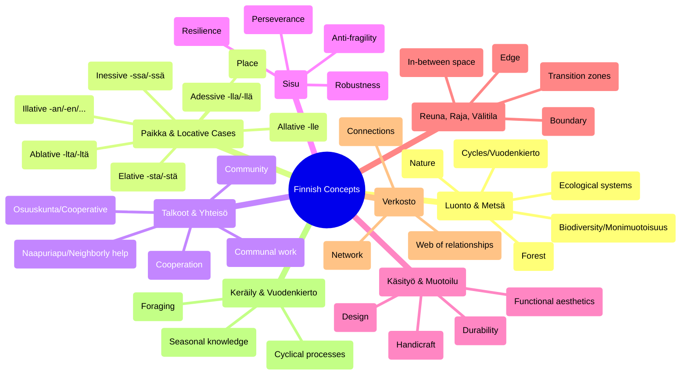

## Finnish Concepts to Application Domains Flow

```mermaid
flowchart TD
    FC(Finnish Concepts) --> SW(Spatial Web & AR)
    FC --> W3(Web3 & Decentralized Systems)
    FC --> NW(Network Weaving)
    FC --> ED(Ecotones & Interface Design)
    FC --> PT(Participatory Technology)
    FC --> FF(Food Forests & Permaculture)
    
    L[Luonto/Nature] --> SW
    L --> FF
    
    P[Paikka/Place] --> SW
    P --> W3
    P --> ED
    
    T[Talkoot/Communal Work] --> W3
    T --> NW
    
    S[Sisu/Resilience] --> W3
    S --> PT
    
    K[Käsityö/Craft] --> PT
    
    R[Reuna/Edge] --> ED
    R --> FF
    
    V[Verkosto/Network] --> NW
    V --> W3
    
    KV[Keräily/Foraging] --> FF
    
    SW --> A1[Place-aware AR layers]
    SW --> A2[Contextual digital overlays]
    
    W3 --> B1[Community DAOs]
    W3 --> B2[Resilient protocols]
    
    NW --> C1[Yhteisö-based connections]
    NW --> C2[Trust networks]
    
    ED --> D1[System interfaces as ecotones]
    ED --> D2[Välitila transition spaces]
    
    PT --> E1[Käsityö-inspired durability]
    PT --> E2[Co-creation/Yhteiskehittäminen]
    
    FF --> F1[Metsäpuutarhat design]
    FF --> F2[Biodiversity focus]
```

## Finnish Concepts and CEREBRUM Cases Integration

```mermaid
erDiagram
    FINNISH-CONCEPT ||--o{ CEREBRUM-CASE : informs
    
    FINNISH-CONCEPT {
        string name
        string definition
        string cultural_context
        string ecological_relevance
    }
    
    CEREBRUM-CASE {
        string case_name
        string function
        string transformation_type
        string precision_weighting
    }
    
    LUONTO-NATURE ||--o{ NOMINATIVE-CASE : grounds
    LUONTO-NATURE {
        string essence "Character/Essence"
        string cycles "Ecological cycles"
        string biodiversity "Monimuotoisuus"
    }
    
    NOMINATIVE-CASE {
        string function "Model as active agent"
        string parameters "Fully accessible"
        string precision "Highest on likelihood"
    }
    
    PAIKKA-PLACE ||--o{ LOCATIVE-CASE : structures
    PAIKKA-PLACE {
        string location_types "Six locative cases"
        string context "Spatial relationships"
        string awareness "Paikkatietoisuus"
    }
    
    LOCATIVE-CASE {
        string function "Model as context"
        string parameters "Environmental emphasis"
        string precision "Highest on contexts"
    }
    
    TALKOOT-COMMUNITY ||--o{ DATIVE-CASE : facilitates
    TALKOOT-COMMUNITY {
        string communal_work "Voluntary collaboration"
        string cooperation "Shared goals"
        string helping "Naapuriapu"
    }
    
    DATIVE-CASE {
        string function "Model as recipient"
        string parameters "Input-focused"
        string precision "Highest on inputs"
    }
    
    SISU-RESILIENCE ||--o{ ABLATIVE-CASE : strengthens
    SISU-RESILIENCE {
        string perseverance "Determination"
        string anti_fragility "Robustness"
        string endurance "Long-term stability"
    }
    
    ABLATIVE-CASE {
        string function "Model as origin/cause"
        string parameters "Origin states emphasized"
        string precision "Highest on historical data"
    }
    
    KASITYO-CRAFT ||--o{ INSTRUMENTAL-CASE : implements
    KASITYO-CRAFT {
        string craft "Handicraft techniques"
        string design "Muotoilu principles"
        string durability "Long-lasting quality"
    }
    
    INSTRUMENTAL-CASE {
        string function "Model as method/tool"
        string parameters "Method-oriented"
        string precision "Highest on operations"
    }
    
    VERKOSTO-NETWORK ||--o{ GENITIVE-CASE : generates
    VERKOSTO-NETWORK {
        string connections "Relationship web"
        string structure "Network topology"
        string quality "Connection integrity"
    }
    
    GENITIVE-CASE {
        string function "Model as source/possessor"
        string parameters "Output-focused"
        string precision "Highest on outputs"
    }
    
    REUNA-EDGE ||--o{ ACCUSATIVE-CASE : transforms
    REUNA-EDGE {
        string boundary "Raja concept"
        string transition "Välitila space"
        string interface "Interconnection point"
    }
    
    ACCUSATIVE-CASE {
        string function "Model as object of process"
        string parameters "Restricted access"
        string precision "Highest on parameters"
    }
```

## Finnish Locative Cases and Spatial Computing Flow

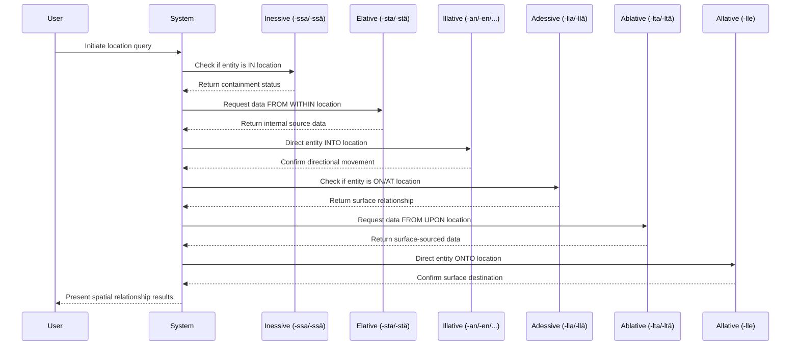

## Finnish Concept Impact on CEREBRUM Implementation

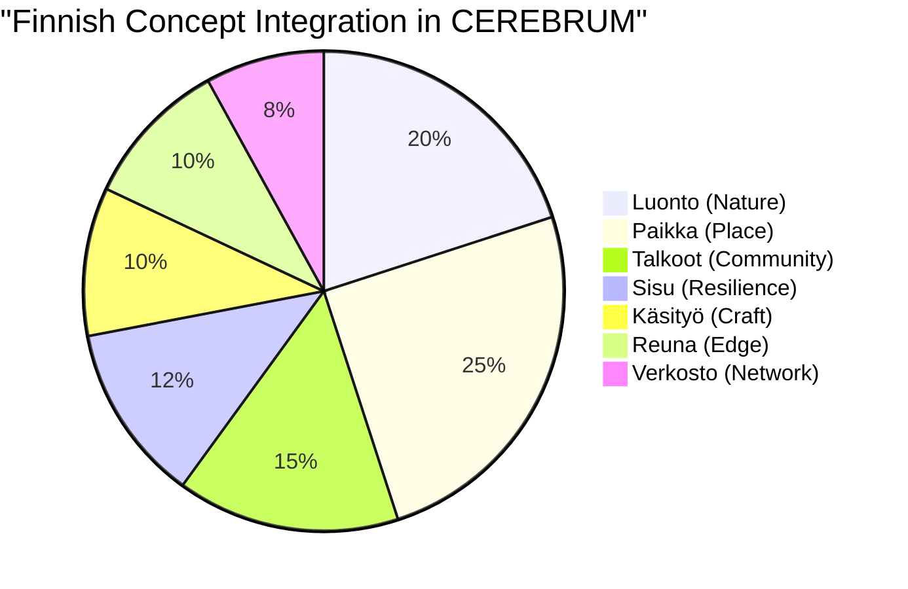

## Talkoot Principles in Distributed Workflows

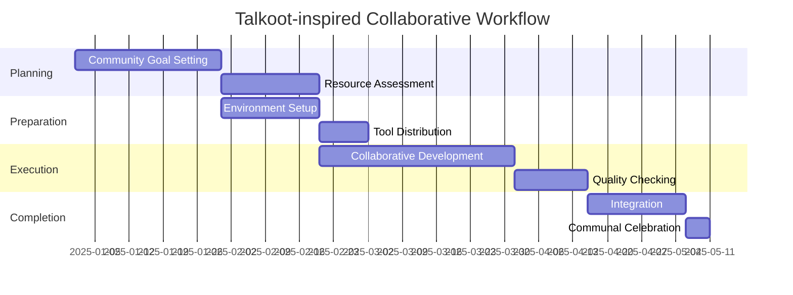

## Active Inference in Finnish-Inspired CEREBRUM

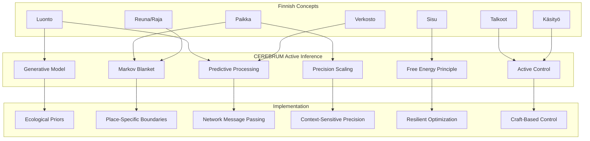

## Finnish Case Transformations in CEREBRUM

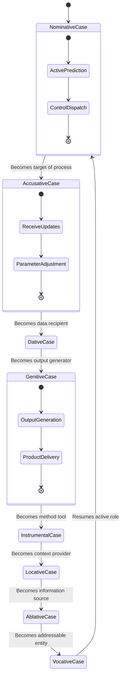

## Finnish-Hungarian-Navajo Intersectional Framework

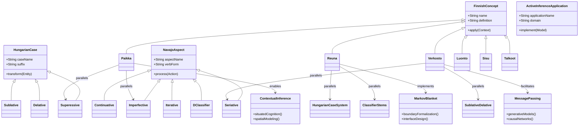

## Cross-Cutting Themes in Finnish-CEREBRUM Integration

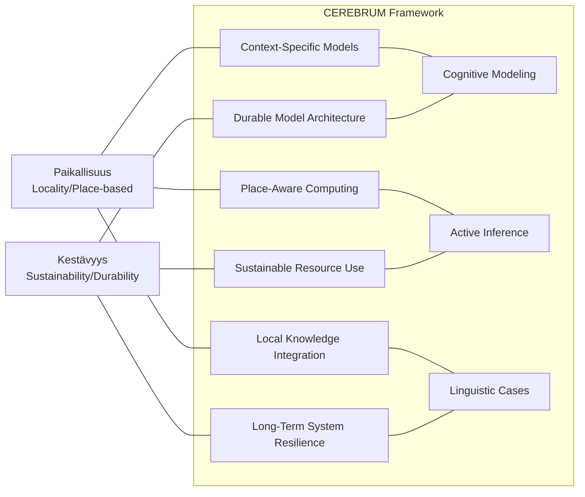

## Place-Based CEREBRUM Architecture

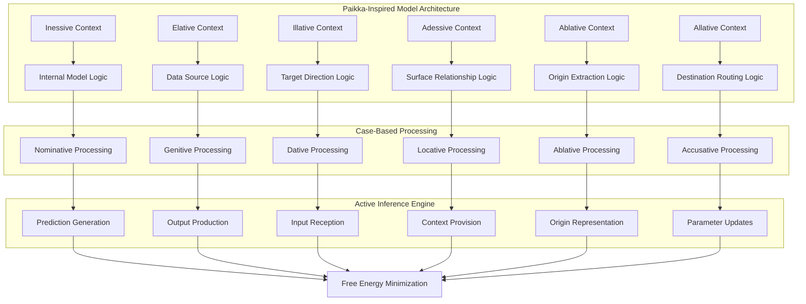

## Verkosto Network Model in CEREBRUM

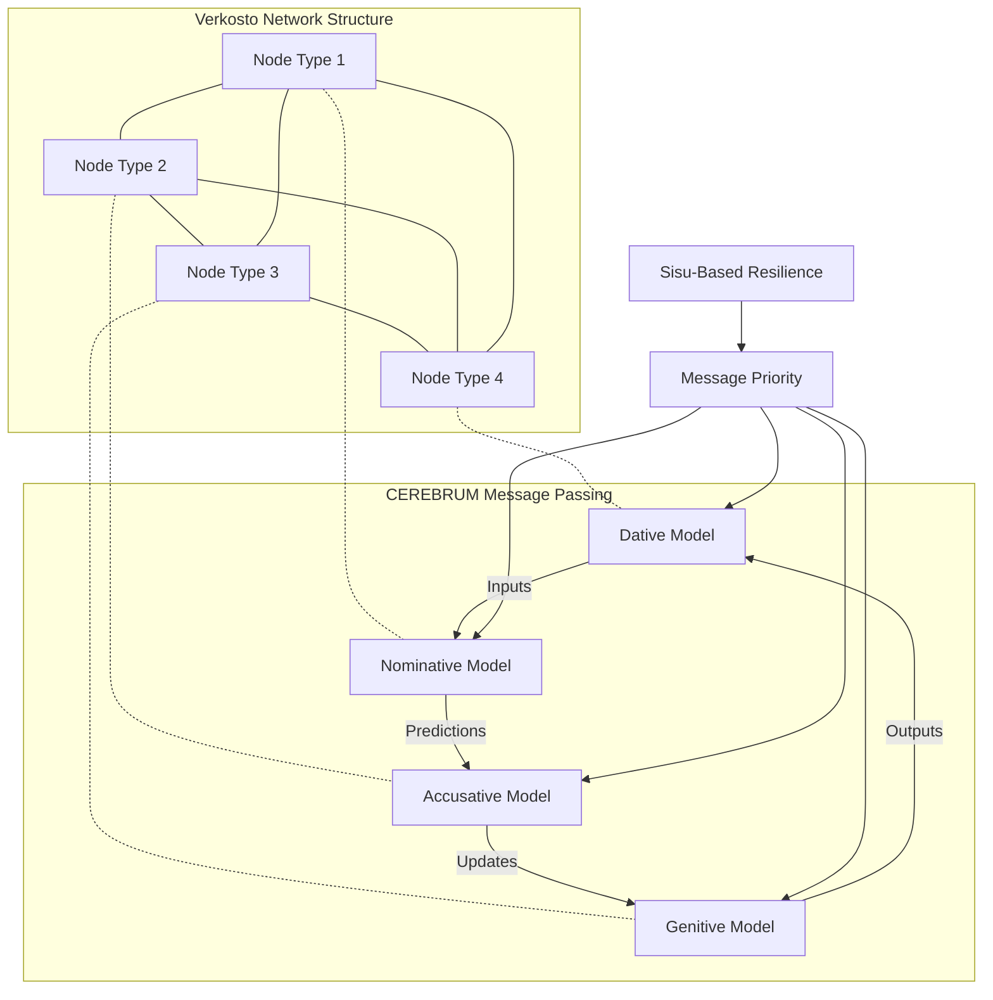

## Sisu Principles in CEREBRUM Resilience

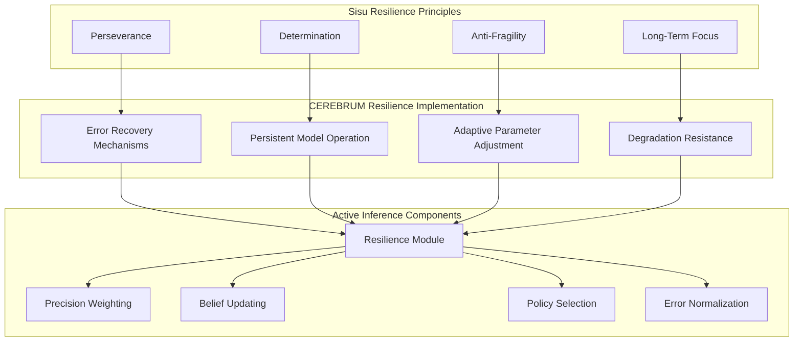

## Käsityö Craft Principles in Model Design

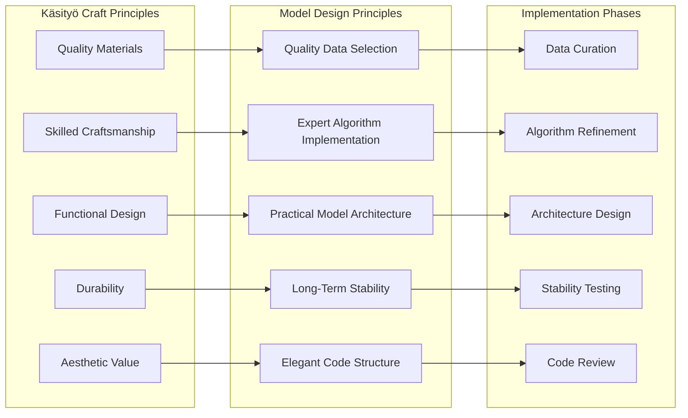

## Luonto-Based Ecological Modeling in CEREBRUM

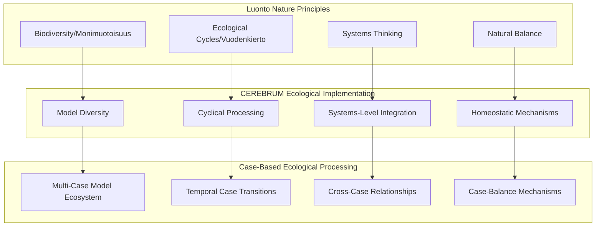