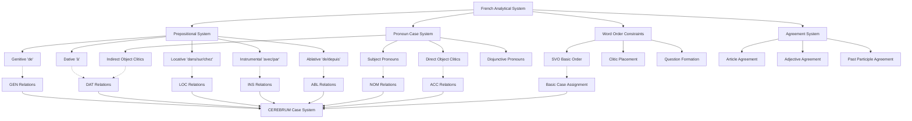

# French Case System and CEREBRUM Mapping

## Overview of French's Analytical Approach to Grammatical Relations

Modern French represents a quintessential analytical Romance language that has almost completely abandoned the Latin case system in favor of prepositional constructions, fixed word order, and complex pronoun paradigms. French provides CEREBRUM with a sophisticated model for expressing case relationships through systematic prepositional systems, position-dependent interpretation, and pronoun case distinctions that preserve morphological traces of the ancestral case system.

This analytical approach offers valuable insights for CEREBRUM implementations requiring elegant systematicity without morphological complexity. French demonstrates how rich relational information can be encoded through productive prepositional systems, strict positional constraints, and pronominal case preservation, providing a model for streamlined case systems that achieve high expressive precision through structural organization and lexical specification.

## Historical Development from Latin Case System

### Latin to French Case Evolution

French evolved from Vulgar Latin through systematic case leveling:

**Classical Latin (6 cases):**
```
rosa, rosae, rosae, rosam, rosā, rosae
(NOM, GEN, DAT, ACC, ABL, VOC)
```

**Old French (2 cases):**
```
Nominative: rose (subject case)
Oblique: rose (object case, from Latin accusative)
```

**Modern French (analytical):**
```
la rose (definite article + noun)
Relationships expressed through prepositions and word order
```

### Preservation in Pronoun Systems

French preserves case distinctions in personal pronouns:

```
Subject pronouns: je, tu, il/elle, nous, vous, ils/elles
Direct object: me, te, le/la, nous, vous, les  
Indirect object: me, te, lui, nous, vous, leur
Disjunctive: moi, toi, lui/elle, nous, vous, eux/elles
```

## Morphological Characteristics

### Minimal Nominal Case Marking

French exhibits:

1. **No Nominal Case Inflection** - Nouns do not inflect for case
2. **Definite Article System** - Articles agree in gender and number but not case
3. **Preserved Pronominal Case** - Personal pronouns maintain morphological case distinctions
4. **Prepositional Productivity** - Extensive system of case-marking prepositions
5. **Fixed Word Order** - SVO pattern with strict positional constraints

### Complex Pronominal Case System

French maintains a sophisticated pronominal case system:

#### Personal Pronoun Paradigm

| Person | Subject | Direct Object | Indirect Object | Disjunctive |
|---------|---------|---------------|----------------|-------------|
| 1SG | je | me | me | moi |
| 2SG | tu | te | te | toi |
| 3SG.M | il | le | lui | lui |
| 3SG.F | elle | la | lui | elle |
| 1PL | nous | nous | nous | nous |
| 2PL | vous | vous | vous | vous |
| 3PL.M | ils | les | leur | eux |
| 3PL.F | elles | les | leur | elles |

#### Clitic Pronoun Order

French clitics follow strict ordering constraints:

```
Subject + [me/te/se/nous/vous] + [le/la/les] + [lui/leur] + [y] + [en] + Verb
```

Example:
```
Je le lui donne. (I give it to him/her)
Il me les a donnés. (He gave them to me)
Elle nous y emmène. (She takes us there)
```

## Prepositional Case System

French employs an extensive prepositional system to express case relationships:

### Core Prepositions for Case Functions

#### Genitive/Possessive Relationships
```
de - Primary genitive preposition
le livre de Marie (Marie's book)
la maison de mes parents (my parents' house)
une tasse de café (a cup of coffee)

du/de la/des - Partitive articles (GEN + definite article)
du pain (some bread)
de la musique (some music)
des livres (some books)
```

#### Dative/Benefactive Relationships
```
à - Primary dative preposition  
donner quelque chose à quelqu'un (give something to someone)
parler à Marie (speak to Marie)
appartenir à Paul (belong to Paul)

pour - Benefactive "for"
faire quelque chose pour quelqu'un (do something for someone)
un cadeau pour toi (a gift for you)
```

#### Locative Relationships
```
dans - "in, inside"
dans la maison (in the house)
dans le parc (in the park)

sur - "on, upon"  
sur la table (on the table)
sur le toit (on the roof)

chez - "at (someone's place)"
chez Marie (at Marie's place)
chez le médecin (at the doctor's)

à - Location with cities/small places
à Paris (in Paris)
à l'école (at school)
```

#### Instrumental Relationships
```
avec - "with (instrument/accompaniment)"
écrire avec un stylo (write with a pen)
venir avec des amis (come with friends)

par - "by means of"
voyager par train (travel by train)
communiquer par téléphone (communicate by telephone)

au moyen de - "by means of" (formal)
résoudre au moyen de la technologie (solve by means of technology)
```

#### Ablative/Source Relationships
```
de - Source/origin
venir de Paris (come from Paris)
sortir de la maison (exit from the house)

depuis - "from, since" (temporal)
depuis hier (since yesterday)
depuis Paris (from Paris [temporal starting point])
```

## Mapping to CEREBRUM Cases

French's analytical system maps to CEREBRUM cases through prepositional constructions and positional syntax:

| CEREBRUM Case | French Equivalent | Implementation Notes |
|---------------|-------------------|----------------------|
| **[NOM]** Nominative | Subject position + subject pronouns | Models in [NOM] should implement subject position and preverbal placement |
| **[ACC]** Accusative | Direct object position + direct object pronouns | Models in [ACC] should implement postverbal position and clitic object pronouns |
| **[GEN]** Genitive | *de* constructions + possessive determiners | Models in [GEN] should implement *de* preposition and possessive relationships |
| **[DAT]** Dative | *à* constructions + indirect object pronouns | Models in [DAT] should implement *à* preposition and indirect object clitics |
| **[INS]** Instrumental | *avec* / *par* / *au moyen de* constructions | Models in [INS] should implement instrumental prepositions |
| **[LOC]** Locative | *dans* / *sur* / *chez* / *à* constructions | Models in [LOC] should implement locative prepositions with place-type sensitivity |
| **[ABL]** Ablative | *de* / *depuis* source constructions | Models in [ABL] should implement source prepositions with temporal/spatial distinction |
| **[VOC]** Vocative | Direct address + interjections | Models in [VOC] should implement direct address patterns |



## Unique French Constructions

### Partitive Articles (GEN)

French has a unique partitive article system that combines genitive semantics with indefinite determination:

```
Je mange du pain. (I eat some bread)
[partitive = de + le]

Elle boit de la eau → de l'eau. (She drinks some water)
[partitive = de + la, with elision]

Nous achetons des livres. (We buy some books)
[partitive = de + les]
```

**CEREBRUM Implementation:**
```python
class PartitiveArticleSystem:
    def __init__(self):
        self.partitive_forms = {
            'du': {'prep': 'de', 'article': 'le', 'gender': 'masculine', 'number': 'singular'},
            'de la': {'prep': 'de', 'article': 'la', 'gender': 'feminine', 'number': 'singular'},
            'des': {'prep': 'de', 'article': 'les', 'gender': 'any', 'number': 'plural'},
            "de l'": {'prep': 'de', 'article': 'le/la', 'gender': 'any', 'number': 'singular', 'vowel_context': True}
        }
    
    def assign_partitive_case(self, noun_model, context):
        partitive_form = self._determine_partitive_form(noun_model)
        return {
            'case': Case.GEN,
            'construction': 'partitive_article',
            'form': partitive_form,
            'semantic_role': 'indefinite_quantity',
            'syntactic_function': 'partitive_object'
        }
```

### Pronominal Verbs (Reflexive/Reciprocal)

French has extensive pronominal verb constructions that affect case assignment:

```
Se laver - "to wash oneself"
Je me lave. (I wash myself)
Tu te laves. (You wash yourself)

Se téléphoner - "to telephone each other"
Ils se téléphonent. (They telephone each other)

Se souvenir de - "to remember"  
Je me souviens de toi. (I remember you)
```

### Complex Question Formation

French question formation involves case-sensitive transformations:

#### Est-ce que Construction
```
Est-ce que tu viens? (Are you coming?)
Est-ce que Marie aime Paul? (Does Marie love Paul?)
```

#### Inversion
```
Viens-tu? (Are you coming?)
Marie aime-t-elle Paul? (Does Marie love Paul?)
```

#### Wh-Questions with Case Implications
```
Qui vois-tu? (Who do you see?) [ACC]
À qui parles-tu? (To whom are you speaking?) [DAT]  
De qui parles-tu? (About whom are you speaking?) [GEN]
Avec qui viens-tu? (With whom are you coming?) [INS/COM]
```

### Complex Relative Clauses

French relative pronouns preserve case distinctions:

```
Subject relative: qui
l'homme qui vient (the man who comes)

Direct object relative: que  
l'homme que je vois (the man whom I see)

Prepositional relatives: dont, où, lequel, etc.
l'homme dont je parle (the man about whom I speak)
la maison où j'habite (the house where I live)
l'homme avec lequel je travaille (the man with whom I work)
```

## Computational Implementation for CEREBRUM

### 1. Prepositional Case Assignment

```python
class FrenchPrepositionCaseAssigner:
    def __init__(self):
        self.preposition_case_mapping = {
            # Genitive prepositions
            'de': self._analyze_de_function,
            'du': Case.GEN,  # de + le
            'de la': Case.GEN,  # de + la  
            'des': Case.GEN,  # de + les
            "de l'": Case.GEN,  # de + l'
            
            # Dative prepositions
            'à': self._analyze_a_function,
            'au': Case.DAT,  # à + le
            'aux': Case.DAT,  # à + les
            'pour': Case.DAT,
            
            # Locative prepositions
            'dans': Case.LOC,
            'sur': Case.LOC,
            'sous': Case.LOC,
            'chez': Case.LOC,
            'devant': Case.LOC,
            'derrière': Case.LOC,
            'entre': Case.LOC,
            
            # Instrumental/Comitative
            'avec': Case.INS,
            'par': Case.INS,
            'au moyen de': Case.INS,
            'grâce à': Case.INS,
            
            # Ablative/Source
            'depuis': Case.ABL,
            'dès': Case.ABL,
            # 'de' handled in _analyze_de_function
        }
    
    def assign_case(self, model, preposition, context):
        if preposition in self.preposition_case_mapping:
            case_assigner = self.preposition_case_mapping[preposition]
            if callable(case_assigner):
                return case_assigner(model, context)
            return case_assigner
        
        # Default to instrumental for unknown prepositions
        return Case.INS
    
    def _analyze_de_function(self, model, context):
        semantic_context = context.get('semantic_role')
        
        if semantic_context == 'possession':
            return Case.GEN
        elif semantic_context == 'source':
            return Case.ABL
        elif semantic_context == 'material':
            return Case.GEN
        elif semantic_context == 'partitive':
            return Case.GEN
        
        return Case.GEN  # Default for 'de'
    
    def _analyze_a_function(self, model, context):
        semantic_context = context.get('semantic_role')
        
        if semantic_context == 'recipient':
            return Case.DAT
        elif semantic_context == 'location':
            return Case.LOC
        elif semantic_context == 'direction':
            return Case.DAT  # Goal as dative
        
        return Case.DAT  # Default for 'à'
```

### 2. Pronominal Case System

```python
class FrenchPronounCaseSystem:
    def __init__(self):
        self.pronoun_paradigms = {
            'je': {'case': Case.NOM, 'person': 1, 'number': 'singular'},
            'me': {'case': [Case.ACC, Case.DAT], 'person': 1, 'number': 'singular'},
            'moi': {'case': Case.DISJ, 'person': 1, 'number': 'singular'},  # Disjunctive
            
            'tu': {'case': Case.NOM, 'person': 2, 'number': 'singular'},
            'te': {'case': [Case.ACC, Case.DAT], 'person': 2, 'number': 'singular'},
            'toi': {'case': Case.DISJ, 'person': 2, 'number': 'singular'},
            
            'il': {'case': Case.NOM, 'person': 3, 'number': 'singular', 'gender': 'masculine'},
            'le': {'case': Case.ACC, 'person': 3, 'number': 'singular', 'gender': 'masculine'},
            'lui': {'case': [Case.DAT, Case.DISJ], 'person': 3, 'number': 'singular', 'gender': 'masculine'},
            
            'elle': {'case': Case.NOM, 'person': 3, 'number': 'singular', 'gender': 'feminine'},
            'la': {'case': Case.ACC, 'person': 3, 'number': 'singular', 'gender': 'feminine'},
            
            'nous': {'case': [Case.NOM, Case.ACC, Case.DAT, Case.DISJ], 'person': 1, 'number': 'plural'},
            'vous': {'case': [Case.NOM, Case.ACC, Case.DAT, Case.DISJ], 'person': 2, 'number': 'plural'},
            
            'ils': {'case': Case.NOM, 'person': 3, 'number': 'plural', 'gender': 'masculine'},
            'elles': {'case': Case.NOM, 'person': 3, 'number': 'plural', 'gender': 'feminine'},
            'les': {'case': Case.ACC, 'person': 3, 'number': 'plural'},
            'leur': {'case': Case.DAT, 'person': 3, 'number': 'plural'},
            'eux': {'case': Case.DISJ, 'person': 3, 'number': 'plural', 'gender': 'masculine'},
        }
        
        self.clitic_order = ['me/te/se/nous/vous', 'le/la/les', 'lui/leur', 'y', 'en']
    
    def assign_pronoun_case(self, pronoun_form, syntactic_position):
        if pronoun_form in self.pronoun_paradigms:
            pronoun_info = self.pronoun_paradigms[pronoun_form]
            case = pronoun_info['case']
            
            # Handle ambiguous forms based on syntactic position
            if isinstance(case, list):
                return self._resolve_case_ambiguity(case, syntactic_position)
            
            return case
        
        return Case.NOM  # Default
    
    def _resolve_case_ambiguity(self, possible_cases, syntactic_position):
        position = syntactic_position.get('position')
        
        if position == 'direct_object':
            return Case.ACC
        elif position == 'indirect_object':
            return Case.DAT
        elif position == 'prepositional_object':
            return Case.DISJ
        
        return possible_cases[0]  # Default to first option
```

### 3. Complex Construction Handler

```python
class FrenchConstructionHandler:
    def __init__(self):
        self.construction_types = {
            'partitive': self._handle_partitive,
            'pronominal_verb': self._handle_pronominal_verb,
            'question_formation': self._handle_question,
            'relative_clause': self._handle_relative_clause
        }
    
    def handle_construction(self, construction_type, elements, context):
        if construction_type in self.construction_types:
            return self.construction_types[construction_type](elements, context)
        return self._default_case_assignment(elements)
    
    def _handle_partitive(self, elements, context):
        partitive_article = elements.get('partitive_article')
        noun = elements.get('noun')
        
        case_assignments = {}
        if noun:
            case_assignments[noun] = {
                'case': Case.GEN,
                'construction': 'partitive',
                'article_form': partitive_article,
                'semantic_role': 'indefinite_quantity'
            }
        
        return case_assignments
    
    def _handle_pronominal_verb(self, elements, context):
        subject = elements.get('subject')
        reflexive_pronoun = elements.get('reflexive_pronoun')
        verb = elements.get('verb')
        
        case_assignments = {}
        
        if subject:
            case_assignments[subject] = Case.NOM
        
        if reflexive_pronoun:
            # Determine if truly reflexive or reciprocal
            reflexive_type = context.get('reflexive_type', 'reflexive')
            if reflexive_type == 'reflexive':
                case_assignments[reflexive_pronoun] = Case.ACC  # Direct reflexive
            elif reflexive_type == 'reciprocal':
                case_assignments[reflexive_pronoun] = Case.ACC  # Reciprocal
            
        return case_assignments
    
    def _handle_question(self, elements, context):
        question_type = context.get('question_type')
        
        if question_type == 'wh_question':
            wh_word = elements.get('wh_word')
            if wh_word:
                case = self._determine_wh_case(wh_word, context)
                return {wh_word: case}
        
        return self._default_case_assignment(elements)
    
    def _determine_wh_case(self, wh_word, context):
        wh_case_mapping = {
            'qui': Case.NOM,  # Subject who
            'que': Case.ACC,  # Object what/whom
            'quoi': Case.ACC,  # What (disjunctive)
            'à qui': Case.DAT,  # To whom
            'de qui': Case.GEN,  # About/of whom
            'avec qui': Case.INS,  # With whom
            'pour qui': Case.DAT,  # For whom
        }
        
        return wh_case_mapping.get(wh_word, Case.NOM)
```

## Example Sentences with Detailed Analysis

### 1. Basic SVO [NOM-ACC]

**French:** Je mange une pomme.

**Analysis:**
- *Je* - 1st person subject pronoun [NOM]
- *mange* - 1st person present verb "eat"
- *une pomme* - indefinite direct object [ACC]

**CEREBRUM:** I_Model[NOM] performs eating_operation on Apple_Model[ACC].

### 2. Genitive Construction [GEN]

**French:** Le livre de Marie est intéressant.

**Analysis:**
- *Le livre* - definite subject [NOM]
- *de Marie* - genitive construction [GEN]
- *est intéressant* - copular predicate

**CEREBRUM:** Book_Model[NOM] derived from Marie_Model[GEN] exhibits interesting_property.

### 3. Dative Construction [DAT]

**French:** Je donne le livre à Marie.

**Analysis:**
- *Je* - subject pronoun [NOM]
- *donne* - ditransitive verb
- *le livre* - direct object [ACC]
- *à Marie* - indirect object [DAT]

**CEREBRUM:** I_Model[NOM] performs giving_operation transferring Book_Model[ACC] to Marie_Model[DAT].

### 4. Clitic Double Object [ACC-DAT]

**French:** Je le lui donne.

**Analysis:**
- *Je* - subject pronoun [NOM]
- *le* - direct object clitic [ACC]
- *lui* - indirect object clitic [DAT]
- *donne* - verb

**CEREBRUM:** I_Model[NOM] performs giving_operation transferring It_Model[ACC] to Him/Her_Model[DAT].

### 5. Instrumental Construction [INS]

**French:** J'écris avec un stylo.

**Analysis:**
- *J'* - subject pronoun with elision [NOM]
- *écris* - 1st person verb
- *avec un stylo* - instrumental phrase [INS]

**CEREBRUM:** I_Model[NOM] performs writing_operation using Pen_Model[INS].

### 6. Locative Construction [LOC]

**French:** Marie habite dans une grande maison.

**Analysis:**
- *Marie* - proper noun subject [NOM]
- *habite* - locative verb
- *dans une grande maison* - locative phrase [LOC]

**CEREBRUM:** Marie_Model[NOM] maintains residence within Large_House_Model[LOC].

### 7. Partitive Construction [GEN]

**French:** Je bois du café.

**Analysis:**
- *Je* - subject pronoun [NOM]
- *bois* - 1st person verb
- *du café* - partitive article + noun [GEN]

**CEREBRUM:** I_Model[NOM] performs drinking_operation on Coffee_Model[GEN:partitive].

### 8. Complex Relative Clause

**French:** L'homme avec qui je travaille est sympathique.

**Analysis:**
- *L'homme* - definite subject [NOM]
- *avec qui* - relative pronoun with preposition [INS]
- *je travaille* - relative clause with subject [NOM]
- *est sympathique* - predicate

**CEREBRUM:** Man_Model[NOM] associated with working_operation involving I_Model[NOM] and Man_Model[INS] exhibits sympathetic_property.

### 9. Question Formation

**French:** À qui donnez-vous le livre?

**Analysis:**
- *À qui* - dative interrogative [DAT]
- *donnez* - 2nd person formal verb
- *vous* - subject pronoun [NOM]
- *le livre* - direct object [ACC]

**CEREBRUM:** Question seeking Recipient_Model[DAT] for giving_operation performed by You_Model[NOM] on Book_Model[ACC].

### 10. Pronominal Verb

**French:** Marie et Paul se téléphonent.

**Analysis:**
- *Marie et Paul* - compound subject [NOM]
- *se* - reflexive/reciprocal pronoun [ACC:reciprocal]
- *téléphonent* - pronominal verb

**CEREBRUM:** Marie_and_Paul_Model[NOM] perform reciprocal_telephoning_operation with Each_Other_Model[ACC:reciprocal].

## Extension Opportunities for CEREBRUM

### 1. Partitive Case Extension

Based on French's partitive system, CEREBRUM could implement a specialized partitive case:

```python
class PartitiveCaseExtension:
    def assign_partitive_case(self, model, context):
        return {
            'case': Case.PART,  # New partitive case
            'semantic_role': 'indefinite_quantity',
            'definiteness': 'indefinite',
            'quantification': 'partial'
        }
```

### 2. Disjunctive Case Implementation

French's disjunctive pronouns suggest a specialized case for emphatic/contrastive contexts:

```python
class DisjunctiveCaseExtension:
    def assign_disjunctive_case(self, model, context):
        if context.get('emphasis') or context.get('contrast'):
            return {
                'case': Case.DISJ,  # Disjunctive case
                'discourse_function': 'emphatic',
                'syntactic_independence': True
            }
```

### 3. Clitic Integration System

Based on French clitic ordering, CEREBRUM could implement sophisticated argument linearization:

```python
class CliticIntegrationSystem:
    def order_case_arguments(self, case_assignments, verb):
        ordered_arguments = []
        
        # Apply French-inspired clitic ordering
        clitic_hierarchy = [
            Case.NOM,   # Subject
            Case.REFL,  # Reflexive
            Case.ACC,   # Direct object
            Case.DAT,   # Indirect object
            Case.LOC,   # Locative y
            Case.PART   # Partitive en
        ]
        
        for case in clitic_hierarchy:
            matching_args = [arg for arg in case_assignments if arg.case == case]
            ordered_arguments.extend(matching_args)
        
        return ordered_arguments
```

These French-inspired approaches would be particularly valuable for CEREBRUM implementations requiring sophisticated analytical case systems with systematic prepositional organization and complex pronoun integration.

## Implications for CEREBRUM Design

French provides crucial insights for CEREBRUM implementations emphasizing analytical systematicity:

1. **Prepositional Productivity**: The systematic prepositional case marking demonstrates how CEREBRUM could implement productive analytical case assignment through lexical specification.

2. **Pronominal Case Preservation**: The maintenance of case distinctions in pronouns shows how CEREBRUM could preserve morphological case information in high-frequency elements while using analytical strategies elsewhere.

3. **Construction-Specific Patterns**: French constructions (partitive, pronominal verbs, etc.) demonstrate how CEREBRUM could implement construction-sensitive case assignment.

4. **Clitic Ordering Constraints**: The systematic clitic ordering provides models for argument linearization in CEREBRUM implementations.

5. **Question Formation Strategies**: French question formation shows how CEREBRUM could handle case-sensitive interrogative constructions.

## References

1. Riegel, M., Pellat, J.-C., & Rioul, R. (2009). *Grammaire méthodique du français*. Presses Universitaires de France.

2. Grevisse, M., & Goosse, A. (2016). *Le bon usage: Grammaire française*. De Boeck Supérieur.

3. Jones, M. A. (1996). *Foundations of French Syntax*. Cambridge University Press.

4. Sportiche, D., Koopman, H., & Stabler, E. (2013). *An Introduction to Syntactic Analysis and Theory*. Wiley-Blackwell.

5. Kayne, R. S. (1975). *French Syntax: The Transformational Cycle*. MIT Press.

6. Miller, P. H., & Sag, I. A. (1997). *French Clitic Movement without Clitics or Movement*. *Natural Language & Linguistic Theory*, 15(3), 573-639.

7. Zribi-Hertz, A. (1994). *The Syntax of Nominative Clitics in Standard and Advanced French*. In G. Cinque et al. (eds.), *Paths towards Universal Grammar* (pp. 453-472). Georgetown University Press.

8. Pollock, J.-Y. (1989). *Verb Movement, Universal Grammar, and the Structure of IP*. *Linguistic Inquiry*, 20(3), 365-424. 